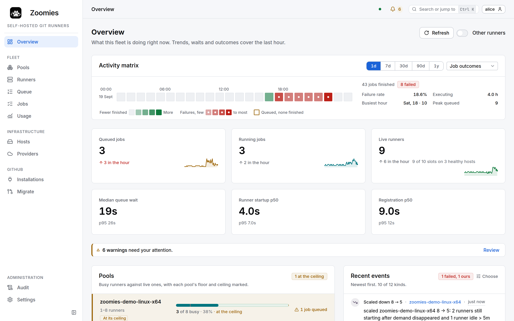
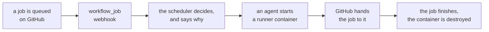
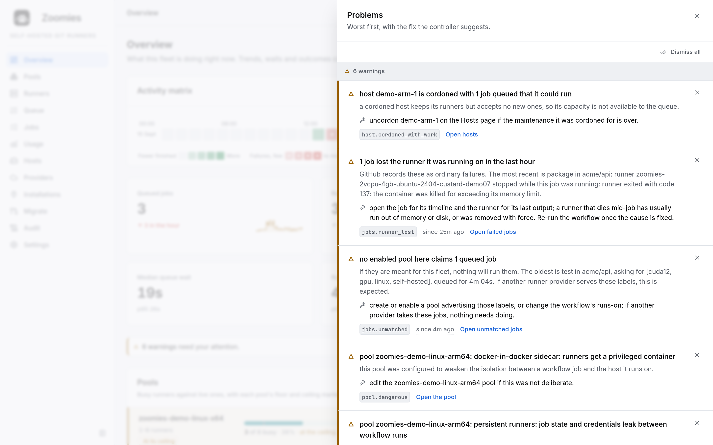
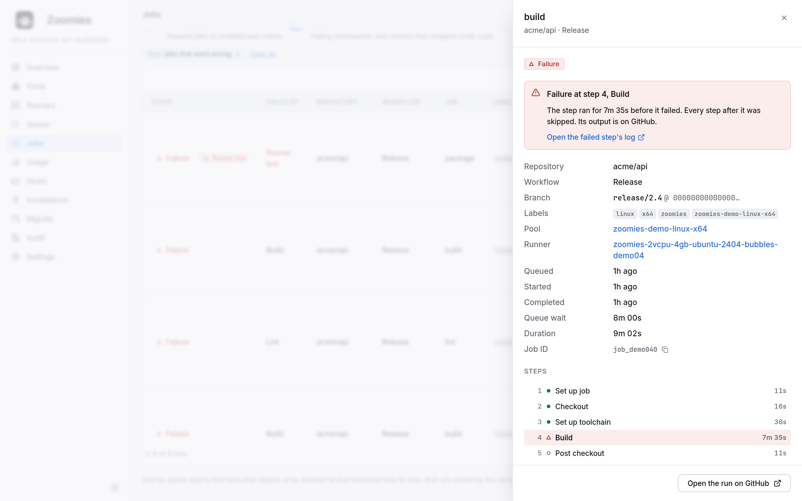
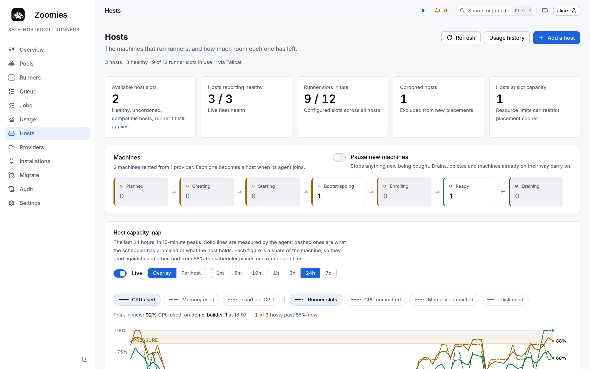
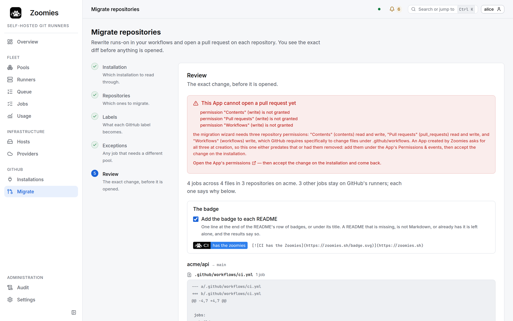

<div align="center">

<picture>
  <source media="(prefers-color-scheme: dark)" srcset="docs/brand/logo-master-dark.png">
  
</picture>

# Zoomies

**Off the lead, on the job.**

A lightweight, self-hosted GitHub Actions runner fleet controller.<br>
Ephemeral runners by default, GitHub App auth, webhook-driven autoscaling,
multi-host agents, a live web UI, and a one-line installer.

Single Go binary. SQLite. No Kubernetes. AGPL-3.0 licensed.

[](https://github.com/eyupio/zoomies/actions/workflows/ci.yml)
[](https://zoomies.sh)
[](https://github.com/eyupio/zoomies/releases/latest)
[](LICENSE)

```sh
curl -fsSL https://zoomies.sh/install.sh | sh
```

**[zoomies.sh](https://zoomies.sh)** ·
[Quick start](https://zoomies.sh/quickstart/) ·
[Architecture](https://zoomies.sh/architecture/) ·
[Configuration](https://zoomies.sh/configuration/) ·
[Migrating](https://zoomies.sh/migration/) ·
[Security](https://zoomies.sh/security/) ·
[API](https://zoomies.sh/api-surface/) ·
[FAQ](https://zoomies.sh/faq/)

<br>

<picture>
  <source media="(prefers-color-scheme: dark)" srcset="docs/screenshots/overview-dark.webp">
  
</picture>

</div>

---

## What it does

You point Zoomies at a GitHub organisation, or at a repository on a personal
account. It watches for queued jobs, starts a fresh runner for each one, and
destroys the runner when the job finishes.



* **Ephemeral by default.** One job per runner. Nothing leaks from one workflow
  run to the next.
* **No pasted tokens.** Zoomies authenticates as a GitHub App and mints
  single-use JIT registrations itself. github.com and Enterprise Server.
* **Event-driven.** `workflow_job` webhooks, with polling only as a fallback so
  a misconfigured webhook does not silently stop your fleet.
* **Multi-host.** One controller, any number of agents. Agents connect outbound
  only, so a host behind NAT needs no inbound rule.
* **Actually observable.** SQLite for state, Prometheus metrics, structured
  logs, live log streaming, job history with queue waits, and an audit row for
  every mutating action.
* **Safe by default.** Loopback bind, auth on, no Docker socket in your jobs, no
  root. Every deviation is named at startup and in the UI.

## Quick start

Five minutes on a fresh Ubuntu, Debian, Fedora or Alpine host.

```sh
curl -fsSL https://zoomies.sh/install.sh | sh
```

The script checks what it needs before it downloads anything — the platform it
is fetching for, whether the install prefix can be written and with what,
whether there is a terminal to run setup on — shows you what it is about to do,
and asks once. Then it hands off to `zoomies init`.

**How setup finishes depends on how you choose to run Zoomies**, and that is the
one fork worth knowing about before you start. Compose is the default whenever
you have a `compose` command:

#### Native — finishes in the terminal

1. **Install mode** — single VM with an embedded agent, controller only, or
   agent only.
2. **Service user and directories** — a dedicated unprivileged `zoomies` user.
3. **Backend** — rootless Docker if it finds one, otherwise Docker, Podman or
   bare process, with the trade-off on every option.
4. **Bind address and TLS** — loopback, a certificate you provide, a
   self-signed one, or reverse-proxy mode.
5. **Review** — the whole plan and the exact files it will write, before
   anything is written. Install, change an answer, or stop.
6. **GitHub App** — opens your browser at a pre-filled App manifest with
   exactly the permissions Zoomies needs and the webhook URL already set.
   Create it, and the credentials come back to the installer automatically.
7. **First admin account**, and a **first pool** sized for the host.
8. **Service** — a hardened systemd unit (or launchd), started and
   health-checked.

It finishes with the URL, your login, and the `runs-on:` line to put in a
workflow.

#### Compose or Docker — finishes in the browser

The same questions up to the review, then it writes the deployment
(`docker-compose.yml` and a fully populated `.env`, or one container and an
env file) and brings it up. The database lives in a volume this installer
cannot open, so the last three steps happen in the browser instead: create
the first administrator, connect GitHub, create a pool. The closing summary
prints all three with their exact addresses, and the Overview repeats them
as a checklist that ticks itself off.

Prefer to read it first? That is the intended way:

```sh
curl -fsSLO https://zoomies.sh/install.sh
less install.sh
sh install.sh
```

Automating it? Every prompt has a flag:

```sh
sh install.sh --non-interactive --answers zoomies-answers.yaml
```

### Docker Compose instead

```sh
git clone https://github.com/eyupio/zoomies && cd zoomies
cp .env.example .env
$EDITOR .env          # ZOOMIES_EXTERNAL_URL, ZOOMIES_ENCRYPTION_KEY, DOCKER_GID
mkdir -p data && sudo chown 65532:65532 data   # the container runs as 65532
docker compose up -d
```

Three values are required, and compose will not start without them:

* `ZOOMIES_EXTERNAL_URL` — the https address you and GitHub reach the
  controller at. Webhooks are delivered there, and creating the GitHub App
  sends your browser back there.
* `ZOOMIES_ENCRYPTION_KEY` — `openssl rand -base64 32`. Back it up; without it
  the stored App key cannot be read.
* `DOCKER_GID` — the gid that owns `/var/run/docker.sock`, which
  `stat -c '%g' /var/run/docker.sock` prints. It is not always the group called
  `docker`. The container is put in that group so it can create runner
  containers; with the wrong number it comes up healthy and can start nothing.
  If that happens, the Hosts page says which group the container holds and
  which line to change, and `docker compose up -d` recreates it. If `stat`
  prints `0`, the socket belongs to root's group: give it a group of its own
  (`sudo groupadd docker`, then restart the daemon) or use a rootless daemon
  rather than putting the container in group 0.

The database lives in `./data` beside the compose file, so a backup is a copy
of a directory. It has to be owned by uid 65532: a bind mount keeps the host
directory's ownership, and the container is not root, so the `chown` needs
`sudo`.

Open the https address, not `http://<ip>`: the session cookie is marked Secure
because the external URL is https, and a browser on a plain-http page throws
it away. Zoomies refuses to sign you in from such a page and says why.

This path has no `zoomies init`, so nothing creates a pool for you. Once
GitHub is connected, make the first one on the **Pools** page; nothing runs
until a pool exists.

The compose file is set up for running behind Cloudflare: the origin serves
plain HTTP on port 80 and Cloudflare terminates TLS, with `ZOOMIES_EXTERNAL_URL`
set to the https address so cookies, webhook URLs and links are all correct, and
Cloudflare's ranges in `ZOOMIES_TRUSTED_PROXIES` so the audit log records real
client addresses rather than Cloudflare's. Firewall the origin to Cloudflare, or
use a Tunnel and publish no port at all. See
[docs/configuration.md](docs/configuration.md#behind-cloudflare-or-any-reverse-proxy).

### Add another host

Generate a join token in the UI (**Hosts → Add a host**) or on the CLI, then run
the one line it gives you on the new machine:

```sh
curl -fsSL https://zoomies.sh/install.sh | sh -s -- \
  --mode agent \
  --controller https://zoomies.example.com \
  --join-token zoojoin_...
```

## Your first pool

A pool says what labels your runners answer to and how many may exist.
On a single-host install, setup creates this one for you once GitHub is
connected -- it is derived from what the host actually is, so the numbers below
are what you get on a 4-CPU Linux box with Docker:

| | |
| --- | --- |
| **Name** | `zoomies-linux-x64` |
| **Labels** | `zoomies-linux-x64`, and `zoomies` like every pool |
| **Backend** | Docker (rootless if available) |
| **Min / max** | `0` / `4` — nothing idle when nothing is queued; the max is the host's capacity |
| **Idle timeout** | `5m` |
| **Ephemeral** | yes |
| **Docker in jobs** | none |

Then in a workflow:

```yaml
jobs:
  build:
    runs-on: zoomies-linux-x64
    steps:
      - uses: actions/checkout@v4
      - run: make test
```

Push it. Zoomies sees the `workflow_job` webhook, starts a runner, and you watch
the whole thing happen on the Overview page without refreshing.

One label is enough, and it is branded on purpose: a reviewer of the pull request
that introduces it can tell at a glance that the job has left GitHub's runners.
Every pool also answers to `zoomies`, so `runs-on: zoomies` means "anywhere in
this fleet" — the line to write before anyone has decided which pool a repository
belongs in.

## Moving your repositories over

You do not have to edit every workflow by hand. **Migrate** in the UI reads the
workflows in the repositories your App can see, rewrites their `runs-on` lines,
shows you the exact diff, and opens one pull request per repository.

It changes `runs-on` and nothing else — comments, indentation and quoting all
survive byte for byte — and it refuses to guess: a job on `${{ matrix.os }}`, a
job already on a self-hosted runner, or a label you chose not to map is listed as
left alone, with the reason, both in the review screen and in the pull request
body.

It needs three App permissions the rest of Zoomies deliberately does not ask for
(Contents, Pull requests, Workflows), and it tells you which are missing before
it tries anything. See [docs/migration.md](docs/migration.md).

## The UI

Ten pages, one job each: **Overview** (fleet health, queue depth, scaling
decisions in plain words, and a problems panel that is quiet when nothing is
wrong), **Pools**, **Runners**, **Jobs**, **Usage**, **Hosts**,
**Installations**, **Migrate**, **Audit**, **Settings**.

<table>
  <tr>
    <td width="50%" valign="top">
<picture>
  <source media="(prefers-color-scheme: dark)" srcset="docs/screenshots/problems-dark.webp">
  
</picture>
      <p align="center"><sub>The problems drawer: what is true, why it matters, what to change.</sub></p>
    </td>
    <td width="50%" valign="top">
<picture>
  <source media="(prefers-color-scheme: dark)" srcset="docs/screenshots/job-dark.webp">
  
</picture>
      <p align="center"><sub>A job that went wrong, and where.</sub></p>
    </td>
  </tr>
  <tr>
    <td width="50%" valign="top">
<picture>
  <source media="(prefers-color-scheme: dark)" srcset="docs/screenshots/hosts-dark.webp">
  
</picture>
      <p align="center"><sub>Hosts, their room left, and the backends their agents found.</sub></p>
    </td>
    <td width="50%" valign="top">
<picture>
  <source media="(prefers-color-scheme: dark)" srcset="docs/screenshots/migrate-dark.webp">
  
</picture>
      <p align="center"><sub>Migrate: the exact diff before a pull request is opened.</sub></p>
    </td>
  </tr>
</table>

Light and dark, keyboard-driven, a `⌘K` command palette, live everywhere, and a
log viewer that handles a hundred thousand lines. Every page is shown at
[zoomies.sh/ui](https://zoomies.sh/ui/). The screenshots are taken from the
real binary against its demo fleet by `make screenshots`, so they cannot show
a page the product does not have. Design system in
[docs/ui-guidelines.md](docs/ui-guidelines.md), identity in
[docs/brand.md](docs/brand.md).

## The CLI

The CLI and the UI are both clients of the same REST API. Nothing is reachable
from one that is not reachable from the other.

```sh
zoomies status                       # the Overview, in a terminal
zoomies pools list
zoomies pools create --name zoomies-linux-x64 --labels zoomies-linux-x64 --installation ins_k3f9qz2m --max 8
zoomies runners list --state busy
zoomies runners drain run_k3f9qz2m
zoomies runners logs run_k3f9qz2m --follow
zoomies jobs list --repo acme/widgets --since 24h
zoomies hosts join-token create --ttl 15m
zoomies audit tail
```

```sh
export ZOOMIES_URL=https://zoomies.example.com
export ZOOMIES_TOKEN=zoo_...
```

## Configuration

One `zoomies.yaml`, every key overridable with a `ZOOMIES_*` environment
variable. It is validated on startup, and the errors tell you what to change:

```
configuration is not valid:
  - server.tls.mode: "selfsigned" is not a TLS mode
      fix: use "off", "self-signed" or "files".
```

Warnings are separate from errors and never stop startup, but each one names a
setting that weakens the default posture:

```
[warning] listening on 0.0.0.0:8080 without TLS -- session cookies, API tokens
and the GitHub App private key you paste during setup all cross the network in
cleartext. Fix: put a TLS-terminating reverse proxy in front, or set
server.tls.mode to self-signed or files.
```

The same list appears in the UI's problems panel. See
[docs/configuration.md](docs/configuration.md) for every key and
[docs/security.md](docs/security.md) for what each dangerous one costs.

## Requirements

* Linux (amd64 or arm64) for the controller and agents. macOS is supported for
  running the controller in development.
* Docker or Podman for the container backends — **rootless preferred**, and the
  installer looks for a rootless socket first.
* A GitHub App on github.com or GitHub Enterprise Server. The installer creates
  it for you.
* No database server, no Kubernetes, no message queue.

## Building from source

```sh
git clone https://github.com/eyupio/zoomies && cd zoomies
make build        # builds the UI and embeds it
./zoomies version
```

Go 1.25 or later, and Node 22 or later. `go.mod` sets the language version at
1.25 and that is the floor a contributor needs; CI builds and releases with
1.26. Node is a build-time dependency only — the binary is
self-contained.

```sh
make test         # Go tests
make lint         # vet, gofmt, staticcheck, UI lint
make test-ui      # Playwright
make dev          # controller with auth off, for UI work
make ui-dev       # Vite dev server against it
```

## How it compares

Zoomies is what you want when [ARC](https://github.com/actions/actions-runner-controller)
is too much machinery — you have a VM or three, not a cluster — but a handful of
hand-registered long-lived runners is too little.

| | ARC | A few static runners | Zoomies |
| --- | :---: | :---: | :---: |
| Runs without Kubernetes | — | ✓ | ✓ |
| Ephemeral runners | ✓ | rarely | **default** |
| Autoscaling | ✓ | — | ✓ |
| Multi-host | ✓ | — | ✓ |
| Auth model | GitHub App | a PAT per runner | **GitHub App** |
| Web UI | — | sometimes | ✓ |
| Audit log | — | — | ✓ |
| To install | Helm, CRDs, a cluster | manual | **one command** |

## Project layout

```
cmd/zoomies         the binary: controller, agent, init, CLI
internal/store      domain model, SQLite schema, every query
internal/config     zoomies.yaml + env, and the validator that warns
internal/scheduler  pure scaling decisions and label matching
internal/github     App auth, JIT configs, webhooks, the fallback poller
internal/backend    Docker, Podman and bare-process runner backends
internal/auth       identity, RBAC, tokens, audit, OIDC
internal/api        REST, SSE, metrics, and the embedded UI
internal/controller the reconcile loop and the agent task queue
internal/agent      the runner-executing half
internal/installer  zoomies init / uninstall / agent join
internal/cryptox    AES-256-GCM at rest, argon2id, token hashing
internal/events     in-process pub/sub that the SSE endpoint fans out
internal/migrate    rewriting workflows' runs-on lines
web/                the Svelte 5 UI
api/openapi.yaml    the contract both clients are generated from
deploy/             images, compose, systemd units
docs/               the zoomies.sh site: architecture, security, UI guidelines,
                    configuration, brand
install.sh          the one-line installer, served from the site root
mkdocs.yml          how docs/ becomes zoomies.sh
```

## The website

[zoomies.sh](https://zoomies.sh) is built from `docs/` by MkDocs, so the site
cannot drift from the repository, and `install.sh` is copied to the site root
from the one in this repository's root -- the script you `curl` and the script a
contributor edits are the same file, and CI asserts they are byte-identical.

```sh
pip install -r docs/requirements.txt
mkdocs serve          # http://127.0.0.1:8000
mkdocs build --strict # a link that points nowhere fails the build
```

## Contributing

Read [docs/architecture.md](docs/architecture.md) first, then
[docs/dependencies.md](docs/dependencies.md) — every dependency needs a
one-line justification, and that is enforced by review. UI changes should keep
[docs/ui-guidelines.md](docs/ui-guidelines.md) true.

## Licence

GNU Affero General Public License, version 3 (`AGPL-3.0-only`). See
[LICENSE](LICENSE). Copyright (C) 2026 Zoomies contributors.

The AGPL is the GPL with one addition, and the addition is the point: anyone
who modifies Zoomies and lets other people use the modified version over a
network -- a hosted runner service built on it, say -- has to offer those
people the source of what they are running. Running it for your own
organisation, changed or not, asks nothing of you.

---

<div align="center">


**Zoomies** · Self-hosted Git runners<br>
Developed by [EyUp.io](https://eyup.io)

</div>
