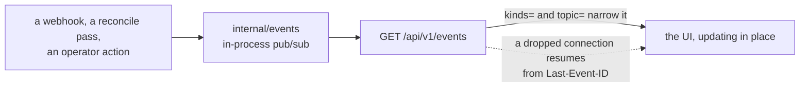

# Zoomies API surface

This is the authoritative list of endpoints. `internal/api` implements exactly
this, `api/openapi.yaml` describes exactly this, and the UI's generated
TypeScript client is derived from that document. **Nothing is reachable from the
UI that is not reachable from the API**, so if a page needs data, it comes from
a route below.

Conventions:

* Base path `/api/v1`. JSON in, JSON out, UTF-8.
* List endpoints take `limit` (default 50, max 500), `offset`, `sort`, `order`
  (`asc`/`desc`) and return `{ "items": [...], "total": <int>, "limit": <int>,
  "offset": <int> }`.
* Errors return `{ "error": { "code": "...", "message": "...", "field": "...",
  "detail": "..." } }` with a message written for a human. Codes:
  `bad_request`, `unauthorized`, `forbidden`, `not_found`, `conflict`,
  `unprocessable`, `rate_limited`, `internal`.
* Timestamps are RFC 3339 with a `Z` offset. Durations are Go duration strings
  (`"5m"`, `"1h30s"`).
* Mutating requests require `Content-Type: application/json` and, for cookie
  auth, an `Origin`/`Sec-Fetch-Site` check (same-origin unless
  `server.allowed_origins` says otherwise). Bearer-token requests are exempt
  because they are not subject to CSRF.
* `Role` is the minimum role required. `—` means unauthenticated.

## Meta and health

| Method | Path | Role | Notes |
| --- | --- | --- | --- |
| GET | `/healthz` | — | Liveness. Always 200 once the process is serving. |
| GET | `/readyz` | — | Readiness: database reachable, migrations applied. |
| GET | `/api/v1/meta` | — | Version, whether bootstrap is needed, whether OIDC is enabled, feature flags. Safe to call before login — it is what the login page uses to decide what to render. |
| GET | `/metrics` | viewer¹ | Prometheus text format. ¹Unauthenticated when `metrics.public` is true. |
| GET | `/api/openapi.yaml` | — | The spec this document describes. |
| GET | `/robots.txt` | — | Declines crawling unless `server.allow_indexing` is on. Rendered per request, because it has to name this controller's own address. |
| GET | `/sitemap.xml` | — | The interface's top-level pages, absolute. Nothing about the fleet: a pool or runner address is gone by tomorrow. |

## Authentication

| Method | Path | Role | Notes |
| --- | --- | --- | --- |
| POST | `/api/v1/auth/bootstrap` | — | Create the first admin. **Refuses once any user exists** — that check is the whole security of this route. |
| POST | `/api/v1/auth/login` | — | `{username, password}` → sets the session cookie, returns the identity. Rate limited per source address. |
| POST | `/api/v1/auth/logout` | viewer | Clears the session. |
| GET | `/api/v1/auth/session` | viewer | The current identity: id, name, role, scopes, `must_change_password`. |
| POST | `/api/v1/auth/password` | viewer | `{old_password, new_password}` for the caller's own account. Invalidates the caller's other sessions. |
| GET | `/api/v1/auth/oidc/start` | — | 302 to the identity provider. |
| GET | `/api/v1/auth/oidc/callback` | — | Completes the flow, sets the cookie, 302 to `/`. |

## Overview

| Method | Path | Role | Notes |
| --- | --- | --- | --- |
| GET | `/api/v1/stats` | viewer | Queued/running counts, live runner counts by state, median and p95 queue wait, per-pool utilisation. `?window=1h`. |
| GET | `/api/v1/samples` | viewer | Fleet samples for the sparklines. `?since=` or `?window=1h`. |
| GET | `/api/v1/problems` | viewer | The problems drawer: unhealthy hosts, failed registrations, webhook delivery failures, unmatched queued jobs, jobs whose runner stopped under them in the last hour, and every configuration warning from `config.Validate`. Returns `{ "items": [...], "ok": true }` — `ok` is true and `items` empty when there is nothing wrong. |
| GET | `/api/v1/scaling-events` | viewer | Recent scheduler decisions with their reason strings. `?pool_id=&limit=`. |
| GET | `/api/v1/events` | viewer | **SSE.** All live updates. Honours `Last-Event-ID`, and opens with a `resync` frame when it cannot replay the gap. Query `kinds=` and `topic=` narrow it. Sends a `heartbeat` comment every 20s. |

## Installations

| Method | Path | Role | Notes |
| --- | --- | --- | --- |
| GET | `/api/v1/installations` | viewer | Never includes key material. Carries `settings_url`, the App's own page on GitHub, once its slug is known. |
| POST | `/api/v1/installations` | admin | `{app_id, installation_id, target, target_type, api_base_url, private_key, webhook_secret}`. The key is sealed before it touches the database. |
| GET | `/api/v1/installations/{id}` | viewer | |
| PATCH | `/api/v1/installations/{id}` | admin | |
| DELETE | `/api/v1/installations/{id}` | admin | Cascades to pools; the response says how many. |
| POST | `/api/v1/installations/{id}/verify` | operator | Probes credentials and permissions. On 403 the message names the missing permission. Records the App's slug, which is how a hand-added installation learns it. |
| GET | `/api/v1/installations/{id}/runner-groups` | viewer | Populates the pool wizard. |
| GET | `/api/v1/installations/{id}/rate-limit` | viewer | Remaining GitHub API quota. |
| POST | `/api/v1/installations/manifest` | admin | Builds the GitHub App manifest and returns the URL to POST it to. |
| POST | `/api/v1/installations/manifest/exchange` | admin | Exchanges the manifest `code` for App credentials and creates the installation. |
| GET | `/api/v1/webhook-deliveries` | viewer | Recent deliveries. `?status=rejected`. |
| POST | `/api/v1/webhook-test` | operator | Asks GitHub to redeliver / pings the configured URL and reports whether this controller is reachable, with the specific fix when it is not. |

## Pools

| Method | Path | Role | Notes |
| --- | --- | --- | --- |
| GET | `/api/v1/pools` | viewer | Includes live per-state runner counts and utilisation. |
| POST | `/api/v1/pools` | operator | Full pool object. Server-side validation mirrors the wizard's. |
| POST | `/api/v1/pools/validate` | operator | Dry run: returns field errors and the dangerous-setting warnings the pool would produce, without creating anything. The wizard's review step calls this. |
| GET | `/api/v1/pools/{id}` | viewer | |
| PATCH | `/api/v1/pools/{id}` | operator | |
| DELETE | `/api/v1/pools/{id}` | operator | `?drain=true` (default) drains runners first; `?force=true` removes them immediately. The response says how many runners were affected. |
| POST | `/api/v1/pools/{id}/prewarm` | operator | Queues an image pull on every host the pool could be placed on, so the first job does not pay for it. `202` with the per-host state. |
| POST | `/api/v1/pools/{id}/enable` | operator | |
| POST | `/api/v1/pools/{id}/disable` | operator | Existing runners drain; no new ones are made. |

A pool's `cache` is disposable build acceleration mounted at
`/opt/zoomies-cache`, not workflow storage, and two of its fields have rules
worth stating plainly.

`cache.size_limit` is enforced, not advisory: in the gap between one runner and
the next, whole cache entries are deleted least-recently-modified-first until
the cache is back under the limit. That gap is the only moment the cache is
certainly idle, so it is the only safe moment to evict. It bounds how far a
cache drifts over its limit across jobs; it is not a filesystem quota, and one
job can still fill a disk before the next runner starts. Only a directory can
be measured, so a non-zero limit requires `cache.source` to be an absolute host
path — a limit on a named volume is refused rather than accepted and ignored.

`cache.scope: repository` gives each repository its own cache. A
repository-targeted installation says which repository that is; an
organisation-targeted one — one app over a whole organisation, which is the
usual deployment — does not, so the pool names it in `cache.repository` as
`owner/name` under the installation's owner. That is what lets a shared fleet
give each repository a cache without an installation per repository.

## Runners

| Method | Path | Role | Notes |
| --- | --- | --- | --- |
| GET | `/api/v1/runners` | viewer | Filters: `pool_id`, `host_id`, `state` (repeatable), `q`, `include_removed`. |
| GET | `/api/v1/runners/{id}` | viewer | Includes the current job and the host. |
| GET | `/api/v1/runners/{id}/timeline` | viewer | State transitions with durations, for the detail page. |
| POST | `/api/v1/runners/{id}/drain` | operator | Finish the current job, then exit. Never kills a running job. |
| DELETE | `/api/v1/runners/{id}` | operator | `?force=true` kills immediately; without it, behaves as drain-then-remove. Deregisters from GitHub. |
| POST | `/api/v1/runners/bulk` | operator | `{action: "drain"\|"delete", ids: [...], force?: bool}`. Returns per-id results so a partial failure is visible. |
| GET | `/api/v1/runners/{id}/logs` | viewer | **SSE.** Live log tail relayed from the agent. `?tail=&follow=`. |
| GET | `/api/v1/runners/{id}/logs/download` | viewer | `text/plain` snapshot with a `Content-Disposition` filename. |

## Jobs

| Method | Path | Role | Notes |
| --- | --- | --- | --- |
| GET | `/api/v1/jobs` | viewer | Filters: `repo`, `workflow`, `pool_id`, `runner_id`, `state`, `conclusion`, `label`, `q`, `since`, `until`, `unmatched`, `managed`, `failed`. `managed=true` narrows the list to what this fleet has a hand in — a pool claims it, a runner here ran it, or it is queued and unclaimed — which is what the Jobs page asks for by default. `failed=true` keeps the jobs that went wrong on either side: a conclusion GitHub counts as a failure, or a runner that stopped under the job, including one GitHub still believes is running. Each item carries `queue_wait_ms`, `duration_ms`, the job's `steps` as GitHub last reported them, `failed_step` (the first step that did not succeed, or null), `head_branch`, `head_sha`, `run_attempt`, and `runner_fault` when the fleet's runner stopped before GitHub reported the job over. |
| GET | `/api/v1/jobs/{id}` | viewer | |
| GET | `/api/v1/jobs/{id}/events` | viewer | The job's timeline: what Zoomies observed and did about it, oldest first, each entry a sentence with its `kind` (`queued`, `claimed`, `unmatched`, `started`, `completed`, `runner_lost`) and `source` (`webhook`, `poller`, `agent`, `controller`). Written from what each delivery changed rather than from the delivery itself, so a redelivery adds nothing. `runner_lost` is the one entry GitHub cannot produce: the runner died under the job, and GitHub will report an ordinary failure. Every change to it is accompanied by a `job.updated` frame, which is when the UI refetches it. |
| GET | `/api/v1/jobs/facets` | viewer | Distinct repos, workflows and conclusions, for the filter menus. |

## Usage

| Method | Path | Role | Notes |
| --- | --- | --- | --- |
| GET | `/api/v1/usage` | viewer | `from` and `to` are required RFC 3339 instants no more than 366 days apart; `group_by` is `pool` (default), `installation`, `repository` or `workflow`. |
| GET | `/api/v1/usage.csv` | viewer | The same aggregate as a `text/csv` attachment. A value the grouping cannot produce is an empty cell, not a zero. |

Two things about the shape are worth knowing before a figure is quoted at
anyone.

**The job counts are additive.** `jobs` counts jobs *queued* inside the
interval, `jobs_started` those that began running in it, and `jobs_completed`
those that finished in it. Each job contributes to exactly one interval per
count, so two adjacent reports sum to the report over both. A job that is
merely *present* — queued last week and still queued — is not counted again in
every window it spans. `job_execution_seconds` and `peak_concurrency` are
clipped to the interval and are about time rather than counts, so they behave
the same way.

**`null` is not zero.** `average_queue_wait_seconds` is the mean over the
`jobs_started` jobs, which is the population with an observed wait, and is
`null` when nothing started in the interval — during an incident that reads as
"no job got off the queue" instead of a flatteringly small average.
`allocated_runner_seconds` and `estimated_cost` are `null` for the repository
and workflow groupings, because a runner idles on behalf of a pool and never on
behalf of a repository; the response's `allocation_attributable` says so once
for the whole report, so a client can drop the column rather than print zeroes.

## Hosts and agents

| Method | Path | Role | Notes |
| --- | --- | --- | --- |
| GET | `/api/v1/hosts` | viewer | Includes health, capacity, active runners, backend capabilities. |
| GET | `/api/v1/hosts/{id}` | viewer | |
| PATCH | `/api/v1/hosts/{id}` | operator | Capacity and labels. |
| POST | `/api/v1/hosts/{id}/cordon` | operator | `{cordoned: bool}`. Keeps existing runners, accepts no new ones. |
| DELETE | `/api/v1/hosts/{id}` | admin | Refuses while the host has live runners unless `?force=true`. |
| GET | `/api/v1/join-tokens` | admin | Outstanding and spent join tokens. Never the secret. |
| POST | `/api/v1/join-tokens` | admin | `{ttl, labels, capacity, controller_url}` → returns the plaintext token **once**, plus the ready-to-paste install command. `controller_url` is optional and replaces `server.external_url` in that command; `capacity` 0 lets the agent decide from the host's CPU count. |
| GET | `/api/v1/join-tokens/{id}` | admin | One token's state. Once redeemed, `used_by_id` is the host it became, which is what the Add-a-host page waits for. |
| DELETE | `/api/v1/join-tokens/{id}` | admin | Revokes an unused token. |

### Agent routes

Authenticated with the agent's own token, never a user session. An agent may
only touch its own host's runners.

| Method | Path | Notes |
| --- | --- | --- |
| POST | `/api/v1/agent/join` | Redeems a join token, returns host id + agent token. |
| POST | `/api/v1/agent/heartbeat` | Liveness, backend capabilities, runner observations. |
| GET | `/api/v1/agent/tasks` | Long-poll, up to 25s, returns a `TaskBatch`. |
| POST | `/api/v1/agent/results` | Task outcomes. |
| POST | `/api/v1/agent/report` | Out-of-band runner state reports. |
| POST | `/api/v1/agent/logs/{stream_id}` | Chunked outbound log relay for a UI viewer. |

## Migrations

Moving a repository's workflows from GitHub's runners onto this fleet. The plan
writes nothing; the second call is the only thing in Zoomies that writes to a
repository, and it needs three App permissions the rest of Zoomies does not ask
for: Contents (write), Pull requests (write) and Workflows (write).

| Method | Path | Role | Notes |
| --- | --- | --- | --- |
| POST | `/api/v1/migrations/plan` | operator | `{installation_id, repos?, mapping?}`. Returns the rewrites, the skips and a unified diff per file. With no mapping, proposes one from the pools that exist. |
| POST | `/api/v1/migrations/pull-requests` | operator | `{installation_id, repos, mapping, title?, body?, commit_message?}`. One pull request per repository, each on its own branch. Re-plans from the repository's current contents rather than trusting the client. |

## Audit

| Method | Path | Role | Notes |
| --- | --- | --- | --- |
| GET | `/api/v1/audit` | viewer | Filters: `actor_id`, `action`, `target_kind`, `target_id`, `q`, `since`, `until`. |
| GET | `/api/v1/audit/actions` | viewer | Distinct action names for the filter menu. |

## Users, tokens, settings

| Method | Path | Role | Notes |
| --- | --- | --- | --- |
| GET | `/api/v1/users` | admin | |
| POST | `/api/v1/users` | admin | `{username, password?, email, display_name, role}`. |
| GET | `/api/v1/users/{id}` | admin | |
| PATCH | `/api/v1/users/{id}` | admin | Refuses to demote or disable the last enabled admin. |
| DELETE | `/api/v1/users/{id}` | admin | Same refusal. |
| POST | `/api/v1/users/{id}/password` | admin | Admin reset; sets `must_change_password`. |
| GET | `/api/v1/tokens` | admin | Metadata only. |
| POST | `/api/v1/tokens` | admin | `{name, role, scopes, expires_in}` → the plaintext **once**. |
| DELETE | `/api/v1/tokens/{id}` | admin | Revokes. |
| GET | `/api/v1/settings` | admin | Effective config with every secret blanked, plus the validator's findings. |
| PATCH | `/api/v1/settings` | admin | The subset that is safe to change at runtime: retention, scheduler tunables, poll interval, log level. Anything requiring a restart is rejected with a message saying so. |

## Webhooks

| Method | Path | Role | Notes |
| --- | --- | --- | --- |
| POST | `/webhooks/github` | — | HMAC-verified. Body capped at 5 MiB. Acts on `workflow_job` and `ping`; records every delivery either way. Path is configurable via `github.webhook_path`. |

## SSE event kinds

Emitted on `/api/v1/events`; the `event:` field carries the kind and `data:` the
JSON payload. One stream carries the lot, and a client narrows it rather than
opening several:



`runner.created` · `runner.updated` · `runner.deleted` · `pool.created` ·
`pool.updated` · `pool.deleted` · `job.updated` · `host.updated` ·
`host.deleted` · `scaling` · `installation.updated` · `installation.deleted` ·
`problems.updated` · `stats` · `audit` · `webhook.delivery` · `heartbeat` ·
`resync`

Every frame but `heartbeat` and `resync` carries an `id` of the form
`<epoch>.<sequence>`, where the epoch names one run of the controller. A client
sends the last one it saw as `Last-Event-ID` (or `?last_event_id=`, when it has
opened a fresh connection) and receives what it missed. When it cannot -- the
server's buffer has moved on, or the controller restarted and the sequence began
again -- the first frame on the new connection is `resync`, and the client
should fetch the resources again rather than trust what it holds. The UI does
exactly that.

Three rules are what make the stream enough to keep a page current, so that no
client ever has to poll or ask the operator to reload:

* **A `*.created` or `*.updated` frame is the resource's `GET` response**, in
  exactly that shape: `host.updated` carries `healthy` and `free`,
  `runner.updated` carries `pool_name` and `host_name`, `pool.updated` carries
  its counts and warnings. A client replaces the row it holds rather than
  merging into it. The views are rendered once, in
  `internal/controller/views.go`, for both transports, so the two cannot drift.
  A `*.deleted` frame carries `{ "id": … }` and nothing else.
* **`stats` and `problems.updated` are computed, not stored**, so no row change
  can announce them. The controller works both out after every reconcile pass
  and every housekeeping tick, and sends each only when its JSON changed.
  `stats` summarises the same one-hour window `GET /stats` defaults to;
  `problems.updated` is the whole `GET /problems` response. Neither is computed
  while nobody is connected to the stream.
* **An operator's change is announced by the handler that made it.** Creating,
  editing, enabling, disabling or deleting a pool; editing, cordoning or
  deleting a host; adding, editing or removing an installation -- each
  publishes before its response is written, so every other open dashboard sees
  it. Removing an installation announces each of its pools as deleted first.

## CLI mapping

The CLI is a client of this API and nothing more. Every command below is one or
two calls to a route above.

```
zoomies pools list | get | create | edit | delete | enable | disable | prewarm
zoomies runners list | get | drain | delete | logs
zoomies jobs list | get
zoomies hosts list | cordon | uncordon | delete
zoomies hosts join-token create
zoomies installations list | verify
zoomies audit list | tail
zoomies users list | create | delete
zoomies tokens list | create | revoke
zoomies status                # the Overview, in a terminal
```

`--output json|table|yaml` on every read command. Credentials come from
`ZOOMIES_URL` + `ZOOMIES_TOKEN`, or `~/.config/zoomies/cli.yaml`.
