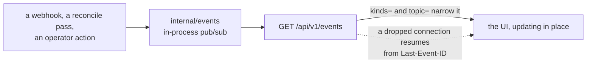

# Zoomies API surface

This is the authoritative list of endpoints. `internal/api` implements exactly
this, `api/openapi.yaml` describes exactly this, and the UI's generated
TypeScript client is derived from that document. **Nothing is reachable from the
UI that is not reachable from the API**, so if a page needs data, it comes from
a route below.

Conventions:

* Base path `/api/v1`. JSON in, JSON out, UTF-8.
* The three long lists, `/runners`, `/jobs` and `/audit`, take `limit` (default
  50, max 500), `offset`, `sort` and `order` (`asc`/`desc`) and return
  `{ "items": [...], "total": <int>, "limit": <int>, "offset": <int> }`. Every
  other list returns `{ "items": [...] }` whole; `/scaling-events` and
  `/webhook-deliveries` take a `limit` and return the newest that many.
* Every API response carries `Cache-Control: no-store`; nothing under `/api/v1`
  is meant to be cached by a browser or a proxy.
* Errors return `{ "error": { "code": "...", "message": "...", "field": "...",
  "detail": "..." } }` with a message written for a human. Codes:
  `bad_request`, `unauthorized`, `forbidden`, `not_found`, `conflict`,
  `unprocessable`, `rate_limited`, `internal`.
* Timestamps are RFC 3339 with a `Z` offset. Durations are Go duration strings
  (`"5m"`, `"1h30s"`).
* Mutating requests require `Content-Type: application/json` and, for cookie
  auth, an `Origin`/`Sec-Fetch-Site` check (same-origin unless
  `server.allowed_origins` says otherwise). Bearer-token requests are exempt
  because they are not subject to CSRF.
* `Role` is the minimum role required. `—` means unauthenticated.

## Meta and health

| Method | Path | Role | Notes |
| --- | --- | --- | --- |
| GET | `/healthz` | — | Liveness. Always 200 once the process is serving. |
| GET | `/readyz` | — | Readiness: database reachable, migrations applied. `schema` says which: how many, and the name of the latest, which is the only schema version there is. |
| GET | `/api/v1/meta` | — | Version, whether bootstrap is needed, whether OIDC is enabled, feature flags, and the fallback poller's state (`poller_enabled`, and `poller_last_poll_at` once it has completed a sweep). Safe to call before login — it is what the login page uses to decide what to render. |
| GET | `/metrics` | viewer¹ | Prometheus text format. ¹Unauthenticated when `metrics.public` is true. |
| GET | `/api/openapi.yaml` | — | The spec this document describes. |
| GET | `/robots.txt` | — | Declines crawling unless `server.allow_indexing` is on. Rendered per request, because it has to name this controller's own address. |
| GET | `/sitemap.xml` | — | The interface's top-level pages, absolute. Nothing about the fleet: a pool or runner address is gone by tomorrow. |

## Authentication

| Method | Path | Role | Notes |
| --- | --- | --- | --- |
| POST | `/api/v1/auth/bootstrap` | — | Create the first admin. **Refuses once any user exists** — that check is the whole security of this route. |
| POST | `/api/v1/auth/login` | — | `{username, password}` → sets the session cookie, returns the identity. Rate limited per source address. |
| POST | `/api/v1/auth/logout` | viewer | Clears the session. |
| GET | `/api/v1/auth/session` | viewer | The current identity: id, name, role, scopes, `must_change_password`. |
| POST | `/api/v1/auth/password` | viewer | `{old_password, new_password}` for the caller's own account. Invalidates the caller's other sessions. |
| GET | `/api/v1/auth/oidc/start` | — | 302 to the identity provider. |
| GET | `/api/v1/auth/oidc/callback` | — | Completes the flow, sets the cookie, 302 to `/`. |

## Overview

| Method | Path | Role | Notes |
| --- | --- | --- | --- |
| GET | `/api/v1/stats` | viewer | Queued/running counts, the window's completed jobs split into `succeeded`, `failed`, `cancelled` and `unknown` (the four add up to `completed`; `unknown` is a conclusion that is none of the others, including a job GitHub stopped reporting, and is never counted as a success), live runner counts by state, median and p95 queue wait, per-pool utilisation, and a `fleet` object carrying the same job figures narrowed to the jobs this fleet has a hand in — one an enabled pool claimed, one that ran on a runner started here, or one still queued that no pool claims. GitHub reports every job in an installed repository, so on an organisation that also uses hosted runners the unscoped figures are mostly somebody else's; both travel in one payload because the same numbers arrive over the event stream, which is one frame for every viewer. `?window=1h`. |
| GET | `/api/v1/samples` | viewer | Fleet samples for the sparklines. `?since=` or `?window=1h`. |
| GET | `/api/v1/problems` | viewer | The problems drawer: unhealthy hosts, failed registrations, webhook delivery failures, unmatched queued jobs, jobs whose runner stopped under them in the last hour, and every configuration warning from `config.Validate`. Returns `{ "items": [...], "ok": true }` — `ok` is true and `items` empty when there is nothing wrong. |
| GET | `/api/v1/scaling-events` | viewer | Recent scheduler decisions with their reason strings. `?pool_id=&limit=`. |
| GET | `/api/v1/events` | viewer | **SSE.** All live updates. Honours `Last-Event-ID`, and opens with a `resync` frame when it cannot replay the gap. Query `kinds=` and `topic=` narrow it. Sends a `heartbeat` comment every 20s. |

## Installations

| Method | Path | Role | Notes |
| --- | --- | --- | --- |
| GET | `/api/v1/installations` | viewer | Never includes key material. Carries `settings_url`, the App's own page on GitHub, once its slug is known. |
| POST | `/api/v1/installations` | admin | `{app_id, installation_id, target, target_type, api_base_url, private_key, webhook_secret}`. The key is sealed before it touches the database. |
| GET | `/api/v1/installations/{id}` | viewer | |
| PATCH | `/api/v1/installations/{id}` | admin | |
| DELETE | `/api/v1/installations/{id}` | admin | Cascades to its pools, and removes their runners **now**, interrupting any job they are running: the runners have to be deregistered while the installation's credentials still exist, which is before the row goes. The response says how many pools and runners went. Drain the pools first (`DELETE /pools/{id}`) if the jobs matter. |
| POST | `/api/v1/installations/{id}/verify` | operator | Probes credentials and permissions. On 403 the message names the missing permission. Also answers *which repositories these credentials reach* — `repository_selection` is GitHub's own `all` or `selected`, with a count and the first names — because an App with every permission correct, installed on "only select repositories" and not on the one somebody pushes to, is a fleet where nothing ever queues and no page says why. A failure to list them costs that line and not the verify. Records the App's slug, which is how a hand-added installation learns it. |
| GET | `/api/v1/installations/{id}/runner-groups` | viewer | Populates the pool wizard. |
| GET | `/api/v1/installations/{id}/rate-limit` | viewer | Remaining GitHub API quota. |
| POST | `/api/v1/installations/manifest` | admin | Builds the GitHub App manifest and returns the URL to POST it to. |
| POST | `/api/v1/installations/manifest/exchange` | admin | Exchanges the manifest `code` for App credentials and creates the installation. |
| GET | `/api/v1/webhook-deliveries` | viewer | Recent deliveries. `?status=rejected`. Each carries `installation_id`: the installation whose webhook secret verified the delivery, which is not necessarily the one covering the repository — when none does, every configured secret is tried and this says which one answered. |
| POST | `/api/v1/webhook-test` | operator | Asks GitHub to redeliver / pings the configured URL and reports whether this controller is reachable, with the specific fix when it is not. |

## Pools

| Method | Path | Role | Notes |
| --- | --- | --- | --- |
| GET | `/api/v1/pools` | viewer | Includes live per-state runner counts and utilisation. |
| POST | `/api/v1/pools` | operator | Full pool object. Server-side validation mirrors the wizard's. |
| POST | `/api/v1/pools/validate` | operator | Dry run: returns field errors, the dangerous-setting warnings the pool would produce, and how the fleet answers it — `selected_hosts` (what its host selector reaches), `matching_hosts` (what could actually run it) and `excluded_hosts` (each host in the gap, with the reason). Creates nothing; the wizard calls it from the placement step on. |
| GET | `/api/v1/pools/platforms` | viewer | The runner image catalogue: every operating system and release a `zoomies-runner` image is published for, and the architectures each is built for. Served rather than hard-coded in a client, so a pool cannot be offered a platform no image exists for. |
| GET | `/api/v1/pools/{id}` | viewer | |
| PATCH | `/api/v1/pools/{id}` | operator | |
| DELETE | `/api/v1/pools/{id}` | operator | `?drain=true` (default) drains runners first; `?force=true` removes them immediately, interrupting their jobs. Deleting a pool deletes its runners' records with it, so it answers `409` while any of them is still finishing — the refusal has already asked them to stop, so call it again once they have gone. A pool whose runners are idle goes in one call, because an idle runner is removed outright rather than drained. The response says how many runners were affected. |
| POST | `/api/v1/pools/{id}/prewarm` | operator | Queues an image pull on every host the pool could be placed on, so the first job does not pay for it. `202` with the per-host state. |
| POST | `/api/v1/pools/{id}/enable` | operator | |
| POST | `/api/v1/pools/{id}/disable` | operator | Existing runners drain; no new ones are made. |

A pool's `cache` is disposable build acceleration mounted at
`/opt/zoomies-cache`, not workflow storage, and two of its fields have rules
worth stating plainly.

`cache.size_limit` is enforced, not advisory: as a runner starts, whole cache
entries are deleted least-recently-modified-first until the cache is back under
the limit — but only when no other runner is using that cache. A pool that runs
several runners at once shares one cache between them, so evicting whenever a
runner starts would delete files out from under a job already running, and a
start that finds the cache busy leaves it alone until one finds it idle. It
bounds how far a cache drifts over its limit across jobs; it is not a filesystem
quota, and one job can still fill a disk before the next runner starts. Only a
directory can be measured, so a non-zero limit requires `cache.source` to be an
absolute host path — a limit on a named volume is refused rather than accepted
and ignored.

`cache.scope: repository` gives each repository its own cache. A
repository-targeted installation says which repository that is; an
organisation-targeted one — one app over a whole organisation, which is the
usual deployment — does not, so the pool names it in `cache.repository` as
`owner/name` under the installation's owner. That is what lets a shared fleet
give each repository a cache without an installation per repository.

## Runners

| Method | Path | Role | Notes |
| --- | --- | --- | --- |
| GET | `/api/v1/runners` | viewer | Filters: `pool_id`, `host_id`, `state` (repeatable), `q`, `include_removed`. |
| GET | `/api/v1/runners/{id}` | viewer | Includes the current job and the host. |
| GET | `/api/v1/runners/{id}/timeline` | viewer | State transitions with durations, for the detail page. |
| POST | `/api/v1/runners/{id}/drain` | operator | Stop taking new work and exit. A job still running is given five minutes to finish; if it takes longer the runner is stopped and GitHub marks that job failed. Draining a busy runner is therefore refused with `409` unless `?confirm=true` says you accept that. A runner that is not busy drains without it. |
| DELETE | `/api/v1/runners/{id}` | operator | `?force=true` kills immediately; without it, behaves as drain-then-remove. Deregisters from GitHub. |
| POST | `/api/v1/runners/bulk` | operator | `{action: "drain"\|"delete", ids: [...], force?: bool}`. Returns per-id results so a partial failure is visible. |
| GET | `/api/v1/runners/{id}/logs` | viewer | **SSE.** Live log tail relayed from the agent. `?tail=&follow=`. |
| GET | `/api/v1/runners/{id}/logs/download` | viewer | `text/plain` snapshot with a `Content-Disposition` filename. |

## Jobs

| Method | Path | Role | Notes |
| --- | --- | --- | --- |
| GET | `/api/v1/jobs` | viewer | Filters: `repo`, `workflow`, `pool_id`, `runner_id`, `state`, `conclusion`, `label`, `q`, `since`, `until`, `unmatched`, `managed`, `failed`. `managed=true` narrows the list to what this fleet has a hand in — a pool claims it, a runner here ran it, or it is queued and unclaimed with labels that could have asked for a pool here — which is what the Jobs page asks for by default. A queued job whose labels all name GitHub's own runners or a vendor's is left out with the finished ones: nothing here will ever run it. `failed=true` keeps the jobs that went wrong on either side: a conclusion GitHub counts as a failure, or a runner that stopped under the job, including one GitHub still believes is running. Each item carries `matched`, `hosted` (every label names GitHub's own runners or a hosted-runner vendor's, so a job no pool claims is theirs to run rather than stuck), `installation_id` (read-only: the installation covering the job's repository, resolved when the job was first recorded, and empty when none does — a pool only runs work in its own installation's target, so a pool whose labels fit is still not eligible unless this matches it), `queue_wait_ms`, `duration_ms`, the job's `steps` as GitHub last reported them, `failed_step` (the first step that did not succeed, or null), `head_branch`, `head_sha`, `run_attempt`, and `runner_fault` when the fleet's runner stopped before GitHub reported the job over. |
| GET | `/api/v1/jobs/{id}` | viewer | |
| POST | `/api/v1/jobs/{id}/cancel` | operator | Ask GitHub to cancel the entire workflow run containing this job. Body: `{ "force": false }`; force bypasses conditions that can leave an ordinary cancellation stuck. Returns `202` when GitHub accepts it. Available only when `github.allow_workflow_cancellation` is enabled and the App has Actions write permission. The local job stays pending until GitHub confirms its terminal state. |
| GET | `/api/v1/jobs/{id}/events` | viewer | The job's timeline: what Zoomies observed and did about it, oldest first, each entry a sentence with its `kind` (`queued`, `waiting`, `approved`, `claimed`, `unmatched`, `started`, `completed`, `runner_lost`, `runner_returned`, `cancel_requested`) and `source` (`webhook`, `poller`, `agent`, `controller`). Written from what each delivery changed rather than from the delivery itself, so a redelivery adds nothing. `runner_lost` is the one entry GitHub cannot produce: the runner died under the job, and GitHub will report an ordinary failure. `waiting` and `approved` bracket a deployment review: the time between them is GitHub's, and the queue wait starts at `approved`. Every change to it is accompanied by a `job.updated` frame, which is when the UI refetches it. |
| GET | `/api/v1/jobs/{id}/explanation` | viewer | Why this job is where it is, in one sentence with a detail and, where there is something to do, a fix. Computed on the controller from the last scheduler plan, the pool that claimed it, and the runner and host behind it — so `blocked` distinguishes a fleet that is merely busy, which clears itself, from one that will never place this job. It is a separate route rather than a field on the job because it is computed from the fleet around the job rather than from its row, and a copy of the job delivered by the event stream would carry a stale one. |
| GET | `/api/v1/jobs/facets` | viewer | Distinct repos, workflows and conclusions, for the filter menus. |

## Usage

| Method | Path | Role | Notes |
| --- | --- | --- | --- |
| GET | `/api/v1/usage` | viewer | `from` and `to` are required RFC 3339 instants no more than 366 days apart; `group_by` is `pool` (default), `installation`, `repository` or `workflow`. |
| GET | `/api/v1/usage.csv` | viewer | The same aggregate as a `text/csv` attachment. A value the grouping cannot produce is an empty cell, not a zero. |

Two things about the shape are worth knowing before a figure is quoted at
anyone.

**The job counts are additive.** `jobs` counts jobs *queued* inside the
interval, `jobs_started` those that began running in it, and `jobs_completed`
those that finished in it. Each job contributes to exactly one interval per
count, so two adjacent reports sum to the report over both. A job that is
merely *present* — queued last week and still queued — is not counted again in
every window it spans. `job_execution_seconds` and `peak_concurrency` are
clipped to the interval and are about time rather than counts, so they behave
the same way.

**`null` is not zero.** `average_queue_wait_seconds` is the mean over the
`jobs_started` jobs, which is the population with an observed wait, and is
`null` when nothing started in the interval — during an incident that reads as
"no job got off the queue" instead of a flatteringly small average.
`allocated_runner_seconds` and `estimated_cost` are `null` for the repository
and workflow groupings, because a runner idles on behalf of a pool and never on
behalf of a repository; the response's `allocation_attributable` says so once
for the whole report, so a client can drop the column rather than print zeroes.

## Hosts and agents

| Method | Path | Role | Notes |
| --- | --- | --- | --- |
| GET | `/api/v1/hosts` | viewer | Includes health, capacity, active runners, backend capabilities, and `upgrade_command`, `upgrade_version`, `upgrade_note` when a remote agent needs version guidance. The copyable command contains no credentials. Also `protocol_version` and `incompatible`: a host whose agent speaks a protocol this controller does not is excluded from placement exactly as a cordoned one is, and nothing else — its runners keep working and are drained as normal. |
| GET | `/api/v1/hosts/{id}` | viewer | |
| PATCH | `/api/v1/hosts/{id}` | operator | Capacity, labels and the reserve (`reserve_cpus`, `reserve_memory_mb`, `reserve_disk_mb`) — what the machine keeps for itself, in the units the host reports its own figures in. Each field is independent, and a reserve on a figure the host has never reported, or one that would leave nothing to place on, is refused rather than clamped. The reserve is written by its own statement, never by the path a heartbeat takes: a host cannot talk its way out of the room its operator kept for it. |
| POST | `/api/v1/hosts/{id}/cordon` | operator | `{cordoned: bool}`. Keeps existing runners, accepts no new ones. |
| DELETE | `/api/v1/hosts/{id}` | admin | Refuses while the host has live runners unless `?force=true`. |
| GET | `/api/v1/join-tokens` | admin | Outstanding and spent join tokens. Never the secret. |
| POST | `/api/v1/join-tokens` | admin | `{ttl, labels, capacity, controller_url}` → returns the plaintext token **once**, plus the ready-to-paste install command. `controller_url` is optional and replaces `server.external_url` in that command; `capacity` 0 lets the agent decide from the host's CPU count. |
| GET | `/api/v1/join-tokens/{id}` | admin | One token's state. Once redeemed, `used_by_id` is the host it became, which is what the Add-a-host page waits for. |
| DELETE | `/api/v1/join-tokens/{id}` | admin | Revokes an unused token. |

### Agent routes

Authenticated with the agent's own token, never a user session. An agent may
only touch its own host's runners. They are in `api/openapi.yaml` too, marked
`x-internal: true`, so the document is the whole surface it says it is; a
client generator should skip them, and `internal/agent/protocol.go` owns the
wire types.

| Method | Path | Notes |
| --- | --- | --- |
| POST | `/api/v1/agent/join` | Redeems a join token, returns host id + agent token. |
| POST | `/api/v1/agent/heartbeat` | Liveness, backend capabilities, runner observations. |
| GET | `/api/v1/agent/tasks` | Long-poll, up to 25s, returns a `TaskBatch`. |
| POST | `/api/v1/agent/results` | Task outcomes. |
| POST | `/api/v1/agent/report` | Out-of-band runner state reports. |
| POST | `/api/v1/agent/logs/{stream_id}` | Chunked outbound log relay for a UI viewer. |

## Migrations

Moving a repository's workflows from GitHub's runners onto this fleet. The plan
writes nothing; the second call is the only thing in Zoomies that writes to a
repository, and it needs three App permissions the rest of Zoomies does not ask
for: Contents (write), Pull requests (write) and Workflows (write).

| Method | Path | Role | Notes |
| --- | --- | --- | --- |
| POST | `/api/v1/migrations/plan` | operator | `{installation_id, repos?, mapping?, overrides?, cursor?}`. Returns the rewrites, the skips and a unified diff per file. With no mapping, proposes one from the pools that exist. Repositories come a page at a time: pass the response's `next_cursor` back as `cursor` for the next one. Each repository carries `archived` and `on_zoomies`, which are the two reasons it cannot be migrated; an archived one's workflows are not read at all. |
| POST | `/api/v1/migrations/pull-requests` | operator | `{installation_id, repos, mapping?, overrides?, workflows?, title?, body?, commit_message?}`. One pull request per repository, each on its own branch. `workflows` narrows a repository to the files named for it. Re-plans from the repository's current contents rather than trusting the client. |

`mapping` is one answer per hosted-runner label for every repository. `overrides` are the exceptions to it: each is `{repo, path, job, to}` naming one job in one workflow file, with a `to` of `""` meaning that job stays on the runner it names today. Either one alone is enough to open a pull request.

## Audit

| Method | Path | Role | Notes |
| --- | --- | --- | --- |
| GET | `/api/v1/audit` | viewer | Filters: `actor_id`, `action`, `target_kind`, `target_id`, `q`, `since`, `until`. |
| GET | `/api/v1/audit/actions` | viewer | Distinct action names for the filter menu. |

## Users, tokens, settings

| Method | Path | Role | Notes |
| --- | --- | --- | --- |
| GET | `/api/v1/users` | admin | |
| POST | `/api/v1/users` | admin | `{username, password?, email, display_name, role}`. |
| GET | `/api/v1/users/{id}` | admin | |
| PATCH | `/api/v1/users/{id}` | admin | Refuses to demote or disable the last enabled admin. |
| DELETE | `/api/v1/users/{id}` | admin | Same refusal. |
| POST | `/api/v1/users/{id}/password` | admin | Admin reset; sets `must_change_password`. |
| GET | `/api/v1/tokens` | admin | Metadata only. |
| POST | `/api/v1/tokens` | admin | `{name, role, scopes, expires_in}` → the plaintext **once**. |
| DELETE | `/api/v1/tokens/{id}` | admin | Revokes. |
| GET | `/api/v1/settings` | admin | Effective config with every secret blanked, plus the validator's findings. |
| PATCH | `/api/v1/settings` | admin | The subset that is safe to change at runtime: retention, scheduler tunables, poll interval, log level. Anything requiring a restart is rejected with a message saying so. |

## Recovery

| Method | Path | Role | Notes |
| --- | --- | --- | --- |
| GET | `/api/v1/recovery` | viewer | Whether this fleet is held for recovery, and why. |
| POST | `/api/v1/recovery/unfence` | admin | Lift it. Audited under its own action; lifting an unfenced instance succeeds and changes nothing. |

`zoomies restore` marks a restored database for recovery, and a controller
reading that mark decides as normal and applies none of it: no runner is
created, drained or removed, nothing is reaped from GitHub, and the fallback
poller does not sweep. The plan is still computed and published, so the
Overview shows exactly what would happen the moment the fence is lifted — the
difference between "nothing to do" and "not allowed to".

`/readyz` answers 503 while the fence is on, so a load balancer takes the
instance out of rotation and a deployment does not go green. Liveness is
deliberately unaffected: the container image's health check is `/healthz`, so a
fenced controller is not restarted by its own runtime.

## Diagnostics

| Method | Path | Role | Notes |
| --- | --- | --- | --- |
| GET | `/api/v1/diagnostics/bundle` | admin | This instance in one JSON document, for a bug report. Admin because it contains the settings section, which is. |

The bundle is assembled from the same renderings the routes above serve, so a
section that is secret-free on its own route is secret-free here; the
configuration in particular is the key-by-key rendering `/settings` uses, which
a secret added to `config.Config` tomorrow cannot appear in by default.

It never carries workflow log bodies. There is no redaction pass for them and
there cannot be a reliable one — a log holds whatever a workflow printed — so
the document carries runner IDs and the `/logs/download` route instead, and an
operator attaches logs deliberately.

Assembly is section by section: a section that fails costs its own contents and
lands in `errors` rather than failing the whole document, because the moment a
bundle is taken is the moment a query is most likely to fail. Sections are
capped by row count and the whole document by bytes; anything shortened says so
in `truncated`. `zoomies diagnostics` is the wrapper that writes it to a file.

## Webhooks

| Method | Path | Role | Notes |
| --- | --- | --- | --- |
| POST | `/webhooks/github` | — | HMAC-verified. Body capped at 5 MiB. Acts on `workflow_job` and `ping`; records every delivery either way. Path is configurable via `github.webhook_path`. |

## SSE event kinds

Emitted on `/api/v1/events`; the `event:` field carries the kind and `data:` the
JSON payload. One stream carries the lot, and a client narrows it rather than
opening several:



`runner.created` · `runner.updated` · `runner.deleted` · `pool.created` ·
`pool.updated` · `pool.deleted` · `job.updated` · `host.updated` ·
`host.deleted` · `scaling` · `installation.updated` · `installation.deleted` ·
`problems.updated` · `stats` · `audit` · `webhook.delivery` · `heartbeat` ·
`resync`

Every frame but `heartbeat` and `resync` carries an `id` of the form
`<epoch>.<sequence>`, where the epoch names one run of the controller. A client
sends the last one it saw as `Last-Event-ID` (or `?last_event_id=`, when it has
opened a fresh connection) and receives what it missed. When it cannot -- the
server's buffer has moved on, or the controller restarted and the sequence began
again -- the first frame on the new connection is `resync`, and the client
should fetch the resources again rather than trust what it holds. The UI does
exactly that.

`resync` also arrives **mid-stream** when more than 64 runner rows are removed
at once, which is what the hourly prune does to everything past the retention
window. Announcing thousands of deletions one at a time overruns every
subscriber's 256-deep queue, and a subscriber that falls behind is dropped: the
stream ends, every open tab reconnects and refetches everything. One `resync`
carries the same news for the cost of one frame. A `resync` frame from the bus
carries an `id` like any other, and its payload names the reason.

Three rules are what make the stream enough to keep a page current, so that no
client ever has to poll or ask the operator to reload:

* **A `*.created` or `*.updated` frame is the resource's `GET` response**, in
  exactly that shape: `host.updated` carries `healthy` and `free`,
  `runner.updated` carries `pool_name` and `host_name`, `pool.updated` carries
  its counts and warnings. A client replaces the row it holds rather than
  merging into it. The views are rendered once, in
  `internal/controller/views.go`, for both transports, so the two cannot drift.
  A `*.deleted` frame carries `{ "id": … }` and nothing else.
* **`stats`, `problems.updated` and a host's own numbers are computed, not
  stored**, so no row change can announce them. The controller works them out
  after every reconcile pass and every housekeeping tick, and sends each only
  when its JSON changed. `stats` summarises the same one-hour window
  `GET /stats` defaults to; `problems.updated` is the whole `GET /problems`
  response. A host is the same idea per row: `active_runners` is counted from
  the runners table when the host is read, and the heartbeat behind
  `last_heartbeat` writes one column nothing publishes, so a runner starting or
  an agent checking in moves the card with no row change to announce it. Each
  host whose rendered view differs from the one last sent gets a `host.updated`;
  a host nobody has touched marshals to the same bytes and gets nothing. None of
  this is computed while nobody is connected to the stream.
* **An operator's change is announced by the handler that made it.** Creating,
  editing, enabling, disabling or deleting a pool; editing, cordoning or
  deleting a host; adding, editing or removing an installation -- each
  publishes before its response is written, so every other open dashboard sees
  it. Removing an installation announces each of its pools as deleted first.

## CLI mapping

The CLI is a client of this API and nothing more. Every command below is one or
two calls to a route above.

```text
zoomies pools list | get | create | edit | delete | enable | disable | prewarm
zoomies runners list | get | drain | delete | logs
zoomies jobs list | get
zoomies hosts list | cordon | uncordon | delete
zoomies hosts join-token create
zoomies installations list | verify
zoomies audit list | tail
zoomies users list | create | passwd | delete
zoomies tokens list | create | revoke
zoomies status                # the Overview, in a terminal
```

`--output json|table|yaml` on every read command. Credentials come from
`ZOOMIES_URL` + `ZOOMIES_TOKEN`, or `~/.config/zoomies/cli.yaml`.


### Private agent enrolment

`POST /api/v1/join-tokens` accepts `connection: "tailcat"` (admin only).
Omit `controller_url` for private enrolment. The returned `command` and
`join_command` contain credentials and must be treated as secrets; they are not
returned by token list/get endpoints. Failed tunnel setup returns 422 without
minting a token. The default `connection` is `direct` for existing clients.

`GET /api/v1/meta` includes the non-secret `tailcat_available` capability flag.
Host responses and `host.updated` include `connection: "direct" | "tailcat"`,
observed at enrolment and heartbeat. The tunnel accepts agent endpoints only;
operator routes are not available through it.
