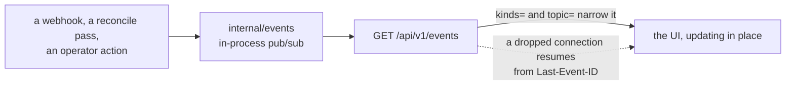

# Zoomies API surface

This is the authoritative list of endpoints. `internal/api` implements exactly
this, `api/openapi.yaml` describes exactly this, and the UI's generated
TypeScript client is derived from that document. **Nothing is reachable from the
UI that is not reachable from the API**, so if a page needs data, it comes from
a route below.

Conventions:

* Base path `/api/v1`. JSON in, JSON out, UTF-8.
* The long lists — `/runners`, `/jobs`, `/provisioning`, `/machines` and
  `/audit` — take `limit` (default 50, max 500), `offset`, `sort` and `order`
  (`asc`/`desc`) and return `{ "items": [...], "total": <int>, "limit": <int>,
  "offset": <int> }`. Every other list returns `{ "items": [...] }` whole;
  `/scaling-events` and `/webhook-deliveries` take a `limit` and return the
  newest that many.
* Every API response carries `Cache-Control: no-store`; nothing under `/api/v1`
  is meant to be cached by a browser or a proxy.
* Errors return `{ "error": { "code": "...", "message": "...", "field": "...",
  "detail": "..." } }` with a message written for a human. Codes:
  `bad_request`, `unauthorized`, `forbidden`, `not_found`, `conflict`,
  `unprocessable`, `rate_limited`, `internal`.
* Timestamps are RFC 3339 with a `Z` offset. Durations are Go duration strings
  (`"5m"`, `"1h30s"`).
* Mutating requests require `Content-Type: application/json` and, for cookie
  auth, an `Origin`/`Sec-Fetch-Site` check (same-origin unless
  `server.allowed_origins` says otherwise). Bearer-token requests are exempt
  because they are not subject to CSRF.
* `Role` is the minimum role required. `—` means unauthenticated.

## Meta and health

| Method | Path | Role | Notes |
| --- | --- | --- | --- |
| GET | `/healthz` | — | Liveness. Always 200 once the process is serving. |
| GET | `/readyz` | — | Readiness: database reachable, migrations applied. `schema` says which: how many, and the name of the latest, which is the only schema version there is. |
| GET | `/api/v1/meta` | — | Version, whether bootstrap is needed, whether OIDC is enabled, feature flags, and the fallback poller's state (`poller_enabled`, and `poller_last_poll_at` once it has completed a sweep). Safe to call before login — it is what the login page uses to decide what to render. |
| GET | `/metrics` | viewer¹ | Prometheus text format. ¹Unauthenticated when `metrics.public` is true. |
| GET | `/api/openapi.yaml` | — | The spec this document describes. |
| GET | `/robots.txt` | — | Declines crawling unless `server.allow_indexing` is on. Rendered per request, because it has to name this controller's own address. |
| GET | `/sitemap.xml` | — | The interface's top-level pages, absolute. Nothing about the fleet: a pool or runner address is gone by tomorrow. |

## Authentication

| Method | Path | Role | Notes |
| --- | --- | --- | --- |
| POST | `/api/v1/auth/bootstrap` | — | Create the first account, which holds the platform role: whoever can read the setup token out of the log already operates the process. **Refuses once any user exists** — that check is the whole security of this route. |
| POST | `/api/v1/auth/login` | — | `{username, password}` → sets the session cookie, returns the identity. Rate limited per source address. |
| POST | `/api/v1/auth/logout` | viewer | Clears the session. |
| GET | `/api/v1/auth/session` | viewer | The current identity: id, name, role, scopes, `must_change_password`. |
| GET | `/api/v1/auth/preferences` | viewer | The current account's private table widths and column order. Non-account identities receive an empty document. |
| PUT | `/api/v1/auth/preferences` | viewer | Replace the signed-in account's private table-layout document. API tokens cannot save one because they are not an account. |
| POST | `/api/v1/auth/password` | viewer | `{old_password, new_password}` for the caller's own account. Invalidates the caller's other sessions. |
| GET | `/api/v1/auth/oidc/start` | — | 302 to the identity provider. |
| GET | `/api/v1/auth/oidc/callback` | — | Completes the flow, sets the cookie, 302 to `/`. |

## Overview

| Method | Path | Role | Notes |
| --- | --- | --- | --- |
| GET | `/api/v1/stats` | viewer | Queued/running counts, the window's completed jobs split into `succeeded`, `failed`, `cancelled` and `unknown` (the four add up to `completed`; `unknown` is a conclusion that is none of the others, including a job GitHub stopped reporting, and is never counted as a success), live runner counts by state, median and p95 queue wait, per-pool utilisation, and a `fleet` object carrying the same job figures narrowed to the jobs this fleet has a hand in — one an enabled pool claimed, one that ran on a runner started here, or one still queued that no pool claims. GitHub reports every job in an installed repository, so on an organisation that also uses hosted runners the unscoped figures are mostly somebody else's; both travel in one payload because the same numbers arrive over the event stream, which is one frame for every viewer. `?window=1h`. |
| GET | `/api/v1/samples` | viewer | Fleet samples for the sparklines. `?since=` or `?window=1h`. |
| GET | `/api/v1/problems` | viewer | The problems drawer: unhealthy hosts, failed registrations, webhook delivery failures, unmatched queued jobs, jobs whose runner stopped under them in the last hour, and every configuration warning from `config.Validate`. Returns `{ "items": [...], "ok": true }` — `ok` is true and `items` empty when there is nothing wrong. |
| GET | `/api/v1/scaling-events` | viewer | Recent scheduler decisions with their reason strings. `?pool_id=&limit=`. |
| GET | `/api/v1/events` | viewer | **SSE.** All live updates. Honours `Last-Event-ID`, and opens with a `resync` frame when it cannot replay the gap. Query `kinds=` and `topic=` narrow it. Sends a `heartbeat` comment every 20s. |

## Installations

| Method | Path | Role | Notes |
| --- | --- | --- | --- |
| GET | `/api/v1/installations` | viewer | Never includes key material. Carries `settings_url`, the App's own page on GitHub, once its slug is known. |
| POST | `/api/v1/installations` | admin | `{app_id, installation_id, target, target_type, api_base_url, private_key, webhook_secret}`. The key is sealed before it touches the database. |
| GET | `/api/v1/installations/{id}` | viewer | |
| PATCH | `/api/v1/installations/{id}` | admin | |
| DELETE | `/api/v1/installations/{id}` | admin | Cascades to its pools, and removes their runners **now**, interrupting any job they are running: the runners have to be deregistered while the installation's credentials still exist, which is before the row goes. The response says how many pools and runners went. Drain the pools first (`DELETE /pools/{id}`) if the jobs matter. |
| POST | `/api/v1/installations/{id}/verify` | operator | Probes credentials and permissions. On 403 the message names the missing permission. Also answers *which repositories these credentials reach* — `repository_selection` is GitHub's own `all` or `selected`, with a count and the first names — because an App with every permission correct, installed on "only select repositories" and not on the one somebody pushes to, is a fleet where nothing ever queues and no page says why. A failure to list them costs that line and not the verify. Records the App's slug, which is how a hand-added installation learns it. |
| GET | `/api/v1/installations/{id}/runner-groups` | viewer | Populates the pool wizard. |
| GET | `/api/v1/installations/{id}/rate-limit` | viewer | Remaining GitHub API quota. |
| POST | `/api/v1/installations/manifest` | admin | Builds the GitHub App manifest and returns the URL to POST it to. |
| POST | `/api/v1/installations/manifest/handoff` | admin | A browser navigation, not a JSON call: the setup page submits GitHub's manifest back here as a form and is answered with a `307` to GitHub, so the POST body is carried on unchanged. The controller checks the pending handshake, the manifest and the destination first, because the redirect is what decides where a credential-creating form is posted. The state is spent by the exchange below, not by this. |
| POST | `/api/v1/installations/manifest/exchange` | admin | Exchanges the manifest `code` for App credentials and creates the installation. |
| GET | `/api/v1/webhook-deliveries` | viewer | Recent deliveries. `?status=rejected`. Each carries `installation_id`: the installation whose webhook secret verified the delivery, which is not necessarily the one covering the repository — when none does, every configured secret is tried and this says which one answered. |
| POST | `/api/v1/webhook-test` | operator | Asks GitHub to redeliver / pings the configured URL and reports whether this controller is reachable, with the specific fix when it is not. |

## Pools

| Method | Path | Role | Notes |
| --- | --- | --- | --- |
| GET | `/api/v1/pools` | viewer | Includes live per-state runner counts and utilisation. |
| POST | `/api/v1/pools` | operator | Full pool object. Server-side validation mirrors the wizard's. Omitting `resources.cpus` and `resources.memory_mb` is how a pool says the host decides: each runner is then given one slot's share of whichever machine it lands on. `cpu_burst` is the [elastic CPU](elastic-cpu.md) policy on top of that share — `mode` and `max_cpus` — and a qualifying pool that omits it is created on `observe`; the response's `sizing` reads `automatic`, `elastic` or `fixed`. `runner_settings` overrides the fleet's runner timings per pool, and distinguishes an absent field from an explicit `null`. |
| POST | `/api/v1/pools/validate` | operator | Dry run: returns field errors, the dangerous-setting warnings the pool would produce, and how the fleet answers it — `selected_hosts` (what its host selector reaches), `matching_hosts` (what could actually run it) and `excluded_hosts` (each host in the gap, with the reason). Creates nothing; the wizard calls it from the placement step on. |
| GET | `/api/v1/pools/defaults` | viewer | What a new pool is, and separately what a size form should open on. `resources` is empty, because a pool that names no size leaves it to the host each runner lands on; `suggested_resources` is the fleet's own figures, for a form offering a fixed size instead. `runner_settings` carries the fleet's runner timings so a form can say what an override is overriding — here rather than on `/settings`, because creating a pool is an operator action and reading the settings page is an administrator's. |
| GET | `/api/v1/pools/platforms` | viewer | The runner image catalogue: every operating system and release a `zoomies-runner` image is published for, and the architectures each is built for. Served rather than hard-coded in a client, so a pool cannot be offered a platform no image exists for. |
| GET | `/api/v1/pools/{id}` | viewer | |
| PATCH | `/api/v1/pools/{id}` | operator | Answers `409` when the change would leave this pool with no host in the fleet that could ever run it, while a host can run it as it stands — the message names the machine it no longer fits and by how much. `?confirm=true` saves it anyway, which is right for a pool sized for machines that have not joined yet. |
| DELETE | `/api/v1/pools/{id}` | operator | `?drain=true` (default) drains runners first; `?force=true` removes them immediately, interrupting their jobs. Deleting a pool deletes its runners' records with it, so it answers `409` while any of them is still finishing — the refusal has already asked them to stop, so call it again once they have gone. A pool whose runners are idle goes in one call, because an idle runner is removed outright rather than drained. The response says how many runners were affected. |
| POST | `/api/v1/pools/{id}/prewarm` | operator | Queues an image pull on every host the pool could be placed on, so the first job does not pay for it. `202` with the per-host state. |
| POST | `/api/v1/pools/{id}/enable` | operator | |
| POST | `/api/v1/pools/{id}/disable` | operator | Existing runners drain; no new ones are made. |

A pool's `cache` is disposable build acceleration mounted at
`/opt/zoomies-cache`, not workflow storage, and two of its fields have rules
worth stating plainly.

`cache.size_limit` is enforced, not advisory: as a runner starts, whole cache
entries are deleted least-recently-modified-first until the cache is back under
the limit — but only when no other runner is using that cache. A pool that runs
several runners at once shares one cache between them, so evicting whenever a
runner starts would delete files out from under a job already running, and a
start that finds the cache busy leaves it alone until one finds it idle. It
bounds how far a cache drifts over its limit across jobs; it is not a filesystem
quota, and one job can still fill a disk before the next runner starts. Only a
directory can be measured, so a non-zero limit requires `cache.source` to be an
absolute host path — a limit on a named volume is refused rather than accepted
and ignored.

`cache.scope: repository` gives each repository its own cache. A
repository-targeted installation says which repository that is; an
organisation-targeted one — one app over a whole organisation, which is the
usual deployment — does not, so the pool names it in `cache.repository` as
`owner/name` under the installation's owner. That is what lets a shared fleet
give each repository a cache without an installation per repository.

## Runners

| Method | Path | Role | Notes |
| --- | --- | --- | --- |
| GET | `/api/v1/runners` | viewer | Filters: `pool_id`, `host_id`, `state` (repeatable), `q`, `include_removed`. |
| GET | `/api/v1/runners/{id}` | viewer | Includes the current job and the host, and what the runner was given: `allocated_cpus` and `allocated_memory_mb` (each omitted when the runner has no limit on that field) with `allocation_source`, `pool` when the pool set the limit and `host` when it is the host's default share, omitted when the runner has neither. Recorded at create, so a pool edited since does not change the answer. `cpu_resource` is the live [elastic CPU](elastic-cpu.md) state for a runner with an enforced CPU quota: a `state` to branch on (`observing`, `guaranteed`, `zoomies`, `maximum_zoomies`, `throttled`), a `label` for people, a `reason`, and `guaranteed_cpus`, `current_cpus` and `ceiling_cpus`. |
| GET | `/api/v1/runners/{id}/timeline` | viewer | State transitions with durations, for the detail page. |
| POST | `/api/v1/runners/{id}/drain` | operator | Stop taking new work and exit. A job still running is given five minutes to finish; if it takes longer the runner is stopped and GitHub marks that job failed. Draining a busy runner is therefore refused with `409` unless `?confirm=true` says you accept that. A runner that is not busy drains without it. |
| DELETE | `/api/v1/runners/{id}` | operator | `?force=true` kills immediately; without it, behaves as drain-then-remove. Deregisters from GitHub. |
| POST | `/api/v1/runners/bulk` | operator | `{action: "drain"\|"delete", ids: [...], force?: bool}`. Returns per-id results so a partial failure is visible. |
| GET | `/api/v1/runners/{id}/logs` | viewer | **SSE.** Live log tail relayed from the agent. `?tail=&follow=`. |
| GET | `/api/v1/runners/{id}/logs/download` | viewer | `text/plain` snapshot with a `Content-Disposition` filename. |

## Jobs

| Method | Path | Role | Notes |
| --- | --- | --- | --- |
| GET | `/api/v1/jobs` | viewer | Filters: `repo`, `workflow`, `run_id` (GitHub's run ID, sent with `repo`: how the Workflows page opens a run to the jobs inside it), `pool_id`, `runner_id`, `state`, `conclusion`, `label`, `q`, `since`, `until`, `unmatched`, `managed`, `failed`, `faulted`, `workflow_failed`, `fault`, `provisioning`. `cancelling` narrows by whether a cancellation has been asked of GitHub and not yet confirmed — leaving it off is every job, and `cancelling=false` is what a list of work still in hand wants, which is why the Jobs page sends it with its Running and Queued views. `provisioning` (`ready`, `expedited`, `paused`, `deleted`, repeatable) narrows to what an operator has done to a queued job's demand; the Jobs page sends `ready`, `expedited` and `paused` for its Queued view, because a job removed from the queue stopped counting as work this fleet is waiting on and the queue depth beside the list no longer counts it either. Every item carries `provisioning`, `provision_now` and `cancel_requested_at` so a client can say which without asking again. `managed=true` narrows the list to what this fleet has a hand in — a pool claims it, a runner here ran it, or it is queued and unclaimed with labels that could have asked for a pool here — which is what the Jobs page asks for by default. A queued job whose labels all name GitHub's own runners or a vendor's is left out with the finished ones: nothing here will ever run it. `failed=true` keeps the jobs that went wrong on either side: a conclusion GitHub counts as a failure, or a runner that stopped under the job, including one GitHub still believes is running. Each item carries `matched`, `hosted` (every label names GitHub's own runners or a hosted-runner vendor's, so a job no pool claims is theirs to run rather than stuck), `installation_id` (read-only: the installation covering the job's repository, resolved when the job was first recorded, and empty when none does — a pool only runs work in its own installation's target, so a pool whose labels fit is still not eligible unless this matches it), `queue_wait_ms`, `duration_ms`, the job's `steps` as GitHub last reported them, `failed_step` (the first step that did not succeed, or null), `head_branch`, `head_sha`, `run_attempt`, `run_number` (GitHub's own sequential number for the workflow run -- the "#1009" its Actions UI shows next to the workflow name, for cross-referencing the two; zero until a workflow_run lookup backfills it, since the webhook that recorded the job never carries it), and `runner_fault` when the fleet's runner stopped before GitHub reported the job over. `faulted=true` and `workflow_failed=true` are the two halves of `failed` — whose failure it was — and sending both is a 400. `fault` repeats to narrow a fleet failure to particular categories, and a category this build does not know is a 400 rather than a filter that quietly matches everything. Each item also carries `fault_kind`, `fault_domain` (`fleet` or `workflow`, empty on a job that did not fail) and `fault_fix`, which is what to do about a fault of that kind. GitHub records both domains as "failure", which is why the split is computed here rather than left to each client: a tile, a list and the CLI working it out separately is three places to disagree about whose bad afternoon it was. |
| GET | `/api/v1/jobs/{id}` | viewer | |
| POST | `/api/v1/jobs/{id}/rerun` | operator | Ask GitHub to run this run's failed jobs again — the remedy for a job the fleet broke, without going to GitHub to press the button there. GitHub has no job-level rerun, so this re-runs **every failed job in the run**. Returns `202` when GitHub accepts it, with `fault_domain` echoed back. Refuses a job that has not finished and one that did not fail; it does not check whose fault the failure was, because an operator who has looked at one and decided to run it again is entitled to — the fault category decides where the action is offered, not whether it is allowed. Nothing local changes: the rerun arrives as new deliveries with a higher `run_attempt`. Needs the App's Actions write permission. |
| POST | `/api/v1/jobs/{id}/cancel` | operator | Ask GitHub to cancel the entire workflow run containing this job. Body: `{ "force": false }`; force bypasses conditions that can leave an ordinary cancellation stuck. Returns `202` when GitHub accepts it. Available only when `github.allow_workflow_cancellation` is enabled and the App has Actions write permission. Once GitHub accepts the run-scoped request, Zoomies immediately pauses every locally queued job in that run, removes runners executing its jobs, and stamps `cancel_requested_at` on every job the run still owned. Job states stay pending/running until GitHub confirms their terminal state — GitHub owns the conclusion — but the stamp is what takes them out of the queue depth, the running count and the Jobs page's Running and Queued views straight away, rather than leaving the fleet reporting work nobody is going to do for as long as GitHub takes. |
| GET | `/api/v1/jobs/{id}/events` | viewer | The job's timeline: what Zoomies observed and did about it, oldest first, each entry a sentence with its `kind` (`queued`, `waiting`, `approved`, `claimed`, `unmatched`, `started`, `completed`, `runner_lost`, `runner_returned`, `cancel_requested`, `runner_start_failed`, `rerun_requested`) and `source` (`webhook`, `poller`, `agent`, `controller`). Written from what each delivery changed rather than from the delivery itself, so a redelivery adds nothing. `runner_lost` is the one entry GitHub cannot produce: the runner died under the job, and GitHub will report an ordinary failure. `runner_start_failed` is the failure that touches no job at all: a runner this pool started died before it could take one, so this job is still queued and the next runner may run it — written here because a pool that cannot start a container otherwise looks exactly like a pool that is merely busy. `waiting` and `approved` bracket a deployment review: the time between them is GitHub's, and the queue wait starts at `approved`. Every change to it is accompanied by a `job.updated` frame, which is when the UI refetches it. |
| GET | `/api/v1/jobs/{id}/explanation` | viewer | Why this job is where it is, in one sentence with a detail and, where there is something to do, a fix. Computed on the controller from the last scheduler plan, the pool that claimed it, and the runner and host behind it — so `blocked` distinguishes a fleet that is merely busy, which clears itself, from one that will never place this job. It is a separate route rather than a field on the job because it is computed from the fleet around the job rather than from its row, and a copy of the job delivered by the event stream would carry a stale one. |
| GET | `/api/v1/jobs/facets` | viewer | Distinct repos, workflows and conclusions, for the filter menus. |
| GET | `/api/v1/workflow-runs` | viewer | One row per workflow run — the "#1009" GitHub's Actions tab lists — summing up the jobs GitHub reported under it over the latest attempt of each job, the way GitHub's own run page does: `state` and `conclusion` are the run's own, `jobs` counts how its jobs are getting on, and `queued_at`, `started_at` and `completed_at` are the first job queued, the first started and the last finished. Nothing is stored for a run; it is derived from its jobs, so a run and the jobs `/jobs?repo=&run_id=` lists for it cannot disagree. Takes `/jobs`'s filters, read at the run's level: the status ones (`state`, `conclusion`, `failed`, `faulted`, `workflow_failed`, `cancelling`) name the run's own status — a run with one job running and another queued is running, and a run whose only failure was re-run to success has not failed — and every other filter keeps a run whenever any job of it matches, so a run arrives whole rather than reduced to the job that matched. This is what the Workflows page lists. |

## Provisioning queue

The demand behind the runners, rather than the runners: one row per queued job
this fleet would build a runner for. Suppressing demand is not cancelling a
job — GitHub still has it, and a runner that already exists may still pick it
up — which is why these are their own routes rather than a field on `/jobs`.

| Method | Path | Role | Notes |
| --- | --- | --- | --- |
| GET | `/api/v1/provisioning` | viewer | Always queued jobs this fleet has a hand in. Takes `/jobs`'s filters plus `branch` and `provisioning` (`ready`, `expedited`, `paused`, `deleted`), and carries `counts` beside the items, computed with every filter applied **except** the provisioning status — so selecting one status does not empty the other three cards. |
| GET | `/api/v1/provisioning/selection` | viewer | The IDs matching the current filters, at most 5,000. The point is the snapshot: a bulk action applies to the IDs the operator was looking at, so work that queues between the two calls cannot be swept in silently. |
| POST | `/api/v1/provisioning/bulk` | operator | `{ids, action: "pause"\|"resume"\|"delete"\|"run_now"}`. Returns a result per unique id, so a partial failure is visible; a job that started or finished in the meantime is skipped with its own error. `run_now` resumes and expedites within the pool's priority tier and bypasses the scale-up delay only — pool and host limits, quotas, backoff and recovery fencing all still apply. |

## Usage

| Method | Path | Role | Notes |
| --- | --- | --- | --- |
| GET | `/api/v1/usage` | viewer | `from` and `to` are required RFC 3339 instants no more than 366 days apart; `group_by` is `pool` (default), `installation`, `repository`, `workflow` or `host`. Each row carries a history of buckets, hourly for a range of two days or less and daily beyond; `interval=hour` or `interval=day` chooses instead, and hourly buckets may be asked for over at most 14 days. `history_from` says where the job and runner history the figures come from begins, because retention prunes runner rows sooner than job rows and a range that reaches past either is complete only from that instant on. |
| GET | `/api/v1/usage.csv` | viewer | The same aggregate as a `text/csv` attachment. A value the grouping cannot produce is an empty cell, not a zero. |

Two things about the shape are worth knowing before a figure is quoted at
anyone.

**The job counts are additive.** `jobs` counts jobs *queued* inside the
interval, `jobs_started` those that began running in it, and `jobs_completed`
those that finished in it. Each job contributes to exactly one interval per
count, so two adjacent reports sum to the report over both. A job that is
merely *present* — queued last week and still queued — is not counted again in
every window it spans. `job_execution_seconds` and `peak_concurrency` are
clipped to the interval and are about time rather than counts, so they behave
the same way.

**`null` is not zero.** `average_queue_wait_seconds` is the mean over the
`jobs_started` jobs, which is the population with an observed wait, and is
`null` when nothing started in the interval — during an incident that reads as
"no job got off the queue" instead of a flatteringly small average.
`allocated_runner_seconds` and `estimated_cost` are `null` for the repository
and workflow groupings, because a runner idles on behalf of a pool and never on
behalf of a repository; the response's `allocation_attributable` says so once
for the whole report, so a client can drop the column rather than print zeroes.

## Hosts and agents

| Method | Path | Role | Notes |
| --- | --- | --- | --- |
| GET | `/api/v1/hosts` | viewer | Includes health, capacity, active runners, backend capabilities, and `upgrade_command`, `upgrade_version`, `upgrade_note` when a remote agent needs version guidance. The copyable command contains no credentials. Also `protocol_version` and `incompatible`: a host whose agent speaks a protocol this controller does not is excluded from placement exactly as a cordoned one is, and nothing else — its runners keep working and are drained as normal. The throttle is four fields: `effective_capacity` (always present; the configured capacity stepped down by the throttle, equal to it when there is none, and what `free` is measured against), `throttle_reason` (always present, empty when not throttled: the operator sentence), `throttle` (only while throttled: `level` 1–3, `since`, `changed_at`, `calm_since` and `reason`) and `unlimited_runners` (omitted when zero: live runners here created with no CPU quota, the ones a sustained CPU hold can mean something about). `usage` carries `load_average_1m` beside the CPU and memory samples. |
| GET | `/api/v1/hosts/samples` | viewer | Every host's minute samples for the capacity map: slots taken and in use, measured CPU, load average and available memory, what the scheduler had promised away, and disk. A figure the host had not measured, or one that was stale when the minute was sampled, is absent rather than zero. `?since=` or `?window=1h`, and `?host_id=` for one host. Kept for `retention.samples`. |
| GET | `/api/v1/hosts/{id}` | viewer | |
| PATCH | `/api/v1/hosts/{id}` | operator | Capacity, labels and the reserve (`reserve_cpus`, `reserve_memory_mb`, `reserve_disk_mb`) — what the machine keeps for itself, in the units the host reports its own figures in. Each field is independent, and a reserve on a figure the host has never reported, or one that would leave nothing to place on, is refused rather than clamped. The reserve is written by its own statement, never by the path a heartbeat takes: a host cannot talk its way out of the room its operator kept for it. A change to the capacity or to any reserve also clears a standing throttle, since it was decided against figures that have just moved. Answers `409` when the reserve or the labels described would leave a pool that runs here today with no host in the fleet that could run it — the message names the pool and the shortfall, and `?confirm=true` saves it anyway, which is right when the pool is on its way out. |
| POST | `/api/v1/hosts/{id}/cordon` | operator | `{cordoned: bool}`. Keeps existing runners, accepts no new ones. A cordon keeps a throttle. |
| POST | `/api/v1/hosts/{id}/throttle/clear` | operator | Lifts the throttle the controller has this host on, whatever rung, and answers with the host. The operator's way out once the cause is fixed rather than a way to switch throttling off: nothing pins a clear, and the next heartbeat puts the host back on the first rung if the pressure is still there. A host on no rung is returned unchanged. Audited as `host.throttle_clear` under the caller's identity; the ladder's own steps are `host.throttle` and `host.throttle_lift` under the system's. |
| DELETE | `/api/v1/hosts/{id}` | admin | Refuses while the host has live runners unless `?force=true`. |
| GET | `/api/v1/join-tokens` | admin | Outstanding and spent join tokens. Never the secret. |
| POST | `/api/v1/join-tokens` | admin | `{ttl, labels, capacity, controller_url}` → returns the plaintext token **once**, plus the ready-to-paste install command. `controller_url` is optional and replaces `server.external_url` in that command; `capacity` 0 lets the agent decide from the host's CPU count. |
| GET | `/api/v1/join-tokens/{id}` | admin | One token's state. Once redeemed, `used_by_id` is the host it became, which is what the Add-a-host page waits for. |
| DELETE | `/api/v1/join-tokens/{id}` | admin | Revokes an unused token. |

### Agent routes

Authenticated with the agent's own token, never a user session. An agent may
only touch its own host's runners. They are in `api/openapi.yaml` too, marked
`x-internal: true`, so the document is the whole surface it says it is; a
client generator should skip them, and `internal/agent/protocol.go` owns the
wire types.

| Method | Path | Notes |
| --- | --- | --- |
| POST | `/api/v1/agent/join` | Redeems a join token, returns host id + agent token. |
| POST | `/api/v1/agent/heartbeat` | Liveness, backend capabilities, runner observations. |
| GET | `/api/v1/agent/tasks` | Long-poll, up to 25s, returns a `TaskBatch`. |
| POST | `/api/v1/agent/results` | Task outcomes. |
| POST | `/api/v1/agent/report` | Out-of-band runner state reports. |
| POST | `/api/v1/agent/logs/{stream_id}` | Chunked outbound log relay for a UI viewer. |

## Providers and machines

A provider is one place machines can be rented from. Its credential goes in
once, sealed with the instance key, and never comes back: every read reports
`credentials_configured` instead, because an audit row and a screenshot both
outlive the person who took them. A provider on a network the controller cannot
route to — a hypervisor at home — is reached through a `zoomies gateway`
running beside it, and the gateway's Tailcat address is handled the same way:
`tailcat_address` goes in once, sealed, and every read reports
`connection: tailcat`. Choosing `connection: direct` is what clears it. See
[Private hosts and providers](private-hosts.md#private-providers).

| Method | Path | Role | Notes |
| --- | --- | --- | --- |
| GET | `/api/v1/providers` | viewer | Each provider with its machines by state, how many still hold a resource, and `held` — why no new machine may be bought right now, in one sentence, or absent when one may. |
| POST | `/api/v1/providers` | admin | Creates one renting nothing: `max_machines` defaults to zero, so a fleet that turns a provider on says in the same breath how many machines it is willing to pay for. 422 names the offending field. |
| POST | `/api/v1/providers/validate` | admin | A dry run over a draft. Always 200 — the verdict is in the body — and it writes nothing and dials nothing, so a form can run it as somebody types. `?id=` says the draft is an edit to that provider, so the name check does not refuse it about itself. |
| POST | `/api/v1/providers/discover` | admin | What a draft's credential can see, before the draft is saved, so the wizard offers a menu of nodes, storages, bridges and templates. Refused with the create's own field errors when the draft could not be saved; a hypervisor that does not answer is 200 with empty lists and the reason in `unavailable`. |
| GET | `/api/v1/providers/kinds` | viewer | What this build can rent from, and the questions each driver's form has to ask. |
| GET | `/api/v1/providers/{id}` | viewer | |
| PATCH | `/api/v1/providers/{id}` | admin | Every field independent; what is not named is left alone. A `credential` or `tailcat_address` of `""` leaves the stored one alone, so a form with a blank password box does not erase it. A provider's kind cannot be changed — the machines it owns are that kind. |
| DELETE | `/api/v1/providers/{id}` | admin | 409 while any of its machines still holds a resource, naming how many. The rows are the only record of what was rented. |
| POST | `/api/v1/providers/{id}/check` | operator | The live preflight. Read-only at the hypervisor, audited here, and recorded on the row so a check run in a terminal quiets the warning the UI is showing. |
| GET | `/api/v1/providers/{id}/discovery` | operator | The nodes, storages, bridges and templates this credential can see. 409 from a driver that cannot list them, and the form asks for identifiers instead. |
| GET | `/api/v1/providers/{id}/orphans` | admin | The three sections of the review page: resources with no row, rows holding no resource, and machines nobody can vouch for. |
| POST | `/api/v1/providers/{id}/pause` · `/resume` | operator | The kill switch. It blocks new machines only — drains, deletes, recovery and ownership checks carry on — and pressing either twice is not an error. Audited as `provider.pause` / `provider.resume`. |
| GET | `/api/v1/machines` | viewer | Paged, filtered by `?provider=`, `?pool=`, `?host=`, `?state=`, `?q=` and `?include_deleted=`. |
| GET | `/api/v1/machines/{id}` | viewer | Includes the phase timeline the detail page reads as a life rather than a row of timestamps. |
| POST | `/api/v1/machines/{id}/drain` | operator | Cordons its host and lets its runners finish. Reversible until the delete starts: demand coming back takes a draining machine back to ready rather than paying for a new one. |
| DELETE | `/api/v1/machines/{id}` | admin | Answers 200 with the machine in `deleting`, because a delete is finished when the resource can no longer be found, not when the provider returns. 409 while runners are still going unless `?force=true`. A quarantined machine is **never** deletable, forced or not. |
| POST | `/api/v1/machines/{id}/release` | admin | Forgets a row and touches nothing, for the machine nobody can safely delete. The machine's name must be in the body. Audited with the provider's identifiers for the resource, because after this the audit row is the only record of them. |

**There is no `POST /machines`.** A machine exists because demand asked for one:
one creation path means one accounting path, and a hand-made machine would be
supply the reconciler would then decide to delete. An operator who wants more
machines raises the provider's ceiling.

`DELETE /api/v1/hosts/{id}` refuses a host that is a machine Zoomies created,
and says to delete the machine instead — that removes the VM too. `?force=true`
still works and forgets the host while leaving the VM running, which is a thing
somebody may genuinely want and never a thing to do by accident.

`GET /api/v1/meta` includes the non-secret `providers_available` flag: this
build ships at least one driver and `provider.enabled` is on.

## Migrations

Moving a repository's workflows from GitHub's runners onto this fleet. The plan
writes nothing; the second call is the only thing in Zoomies that writes to a
repository, and it needs three App permissions the rest of Zoomies does not ask
for: Contents (write), Pull requests (write) and Workflows (write).

| Method | Path | Role | Notes |
| --- | --- | --- | --- |
| POST | `/api/v1/migrations/plan` | operator | `{installation_id, repos?, mapping?, overrides?, cursor?}`. Returns the rewrites, the skips and a unified diff per file. With no mapping, proposes one from the pools that exist. Repositories come a page at a time: pass the response's `next_cursor` back as `cursor` for the next one. Each repository carries `archived` and `on_zoomies`, which are the two reasons it cannot be migrated; an archived one's workflows are not read at all. |
| POST | `/api/v1/migrations/pull-requests` | operator | `{installation_id, repos, mapping?, overrides?, workflows?, title?, body?, commit_message?, badge?}`. One pull request per repository, each on its own branch. `workflows` narrows a repository to the files named for it. `badge` (default `true`) also adds the "CI has the Zoomies" badge to each README; each result says what became of it. Re-plans from the repository's current contents rather than trusting the client. |

`mapping` is one answer per hosted-runner label for every repository. `overrides` are the exceptions to it: each is `{repo, path, job, to}` naming one job in one workflow file, with a `to` of `""` meaning that job stays on the runner it names today. Either one alone is enough to open a pull request.

## Audit

| Method | Path | Role | Notes |
| --- | --- | --- | --- |
| GET | `/api/v1/audit` | viewer | Filters: `actor_id`, `action`, `target_kind`, `target_id`, `q`, `since`, `until`. |
| GET | `/api/v1/audit/actions` | viewer | Distinct action names for the filter menu. |

## Users, tokens, settings

| Method | Path | Role | Notes |
| --- | --- | --- | --- |
| GET | `/api/v1/users` | admin | |
| POST | `/api/v1/users` | admin | `{username, password?, email, display_name, role}`. |
| GET | `/api/v1/users/{id}` | admin | |
| PATCH | `/api/v1/users/{id}` | admin | Refuses to demote or disable the last enabled admin. |
| DELETE | `/api/v1/users/{id}` | admin | Same refusal. |
| POST | `/api/v1/users/{id}/password` | admin | Admin reset; sets `must_change_password`. |
| GET | `/api/v1/tokens` | admin | Metadata only. |
| POST | `/api/v1/tokens` | admin | `{name, role, scopes, expires_in}` → the plaintext **once**. |
| DELETE | `/api/v1/tokens/{id}` | admin | Revokes. |
| GET | `/api/v1/settings` | admin | Every setting with its value, its kind, the layer it came from and whether it can be changed here, plus the same configuration as a nested object and the validator's findings. No secret's value is ever sent. |
| PATCH | `/api/v1/settings` | admin | Change the fleet's settings. Keys may be nested or dotted; `null` clears one, so it goes back to the file or the default. An accepted change is always stored: one the running process can apply does so at once, and one it cannot is named in `pending_restart`. Refused: a key read before the database opens, one belonging to a standalone agent's own host, one an environment variable is pinning, and any change that would leave a controller which will not start. |
| GET | `/api/v1/settings/export` | admin | Every setting somebody has set — stored here, set in the file, or pinned by the environment — as a file: `?format=json` (the default) wraps the tree with when, where from and which secrets were configured but not exported; `?format=yaml` is the tree alone, in the shape `zoomies.yaml` takes, so the download can be started from. Defaults are left out because they are computed on the host that reads them, and no secret's value is ever in it. Audited. |
| POST | `/api/v1/settings/import` | admin | `{document, dry_run, skip}`. The document is an export or a `zoomies.yaml`, as text. Every key is planned through the same checks a PATCH makes and reported as `change`, `unchanged`, `unset` or `refused` with the reason; a dry run reports and writes nothing, and a real run refuses the whole document while any key is refused, so it is one change or none. `skip` names the keys to leave out — the refused ones, or the ones the operator unticked. Applying returns the settings page as well, so a client can repaint without a second request. Audited. |

## Recovery

| Method | Path | Role | Notes |
| --- | --- | --- | --- |
| GET | `/api/v1/recovery` | viewer | Whether this fleet is held for recovery, and why. |
| POST | `/api/v1/recovery/unfence` | platform | Lift it. Audited under its own action; lifting an unfenced instance succeeds and changes nothing. |

`zoomies restore` marks a restored database for recovery, and a controller
reading that mark decides as normal and applies none of it: no runner is
created, drained or removed, nothing is reaped from GitHub, and the fallback
poller does not sweep. The plan is still computed and published, so the
Overview shows exactly what would happen the moment the fence is lifted — the
difference between "nothing to do" and "not allowed to".

`/readyz` answers 503 while the fence is on, so a load balancer takes the
instance out of rotation and a deployment does not go green. Liveness is
deliberately unaffected: the container image's health check is `/healthz`, so a
fenced controller is not restarted by its own runtime.

## Backups

| Method | Path | Role | Notes |
| --- | --- | --- | --- |
| GET | `/api/v1/backups` | platform | Every backup in `backup.directory` and every copy the store took before migrating, newest first, each with what its manifest says and whether a restore of it would be refused (`restorable`, `restore_problem`); the schedule and its last outcome; the restore waiting for a restart, if any; and what became of the last one. |
| POST | `/api/v1/backups` | platform | Take one now: `VACUUM INTO`, integrity checked, with its manifest. Retention runs afterwards. `409` while another is being taken. |
| POST | `/api/v1/backups/upload` | platform | `multipart/form-data`: the archive in `file`, and for an encrypted one its `passphrase`. Unpacked into a staging directory, verified, then listed under the name its manifest gives it. Bounded by its own limit rather than the API's, since an archive is the whole database. |
| GET | `/api/v1/backups/{id}` | platform | |
| DELETE | `/api/v1/backups/{id}` | platform | `409` while the backup is staged to be restored. |
| POST | `/api/v1/backups/{id}/verify` | platform | Re-read it: the digest against the manifest, `PRAGMA integrity_check`, and whether this build can open it. A POST because it reads the whole file. |
| GET | `/api/v1/backups/{id}/download` | platform | `<id>.tar.gz`: manifest, database and, only when it was taken with it, the key. Audited. |
| POST | `/api/v1/backups/{id}/download` | platform | `{passphrase}` → `<id>.tar.gz.enc`: argon2id and chunked AES-256-GCM, so a file cut short or altered does not open as a shorter backup. |
| POST | `/api/v1/backups/{id}/restore` | platform | **Stages** a restore: every check `zoomies restore` makes is made now, and the restore is written down for the next controller to apply before it opens the database. Body `{revoke_api_tokens, reset_agent_tokens}`, the command's flags. `202` with the staged restore; `422` names the check that failed. Nothing changes until the restart. |
| DELETE | `/api/v1/backups/restore` | platform | Cancel the staged restore. |
| POST | `/api/v1/backups/restore/apply` | platform | Stop this controller so its service manager starts the next, which applies the staged restore. `202`, then the process exits with code 3. `409` when nothing is staged. |
| DELETE | `/api/v1/backups/restore/outcome` | platform | Dismiss what became of the last restore. |
| POST | `/api/v1/backups/remotes` | platform | Add an S3-compatible destination. The secret key and the passphrase are sealed with the instance key and never served back; a name `backup.remotes` already uses is refused, because the file has the last word. |
| POST | `/api/v1/backups/remotes/check` | platform | Test a destination that is not saved yet, against exactly the body a create would store — which is how a secret key is proved when it is typed. A body with no secret falls back to the one stored under that name. |
| PATCH | `/api/v1/backups/remotes/{name}` | platform | Change a stored destination. The two secrets follow the credential convention: absent leaves what is stored, a value replaces it, an empty string clears it. A destination the file describes answers `409`. |
| DELETE | `/api/v1/backups/remotes/{name}` | platform | Forget a stored destination. What its bucket holds is left alone. |
| POST | `/api/v1/backups/offsite` | platform | Make every remote under `backup.remotes` hold what the backup directory holds: list it, send what it is missing oldest first, apply its retention. The pass the controller runs after each backup and hourly, on demand. A destination that refuses is reported in `error` while the others still go; `409` while a pass is running. |
| POST | `/api/v1/backups/prune` | platform | Apply retention now: the copies beyond `backup.keep` here, and the ones beyond each destination's own `keep` in its bucket. Retention otherwise runs only as part of taking a backup, which leaves a fleet that has just lowered `backup.keep` holding the old number until the next one. The answer lists what went, per destination; `409` while a backup or an offsite pass is running. |
| GET | `/api/v1/backups/remotes/{name}/copies` | platform | What one remote holds, read live from the bucket rather than from anything remembered — the question is whether the offsite copy is actually there, and a remembered yes is worth nothing. |
| POST | `/api/v1/backups/remotes/{name}/check` | platform | Test it: one listing, which is the whole of what has to work for a backup to reach it. A remote that refuses is `200` with `ok: false` and the service's own words. |
| POST | `/api/v1/backups/remotes/{name}/copies/{id}/fetch` | platform | Bring one copy back into `backup.directory`, decrypted with the remote's passphrase or the body's, and verified as an upload is. It is then an ordinary backup; restoring it is the staged restore above. |
| DELETE | `/api/v1/backups/remotes/{name}/copies/{id}` | platform | Remove one copy from the bucket. Audited, like deleting a local backup. |

A backup is the whole database, so `backups:read` on a token is the fleet: every
account's password hash and every sealed credential. `backups:restore` is its
own action rather than `backups:write` because it is the one that replaces the
fleet. [Backup and restore](backup-and-restore.md) is the operator's page.

## Diagnostics

| Method | Path | Role | Notes |
| --- | --- | --- | --- |
| GET | `/api/v1/diagnostics/bundle` | admin | This instance in one JSON document, for a bug report. Admin because it contains the settings section, which is. |

The bundle is assembled from the same renderings the routes above serve, so a
section that is secret-free on its own route is secret-free here; the
configuration in particular is the key-by-key rendering `/settings` uses, which
a secret added to `config.Config` tomorrow cannot appear in by default.

It never carries workflow log bodies. There is no redaction pass for them and
there cannot be a reliable one — a log holds whatever a workflow printed — so
the document carries runner IDs and the `/logs/download` route instead, and an
operator attaches logs deliberately.

Assembly is section by section: a section that fails costs its own contents and
lands in `errors` rather than failing the whole document, because the moment a
bundle is taken is the moment a query is most likely to fail. Sections are
capped by row count and the whole document by bytes; anything shortened says so
in `truncated`. `zoomies diagnostics` is the wrapper that writes it to a file.

## Webhooks

| Method | Path | Role | Notes |
| --- | --- | --- | --- |
| POST | `/webhooks/github` | — | HMAC-verified. Body capped at 5 MiB. Acts on `workflow_job` and `ping`; records every delivery either way. Path is configurable via `github.webhook_path`. |

## SSE event kinds

Emitted on `/api/v1/events`; the `event:` field carries the kind and `data:` the
JSON payload. One stream carries the lot, and a client narrows it rather than
opening several:



`runner.created` · `runner.updated` · `runner.deleted` · `pool.created` ·
`pool.updated` · `pool.deleted` · `job.updated` · `host.updated` ·
`host.deleted` · `scaling` · `installation.updated` · `installation.deleted` ·
`problems.updated` · `stats` · `audit` · `webhook.delivery` ·
`provider.updated` · `provider.deleted` · `machine.updated` ·
`machine.deleted` · `heartbeat` · `resync`

Every frame but `heartbeat` and `resync` carries an `id` of the form
`<epoch>.<sequence>`, where the epoch names one run of the controller. A client
sends the last one it saw as `Last-Event-ID` (or `?last_event_id=`, when it has
opened a fresh connection) and receives what it missed. When it cannot -- the
server's buffer has moved on, or the controller restarted and the sequence began
again -- the first frame on the new connection is `resync`, and the client
should fetch the resources again rather than trust what it holds. The UI does
exactly that.

`resync` also arrives **mid-stream** when more than 64 runner rows are removed
at once, which is what the hourly prune does to everything past the retention
window. Announcing thousands of deletions one at a time overruns every
subscriber's 256-deep queue, and a subscriber that falls behind is dropped: the
stream ends, every open tab reconnects and refetches everything. One `resync`
carries the same news for the cost of one frame. A `resync` frame from the bus
carries an `id` like any other, and its payload names the reason.

Three rules are what make the stream enough to keep a page current, so that no
client ever has to poll or ask the operator to reload:

* **A `*.created` or `*.updated` frame is the resource's `GET` response**, in
  exactly that shape: `host.updated` carries `healthy`, `free`,
  `effective_capacity` and `throttle_reason` (so a throttle stepping up or
  lifting repaints the card with the slots it actually has), `runner.updated`
  carries `pool_name` and `host_name`, `pool.updated` carries
  its counts and warnings. A client replaces the row it holds rather than
  merging into it. The views are rendered once, in
  `internal/controller/views.go`, for both transports, so the two cannot drift.
  A `*.deleted` frame carries `{ "id": … }` and nothing else.
* **`stats`, `problems.updated` and a host's own numbers are computed, not
  stored**, so no row change can announce them. The controller works them out
  after every reconcile pass and every housekeeping tick, and sends each only
  when its JSON changed. `stats` summarises the same one-hour window
  `GET /stats` defaults to; `problems.updated` is the whole `GET /problems`
  response. A host is the same idea per row: `active_runners` is counted from
  the runners table when the host is read, and the heartbeat behind
  `last_heartbeat` writes one column nothing publishes, so a runner starting or
  an agent checking in moves the card with no row change to announce it. Each
  host whose rendered view differs from the one last sent gets a `host.updated`;
  a host nobody has touched marshals to the same bytes and gets nothing. None of
  this is computed while nobody is connected to the stream.
* **An operator's change is announced by the handler that made it.** Creating,
  editing, enabling, disabling or deleting a pool; editing, cordoning, clearing
  the throttle on or deleting a host; adding, editing or removing an
  installation -- each publishes before its response is written, so every
  other open dashboard sees it. The controller's own throttle steps are
  published the same way, from the heartbeat that decided them. Removing an installation announces each of its pools as deleted first.

## CLI mapping

The CLI is a client of this API and nothing more. Every command below is one or
two calls to a route above.

```text
zoomies pools list | get | create | edit | delete | enable | disable | prewarm
zoomies runners list | get | drain | delete | logs
zoomies jobs list | get
zoomies hosts list | cordon | uncordon | delete
zoomies hosts join-token create
zoomies providers list | check | pause | resume | machines | orphans
zoomies installations list | verify
zoomies audit list | tail
zoomies users list | create | passwd | delete
zoomies tokens list | create | revoke
zoomies status                # the Overview, in a terminal
```

`--output json|table|yaml` on every read command. Credentials come from
`ZOOMIES_URL` + `ZOOMIES_TOKEN`, or `~/.config/zoomies/cli.yaml`.


### Private agent enrolment

`POST /api/v1/join-tokens` accepts `connection: "tailcat"` (admin only).
Omit `controller_url` for private enrolment. The returned `command` and
`join_command` contain credentials and must be treated as secrets; they are not
returned by token list/get endpoints. Failed tunnel setup returns 422 without
minting a token. The default `connection` is `direct` for existing clients.

`GET /api/v1/meta` includes the non-secret `tailcat_available` capability flag.
Host responses and `host.updated` include `connection: "direct" | "tailcat"`,
observed at enrolment and heartbeat. The tunnel accepts agent endpoints only;
operator routes are not available through it.
