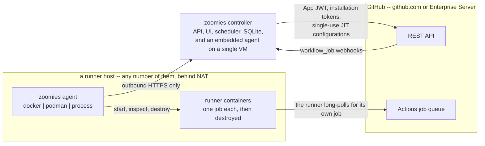
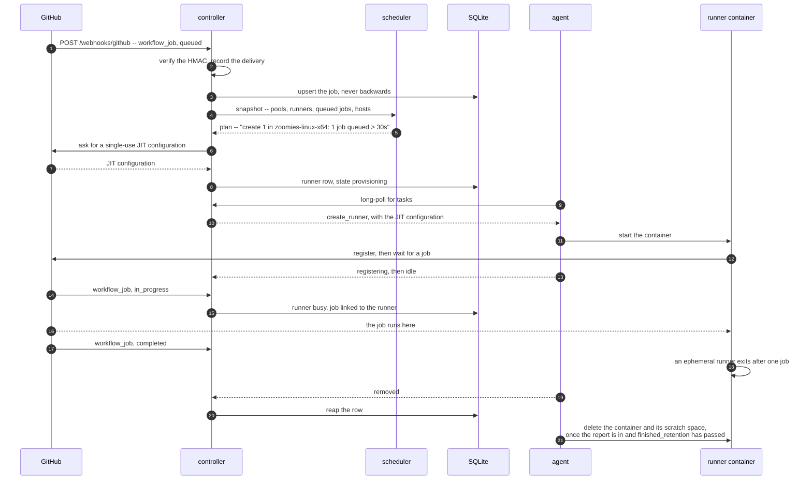
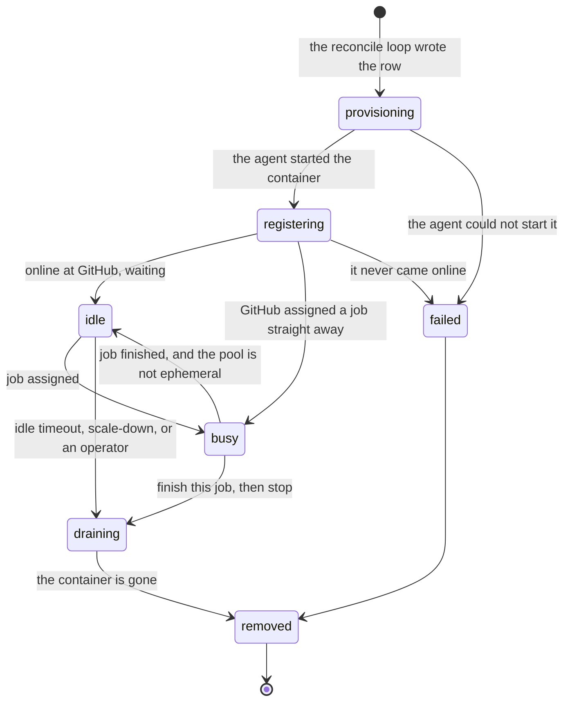
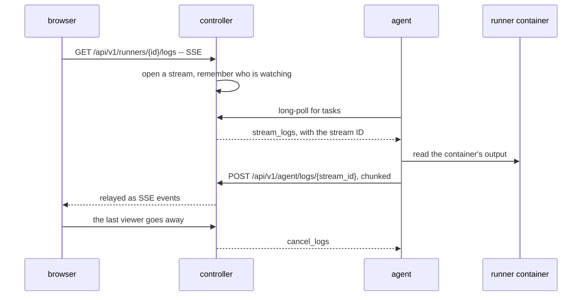
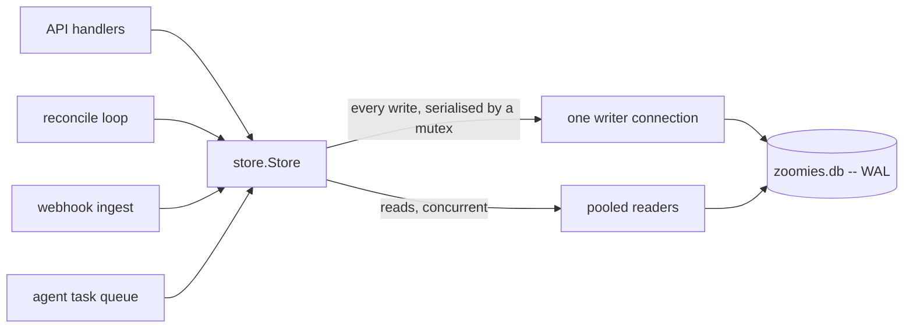

# Zoomies architecture

Zoomies is a self-hosted controller for GitHub Actions self-hosted runners. It
watches for queued jobs, creates a fresh runner for each one, and throws the
runner away when the job finishes.

It is one Go binary. `zoomies controller` runs the control plane; `zoomies agent`
runs the thing that actually starts containers. On a single VM the controller
runs an agent inside itself, so the whole system is one process, one SQLite file
and one systemd unit.

## Why this shape

The project this one is modelled on kept a handful of long-lived runners on one
machine, described by a YAML file, registered by hand with a token that expires
after an hour. That works until it doesn't:

| Problem | What Zoomies does instead |
| --- | --- |
| Runners are long-lived, so job state leaks between workflow runs | Ephemeral by default: one job per runner, then the container is destroyed |
| A personal access token in a dotfile next to each runner | GitHub App credentials, sealed at rest, and Zoomies mints short-lived JIT registrations itself |
| 5-minute polling | `workflow_job` webhooks, with polling only as a fallback |
| One host | A controller plus any number of agents, each connecting outbound |
| Runtime state in dotfiles inside runner directories | One SQLite database that can be queried, backed up and audited |
| No auth, no audit | Local users with argon2id or OIDC, RBAC, scoped API tokens, and an audit row for every mutating action |

## The picture

Follow the arrowheads: they are connections, not data. GitHub is the only thing
that ever dials in, and only as far as the controller's webhook endpoint.
Everything else reaches outward -- agents to the controller, runners to GitHub --
so a host that runs jobs needs no inbound firewall rule at all. Everything an
agent does travels on connections it opened itself: it long-polls for tasks, and
posts results and logs back the same way.

## Request and event flow

### A job arrives

One queued job, from the webhook that announces it to the row the controller
reaps when it is over:

In detail:

1. GitHub POSTs `workflow_job` (action `queued`) to `/webhooks/github`.
2. The controller verifies the HMAC signature, records the delivery, and upserts
   a `jobs` row. Deliveries are at-least-once and can arrive out of order, so
   the upsert refuses to move a job backwards through its lifecycle.
3. The reconcile loop wakes immediately (it also runs on a timer).
4. `internal/scheduler.Decide` is handed a snapshot -- pools, runners, queued
   jobs, hosts, and the tunables -- and returns a `Plan`. It is a pure function:
   no clock reads, no database, no network. That is what makes the scaling
   behaviour testable, and it is where every scaling decision's *reason string*
   comes from. Which host each new runner is placed on is decided here too --
   healthy, uncordoned, offering the pool's backend, matching its host selector,
   with room left -- and [Hosts and pools](hosts-and-pools.md) is that rule in
   operator terms.
5. For each `create` action the controller picks the installation, asks GitHub
   for a JIT configuration, writes a `runners` row in `provisioning`, and queues
   a task for the chosen host's agent. A JIT configuration registers exactly one
   runner and cannot be replayed, which is what makes it safe to hand to a
   container in its environment; a non-ephemeral pool has to run `config.sh`, so
   it gets a registration token instead.
6. The agent long-polls, picks up the task, and starts a container with the JIT
   config in its environment. It reports back: `registering`, then `idle`.
7. GitHub hands the job to the runner. A `workflow_job` `in_progress` webhook
   moves the runner to `busy` and links the job row to the runner row.
8. On `completed`, the ephemeral runner exits by itself. The agent notices,
   reports `removed`, and the controller reaps the row.
9. The host cleans up after itself. The controller has no reason to send a
   task for a runner it already considers gone, so the agent deletes the
   finished workload on its own -- the exited container with the runner's log,
   its docker-in-docker sidecar, any scratch directory Zoomies made for it, or
   the process backend's runner directory -- once the controller has accepted
   the report and [`agent.finished_retention`](configuration.md#agentfinished_retention)
   has passed. The window is what keeps a finished runner's output readable
   from the Runners page for a while; the report gate is what keeps the exit
   code from being deleted before anyone has heard it.

Every one of those steps publishes on the event bus, and the UI is watching a
Server-Sent Events stream, so the operator sees it happen without refreshing.
So does every change an operator makes through the API, and the two things
that are computed rather than stored -- the Overview's statistics and the
problems list -- are worked out again after every pass and sent when they
differ. Each frame is the resource's `GET` shape, rendered by the same code
(see [api-surface.md](api-surface.md#sse-event-kinds)).

### When webhooks cannot reach you

If `github.poll_fallback` is on (the default), a poller lists queued jobs on an
interval and feeds the same code path. The UI's problems drawer says
plainly when the controller is running on polling alone, because a fleet that
silently stopped receiving webhooks looks exactly like a quiet fleet.

## Components

| Package | Responsibility |
| --- | --- |
| `internal/store` | The only place SQL is written. Domain types, embedded migrations, every query. Enforces the runner state machine. |
| `internal/config` | `zoomies.yaml` + `ZOOMIES_*`. Splits findings into errors that stop startup and warnings that name every dangerous setting. |
| `internal/cryptox` | AES-256-GCM for secrets at rest; argon2id for passwords; SHA-256 for bearer tokens. |
| `internal/scheduler` | Pure scaling decisions and label matching. No I/O. |
| `internal/github` | App auth, JIT configs, registration tokens, webhook validation, the fallback poller, and a fake GitHub for tests. |
| `internal/backend` | How a runner becomes a real process: Docker, Podman, bare process. |
| `internal/auth` | Identity, RBAC, sessions, API tokens, join tokens, OIDC, audit. |
| `internal/api` | The REST API, SSE, `/metrics`, and the embedded UI. |
| `internal/controller` | Wiring: the reconcile loop, webhook ingest, the agent task queue, the log relay. |
| `internal/agent` | The runner-executing half and its transport to the controller. |
| `internal/installer` | `zoomies init`, `zoomies uninstall`, the GitHub App manifest flow, service installation. |
| `internal/events` | In-process pub/sub that the SSE endpoint fans out. |
| `internal/migrate` | Rewriting a workflow's `runs-on` line, and nothing else in the file. |

## The runner state machine

* **provisioning** -- the row exists, the agent has not started the workload.
* **registering** -- the container is up, the runner has not yet appeared online.
* **idle** -- registered with GitHub, waiting for a job.
* **busy** -- executing a job.
* **draining** -- told to finish and exit. A busy runner in `draining` keeps its
  job; nothing kills a running job.
* **removed** / **failed** -- terminal. A failed runner stays on the Runners
  page for ten minutes before it is removed, because its message is the only
  record of why it failed, and the scheduler reads the failures still on the
  page to decide how long to wait before creating another
  ([how the wait works](hosts-and-pools.md#when-runners-keep-failing-to-start)).

Any live state can also go straight to `failed` or `removed`: a host that
vanishes takes its runners with it, and the drawing leaves those edges out to
stay readable. The allow-list itself is `validRunnerTransitions` in
`internal/store/models.go`.

Transitions are validated in `store.TransitionRunner`, not in the caller. An
agent cannot report a nonsensical state and corrupt the fleet's accounting.

## Why the agent connects outbound

The controller never dials an agent. Agents long-poll for tasks and POST
results. This means:

* a host behind NAT or a strict firewall needs no inbound rule;
* adding a host is one command with a short-lived join token;
* the blast radius of a compromised agent is bounded -- it can claim tasks for
  itself, not reach into the controller.

The cost is that log streaming has to be inverted. Nothing can ask the agent for
a runner's output, so the request travels as a task and the output comes back as
a POST that the controller relays to whoever is watching:

For the embedded agent this is all in-process. A second viewer following the
same runner joins the stream that already exists rather than starting a second
one, and the last one to leave is what tells the agent to stop reading. Each
viewer's queue is bounded, and a viewer that falls behind loses bytes rather
than growing it: a backgrounded tab nobody is reading must not make the
controller hold a compiler's output for ever.

## Storage

SQLite via `modernc.org/sqlite`, so there is no cgo and the binary stays static.

Access is split deliberately: **one** writer connection behind a mutex, and a
pooled reader in WAL mode. SQLite permits exactly one writer, and funnelling
writes through a single connection is what keeps `database is locked` -- the
usual reason small SQLite services fall over -- out of the codebase.

Only `internal/store` imports `database/sql`, so there is one place to look
when a query is slow, and one place a second writer could be added by mistake.

Migrations are embedded and applied on startup, recorded in a
`schema_migrations` ledger.

## Security posture

The default configuration is the safe one: loopback bind, authentication on,
ephemeral runners, no Docker daemon exposed to jobs, no root.

Every deviation from that is named. `config.Validate` returns `Finding`s with a
severity, a title, why it matters and how to fix it; the same list is printed at
startup and rendered in the UI's problems drawer. See [security.md](security.md)
for the threat model and each individual toggle.

## What this is not

* Not a Kubernetes operator. [ARC](https://github.com/actions/actions-runner-controller)
  already exists and is the right answer if you have a cluster.
* Not a cloud provisioner. There is no EC2 or GCE backend in v1. The
  `backend.Backend` interface is narrow enough -- create, inspect, log, remove --
  that one could be added without the agent learning anything new.
* Not multi-tenant across unrelated organisations. One Zoomies is one team's
  fleet.
