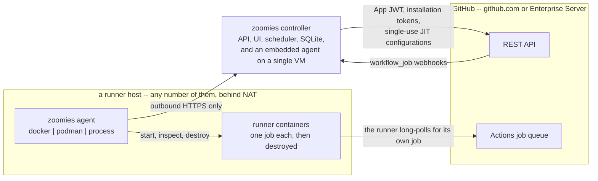
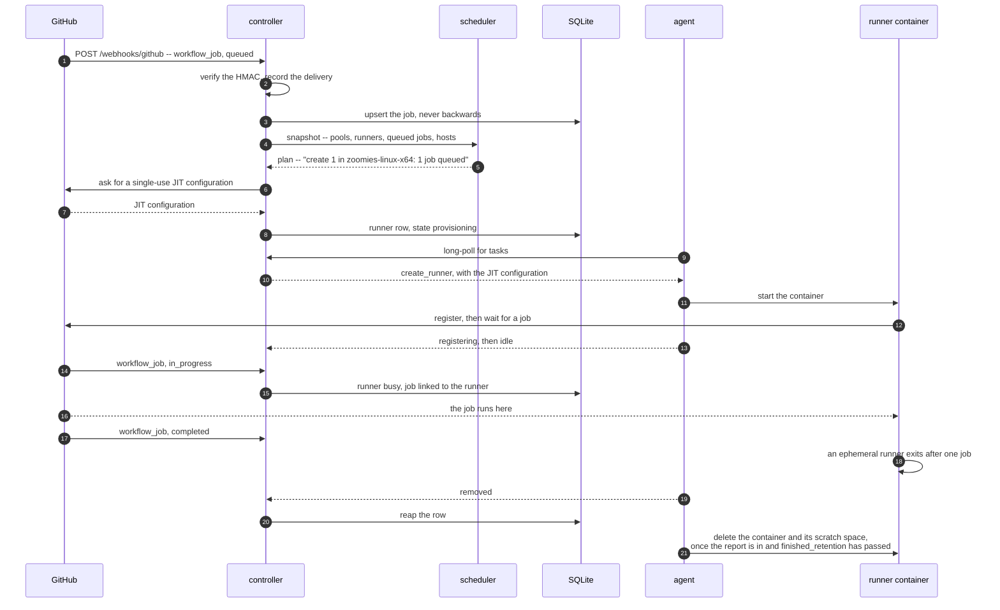
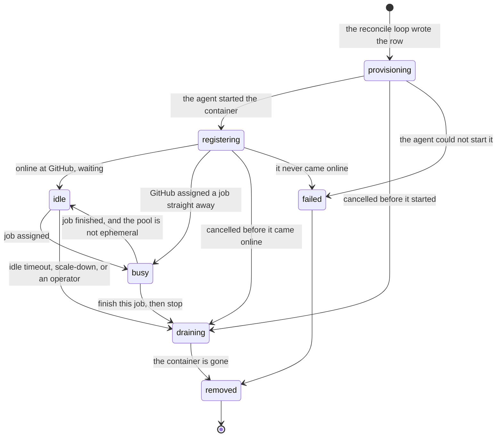
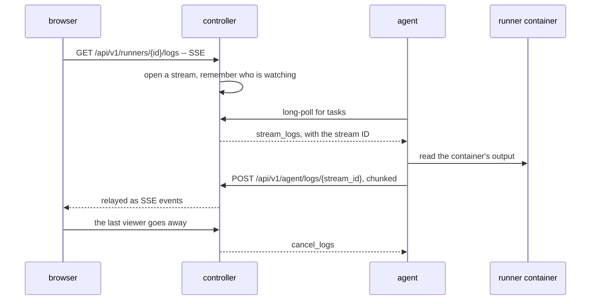
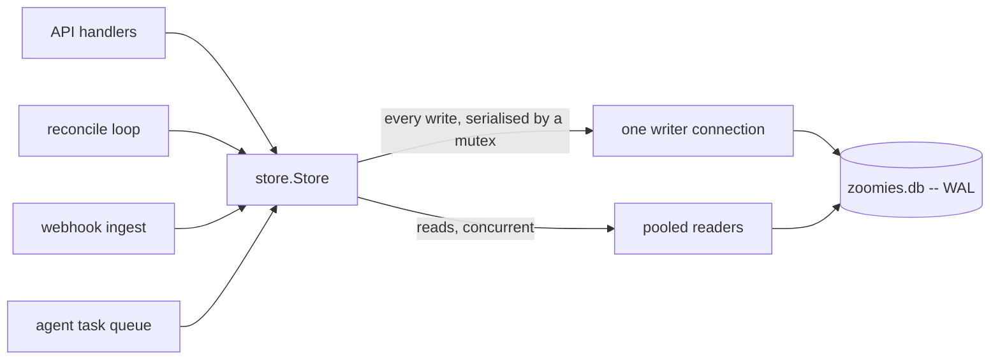

# Zoomies architecture

Zoomies is a self-hosted controller for GitHub Actions self-hosted runners. It
watches for queued jobs, creates a fresh runner for each one, and throws the
runner away when the job finishes.

It is one Go binary. `zoomies controller` runs the control plane; `zoomies agent`
runs the thing that actually starts containers. On a single VM the controller
runs an agent inside itself, so the whole system is one process, one SQLite file
and one systemd unit.

## Why this shape

The project this one is modelled on kept a handful of long-lived runners on one
machine, described by a YAML file, registered by hand with a token that expires
after an hour. That works until it doesn't:

| Problem | What Zoomies does instead |
| --- | --- |
| Runners are long-lived, so job state leaks between workflow runs | Ephemeral by default: one job per runner, then the container is destroyed |
| A personal access token in a dotfile next to each runner | GitHub App credentials, sealed at rest, and Zoomies mints short-lived JIT registrations itself |
| 5-minute polling | `workflow_job` webhooks, with polling only as a fallback |
| One host | A controller plus any number of agents, each connecting outbound |
| Runtime state in dotfiles inside runner directories | One SQLite database that can be queried, backed up and audited |
| No auth, no audit | Local users with argon2id or OIDC, RBAC, scoped API tokens, and an audit row for every mutating action |

## The picture

Follow the arrowheads: they are connections, not data. GitHub is the only thing
that ever dials in, and only as far as the controller's webhook endpoint.
Everything else reaches outward -- agents to the controller, runners to GitHub --
so a host that runs jobs needs no inbound firewall rule at all. Everything an
agent does travels on connections it opened itself: it long-polls for tasks, and
posts results and logs back the same way.

## Request and event flow

### A job arrives

One queued job, from the webhook that announces it to the row the controller
reaps when it is over:

In detail:

1. GitHub POSTs `workflow_job` (action `queued`) to `/webhooks/github`.
2. The controller verifies the HMAC signature, records the delivery, and upserts
   a `jobs` row. Deliveries are at-least-once and can arrive out of order, so
   the upsert refuses to move a job backwards through its lifecycle.
3. The reconcile loop wakes immediately (it also runs on a timer).
4. `internal/scheduler.Decide` is handed a snapshot -- pools, runners, queued
   jobs, hosts, and the tunables -- and returns a `Plan`. It is a pure function:
   no clock reads, no database, no network. That is what makes the scaling
   behaviour testable, and it is where every scaling decision's *reason string*
   comes from. Which host each new runner is placed on is decided here too --
   healthy, uncordoned, offering the pool's backend, *being the platform the
   pool asked for*, matching its host selector, with room left -- and
   [Hosts and pools](hosts-and-pools.md) is that rule in operator terms. A pool
   that names no platform, and a host whose agent has not reported one, both
   constrain nothing, so adding a platform narrows placement and never widens
   it.
5. For each `create` action the controller picks the installation, resolves the
   runner image from the pool's own image or its platform, asks GitHub for a JIT
   configuration, writes a `runners` row in `provisioning`, and queues a task for
   the chosen host's agent. A JIT configuration registers exactly one
   runner and cannot be replayed, which is what makes it safe to hand to a
   container in its environment; a non-ephemeral pool has to run `config.sh`, so
   it gets a registration token instead.
6. The agent long-polls, picks up the task, and starts a container with the JIT
   config in its environment. It reports back: `registering`, then `idle`.
7. GitHub hands the job to the runner. A `workflow_job` `in_progress` webhook
   moves the runner to `busy` and links the job row to the runner row.
8. On `completed`, the ephemeral runner exits by itself. The agent notices,
   reports `removed`, and the controller reaps the row.
9. The host cleans up after itself. The controller has no reason to send a
   task for a runner it already considers gone, so the agent deletes the
   finished workload on its own -- the exited container with the runner's log,
   its docker-in-docker sidecar, any scratch directory Zoomies made for it, or
   the process backend's runner directory -- once the controller has accepted
   the report and [`agent.finished_retention`](configuration.md#agentfinished_retention)
   has passed. The window is what keeps a finished runner's output readable
   from the Runners page for a while; the report gate is what keeps the exit
   code from being deleted before anyone has heard it.

Every one of those steps publishes on the event bus, and the UI is watching a
Server-Sent Events stream, so the operator sees it happen without refreshing.
So does every change an operator makes through the API, and the two things
that are computed rather than stored -- the Overview's statistics and the
problems list -- are worked out again after every pass and sent when they
differ. Each frame is the resource's `GET` shape, rendered by the same code
(see [api-surface.md](api-surface.md#sse-event-kinds)).

### When webhooks cannot reach you

If `github.poll_fallback` is on (the default), a poller lists queued jobs on an
interval and feeds the same code path. The UI's problems drawer says
plainly when the controller is running on polling alone, because a fleet that
silently stopped receiving webhooks looks exactly like a quiet fleet.

Both of the poller's decisions are made per installation, and that is
load-bearing on a controller serving more than one. It skips an installation
whose own webhooks are arriving — deliveries are credited to the installation
that owns the repository named in them, not to whichever secret verified them —
so one organisation's working deliveries cannot silence the poller for an
organisation whose webhooks reach nobody, which is the exact failure the poller
is the safety net for. And when GitHub rate-limits one installation the poller
stands that installation down and carries on with the rest, because the quota is
per installation and abandoning the sweep would let one organisation out of
quota stop every other one from scaling.

The stand-down lasts as long as GitHub asked: every rate-limited response says
when the quota returns, either as a reset instant or as a retry-after, and the
error carries the number rather than formatting it into a message. A fixed wait
is only the fallback for a response that said nothing — waiting a flat quarter
of an hour for a quota that came back in two minutes wastes the difference on
every sweep, and for one that returns in fifty spends the rest of the window
rediscovering the same refusal. It is capped at an hour, because GitHub's window
is an hour and anything beyond it is a clock out of step rather than an answer.

The hold belongs to the installation rather than to the poller, so the
registration reap honours it too and sets it the same way. The reap is the other
sweep that spends quota on its own schedule, and it stops working down an
installation's list at the first refusal: every remaining call would be refused
identically, and each one is another call against a quota that is already gone.

### One controller per database

Two controllers over one database is not a supported topology and never was,
but nothing used to stop it. SQLite's busy timeout serialises writes; it does
not stop a second scheduler minting runner credentials, reclaiming hosts it
thinks are lost and reaping workloads the first one created. Every symptom of
that looks like a bug somewhere else.

A controller therefore takes two things before it starts. An advisory lock on
a file beside the database catches a second process on the same host, and the
kernel drops it however the process exits, so a controller killed with
`SIGKILL` leaves nothing to clean up. A lease row in the database catches what
no lock on this host can see: a restored copy on a shared filesystem, or a
controller on another machine pointed at the same file. A controller refused by
either says which host and process is holding it, and `--takeover` starts
anyway for the case where the other one is known to be gone.

A controller restarting on the same host reclaims its predecessor's lease at
once rather than waiting the lease out — the service unit restarts always, and
the lock it already holds proves nothing else here has the database. The
cross-host case, which is the one the lease exists for, is refused as normal.

The holder renews its lease on a timer. If a renewal finds somebody else
holding it, the controller raises `controller.lease_lost` and keeps raising it:
two schedulers are now running, and this is not a state a process recovers from
by trying again.

## Components

| Package | Responsibility |
| --- | --- |
| `internal/store` | The only place SQL is written. Domain types, embedded migrations, every query. Enforces the runner state machine. |
| `internal/config` | `zoomies.yaml` + `ZOOMIES_*`. Splits findings into errors that stop startup and warnings that name every dangerous setting. |
| `internal/cryptox` | AES-256-GCM for secrets at rest; argon2id for passwords; SHA-256 for bearer tokens. |
| `internal/scheduler` | Pure scaling decisions, label matching and platform fit. No I/O. |
| `internal/naming` | The `zoomies-*` naming grammar for pools and hosts, and the runner image catalogue. No I/O; see [Naming and platforms](naming.md). |
| `internal/machine` | What host this process is running on: distribution, release, and how much machine the cgroup actually allows. |
| `internal/github` | App auth, JIT configs, registration tokens, webhook validation, the fallback poller, and a fake GitHub for tests. |
| `internal/backend` | How a runner becomes a real process: Docker, Podman, bare process. |
| `internal/auth` | Identity, RBAC, sessions, API tokens, join tokens, OIDC, audit. |
| `internal/api` | The REST API, SSE, `/metrics`, and the embedded UI. |
| `internal/controller` | Wiring: the reconcile loop, webhook ingest, the agent task queue, the log relay. |
| `internal/agent` | The runner-executing half and its transport to the controller. |
| `internal/installer` | `zoomies init`, `zoomies uninstall`, the GitHub App manifest flow, service installation. |
| `internal/events` | In-process pub/sub that the SSE endpoint fans out. |
| `internal/migrate` | Rewriting a workflow's `runs-on` line, and nothing else in the file. |

## The runner state machine

* **provisioning** -- the row exists, the agent has not started the workload.
* **registering** -- the container is up, the runner has not yet appeared online.
* **idle** -- registered with GitHub, waiting for a job.
* **busy** -- executing a job.
* **draining** -- told to finish and exit. A busy runner in `draining` keeps its
  job; nothing kills a running job.
* **removed** / **failed** -- terminal. A failed runner stays on the Runners
  page for ten minutes before it is removed, because its message is the only
  record of why it failed, and the scheduler reads the failures still on the
  page to decide how long to wait before creating another
  ([how the wait works](hosts-and-pools.md#when-runners-keep-failing-to-start)).

Every live state can also go straight to `failed` or `removed`: a host that
vanishes takes its runners with it, and the drawing leaves those two edges out
of each state to stay readable. Everything else it draws, including the two
ways a runner can be told to stop before it ever comes online — a pool
disabled or deleted underneath it, or an operator draining the host. The
allow-list itself is `validRunnerTransitions` in `internal/store/models.go`.

Transitions are validated in `store.TransitionRunner`, not in the caller. An
agent cannot report a nonsensical state and corrupt the fleet's accounting.

### Reconciliation invariants

The rules that keep the diagram true when something goes wrong are spread
over four packages, and each constant was chosen against one in another. This
is the list, with the constant and the package that owns it, so that a change
to one is made knowing the rest. Two tests in `internal/controller`
(`invariants_test.go`) fail if the relationships at the end stop holding.

| Rule | Constant | Owner |
| --- | --- | --- |
| A task is delivered at least once. The controller keeps it in flight under a lease, and a result that has not arrived when the lease expires puts the task back on the host's queue. A log relay is the exception: it is tied to a browser that has since gone, so it is never re-queued. | `createLease` 20 min, `stopLease` 10 min, `removeLease` 5 min | `internal/controller` (`taskQueue.sweep`) |
| A task is offered at most three times, so a host is given up on after three leases: an hour for a create, thirty minutes for a stop, fifteen for a remove. A dropped create is noticed by the runner's provision timeout, which says so on the Runners page; a dropped stop would be noticed by nothing, so the sweep fails that runner itself and the next pass frees its slot. | `maxTaskAttempts` = 3 | `internal/controller` (`sweepTasks`) |
| A host's queue is in memory. A controller restart loses every task in flight; the runner a lost create was for waits out the provision timeout and is replaced with a freshly minted credential. | — | `internal/controller` |
| A host is late, then unhealthy, then lost, in that order. The controller hands the agent its heartbeat interval on every heartbeat, and the validator warns when that interval is more than half the timeout, so one late heartbeat never counts. After ninety seconds without one the host is unhealthy and the scheduler places nothing new on it. After five minutes it is lost: every runner still recorded as live on it is failed, and a job one was running is marked the fleet's failure. Both judgements are made on the thirty-second housekeeping tick. | `agent.heartbeat_interval` 30 s; `config.MaxQuietHeartbeatInterval` 45 s; `store.HeartbeatTimeout` 90 s; `hostLostAfter` 5 min; `housekeepingTick` 30 s | `internal/config` (`Validate`); `internal/store` (`Host.Healthy`); `internal/controller` (`checkHostHealth`, `reclaimLostRunners`) |
| A runner that has not come online in time is failed. The timeout covers both `provisioning` and `registering`; there is no second "registration timeout", and the `runners.not_progressing` problem is raised at half of it. The maximum lifetime retires only a runner that is idle; nothing the scheduler does touches a busy one. | `scheduler.provision_timeout`, 5 min by default; `scheduler.max_runner_lifetime` | `internal/scheduler` (`Decide`); `internal/controller` (`Problems`) |
| A failed runner stays for ten minutes, then goes. It holds no host slot, its message is the only record of why it failed, and the failures still on the page decide how long the pool waits before creating another: ten seconds, doubling to five minutes, and never longer than the retention, because the failures the wait is computed from are gone by then. | `failedRetention` 10 min; `startBackoff` 10 s; `maxStartBackoff` 5 min | `internal/scheduler` |
| A repeated state is legal and a wrong one is dropped. `CanTransition(s, s)` is true, so an agent that reports what the row already says changes nothing, not even the idle clock the scale-down reads; a transition outside the allow-list is ignored with a log line, never forced. `finished_at` is stamped once, on the first entry to a terminal state, and is what the failed retention counts from. | `validRunnerTransitions` | `internal/store` (`TransitionRunner`); `internal/controller` (`applyRunnerState`) |
| Capacity is derived from rows. A host's free capacity is its `capacity` minus the runners recorded on it in a state other than `removed` or `failed`, counted on every read; no counter is kept anywhere, and every scheduling decision starts from rows, the clock and the policy. A dead host's rows therefore count until they are failed, which is what the host-lost reclaim is for. | `Host.ActiveRunners` | `internal/store` (`ListHosts`); `internal/scheduler` (`HostCanRun`) |
| An agent asserts no state for a live runner. It says `registering` when its create succeeded and `removed` or `failed` when the workload exited, read from the exit code; in between it reports the phase and leaves the state empty, because whether GitHub has handed the runner a job is not the host's call. The controller reads a running phase on a `registering` row as `idle`, and the webhook is what makes it `busy`. A runner's end is reported once. | — | `internal/agent` (`ReconcileOnce`); `internal/controller` (`applyReports`) |
| A host may only speak for its own runners. A task result or a runner report from a host that does not own the runner is refused. A host that joins again under its name keeps its id, gets a new token, and drops every runner row recorded against the old one. | — | `internal/controller` (`ReportResult`, `applyReports`, `Join`) |
| The agent reaps only what nothing claims, and only after it has asked. A managed workload it has no record of is removed two minutes after it was first seen, and never before the agent has completed one task poll, so a controller that is down can never look like "nobody owns these runners". A runner created moments ago is not declared gone for a minute, because the backend may not list it yet. | `orphanGrace` 2 min; `missingGrace` 1 min | `internal/agent` (`reapOrphan`, `ReconcileOnce`) |
| The agent deletes a finished workload only after the controller has acknowledged its end and the finished retention has passed, so the container and its logs outlive the job by long enough to be looked at. | `agent.finished_retention`, 10 min by default | `internal/agent` (`ReconcileOnce`) |
| An agent stopping leaves its runners running. Shutdown starts no new task, waits up to thirty seconds for the ones in flight, sends one last report, and never stops or removes a runner; a create, stop or remove already under way runs to its own timeout on a context shutdown cannot cancel. | `shutdownGrace` 30 s | `internal/agent` (`Run`) |
| A host reports what it is, and the operator says what to keep back from it. The agent measures its work directory's filesystem and sends the size and the free space on join and on every heartbeat; the controller records those and never the reserve, which is the operator's the way capacity is. Free space is the one figure that moves on its own, so it is written only when it has moved by more than a twentieth or by 256 MB, whichever is larger -- otherwise a fleet takes one row write per host per beat for a number that is never twice the same. Zero means "not measured", never "full": an agent too old to send it, or a platform with no portable way to ask, leaves what was known alone. | `diskFreeToleranceFraction` 0.05; `diskFreeToleranceFloorMB` 256 | `internal/agent` (`workDirSpace`); `internal/controller` (`diskFreeMoved`, `Heartbeat`); `internal/store` (`SetHostReserve`) |
| The agent remembers nothing across a restart but its credentials. `agent.json` holds the join token; the set of runners it manages is in memory. A workload it did not start is adopted when a task arrives for it, by the runner id in the workload's labels, and at no other time. | `StateFile` | `internal/agent` (`adopt`) |
| Registrations are compared with rows a minute after start and every ten minutes after that. A registration with the `zoomies-` prefix that GitHub does not report busy and that no live row explains is an orphan, untidy rather than urgent, and one API call per installation is what the comparison costs. | `reapInterval` 10 min | `internal/controller` (`reap`) |

What holds them together, pinned by the two tests:

* **The silence ladder is ordered.** `store.HeartbeatTimeout` is at least three
  default heartbeat intervals, so one slow heartbeat never makes a host
  unhealthy, and `hostLostAfter` is later than `store.HeartbeatTimeout`, so
  runners are never failed on a host the scheduler is still placing new ones
  on.
* **Every lease outlasts the work it covers.** The create lease exceeds the
  time the agent gives itself for a create, the stop lease exceeds the stop
  timeout the controller hands out plus the agent's margin, and the remove
  lease exceeds the agent's remove timeout. A shorter lease would offer the
  task to the host again while the first attempt was still running.

What follows from the constants as they stand, and is not yet what an
operator would want:

* The provision timeout is shorter than both the agent's create timeout and
  the create lease. A cold image pull that takes longer than five minutes
  registers a runner on a row the scheduler has already failed, and the
  registering report is refused as an illegal transition while the workload
  goes on to register with GitHub. The same happens to a create in flight on
  a host that goes quiet and comes back: lost at five minutes, its lease
  still has fifteen to run.
* The agent's tracked set does not survive its restart, and adoption happens
  only when a task arrives. On the single-VM install the controller runs the
  agent inside itself, so a controller restart builds a fresh agent whose
  first poll succeeds at once, and the workloads already running on that host
  become orphans two minutes later. No test exercises this yet; the
  [upgrading page](upgrading.md) is hedged accordingly, and the roadmap's
  adoption-on-start change and its drill tier are what settle it.

## Why the agent connects outbound

The controller never dials an agent. Agents long-poll for tasks and POST
results. This means:

* a host behind NAT or a strict firewall needs no inbound rule;
* adding a host is one command with a short-lived join token;
* the blast radius of a compromised agent is bounded -- it can claim tasks for
  itself, not reach into the controller.

The cost is that log streaming has to be inverted. Nothing can ask the agent for
a runner's output, so the request travels as a task and the output comes back as
a POST that the controller relays to whoever is watching:

For the embedded agent this is all in-process. A second viewer following the
same runner joins the stream that already exists rather than starting a second
one, and the last one to leave is what tells the agent to stop reading. Each
viewer's queue is bounded, and a viewer that falls behind loses bytes rather
than growing it: a backgrounded tab nobody is reading must not make the
controller hold a compiler's output for ever.

## Storage

SQLite via `modernc.org/sqlite`, so there is no cgo and the binary stays static.

Access is split deliberately: **one** writer connection behind a mutex, and a
pooled reader in WAL mode. SQLite permits exactly one writer, and funnelling
writes through a single connection is what keeps `database is locked` -- the
usual reason small SQLite services fall over -- out of the codebase.

Only `internal/store` imports `database/sql`, so there is one place to look
when a query is slow, and one place a second writer could be added by mistake.

Migrations are embedded and applied on startup, recorded in a
`schema_migrations` ledger.

## Security posture

The default configuration is the safe one: loopback bind, authentication on,
ephemeral runners, no Docker daemon exposed to jobs, no root.

Every deviation from that is named. `config.Validate` returns `Finding`s with a
severity, a title, why it matters and how to fix it; the same list is printed at
startup and rendered in the UI's problems drawer. See [security.md](security.md)
for the threat model and each individual toggle.

## What this is not

* Not a Kubernetes operator. [ARC](https://github.com/actions/actions-runner-controller)
  already exists and is the right answer if you have a cluster.
* Not a cloud provisioner. Zoomies never creates or deletes a machine. The
  `backend.Backend` interface — create, inspect, log, remove — is the shape of
  a runner on a host the agent already has, so a backend that put each job in
  its own VM could be added behind it without the agent learning anything new;
  renting the host itself is a different contract, on the controller's side,
  and the nearest thing to it today is the
  [capacity-demand receiver](capacity-demand-receiver.md), which asks an
  external autoscaler for hosts and leaves the deleting to it.
* Not multi-tenant across unrelated organisations. One Zoomies is one team's
  fleet.
