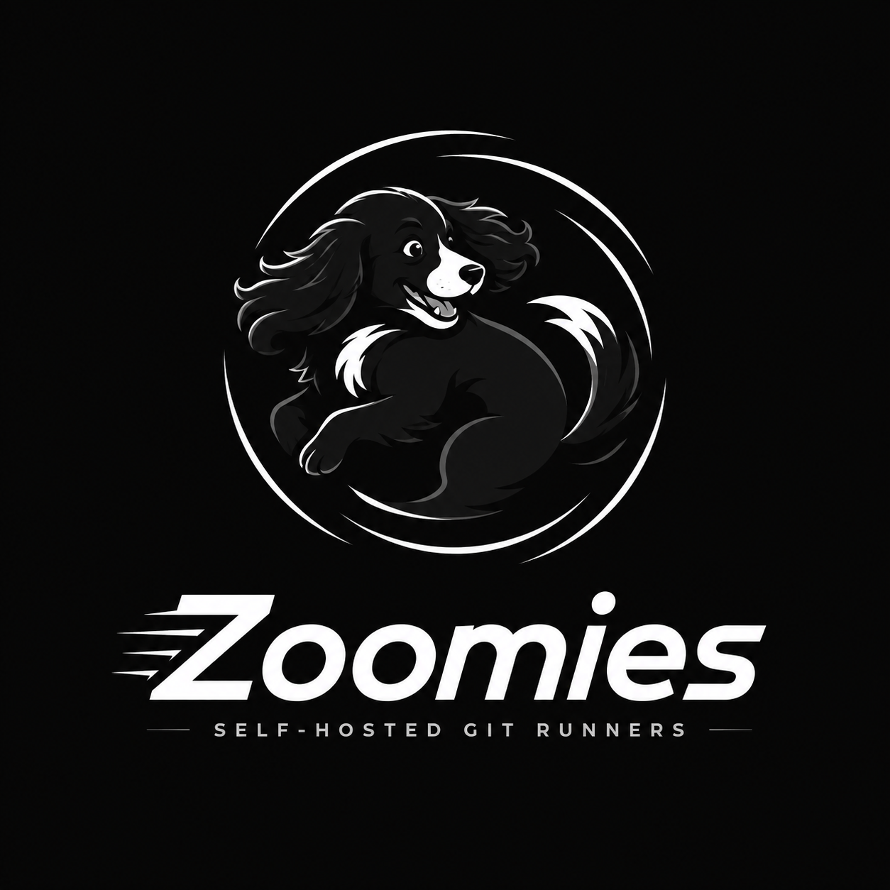

# Zoomies brand

The identity is a fast-moving black-and-white cocker spaniel curling through a
circular motion path, paired with the Zoomies wordmark. A dog doing zoomies in
circles is runners executing jobs quickly — that is the whole idea, and it is
why the mark is never rotated: the circular movement already communicates speed.

Personality: fast, playful, capable, technical, friendly.

**[Branding Guide v2.1](brand/BRANDING_GUIDE.md) is the authority.**
This page records what the product actually does with it, and
[ui-guidelines.md](ui-guidelines.md) is where the derived design tokens live.
The older PDF remains in the repository as a historical source, not as current
guidance. Asset provenance is recorded in
[`ASSET_MANIFEST.json`](brand/ASSET_MANIFEST.json).

## Colour

The core palette is monochrome. The accent exists for the product UI only — the
logo stays monochrome, always.

| Name | Value | Where it is used |
| --- | --- | --- |
| Zoomies Black | `#080808` | The ground the mark sits on, in both themes |
| White | `#FFFFFF` | Surfaces in the light theme, and the knockout mark |
| Cool Grey | `#B9BCC2` | Secondary text in the dark theme |
| Mid Grey | `#666A73` | Secondary text in the light theme |
| Runner Blue | `#2F80ED` | The interactive accent — see the note below |
| Fast Cyan | `#22D3EE` | The *busy* runner state, and nothing else |
| Paw Black | `#000000` | The official favicon and smallest-size artwork |

They are available in `brand/brand-tokens.json` and as CSS custom properties
(`--z-brand-black`, `--z-brand-runner-blue`, …) at the top of
`web/src/lib/styles/tokens.css`.

### Two decisions worth explaining

**Runner Blue is darkened for interactive use.** `#2F80ED` is 3.87:1 on white.
That is fine for a large shape but fails WCAG AA for 13px text, and it fails for
white text on a button. So `--z-accent` is a darkened Runner Blue (`#1A63D8`,
5.5:1) and the pure brand blue is kept for illustrative fills where 3:1 is the
bar. The dark theme lifts it the other way, to `#78B4FF` at 9.2:1.

**Fast Cyan is spent on one thing.** The brand guide says to use the accent
sparingly. In an operations dashboard the single most valuable "look here"
signal is *this runner is executing a job right now*, so that is what Fast Cyan
marks, and nothing else does.

## Logo system

Use the artwork in this order. Moving down the list is a response to less
available space; it is not a choice between interchangeable logos.

| File | Use |
| --- | --- |
| `brand/logo-master-dark.png` | Primary full logo on Zoomies Black or another dark ground |
| `brand/logo-light-background.png` | Primary full logo on white or a very light ground |
| `brand/logo-white-transparent.png` | Transparent white primary logo on a dark or coloured ground |
| `brand/mark-dark.png`, `brand/mark-white-transparent.png` | Original circular dog mark where the name is already visible |
| `brand/head-swish-black.png`, `brand/head-swish-white.png` | Compact navigation, badges and app UI at 48px and above |
| `brand/paw-swish-black.png`, `brand/paw-swish-white.png` | Favicons and equivalent tiny UI marks from 16–64px only |
| `brand/wordmark-dark.png`, `brand/wordmark-white-transparent.png` | The wordmark alone |
| `brand/github-avatar.png` | Original-dog artwork with safe space for GitHub's circular crop |
| `brand/github-social-preview.png` | 1280×640 GitHub social preview |
| `brand/social-card.png` | 1200×630 Open Graph sharing image |

The product's own copies live in `web/public/` and are the sizes the app
actually serves: `favicon.ico` (16/32/48), `favicon-16.png`, `favicon-32.png`,
`apple-touch-icon.png`, `icon-192.png`, `icon-512.png`, the dedicated
`maskable-icon-512.png`, and the nine web UI assets under `brand/`.

`brand/app-logo.png` is the original-dog GitHub avatar with circular-crop safe
space. An App manifest cannot carry a logo, so the connect flow hands the
operator this file and a link to the page that takes it; without it the App
wears GitHub's grey default and signs every "Set up job" line anonymously.

That is one step in a wizard somebody sees once, so it is also on every
installation's card on the Installations page, with the same download and the
same link, until it is dismissed. Whether an App has an avatar is not something
GitHub will tell us -- its API serves a generated identicon for an App without
one, indistinguishable from an upload -- so the reminder is offered rather than
detected, and the operator is the one who says it is done.

To set it by hand: open the App's settings (**Installations -> the connection ->
Open the App's settings**, or `https://github.com/organizations/<org>/settings/apps/<app>`
for an organisation App and `https://github.com/settings/apps/<app>` for a
personal one) and upload `brand/github-avatar.png` under **Display
information**. GitHub crops it to a circle, which the file already allows for.

## Using the system in the product

The full primary logo appears on the sign-in, first-run, boot and connection
failure screens. It is the identity, and on those screens it is the only thing
on the page, so it is given room: about 300px on the sign-in and first-run
screens, 250px on the two transient ones, and never below the 220px minimum. The
holding shape is Zoomies Black, and it is capped at the width of whatever
contains it, so a phone shrinks the lockup rather than overflowing. The artwork
carries its own clear space, so the shape is deliberately larger than the dog
inside it -- that padding is part of the supplied file and is not cropped away.

The secondary head/swish carries spacious product identity slots at 48px, such
as Settings → About. The paw/swish carries the navbar, where the detailed dog
does not read clearly, plus genuinely tiny placements such as the mobile top
bar, page footer and command palette. Both use the supplied white reverse
artwork on a Zoomies Black chip, so the artwork is unchanged and remains
legible in either theme.

Once somebody is signed in, the identity is carried in these quieter places:

| Where | What |
| --- | --- |
| The navigation masthead | 32px paw/swish beside the name and descriptor; icon alone when collapsed |
| The top bar, on a phone | Paw/swish, because the masthead is not on screen there |
| The foot of every page | Paw/swish, name, running version and descriptor |
| The command palette | Paw/swish and name beside the key hints |
| Settings → About | 48px head/swish beside the name and descriptor |

The descriptor is set in Inter -- small, uppercase, letter-spaced -- rather than
cropped out of the wordmark artwork, whose own descriptor line is drawn for
240px and is a smudge at sidebar width.

### Names from the kennel

The mark is a cocker spaniel, so the names the product invents come from one.
The pool wizard opens with a name already filled in: the brand, a spaniel from
`web/src/lib/pools/names.ts`, and what the pool will actually run on --
`zoomies-truffle-docker-linux`. The kennel half is what makes one pool tellable
from another in a list; the infrastructure half is what an operator wants to
know before sending a job to it.

The `zoomies-` prefix is not decoration and is never dropped: in GitHub's own
runner settings it is the only thing distinguishing our runners from anyone
else's. So the name is offered and the prefix is not. The dice roll another
name and a name typed over is left alone, but a name given without the brand
gains it -- in the wizard's field as soon as it loses focus, and again in the
store, so that a pool created from the CLI, the API or an answer file is
branded exactly as one created from the wizard is.

## Clear space and minimum sizes

* Full logo clear space: the height of the **O** in the wordmark on every side.
* Standalone mark clear space: at least 12.5% of its longest dimension. The
  supplied square icon files already include this padding; do not crop it away.
* Primary full logo: 220px wide minimum.
* Circular dog mark: 128px square minimum.
* Head/swish: 48px square minimum.
* Paw/swish: 16px square minimum and 64px maximum.

## Do and do not

**Do**

* Use the dark master on dark surfaces.
* Use the white knockout over dark photography or a coloured UI.
* Use the original circular dog for avatars, touch icons, PWA icons and social artwork.
* Use the head/swish for compact UI at 48px and above.
* Use the paw/swish only for favicons and equivalent tiny UI marks.
* Keep every mark's supplied swish and safe padding intact.

**Do not**

* Stretch or skew the artwork.
* Recolour any part of the dog.
* Add a shadow, gradient or glow.
* Put the dark master on a busy background.
* Rotate the mark.
* Promote the paw/swish into a primary or social logo.

## Typography

**Inter** for the interface, with Geist and `system-ui` as the sanctioned
alternatives, and **JetBrains Mono** for logs, identifiers and durations. Both
are self-hosted as woff2 so an air-gapped install makes no third-party font
request. The wordmark in the artwork is custom-rendered and is not Inter — do
not try to set it in type.

## Naming

| | |
| --- | --- |
| Product | Zoomies |
| Descriptor | Self-hosted Git runners |
| CLI | `zoomies` |
| Service | `zoomies` (controller), `zoomies-agent` (agent) |
| Config directory | `/etc/zoomies` as root, `~/.config/zoomies` otherwise; see [Where things live](configuration.md#where-things-live) |
| Container images | `ghcr.io/eyupio/zoomies`, `ghcr.io/eyupio/zoomies-runner`, `ghcr.io/eyupio/zoomies-runner-docker` |
| Runner names | `zoomies-4vcpu-ubuntu-2404-biscuit-a3f9qz2m` — the brand, the pool's shape, a kennel word and a token |
| Pool names | `zoomies-truffle-docker-linux`; a name given without the prefix gains one |
| Pool labels | `zoomies-linux-x64`, `zoomies-gpu`; every pool also answers to `zoomies` |
| Migration branch | `zoomies/migrate-runners-<timestamp>` |

### On somebody else's screen

Two of those names are read far more often outside Zoomies than inside it: the
runner name, which GitHub prints in its runner list and in every job's "Set up
job" step, and the pool label, which has to be written into `runs-on` in every
workflow in the organisation. Both start with the product name, and neither
carries anything a reader would have to decode. The runner name carries the
pool's *shape* rather than the name somebody invented for it, because a reader
on GitHub is there precisely because they do not yet know what they are looking
at — and when it will not fit, the shape is what gives way rather than the
brand. See [Naming and platforms](naming.md#runner-names).

`internal/store/brand.go` is the one place these are spelled out;
`web/src/lib/brand.ts` is the browser's copy of it.

## Sharing and discovery

Most people meet Zoomies on somebody else's screen: a controller their
colleague installed, or a link pasted into a chat window. Two places carry the
identity outwards, and both are part of the brand rather than an afterthought.

**A controller's own page.** `web/index.html` carries Open Graph and Twitter
card tags, `brand/social-card.png` as the card image, and one hairline link to
[zoomies.sh](https://zoomies.sh) in the sign-in colophon and the footer of every
signed-in page, beside the credit *Developed by [EyUp.io](https://eyup.io)*.
Both addresses come from `web/src/lib/links.ts`, and the site's footer prints
the same credit from `extra.developer` in `mkdocs.yml`, so the product and the
site say the same thing about where they came from. `og:url` and `og:image` have to be absolute for a preview to
render at all -- the service fetching the page is not a browser and has no base
to resolve a relative path against -- so the controller substitutes
`server.external_url` into them when it starts. An instance that has not been
told its own address keeps relative paths rather than guessing at one.

**The site.** `overrides/main.html` extends the Material theme with the same
tags, derived per page, plus a `SoftwareApplication` description in JSON-LD on
the home page. Material's own social plugin is not used: it renders a card
image per page with Cairo and Pillow, which is two native libraries in the docs
build for a picture the brand pack already supplies.

## For print, signage or merchandise

The SVG files in the original pack are raster wrappers, not true vector
redraws. The secondary head/swish is a restored reconstruction because its
approved source binary was not available. For large-format work, commission a
proper vector redraw from the approved masters rather than enlarging them.
