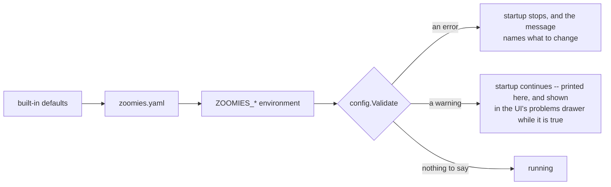

# Configuring Zoomies

One file, `zoomies.yaml`, and every key can be overridden with a `ZOOMIES_*`
environment variable. Environment wins over file; file wins over defaults.

Zoomies looks for the file at, in order: `--config <path>`,
`$ZOOMIES_CONFIG_DIR/zoomies.yaml`, `/etc/zoomies/zoomies.yaml` when running as
root, otherwise `$XDG_CONFIG_HOME/zoomies/zoomies.yaml`. If no file exists and
none was named explicitly, defaults plus environment are used — which is what
makes the container image work with nothing but environment variables.

The parser is strict. A misspelled key is an error naming the line, not a
setting that silently does nothing.



---

## Everything at once

The defaults below are the actual defaults. A file containing only the settings
you want to change is the normal case.

```yaml
server:
  bind: 127.0.0.1:8080          # ZOOMIES_BIND
  external_url: ""              # ZOOMIES_EXTERNAL_URL  -- required for webhooks
  tls:
    mode: off                   # ZOOMIES_TLS_MODE      -- off | self-signed | files
    cert_file: ""               # ZOOMIES_TLS_CERT_FILE
    key_file: ""                # ZOOMIES_TLS_KEY_FILE
    hosts: []                   # ZOOMIES_TLS_HOSTS     -- names for a generated cert
  trusted_proxies: []           # ZOOMIES_TRUSTED_PROXIES -- CIDRs, or [cloudflare]; 0.0.0.0/0 is warned about
  allowed_origins: []           # ZOOMIES_ALLOWED_ORIGINS -- extra browser origins; "*" is warned about
  allow_indexing: false         # ZOOMIES_ALLOW_INDEXING -- let search engines in
  read_timeout: 30s             # ZOOMIES_READ_TIMEOUT
  write_timeout: 0s             # ZOOMIES_WRITE_TIMEOUT -- 0: SSE and log tails must not be cut off
  idle_timeout: 120s            # ZOOMIES_IDLE_TIMEOUT

database:
  path: /var/lib/zoomies/zoomies.db   # ZOOMIES_DB_PATH

security:
  encryption_key: ""                        # ZOOMIES_ENCRYPTION_KEY
  encryption_key_file: /etc/zoomies/encryption.key   # ZOOMIES_ENCRYPTION_KEY_FILE
  session_ttl: 168h                         # ZOOMIES_SESSION_TTL
  cookie_secure: null                       # ZOOMIES_COOKIE_SECURE (derived when unset)
  disable_auth: false                       # ZOOMIES_DISABLE_AUTH
  rate_limit_logins: 10                     # ZOOMIES_RATE_LIMIT_LOGINS (per IP per minute); 0 disables it and is warned about

github:
  api_base_url: https://api.github.com   # ZOOMIES_GITHUB_API_BASE_URL
  upload_base_url: ""                    # ZOOMIES_GITHUB_UPLOAD_BASE_URL
  webhook_path: /webhooks/github         # ZOOMIES_WEBHOOK_PATH
  poll_interval: 30s                     # ZOOMIES_POLL_INTERVAL
  poll_fallback: true                    # ZOOMIES_POLL_FALLBACK
  runner_image: ghcr.io/eyupio/zoomies-runner:latest   # ZOOMIES_RUNNER_IMAGE
  runner_version: ""                     # ZOOMIES_RUNNER_VERSION

agent:
  embedded: true                # ZOOMIES_AGENT_EMBEDDED
  name: <hostname>              # ZOOMIES_AGENT_NAME
  capacity: <cpus / 2>          # ZOOMIES_AGENT_CAPACITY
  backend: docker               # ZOOMIES_AGENT_BACKEND  -- docker | podman | process
  docker_host: ""               # ZOOMIES_DOCKER_HOST / DOCKER_HOST -- "" autodetects
  work_dir: /var/lib/zoomies/work   # ZOOMIES_WORK_DIR
  labels: {}                    # ZOOMIES_AGENT_LABELS   -- "gpu=true,zone=eu"
  network: ""                   # ZOOMIES_AGENT_NETWORK
  heartbeat_interval: 30s       # ZOOMIES_HEARTBEAT_INTERVAL -- a host is lost after 90s of silence; above 45s is warned about
  finished_retention: 10m       # ZOOMIES_AGENT_FINISHED_RETENTION -- how long a finished runner stays on disk
  # Process backend only:
  runner_sha256: ""             # ZOOMIES_AGENT_RUNNER_SHA256 -- digest of the runner archive, when github.runner_version is pinned
  allow_unverified_runner_download: false   # ZOOMIES_AGENT_ALLOW_UNVERIFIED_RUNNER_DOWNLOAD -- warned about
  runner_download_url: ""       # ZOOMIES_AGENT_RUNNER_DOWNLOAD_URL -- an internal mirror of the actions/runner releases
  # Standalone agents only:
  controller_url: ""            # ZOOMIES_CONTROLLER_URL
  join_token: ""                # ZOOMIES_JOIN_TOKEN
  agent_token: ""               # ZOOMIES_AGENT_TOKEN
  ca_file: ""                   # ZOOMIES_AGENT_CA_FILE
  client_cert_file: ""          # ZOOMIES_AGENT_CLIENT_CERT_FILE
  client_key_file: ""           # ZOOMIES_AGENT_CLIENT_KEY_FILE
  insecure_skip_verify: false   # ZOOMIES_AGENT_INSECURE_SKIP_VERIFY

scheduler:
  interval: 10s                 # ZOOMIES_SCHEDULER_INTERVAL
  scale_up_delay: 0s            # ZOOMIES_SCALE_UP_DELAY
  max_runner_lifetime: 6h       # ZOOMIES_MAX_RUNNER_LIFETIME
  provision_timeout: 5m         # ZOOMIES_PROVISION_TIMEOUT
  max_creates_per_tick: 10      # ZOOMIES_MAX_CREATES_PER_TICK

capacity_demand:
  destination_url: ""           # ZOOMIES_CAPACITY_DEMAND_URL (empty disables)
  signing_secret: ""            # ZOOMIES_CAPACITY_DEMAND_SIGNING_SECRET
  cooldown: 10m                  # ZOOMIES_CAPACITY_DEMAND_COOLDOWN
  timeout: 10s                   # ZOOMIES_CAPACITY_DEMAND_TIMEOUT
  pools: []                      # ZOOMIES_CAPACITY_DEMAND_POOLS (IDs or names)

log:
  level: info                   # ZOOMIES_LOG_LEVEL   -- debug | info | warn | error
  format: json                  # ZOOMIES_LOG_FORMAT  -- json | text

oidc:
  enabled: false                # ZOOMIES_OIDC_ENABLED
  issuer: ""                    # ZOOMIES_OIDC_ISSUER
  client_id: ""                 # ZOOMIES_OIDC_CLIENT_ID
  client_secret: ""             # ZOOMIES_OIDC_CLIENT_SECRET
  redirect_url: ""              # ZOOMIES_OIDC_REDIRECT_URL (derived from external_url)
  scopes: [openid, profile, email]
  username_claim: preferred_username
  groups_claim: groups
  admin_groups: []              # ZOOMIES_OIDC_ADMIN_GROUPS
  operator_groups: []           # ZOOMIES_OIDC_OPERATOR_GROUPS
  allow_signup: false           # ZOOMIES_OIDC_ALLOW_SIGNUP
  link_by_username: false       # ZOOMIES_OIDC_LINK_BY_USERNAME -- let SSO take over a password account of the same name; warned about

metrics:
  enabled: true                 # ZOOMIES_METRICS_ENABLED
  path: /metrics                # ZOOMIES_METRICS_PATH
  public: false                 # ZOOMIES_METRICS_PUBLIC

retention:
  jobs: 720h                    # ZOOMIES_RETENTION_JOBS      (30 days)
  runners: 168h                 # ZOOMIES_RETENTION_RUNNERS   (7 days; the row, not the container -- see agent.finished_retention)
  audit: 8760h                  # ZOOMIES_RETENTION_AUDIT     (365 days of scaling history; audit rows are never pruned)
  samples: 168h                 # ZOOMIES_RETENTION_SAMPLES
  webhooks: 168h                # ZOOMIES_RETENTION_WEBHOOKS
```

---

## The settings that matter most

### `server.external_url`

The address GitHub and your browser use. Webhooks are delivered to
`<external_url><github.webhook_path>`, and the OIDC redirect URL is derived from
it.

Without it, Zoomies cannot tell GitHub where to deliver webhooks, so scaling
falls back entirely to polling and reacts in tens of seconds rather than
instantly. It warns about this at startup.

### `server.bind`

Defaults to loopback. If you change it to `0.0.0.0` and leave TLS off, you get a
warning — which is correct behaviour if a reverse proxy terminates TLS, and a
problem otherwise. When you do run behind a proxy, also set
`server.trusted_proxies` so audit entries and login rate limiting see the real
client address instead of your proxy's.

### `server.allow_indexing`

Off, and it should usually stay off. A controller serves `/robots.txt` and
`/sitemap.xml` like any other web address, and by default the first of them
declines crawling altogether: this is your infrastructure, and appearing in a
search result is a way of being found that nobody asked for. The page itself
carries `noindex, nofollow` to say the same thing to a crawler that arrived from
a link without reading `robots.txt`.

Turn it on and `robots.txt` invites crawlers to the UI's own pages — never
`/api/`, `/metrics` or the webhook path — advertises the sitemap, and the page
switches to `index, follow`. Zoomies warns at startup when it is on, because the
sign-in page and this controller's address then become public knowledge.

`/sitemap.xml` is served either way. It lists the interface's top-level pages
and nothing about your fleet: no pool, runner or job has an entry, because those
addresses are gone by tomorrow.

### `security.encryption_key`

32 bytes, base64 or hex. Generate one with `openssl rand -base64 32`.

Supply it through `ZOOMIES_ENCRYPTION_KEY` or a `0600` key file. Putting it in
`zoomies.yaml` produces a warning, because anything that can read your config —
backups, configuration management, a support bundle — can then decrypt every
stored secret.

Zoomies refuses to read a key file that is group- or world-readable.

**Back it up, separately from the database.** Losing it means re-entering the
GitHub App private key and webhook secret.

### `github.api_base_url` — GitHub Enterprise Server

```yaml
github:
  api_base_url: https://ghes.example.com/api/v3
```

A bare hostname is accepted and `/api/v3` appended. Everything else — App auth,
JIT configs, webhooks, runner groups — works the same.

### `github.runner_image` — which image tag to run

```yaml
github:
  runner_image: ghcr.io/eyupio/zoomies-runner:latest
```

Three images are published to GHCR — `ghcr.io/eyupio/zoomies` (the controller),
`ghcr.io/eyupio/zoomies-runner` (the runner) and
`ghcr.io/eyupio/zoomies-runner-docker` (the runner plus a Docker CLI, for pools
that build container images — see [Jobs that build container
images](#jobs-that-build-container-images)) — each under four kinds of tag:

| Tag | Points at | Published by |
| --- | --- | --- |
| `latest` | The most recent release | `release.yml`, on a `v*` tag |
| `vX.Y.Z` | One tagged release | `release.yml`, on a `v*` tag |
| `main` | The tip of `main` | `ci.yml`, on every push to `main` |
| `sha-<commit>` | One exact commit | `ci.yml`, on every push to `main` |

`latest` is the default and means the most recent release, so a pool that names
no tag moves only when a release is cut, never on a merge. Pin `vX.Y.Z` to stay
on one release, or `sha-<commit>` for an image that never changes at all. `main`
is for running ahead of the releases, and moves with every merge.

The runner images are only rebuilt when something that goes into them changes —
`deploy/Dockerfile.runner` or `deploy/runner-entrypoint.sh` — so their `main` tag
can be older than the controller's, and correctly so. Both come out of the same
Dockerfile, as its `runner` and `runner-docker` targets, so they are never out of
step with each other.

### Deployment models

`zoomies init` can run Zoomies three ways, and offers only the ones your host can
actually do:

| | What it writes | When to pick it |
| --- | --- | --- |
| `native` | a hardened systemd unit (or a launchd plist) | leanest, starts fastest, and needs no container runtime for the controller itself |
| `compose` | `docker-compose.yml` and a populated `.env` | easiest to upgrade and to move to another host |
| `docker` | an env file and one `docker run` | fewest files, but you manage the run command |

Pass `--deployment native|compose|docker` to skip the question. Compose is the
default when a compose command is present, native otherwise.

The generated `.env` is complete: external URL, a freshly generated encryption
key, bind address, TLS mode, trusted proxies, backend, capacity, work and
database paths, log settings, the image tag, the published port, and the host's
real docker group id. Every variable carries a comment. It is `0600`, written
atomically, and a re-run **reuses the existing encryption key** rather than
minting a new one -- which would render every stored secret undecryptable.

`zoomies uninstall` reads back which deployment was used and tears down the
right thing: `<compose> down` for a compose install (offering `-v`, and saying
plainly that this destroys the database), `stop` and `rm` for a container.

### Behind Cloudflare (or any reverse proxy)

`docker-compose.yml` is set up for this: Cloudflare terminates TLS and proxies
to the origin over plain HTTP on port 80.

```yaml
server:
  bind: 0.0.0.0:8080          # the container port; compose publishes it on 80
  external_url: https://zoomies.sh
  tls:
    mode: off                 # Cloudflare holds the certificate
  trusted_proxies: [cloudflare]
```

Three things follow from that, and getting any of them wrong is quiet rather
than loud:

* **The external URL is `https://`, not `http://`.** It is what the session
  cookie's `Secure` flag is derived from, what the webhook URL is built from,
  and what the UI links to. The container serving HTTP does not change any of
  that. It does mean the UI has to be opened through the https address: a
  browser on a plain-http page -- `http://<ip>` to check the container is up --
  throws a Secure cookie away, so Zoomies refuses to sign you in from one and
  says why, rather than signing you in and out in the same second. To test over
  plain http, set `cookie_secure: false` for the duration.
* **`trusted_proxies` must trust Cloudflare.** Write the word `cloudflare` and
  Zoomies expands it to Cloudflare's published ranges, embedded in the binary.
  Without them the origin sees Cloudflare's address on every connection, so
  the audit log records Cloudflare for every action and the login rate limiter
  throttles the whole internet as one client. With them, Zoomies takes the
  address from `CF-Connecting-IP` — which Cloudflare sets and a client cannot
  override — falling back to the right-most non-proxy entry of
  `X-Forwarded-For`. The ranges move when the binary does, and `zoomies init`
  offers a "Cloudflare in front" choice that writes the token for you.
* **Only Cloudflare should be able to reach the origin.** Publishing port 80
  puts an unauthenticated webhook endpoint on the public internet with
  Cloudflare merely in front of it, not in the way. Firewall the origin to
  Cloudflare's ranges, or use a Cloudflare Tunnel and publish no port at all.

Zoomies will warn at startup that it is listening without TLS. In this
deployment that warning is expected, and it is the reason the warning says
"if a proxy already terminates TLS, this is expected" rather than treating it
as an error. The controller cannot see the proxy from behind it, so it has no
way to tell this deployment from an origin genuinely exposed in the clear.

The web UI does not repeat it: `bind.public_no_tls` is printed at startup and
by `zoomies config check`, but it is left off the UI's problems drawer
and the Settings page, because a count that is permanently amber on a
correctly configured fleet is a count nobody reads.

### `agent.capacity`

The maximum number of concurrent runners on this host. It is a hard ceiling the
scheduler respects; a pool's `max_runners` cannot exceed the capacity actually
available across matching hosts.

Default is half the CPU count, on the reasoning that a job usually wants more
than one core and the host still has to breathe.

### `agent.docker_host`

Empty autodetects, **preferring a rootless socket**, in this order:

1. `$DOCKER_HOST`
2. `$XDG_RUNTIME_DIR/docker.sock`
3. `/run/user/<uid>/docker.sock`
4. `~/.docker/run/docker.sock` (Docker Desktop on macOS)
5. `/var/run/docker.sock`

The group a service account must join to reach a root socket is read from the
socket itself, not from the name `docker`. In a containerised deployment that
gid is `DOCKER_GID` in the environment file: `group_add` reads it, the compose
files also pass it into the container's environment, and `zoomies init` checks
it against the socket before the container is started -- a container is given
a group when it is created, and no `usermod` on the host can add one
afterwards. A socket that exists but cannot be opened is diagnosed rather than
guessed at: the agent reports the account it runs as, the group that owns the
socket, and whether that account is already a member. If it is, the fix is a
restart of the agent and not another `usermod` -- supplementary groups are
fixed when a process starts. In a container it reports the group the container
holds against the one it needs, and names the `DOCKER_GID` line to change and
the `docker compose up -d` that recreates the container.

### `agent.labels` and pool host selectors

Agent labels describe a host; a pool's `host_selector` requires them. Every
key/value in the selector must match.

```yaml
# on the GPU box
agent:
  labels: { gpu: "true", zone: "eu-west" }
```

```yaml
# in the pool
host_selector: { gpu: "true" }
```

An empty selector matches any host, so once a specialised machine joins, give
the general pools a selector of their own — otherwise they are eligible for the
GPU box too. [Hosts and pools](hosts-and-pools.md) works that shape through.

### `agent.finished_retention`

How long a finished runner's workload stays on the host before the agent
deletes it: the exited container with the runner's log and its writable layer,
its docker-in-docker sidecar, and any scratch directory Zoomies created for it
-- or, on the process backend, the runner's directory under `agent.work_dir`.
The default is `10m`.

A runner that has exited is finished business as far as the controller is
concerned: the row is marked removed and nothing sends the host another task
for it. So the host cleans up after itself. Once the controller has been told
how the runner ended, and this window has passed, the agent removes the
workload and logs a line saying so. Until then its output is still readable
from the Runners page, which is what the window is for.

`0s` removes a finished runner on the next pass after it has been reported. A
long window is disk: a busy host keeps one finished container per job for that
long, and a setting over a day is flagged in the problems drawer for that
reason. It is separate from `retention.runners`, which keeps the runner's row
in the database for the history page.

### `agent.runner_sha256` and the process backend's download

The process backend downloads the `actions/runner` release itself, and it
refuses to install an archive it cannot verify. Zoomies ships the SHA-256 of
every archive for the release it pins by default, so the common case needs no
setting at all. Pin a different release with `github.runner_version` and give
its digest here -- every actions/runner release lists them in its notes -- and
the download is verified against that instead.

`agent.allow_unverified_runner_download` accepts an archive with no known
digest. It is warned about at startup, because it means executing whatever the
network handed over. `agent.runner_download_url` points the download at an
internal mirror that keeps GitHub's release layout underneath it.

### `scheduler.scale_up_delay`

How long a job must have been queued before it counts as demand. `0s` reacts
immediately, which is what you want most of the time. Raise it if your workflows
arrive in bursts that resolve themselves and you would rather not churn runners.

### `scheduler.max_runner_lifetime`

Force-drains a runner that has lived this long and is **not** busy. It catches
runners wedged by something that never finished registering. It never interrupts
a running job.

---

## Pool settings

Pools live in the database, not in the config file — they are created in the UI,
the CLI or the API. These are their fields:

| Field | Meaning |
| --- | --- |
| `name` | Unique. Appears in scaling reasons and in the UI. |
| `installation_id` | Which GitHub App installation this pool registers against. |
| `labels` | What `runs-on` must ask for. Normalised to lowercase, and always includes `zoomies`, which Zoomies adds to every pool. |
| `runner_group` | Optional GitHub runner group. |
| `backend` | `docker`, `podman` or `process`. |
| `image` | Runner image for the container backends. |
| `pull_policy` | `if-not-present` (the default), `always`, or `pinned-only`, which refuses to run anything but the digest the pool names. |
| `runner_version` | Pin an `actions/runner` release instead of tracking the latest. |
| `min_runners` | Kept warm even with nothing queued. `0` is usually right. |
| `max_runners` | Hard ceiling. **Always set this** — it is your backstop against a runaway workflow. |
| `repository_scale_up_limit` | Best-effort limit on new capacity attributed to one repository; `0` disables it. This is a creation throttle, **not** a strict concurrency or isolation boundary: GitHub can assign any matching queued job to an existing compatible idle runner. Strict isolation requires repository-specific pools and corresponding repository-specific `runs-on` labels in workflows. |
| `priority` | Higher-priority pools are given creation capacity first when the fleet cannot satisfy every pool at once. Pools at the same priority share it fairly. |
| `idle_timeout` | How long an idle runner waits before being drained. |
| `ephemeral` | One job per runner. Leave it on. |
| `docker_mode` | `none`, `dind`, or `host-socket`. Needs an image with a Docker client — see [below](#jobs-that-build-container-images) and [security.md](security.md). |
| `resources` | `cpus`, `memory_mb`, `disk_gb`, `pids_limit` per runner. `disk_gb` is advisory, and enforced only where the backend can. |
| `cache` | A disposable accelerator directory mounted at `/opt/zoomies-cache`, scoped `pool` or `repository`, with an enforced `size_limit`. It is not workflow storage and may be evicted — see [below](#the-pool-cache). |
| `cost_per_runner_hour` | An optional rate you supply, used only to estimate what the fleet costs. Zoomies never embeds prices of its own. |
| `host_selector` | Restricts the pool to matching hosts. |
| `env` | Injected into every runner. |
| `run_as_root` | Off. Turning it on is warned about. |
| `enabled` | A disabled pool drains to zero and creates nothing. |

### The labels to give a pool

Give it one branded label of its own — `zoomies-linux-x64`, `zoomies-gpu` — and
let a workflow write that alone:

```yaml
runs-on: zoomies-linux-x64
```

One label is enough to reach a pool. Branding it means a reviewer of the pull
request that introduces it can tell the job has left GitHub's runners, which
`runs-on: [self-hosted, linux, x64]` does not say. Zoomies also adds `zoomies` to
every pool, so `runs-on: zoomies` means "anywhere in this fleet" — useful for a
repository nobody has assigned a pool to yet.

Runners are named for the brand too: `zoomies-k3f9qz2m`, which is what GitHub
shows in its runner list and in every job's log header.

### The pool cache

`cache` mounts a directory at `/opt/zoomies-cache` inside every runner the pool
creates, and keeps it between runners. It exists to stop an ephemeral fleet
paying for the same download twice — a package or layer cache, a toolchain, a
warm module directory.

It is **not** workflow storage. Nothing guarantees a hit, an operator may empty
it at any time, and a job that cannot run without it is a job that will fail one
morning. Use `actions/cache` for anything a workflow depends on.

```yaml
cache:
  enabled: true
  scope: pool         # or: repository
  size_limit: 0       # bytes; 0 is unlimited
  source: ""          # a named-volume prefix, or an absolute host path
  repository: ""      # owner/name, for a repository cache under an org installation
```

`scope` decides who shares it. `pool` gives every runner in the pool the same
cache, which is the faster of the two and assumes the repositories in the pool
may see each other's build artefacts. `repository` gives each repository its own,
which is what to use when the pool serves repositories that should not.

A repository cache needs to know which repository it is for. An installation
scoped to a single repository says so by itself and `repository` stays empty.
An installation scoped to a whole organisation — one App over one shared fleet,
which is the usual deployment — does not, so name it there as `owner/name`
under that organisation. Without this a shared fleet would need a separate
installation per repository to give each one a cache.

Naming the repository does not stop GitHub giving this pool's runners another
repository's job. A runner registered to an organisation takes any queued job
whose `runs-on` matches its labels, and that job reads and writes the cache.
So a repository cache under an organisation installation is only as private as
the pool's labels: give such a pool a branded label that only that repository's
workflows use, and keep it that way. Zoomies warns about the combination on the
pool's page and in the problems panel, because the cache's privacy rests on
something it cannot see — see [security.md](security.md#6-the-dangerous-toggles).

`source` is left empty for a daemon-managed volume, which is the easy answer. An
absolute path puts the cache on a disk you chose; anything else is treated as a
volume-name prefix. Zoomies appends the scope's own identity to whichever you
give, so two pools never collide, and refuses a source containing `..`.

`size_limit` is enforced, not advisory. In the gap between one runner finishing
and the next starting — the only moment the cache is certainly idle, and so the
only safe moment to delete from it — whole cache entries are removed, least
recently modified first, until the cache is back under the limit. That bounds
how far it drifts over the limit from one job to the next. It is not a
filesystem quota: a single job can still fill the disk before the next runner
starts, and if that matters, give the cache its own filesystem.

Only a directory can be measured, so a non-zero `size_limit` requires `source`
to be an absolute host path. On a named volume the bytes are the daemon's, on a
filesystem the agent may not even share, and a limit there would be a number in
a form that controlled nothing — so it is refused rather than accepted.

### Jobs that build container images

A job that runs `docker`, `docker buildx` or `docker compose` — which includes
`docker/setup-qemu-action`, `docker/setup-buildx-action` and
`docker/build-push-action` — needs two things from its pool, and setting only
one of them is the common mistake:

1. **A daemon.** Set the pool's `docker_mode` to `dind` or `host-socket`. The
   default, `none`, gives the job no daemon at all. Both alternatives weaken the
   pool's isolation and both are warned about at startup;
   [security.md](security.md#6-the-dangerous-toggles) says what each costs, and
   `dind` is the one to prefer.
2. **A client.** Set the pool's `image` to
   `ghcr.io/eyupio/zoomies-runner-docker:latest`. The default runner image
   deliberately carries no Docker CLI, because most pools never build an image
   and a client on every runner is cold-start time spent for nothing.

Miss the second and the daemon is there, reachable, and unused: the job fails at
its first Docker step with

```
Error: Unable to locate executable file: docker.
```

which names the missing binary and not the reason. A runner that starts with a
daemon it has no client for says so in its own log, at the top, before the job
runs.

`ghcr.io/eyupio/zoomies-runner-docker` is the stock runner image plus
`docker-ce-cli`, `docker-buildx-plugin` and `docker-compose-plugin` — the client
only. It never runs a daemon of its own; that is what `docker_mode` is for. An
image of your own works just as well, and only has to put `docker` on the
runner's `PATH`.

On a `host-socket` pool Zoomies also adds the group that owns the host's
`docker.sock` to the runner container, because the runner is not root inside it
and a socket it cannot open is the same failure with a different message.

### How a job finds a pool

1. The job's `runs-on` labels are normalised.
2. Labels every runner advertises anyway — `self-hosted`, `linux`, `windows`,
   `macos`, `x64`, `arm`, `arm64` — do not constrain the choice, except that a
   pool declaring a *contradicting* os/arch label is excluded.
3. A pool matches when it provides every remaining label the job asked for.
4. Among matching pools, the most specific wins (fewest surplus labels), with a
   deterministic tie-break by name, so the same job always lands in the same
   pool.

A queued job that matches no enabled pool appears in the Overview's problems
panel. That is almost always a typo in `runs-on` or a label missing from a pool.

---

## Validation

Every start prints what it found:

```
$ zoomies controller
level=INFO msg="configuration warning" code=bind.public_no_tls setting=server.bind
  title="listening on 0.0.0.0:8080 without TLS"
  detail="session cookies, API tokens and the GitHub App private key you paste during setup all cross the network in cleartext."
  fix="put a TLS-terminating reverse proxy in front, or set server.tls.mode to self-signed or files."
```

Check a file without starting anything:

```sh
zoomies config check --config /etc/zoomies/zoomies.yaml
zoomies config print          # the effective config, secrets blanked
```

The same findings are served at `GET /api/v1/problems` and rendered in the UI's
problems drawer, so a warning cannot be missed just because nobody was reading
the logs the day it appeared. An operator can dismiss one they have read; that
is a per-browser preference and changes nothing the API or `zoomies status`
reports.
