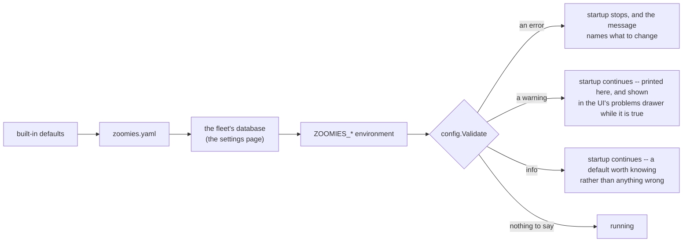

# Configuring Zoomies

Almost every setting lives in the fleet's own SQLite database and is changed on
the **Settings → Configuration** page. A change made there is kept: it survives
a restart, it is written to the audit trail, and it applies to this controller
and nothing else.

Three keys cannot live there, because they are what gets that database open:
`database.path`, and `security.encryption_key` or `security.encryption_key_file`.
A setting that unlocks a store cannot be stored in that store. Those go in
`zoomies.yaml` or the environment, and that is the whole of what a fresh
install's file contains.

### The four layers



Each layer wins over the one before it, and the settings page says which layer
each value came from, so "I changed it and nothing happened" is a question the
page answers rather than one you have to work out.

**The environment is deliberately last.** It is the way back in when a stored
setting has locked you out of the interface that would fix it — a bind address
nothing can reach, an external URL that breaks the login redirect — and it is
what keeps every containerised deployment working, since those ship their
configuration as environment variables. The cost is that a value typed on the
settings page can be silently overridden, so it is not left silent: a setting an
environment variable is holding is shown in its own group at the foot of the
page, naming the variable, and the API refuses to change it rather than storing
something that would be overridden at the next restart.

To hand such a setting over to the settings page, remove the variable from the
deployment's environment file and restart.

### Upgrading from a file-only install

On the first start after the upgrade, the settings your `zoomies.yaml` actually
spells are copied into the database, attributed to the file, and the file stays
as the layer underneath them. Nothing about what the controller runs changes —
you simply gain the ability to change them. It happens once, so a setting you
later clear back to its default is not poured back in at the next restart, and
an info finding (`settings.imported_from_file`) says it happened.

A key the file never mentioned is left alone. The defaults are worked out on the
host that reads them — the database path from its state directory, the agent's
capacity from its cores — so a row claiming to be "the default" would freeze one
machine's answers for every machine after it.

### From a terminal

When the settings page is the thing that is broken, `zoomies config` does the
same job against a stopped controller:

```sh
zoomies config list                       # what this fleet has stored, and where each value came from
zoomies config get server.bind            # one setting, and which layer won
zoomies config set server.bind 127.0.0.1:8080
zoomies config unset server.bind          # back to the file, or the built-in default
```

It refuses to run while a controller is up, because writing settings under a
process that has already read them leaves the two disagreeing with no way for
either to find out.

### The file

The parser is strict. A misspelled key is an error naming the line, not a
setting that silently does nothing.

If no file exists and none was named explicitly, the database plus the
environment plus the defaults are used — which is what makes the container image
work with nothing but environment variables.

### Where things live

Two directories, and neither has one fixed answer: they depend on the operating
system and on whether the process is running as root.

| | Configuration | State |
| --- | --- | --- |
| Override | `ZOOMIES_CONFIG_DIR` | `ZOOMIES_STATE_DIR` |
| Linux, as root | `/etc/zoomies` | `/var/lib/zoomies` |
| Linux, as anyone else | `~/.config/zoomies` | `~/.config/zoomies` |
| macOS | `~/Library/Application Support/zoomies` | same |
| Windows | `%ProgramData%\zoomies` | same |

The configuration directory holds `zoomies.yaml` and the encryption key; the
state directory holds the database — which is where the settings themselves
live — and the agents' work areas. Every default
path below that begins `<config dir>` or `<state dir>` resolves through this
table, and `zoomies config print` says what they came out as on this host.

`ZOOMIES_STATE_DIR` is the one to reach for when the database belongs on a
different disk from everything else — it moves the database and the work
directories together, so the two do not have to be set separately.

Every finding carries a code, and the code is the stable half: it is what you
search for and alert on, while the sentence beside it is written for whoever is
reading and may improve. [Problem codes](problem-codes.md) lists all of them —
the validator's and the running controller's — with severities and what to do.

---

## Everything at once

Every setting, with its default and its environment override. These are the
values the settings page edits; the block below is the same list in the shape
`zoomies.yaml` takes, for the deployments that still configure from a file.

The defaults below are the actual defaults. A file containing only the settings
you want to change is the normal case — and a fresh install's file contains only
the two or three keys that have to be in one.

```yaml
server:
  bind: 127.0.0.1:8080          # ZOOMIES_BIND
  external_url: ""              # ZOOMIES_EXTERNAL_URL  -- required for webhooks
  tls:
    mode: off                   # ZOOMIES_TLS_MODE      -- off | self-signed | files
    cert_file: ""               # ZOOMIES_TLS_CERT_FILE
    key_file: ""                # ZOOMIES_TLS_KEY_FILE
    hosts: []                   # ZOOMIES_TLS_HOSTS     -- names for a generated cert
  trusted_proxies: []           # ZOOMIES_TRUSTED_PROXIES -- CIDRs, or [cloudflare]; 0.0.0.0/0 is warned about
  allowed_origins: []           # ZOOMIES_ALLOWED_ORIGINS -- extra browser origins; "*" is warned about
  allow_indexing: false         # ZOOMIES_ALLOW_INDEXING -- let search engines in
  read_timeout: 30s             # ZOOMIES_READ_TIMEOUT
  write_timeout: 0s             # ZOOMIES_WRITE_TIMEOUT -- 0: SSE and log tails must not be cut off
  idle_timeout: 120s            # ZOOMIES_IDLE_TIMEOUT

database:
  path: <state dir>/zoomies.db  # ZOOMIES_DB_PATH -- see "Where things live" below

security:
  encryption_key: ""                        # ZOOMIES_ENCRYPTION_KEY
  encryption_key_file: <config dir>/encryption.key   # ZOOMIES_ENCRYPTION_KEY_FILE
  session_ttl: 168h                         # ZOOMIES_SESSION_TTL
  cookie_secure: null                       # ZOOMIES_COOKIE_SECURE (derived when unset)
  disable_auth: false                       # ZOOMIES_DISABLE_AUTH
  rate_limit_logins: 10                     # ZOOMIES_RATE_LIMIT_LOGINS (per address per minute, and 5x that per account
                                            #   over 15m); 0 disables it and is warned about

github:
  api_base_url: https://api.github.com   # ZOOMIES_GITHUB_API_BASE_URL
  upload_base_url: ""                    # ZOOMIES_GITHUB_UPLOAD_BASE_URL
  webhook_path: /webhooks/github         # ZOOMIES_WEBHOOK_PATH
  poll_interval: 30s                     # ZOOMIES_POLL_INTERVAL
  poll_fallback: true                    # ZOOMIES_POLL_FALLBACK
  allow_workflow_cancellation: true      # ZOOMIES_ALLOW_WORKFLOW_CANCELLATION
  runner_image: ghcr.io/eyupio/zoomies-runner:latest   # ZOOMIES_RUNNER_IMAGE
  runner_version: ""                     # ZOOMIES_RUNNER_VERSION

agent:
  embedded: true                # ZOOMIES_AGENT_EMBEDDED
  name: <hostname>              # ZOOMIES_AGENT_NAME
  capacity: <cpus / 2>          # ZOOMIES_AGENT_CAPACITY
  backend: docker               # ZOOMIES_AGENT_BACKEND  -- docker | podman | process
  docker_host: ""               # ZOOMIES_DOCKER_HOST / DOCKER_HOST -- "" autodetects
  work_dir: <state dir>/work    # ZOOMIES_WORK_DIR
  labels: {}                    # ZOOMIES_AGENT_LABELS   -- "gpu=true,zone=eu"
  network: ""                   # ZOOMIES_AGENT_NETWORK
  heartbeat_interval: 30s       # ZOOMIES_HEARTBEAT_INTERVAL -- a host is lost after 90s of silence; above 45s is warned about
  finished_retention: 0s        # ZOOMIES_AGENT_FINISHED_RETENTION -- 0 removes a finished workload after its report is acknowledged
  # Process backend only:
  runner_sha256: ""             # ZOOMIES_AGENT_RUNNER_SHA256 -- digest of the runner archive, when github.runner_version is pinned
  allow_unverified_runner_download: false   # ZOOMIES_AGENT_ALLOW_UNVERIFIED_RUNNER_DOWNLOAD -- warned about
  runner_download_url: ""       # ZOOMIES_AGENT_RUNNER_DOWNLOAD_URL -- an internal mirror of the actions/runner releases
  registry_auth: ""             # ZOOMIES_REGISTRY_AUTH -- credentials for a private image registry
  # Standalone agents only:
  controller_url: ""            # ZOOMIES_CONTROLLER_URL
  join_token: ""                # ZOOMIES_JOIN_TOKEN
  agent_token: ""               # ZOOMIES_AGENT_TOKEN
  ca_file: ""                   # ZOOMIES_AGENT_CA_FILE
  client_cert_file: ""          # ZOOMIES_AGENT_CLIENT_CERT_FILE
  client_key_file: ""           # ZOOMIES_AGENT_CLIENT_KEY_FILE
  insecure_skip_verify: false   # ZOOMIES_AGENT_INSECURE_SKIP_VERIFY
  allow_insecure_http: false    # ZOOMIES_AGENT_ALLOW_INSECURE_HTTP -- plain http:// off-host

runners:
  docker_wait: 2m               # ZOOMIES_DOCKER_WAIT   -- how long a Docker pool's runner waits for its daemon; 0 leaves the image's default
  env: {}                       # ZOOMIES_RUNNER_ENV    -- "HTTPS_PROXY=http://proxy:3128,NO_PROXY=localhost"; a pool's env wins

scheduler:
  interval: 10s                 # ZOOMIES_SCHEDULER_INTERVAL
  scale_up_delay: 0s            # ZOOMIES_SCALE_UP_DELAY
  max_runner_lifetime: 6h       # ZOOMIES_MAX_RUNNER_LIFETIME
  provision_timeout: 5m         # ZOOMIES_PROVISION_TIMEOUT
  drain_timeout: 15m            # ZOOMIES_DRAIN_TIMEOUT
  max_creates_per_tick: 10      # ZOOMIES_MAX_CREATES_PER_TICK
  default_runner_limits: true   # ZOOMIES_DEFAULT_RUNNER_LIMITS -- a pool with no cpus or memory_mb gets one slot's share of its host; off is warned about
  host_throttling: true         # ZOOMIES_HOST_THROTTLING -- step an overwhelmed host down and lift it after calm; off is warned about

capacity_demand:
  destination_url: ""           # ZOOMIES_CAPACITY_DEMAND_URL (empty disables)
  signing_secret: ""            # ZOOMIES_CAPACITY_DEMAND_SIGNING_SECRET
  cooldown: 10m                  # ZOOMIES_CAPACITY_DEMAND_COOLDOWN
  timeout: 10s                   # ZOOMIES_CAPACITY_DEMAND_TIMEOUT
  pools: []                      # ZOOMIES_CAPACITY_DEMAND_POOLS (IDs or names)

log:
  level: info                   # ZOOMIES_LOG_LEVEL   -- debug | info | warn | error
  format: json                  # ZOOMIES_LOG_FORMAT  -- json | text

oidc:
  enabled: false                # ZOOMIES_OIDC_ENABLED
  issuer: ""                    # ZOOMIES_OIDC_ISSUER
  client_id: ""                 # ZOOMIES_OIDC_CLIENT_ID
  client_secret: ""             # ZOOMIES_OIDC_CLIENT_SECRET
  redirect_url: ""              # ZOOMIES_OIDC_REDIRECT_URL (derived from external_url)
  scopes: [openid, profile, email]  # ZOOMIES_OIDC_SCOPES
  username_claim: preferred_username # ZOOMIES_OIDC_USERNAME_CLAIM
  groups_claim: groups          # ZOOMIES_OIDC_GROUPS_CLAIM
  admin_groups: []              # ZOOMIES_OIDC_ADMIN_GROUPS
  operator_groups: []           # ZOOMIES_OIDC_OPERATOR_GROUPS
  allow_signup: false           # ZOOMIES_OIDC_ALLOW_SIGNUP
  link_by_username: false       # ZOOMIES_OIDC_LINK_BY_USERNAME -- let SSO take over a password account of the same name; warned about

metrics:
  enabled: true                 # ZOOMIES_METRICS_ENABLED
  path: /metrics                # ZOOMIES_METRICS_PATH
  public: false                 # ZOOMIES_METRICS_PUBLIC

retention:
  jobs: 720h                    # ZOOMIES_RETENTION_JOBS      (30 days)
  runners: 168h                 # ZOOMIES_RETENTION_RUNNERS   (7 days; the row, not the container -- see agent.finished_retention)
  scaling_events: 8760h         # ZOOMIES_RETENTION_SCALING_EVENTS (365 days of scaling history; was retention.audit, which is still read)
  samples: 168h                 # ZOOMIES_RETENTION_SAMPLES   (7 days of the per-minute fleet and per-host samples the Overview and the Hosts page draw)
  webhooks: 168h                # ZOOMIES_RETENTION_WEBHOOKS
  machines: 168h                # ZOOMIES_RETENTION_MACHINES  (7 days of deleted-machine rows -- what was rented, when, and what it cost)

images:
  refresh_interval: 1h          # ZOOMIES_IMAGE_REFRESH_INTERVAL  -- 0 switches it off

updates:
  check_interval: 24h           # ZOOMIES_UPDATE_CHECK_INTERVAL   -- 0 never asks

provider:
  enabled: false                # ZOOMIES_PROVIDER_ENABLED                -- off: renting machines spends money
  paused: false                 # ZOOMIES_PROVIDER_PAUSED                 -- the kill switch; holds creation only
  interval: 30s                 # ZOOMIES_PROVIDER_INTERVAL
  sweep_interval: 10m           # ZOOMIES_PROVIDER_SWEEP_INTERVAL         -- how often each provider is asked what it is running
  max_machines: 0               # ZOOMIES_PROVIDER_MAX_MACHINES           -- fleet-wide ceiling; 0 rents nothing, and is warned about
  max_creates_in_flight: 2      # ZOOMIES_PROVIDER_MAX_CREATES_IN_FLIGHT
  scale_up_delay: 0s            # ZOOMIES_PROVIDER_SCALE_UP_DELAY         -- a machine takes minutes; it has already waited
  call_timeout: 30s             # ZOOMIES_PROVIDER_CALL_TIMEOUT
  create_timeout: 20m           # ZOOMIES_PROVIDER_CREATE_TIMEOUT
  bootstrap_timeout: 10m        # ZOOMIES_PROVIDER_BOOTSTRAP_TIMEOUT
  enrol_timeout: 15m            # ZOOMIES_PROVIDER_ENROL_TIMEOUT
  delete_timeout: 15m           # ZOOMIES_PROVIDER_DELETE_TIMEOUT
  ambiguity_timeout: 30m        # ZOOMIES_PROVIDER_AMBIGUITY_TIMEOUT      -- then a person is asked
  idle_timeout: 15m             # ZOOMIES_PROVIDER_IDLE_TIMEOUT
  scale_down_cooldown: 15m      # ZOOMIES_PROVIDER_SCALE_DOWN_COOLDOWN    -- at least one idle_timeout, or the fleet churns
  delete_grace: 10m             # ZOOMIES_PROVIDER_DELETE_GRACE           -- after a machine's host goes silent

ui:
  capacity_map:
    overview_layout: overlay    # ZOOMIES_UI_CAPACITY_MAP_OVERVIEW_LAYOUT -- overlay | split; what the Overview's map opens with
    hosts_layout: overlay       # ZOOMIES_UI_CAPACITY_MAP_HOSTS_LAYOUT    -- the same for the Hosts page, separately
```

---

## Every key

Where each setting can live, and when a change to it takes effect. "At once"
means the running controller picks it up on its next pass; "next restart" means
the change is stored and applied when the controller starts again, which the
settings page reports rather than refusing the edit.

### `agent`

| Key | Environment | Takes effect | What it is |
| --- | --- | --- | --- |
| `agent.agent_token` | `ZOOMIES_AGENT_TOKEN` | on the agent's own host | Agent token — The credential a standalone agent carries afterwards. It is configured on that agent's own host. |
| `agent.allow_insecure_http` | `ZOOMIES_AGENT_ALLOW_INSECURE_HTTP` | on the agent's own host | Allow plain HTTP to the controller — Let a standalone agent use a plain http:// controller URL off loopback, which puts its token and every runner credential on the wire in the clear. It is configured on that agent's own host. |
| `agent.allow_unverified_runner_download` | `ZOOMIES_AGENT_ALLOW_UNVERIFIED_RUNNER_DOWNLOAD` | next restart | Allow unverified runner downloads — Let the process backend install a runner archive whose digest it cannot check. The alternative to checking is executing whatever the network handed over. |
| `agent.backend` | `ZOOMIES_AGENT_BACKEND` | next restart | Runner backend — What a runner runs in: a Docker container, a Podman container, or a bare process on this host. |
| `agent.ca_file` | `ZOOMIES_AGENT_CA_FILE` | on the agent's own host | Controller certificate — The certificate a standalone agent pins for its controller. It is configured on that agent's own host. |
| `agent.capacity` | `ZOOMIES_AGENT_CAPACITY` | next restart | Runners per host — How many runners this host will hold at once. It defaults to one per two cores, which leaves the machine room to breathe. |
| `agent.client_cert_file` | `ZOOMIES_AGENT_CLIENT_CERT_FILE` | on the agent's own host | Client certificate — A standalone agent's client certificate, for mutual TLS. It is configured on that agent's own host. |
| `agent.client_key_file` | `ZOOMIES_AGENT_CLIENT_KEY_FILE` | on the agent's own host | Client private key — The key for that client certificate. It is configured on that agent's own host. |
| `agent.controller_url` | `ZOOMIES_CONTROLLER_URL` | on the agent's own host | Controller URL — The controller a standalone agent connects to. It is configured on that agent's own host. |
| `agent.docker_build_cache_mb` | `ZOOMIES_AGENT_DOCKER_BUILD_CACHE_MB` | next restart | Docker build cache target — The target size for unused Docker builder cache. 0 leaves a shared or externally managed daemon alone. |
| `agent.docker_host` | `ZOOMIES_DOCKER_HOST` | next restart | Docker socket — The Docker or Podman socket. Empty finds one, preferring a rootless socket over the root one. |
| `agent.embedded` | `ZOOMIES_AGENT_EMBEDDED` | next restart | Run an agent in this controller — Run an agent inside this controller, so a single machine needs one process. Off makes a controller that schedules runners onto other hosts and starts none itself. |
| `agent.finished_retention` | `ZOOMIES_AGENT_FINISHED_RETENTION` | next restart | Keep finished containers for — How long a finished runner's container stays on the host before the agent deletes it. It is the window for reading a finished runner's log, and it is host disk: 0 deletes on the next pass. |
| `agent.heartbeat_interval` | `ZOOMIES_HEARTBEAT_INTERVAL` | next restart | Heartbeat interval — How often an agent reports in. A host that goes quiet for 90 seconds is counted lost, so this has to be comfortably under that. |
| `agent.insecure_skip_verify` | `ZOOMIES_AGENT_INSECURE_SKIP_VERIFY` | on the agent's own host | Skip certificate verification — Let a standalone agent skip verifying its controller's certificate. It is configured on that agent's own host. |
| `agent.join_token` | `ZOOMIES_JOIN_TOKEN` | on the agent's own host | Join token — The single-use token a standalone agent redeems to enrol. It is configured on that agent's own host. |
| `agent.labels` | `ZOOMIES_AGENT_LABELS` | next restart | Host labels — Key=value labels describing this host, which a pool can require of the hosts it runs on. |
| `agent.name` | `ZOOMIES_AGENT_NAME` | next restart | Host name — What this host is called in the fleet. Empty names it after the machine it is on. |
| `agent.network` | `ZOOMIES_AGENT_NETWORK` | next restart | Container network — An existing container network to attach runners to. Empty uses the daemon's default bridge. |
| `agent.registry_auth` | `ZOOMIES_REGISTRY_AUTH` | next restart | Registry credentials — A base64 X-Registry-Auth value the container backends send when they pull. Without it a pool on a private registry cannot use pinned-only pulls at all. |
| `agent.runner_download_url` | `ZOOMIES_AGENT_RUNNER_DOWNLOAD_URL` | next restart | Runner download mirror — Where the process backend fetches runner archives from, for hosts that mirror releases internally. The path below it is the same. |
| `agent.runner_sha256` | `ZOOMIES_AGENT_RUNNER_SHA256` | next restart | Runner archive digest — The expected digest of the actions/runner archive the process backend downloads. Zoomies ships the digest for the release it pins; supply one when you pin another. |
| `agent.work_dir` | `ZOOMIES_WORK_DIR` | next restart | Working directory — Where runner working directories and the agent's own credentials live. |

### `capacity_demand`

| Key | Environment | Takes effect | What it is |
| --- | --- | --- | --- |
| `capacity_demand.cooldown` | `ZOOMIES_CAPACITY_DEMAND_COOLDOWN` | at once | Cooldown — How long to wait before asking for capacity for the same pool again. |
| `capacity_demand.destination_url` | `ZOOMIES_CAPACITY_DEMAND_URL` | at once | Destination URL — Where signed requests for host capacity are posted. Empty disables the integration. |
| `capacity_demand.pools` | `ZOOMIES_CAPACITY_DEMAND_POOLS` | at once | Pools to publish for — Which pools to publish demand for. Empty publishes for all of them. |
| `capacity_demand.signing_secret` | `ZOOMIES_CAPACITY_DEMAND_SIGNING_SECRET` | at once | Signing secret — The secret those requests are signed with. Anyone holding it can forge one, so it is stored sealed. |
| `capacity_demand.timeout` | `ZOOMIES_CAPACITY_DEMAND_TIMEOUT` | at once | Request timeout — How long one of those requests may take. |

### `database`

| Key | Environment | Takes effect | What it is |
| --- | --- | --- | --- |
| `database.path` | `ZOOMIES_DB_PATH` | file or environment only | Database file — The SQLite file holding this fleet, including every setting below. It is named in the configuration file or the environment because nothing can read it from inside itself. |

### `github`

| Key | Environment | Takes effect | What it is |
| --- | --- | --- | --- |
| `github.allow_workflow_cancellation` | `ZOOMIES_ALLOW_WORKFLOW_CANCELLATION` | at once | Allow cancelling workflow runs — Let operators ask GitHub to cancel the workflow run that owns a job. Turning it off is what a read-only Actions grant wants. |
| `github.api_base_url` | `ZOOMIES_GITHUB_API_BASE_URL` | at once | GitHub API base URL — https://api.github.com for github.com, or your Enterprise Server's /api/v3. It is the default for a new installation; each existing one keeps the base it was added with. |
| `github.poll_fallback` | `ZOOMIES_POLL_FALLBACK` | next restart | Poll for queued jobs — List queued jobs on a timer as well as waiting for webhooks. On by default: a controller that silently stops scaling because a webhook was misconfigured is worse than a few extra API calls. |
| `github.poll_interval` | `ZOOMIES_POLL_INTERVAL` | at once | Poll interval — How often the fallback poller looks for queued jobs. |
| `github.runner_image` | `ZOOMIES_RUNNER_IMAGE` | at once | Default runner image — The container image a new pool runs when it names neither an image nor an operating system. |
| `github.runner_version` | `ZOOMIES_RUNNER_VERSION` | at once | Pinned runner release — Pin the actions/runner release. Empty tracks whatever the image carries. |
| `github.upload_base_url` | `ZOOMIES_GITHUB_UPLOAD_BASE_URL` | at once | GitHub upload base URL — The upload endpoint, when your Enterprise Server puts it somewhere other than beside the API. |
| `github.webhook_path` | `ZOOMIES_WEBHOOK_PATH` | next restart | Webhook path — The path GitHub posts deliveries to. Changing it means changing the App's webhook URL too. |

### `images`

| Key | Environment | Takes effect | What it is |
| --- | --- | --- | --- |
| `images.refresh_interval` | `ZOOMIES_IMAGE_REFRESH_INTERVAL` | at once | Image refresh interval — How often every pool's image is prewarmed again, so a moving tag reaches the hosts. 0 switches it off, which is what an air-gapped fleet wants. |

### `log`

| Key | Environment | Takes effect | What it is |
| --- | --- | --- | --- |
| `log.format` | `ZOOMIES_LOG_FORMAT` | next restart | Log format — json for a log collector, text for a person reading a terminal. |
| `log.level` | `ZOOMIES_LOG_LEVEL` | at once | Log level — How much detail the controller logs. |

### `metrics`

| Key | Environment | Takes effect | What it is |
| --- | --- | --- | --- |
| `metrics.enabled` | `ZOOMIES_METRICS_ENABLED` | next restart | Prometheus endpoint — Serve the Prometheus endpoint. |
| `metrics.path` | `ZOOMIES_METRICS_PATH` | next restart | Metrics path — Where it is served. |
| `metrics.public` | `ZOOMIES_METRICS_PUBLIC` | next restart | Serve metrics without authentication — Serve it without authentication. Off by default, because job and repository names are visible in the label set. |

### `oidc`

| Key | Environment | Takes effect | What it is |
| --- | --- | --- | --- |
| `oidc.admin_groups` | `ZOOMIES_OIDC_ADMIN_GROUPS` | next restart | Administrator groups — Provider groups whose members get the administrator role. |
| `oidc.allow_signup` | `ZOOMIES_OIDC_ALLOW_SIGNUP` | next restart | Create accounts on first sign-in — Create an account on a first successful single sign-on, rather than refusing anyone not already here. |
| `oidc.client_id` | `ZOOMIES_OIDC_CLIENT_ID` | next restart | Client ID — The client this controller identifies itself as. |
| `oidc.client_secret` | `ZOOMIES_OIDC_CLIENT_SECRET` | next restart | Client secret — The client secret that goes with it. |
| `oidc.enabled` | `ZOOMIES_OIDC_ENABLED` | next restart | Single sign-on — Offer single sign-on as well as local accounts. |
| `oidc.groups_claim` | `ZOOMIES_OIDC_GROUPS_CLAIM` | next restart | Groups claim — The token claim listing the groups a user is in. |
| `oidc.issuer` | `ZOOMIES_OIDC_ISSUER` | next restart | Issuer URL — The identity provider's issuer URL, from which its endpoints are discovered. |
| `oidc.link_by_username` | `ZOOMIES_OIDC_LINK_BY_USERNAME` | next restart | Link sign-on to local accounts — Let a first single sign-on take over an existing local account with the same username. Turn it on for the one migration where that is the intention, then turn it off again. |
| `oidc.operator_groups` | `ZOOMIES_OIDC_OPERATOR_GROUPS` | next restart | Operator groups — Provider groups whose members get the operator role. A user in no mapped group is a viewer. |
| `oidc.redirect_url` | `ZOOMIES_OIDC_REDIRECT_URL` | next restart | Redirect URL — Where the provider sends the browser back to. Empty derives it from the external URL. |
| `oidc.scopes` | `ZOOMIES_OIDC_SCOPES` | next restart | Scopes — The scopes asked for at sign-in. |
| `oidc.username_claim` | `ZOOMIES_OIDC_USERNAME_CLAIM` | next restart | Username claim — The token claim that becomes a Zoomies username. |

### `provider`

| Key | Environment | Takes effect | What it is |
| --- | --- | --- | --- |
| `provider.ambiguity_timeout` | `ZOOMIES_PROVIDER_AMBIGUITY_TIMEOUT` | next restart | Unknown-outcome timeout — How long an operation whose outcome is unknown is reconciled by looking before a person is asked instead. It must outlast the creation timeout: a create that is merely slow is not an unknown outcome. |
| `provider.bootstrap_timeout` | `ZOOMIES_PROVIDER_BOOTSTRAP_TIMEOUT` | next restart | Agent install timeout — How long installing the agent inside a machine that is already up may take. |
| `provider.call_timeout` | `ZOOMIES_PROVIDER_CALL_TIMEOUT` | next restart | Provider request timeout — How long one API request to a provider may take. |
| `provider.create_timeout` | `ZOOMIES_PROVIDER_CREATE_TIMEOUT` | next restart | Machine creation timeout — How long the whole asynchronous creation of a machine may take, rather than the request that starts it. |
| `provider.delete_grace` | `ZOOMIES_PROVIDER_DELETE_GRACE` | next restart | Grace before a silent machine is lost — How long a machine whose host has gone silent is left alone before it is treated as lost. It has to outlast the controller's own judgement that a host is gone, or a network blip would destroy a machine in the middle of a job. |
| `provider.delete_timeout` | `ZOOMIES_PROVIDER_DELETE_TIMEOUT` | next restart | Deletion timeout — How long an asynchronous deletion may take. |
| `provider.enabled` | `ZOOMIES_PROVIDER_ENABLED` | next restart | Rent machines — Whether the machine loop runs at all. Off by default: renting a machine spends money, and nothing here should start doing that because a release added the ability to. |
| `provider.enrol_timeout` | `ZOOMIES_PROVIDER_ENROL_TIMEOUT` | next restart | Enrolment timeout — How long a bootstrapped machine has to appear as a host. It has to outlast a heartbeat timeout, or a machine that joined and went briefly quiet would be given up on. |
| `provider.idle_timeout` | `ZOOMIES_PROVIDER_IDLE_TIMEOUT` | at once | Idle before draining — How long a machine's host must have had no runner on it before the machine is drained. |
| `provider.interval` | `ZOOMIES_PROVIDER_INTERVAL` | next restart | Machine loop interval — How often the machine loop runs. It is slower than the scheduler's on purpose: a clone takes minutes, and the pass that watches one gains nothing from a ten-second tick. |
| `provider.max_creates_in_flight` | `ZOOMIES_PROVIDER_MAX_CREATES_IN_FLIGHT` | at once | Machines built at once — How many machines may be being built at once across the fleet, so a burst of queued jobs cannot ask a hypervisor for fifty clones in one pass. |
| `provider.max_machines` | `ZOOMIES_PROVIDER_MAX_MACHINES` | at once | Machines the fleet may rent — The ceiling across every provider. Zero rents nothing, exactly as a pool's max_runners of zero runs nothing: a maximum of none is none. |
| `provider.paused` | `ZOOMIES_PROVIDER_PAUSED` | at once | Pause new machines — Stop creating machines while leaving draining, deleting, recovering and verifying ownership running. A switch that stopped those too would strand running machines nobody is watching. |
| `provider.scale_down_cooldown` | `ZOOMIES_PROVIDER_SCALE_DOWN_COOLDOWN` | next restart | Cooldown before deleting — How long that idleness must hold continuously before anything is deleted, so a quiet minute between two bursts does not destroy the machines the second burst is about to want. |
| `provider.scale_up_delay` | `ZOOMIES_PROVIDER_SCALE_UP_DELAY` | next restart | Delay before renting — How long a pool's demand must stand before a machine is bought for it. Zero, unlike the scheduler's: a machine that takes four minutes to arrive has already spent the delay by being slow. |
| `provider.sweep_interval` | `ZOOMIES_PROVIDER_SWEEP_INTERVAL` | next restart | Ownership sweep interval — How often each provider is asked for everything it believes it is running, which is how an orphaned machine and one that vanished underneath us are both found. |

### `retention`

| Key | Environment | Takes effect | What it is |
| --- | --- | --- | --- |
| `retention.jobs` | `ZOOMIES_RETENTION_JOBS` | at once | Keep job history for — How long job history is kept. |
| `retention.machines` | `ZOOMIES_RETENTION_MACHINES` | at once | Keep deleted machines for — How long a deleted machine's row is kept, so what the fleet rented and gave back is still answerable after the machine itself is gone. |
| `retention.runners` | `ZOOMIES_RETENTION_RUNNERS` | at once | Keep finished runners for — How long finished runners are kept. |
| `retention.samples` | `ZOOMIES_RETENTION_SAMPLES` | at once | Keep Overview samples for — How long the Overview's samples are kept. |
| `retention.scaling_events` | `ZOOMIES_RETENTION_SCALING_EVENTS` | at once | Keep scaling history for — How long scaling decisions are kept. Audit rows are not covered by this, or by anything: they are never deleted. |
| `retention.webhooks` | `ZOOMIES_RETENTION_WEBHOOKS` | at once | Keep webhook deliveries for — How long webhook deliveries are kept. |

### `runners`

| Key | Environment | Takes effect | What it is |
| --- | --- | --- | --- |
| `runners.docker_wait` | `ZOOMIES_DOCKER_WAIT` | at once | Docker daemon wait — How long a runner on a pool that provides Docker waits for that daemon before refusing to take a job. Whole seconds, up to an hour; 0 leaves the runner image's own default. A pool's env can set ZOOMIES_DOCKER_WAIT to override it for that pool. |
| `runners.env` | `ZOOMIES_RUNNER_ENV` | at once | Runner environment — Key=value variables every runner starts with, such as a proxy or a package mirror. A pool's own env wins where the two name the same variable. Every job can read these, so a credential does not belong here: give it to the pool, or to the workflow as a GitHub secret. |

### `scheduler`

| Key | Environment | Takes effect | What it is |
| --- | --- | --- | --- |
| `scheduler.default_runner_limits` | `ZOOMIES_DEFAULT_RUNNER_LIMITS` | at once | Default runner limits — Give a runner whose pool sets no CPU or memory limit one slot's share of its host as a real limit. Off, a host's worth of them can each take every core. |
| `scheduler.drain_timeout` | `ZOOMIES_DRAIN_TIMEOUT` | at once | Drain timeout — Fail a runner that has been draining this long with no job left on it. A runner still finishing a job is never touched by it. |
| `scheduler.host_throttling` | `ZOOMIES_HOST_THROTTLING` | at once | Throttle hosts under pressure — Let the controller throttle a host its measurements say is overwhelmed, and step it back up after a stretch of calm. |
| `scheduler.interval` | `ZOOMIES_SCHEDULER_INTERVAL` | at once | Scheduler interval — How often the scheduler runs a pass even with nothing to react to. |
| `scheduler.max_creates_per_tick` | `ZOOMIES_MAX_CREATES_PER_TICK` | at once | Runners created per pass — How many runners may be created in one pass, so a thundering herd of queued jobs cannot exhaust a host in one go. |
| `scheduler.max_runner_lifetime` | `ZOOMIES_MAX_RUNNER_LIFETIME` | at once | Maximum runner lifetime — Drain a runner that has lived this long, next time it is not busy. It bounds how long a runner's credentials live; it never ends a job. |
| `scheduler.provision_timeout` | `ZOOMIES_PROVISION_TIMEOUT` | at once | Provision timeout — Fail a runner that never finishes registering, so a bad image does not hold a host slot for ever. |
| `scheduler.scale_up_delay` | `ZOOMIES_SCALE_UP_DELAY` | at once | Scale-up delay — How long a job must have been queued before it counts as demand. It damps churn when jobs arrive in bursts; 0 reacts at once. |

### `security`

| Key | Environment | Takes effect | What it is |
| --- | --- | --- | --- |
| `security.cookie_secure` | `ZOOMIES_COOKIE_SECURE` | next restart | Secure session cookies — Force the Secure attribute on session cookies. Unset derives it from the external URL and the TLS mode, which is right unless a proxy in front makes it wrong. |
| `security.disable_auth` | `ZOOMIES_DISABLE_AUTH` | next restart | Disable authentication — Remove all authentication. It exists for local development, and it is refused wherever this controller looks reachable. |
| `security.encryption_key` | `ZOOMIES_ENCRYPTION_KEY` | file or environment only | Encryption key — The 32-byte key, base64 or hex, that seals GitHub App private keys, webhook secrets and the stored credentials below. Prefer the key file or the environment variable: a key written into zoomies.yaml is a key in your configuration management system. |
| `security.encryption_key_file` | `ZOOMIES_ENCRYPTION_KEY_FILE` | file or environment only | Encryption key file — Where that key is read from, and written to on a first run. Back it up beside the database: without it the sealed rows cannot be read. |
| `security.rate_limit_logins` | `ZOOMIES_RATE_LIMIT_LOGINS` | next restart | Login attempts per minute — Password attempts allowed per source address per minute, and five times that per account. |
| `security.session_ttl` | `ZOOMIES_SESSION_TTL` | next restart | Session lifetime — How long a browser login lasts before it has to be made again. |

### `server`

| Key | Environment | Takes effect | What it is |
| --- | --- | --- | --- |
| `server.allow_indexing` | `ZOOMIES_ALLOW_INDEXING` | next restart | Allow search engine indexing — Invite search engines into the UI. Off by default: a controller is somebody's infrastructure rather than somebody's website. |
| `server.allowed_origins` | `ZOOMIES_ALLOWED_ORIGINS` | next restart | Allowed browser origins — Extra browser origins allowed to make state-changing requests. Empty means same-origin only, which is what the built-in UI needs. |
| `server.bind` | `ZOOMIES_BIND` | next restart | Listen address — The address the controller listens on. 127.0.0.1:8080 is this machine only; 0.0.0.0:8080 is every interface. |
| `server.external_url` | `ZOOMIES_EXTERNAL_URL` | next restart | External URL — How GitHub and browsers reach this controller. It forms the webhook URL, so webhooks need it. |
| `server.idle_timeout` | `ZOOMIES_IDLE_TIMEOUT` | next restart | Idle timeout — How long an idle keep-alive connection is held open. |
| `server.read_timeout` | `ZOOMIES_READ_TIMEOUT` | next restart | Read timeout — How long a client may take to send its request. |
| `server.tailcat_enabled` | `ZOOMIES_TAILCAT_ENABLED` | next restart | Private agent network — Permit private agent connections, started on first enrolment. |
| `server.tls.cert_file` | `ZOOMIES_TLS_CERT_FILE` | next restart | Certificate file — The certificate the listener serves, when the mode is files. |
| `server.tls.hosts` | `ZOOMIES_TLS_HOSTS` | next restart | Certificate host names — The names baked into a generated self-signed certificate. |
| `server.tls.key_file` | `ZOOMIES_TLS_KEY_FILE` | next restart | Private key file — The private key for that certificate. The file stays on disk; only its path is stored here. |
| `server.tls.mode` | `ZOOMIES_TLS_MODE` | next restart | TLS mode — How the listener terminates TLS: off behind a reverse proxy, self-signed for a generated certificate, files for one of your own. |
| `server.trusted_proxies` | `ZOOMIES_TRUSTED_PROXIES` | next restart | Trusted proxies — CIDRs whose X-Forwarded-For header is believed, or the word cloudflare for Cloudflare's published ranges. Empty takes client addresses from the socket, which is the safe answer. |
| `server.write_timeout` | `ZOOMIES_WRITE_TIMEOUT` | next restart | Write timeout — How long a response may take. It is 0, and should stay 0: the event stream and a followed log are responses that never end. |

### `ui`

What the web UI opens with. Each of these is a starting point: the page
itself lets an operator pick the other answer, and remembers the pick in that
browser, so what is set here is what somebody who has never chosen sees. The
two pages that carry the capacity map are set separately, because they are
opened for different reasons — the Overview to glance at a fleet, the Hosts
page to look into a machine — and a fleet may want each to open on its own
answer.

| Key | Environment | Takes effect | What it is |
| --- | --- | --- | --- |
| `ui.capacity_map.hosts_layout` | `ZOOMIES_UI_CAPACITY_MAP_HOSTS_LAYOUT` | at once | Hosts capacity map layout — The same choice for the map on the Hosts page, which can open differently from the Overview's: split suits the page a machine is looked into on, overlay the page a fleet is glanced at. |
| `ui.capacity_map.overview_layout` | `ZOOMIES_UI_CAPACITY_MAP_OVERVIEW_LAYOUT` | at once | Overview capacity map layout — How the host capacity map on the Overview opens: overlay draws every host on one chart, split draws a chart for each. An operator who picks the other one on the page keeps their pick in that browser. |

### `updates`

| Key | Environment | Takes effect | What it is |
| --- | --- | --- | --- |
| `updates.check_interval` | `ZOOMIES_UPDATE_CHECK_INTERVAL` | at once | Update check interval — How often github.com is asked which release of Zoomies is current. 0 never asks, and is the one request that is not about your fleet. Nothing is ever downloaded by it. |

## The settings that matter most

### `server.external_url`

The address GitHub and your browser use. Webhooks are delivered to
`<external_url><github.webhook_path>`, and the OIDC redirect URL is derived from
it.

Without it, Zoomies cannot tell GitHub where to deliver webhooks, so scaling
falls back entirely to polling and reacts in tens of seconds rather than
instantly. It warns about this at startup.

### `server.tailcat_enabled`

Default `true`; environment override `ZOOMIES_TAILCAT_ENABLED`.
Permits built-in private agent connections through Tailcat. The controller
starts its userspace listener on first private enrolment, then resumes it on
subsequent starts. Requires authentication and the instance encryption key.
Set false and restart to stop private connections without deleting their saved
identity. See [Private hosts](private-hosts.md).

### `server.bind`

Defaults to loopback. If you change it to `0.0.0.0` and leave TLS off, you get a
warning — which is correct behaviour if a reverse proxy terminates TLS, and a
problem otherwise. When you do run behind a proxy, also set
`server.trusted_proxies` so audit entries and login rate limiting see the real
client address instead of your proxy's.

It governs `X-Forwarded-Proto` as well as `X-Forwarded-For`. Without it the
controller reads every request as plain `http`, whatever the header says,
because nothing distinguishes your proxy from anyone else who can reach the
listener — so it will not send `Strict-Transport-Security`, and an `https://`
`Origin` is same-origin only by way of `server.external_url`. Set both and
neither applies.

### The setup token

While the instance has no accounts, the controller prints a **setup token** at
startup — on the banner and on a log line beginning `setup token` — and the
first-run page asks for it. It is what stops a controller you have just deployed
from being claimed by whoever loads the page first; an empty database is not, by
itself, proof that you are its owner.

```sh
docker compose logs zoomies | grep 'setup token'
```

It is minted per process and held only in memory, so restarting the controller
prints a new one, and the line stops appearing for good once an account exists.
`zoomies init` and the installer create the first administrator on the console
and never need it.

### `server.allow_indexing`

Off, and it should usually stay off. A controller serves `/robots.txt` and
`/sitemap.xml` like any other web address, and by default the first of them
declines crawling altogether: this is your infrastructure, and appearing in a
search result is a way of being found that nobody asked for. The page itself
carries `noindex, nofollow` to say the same thing to a crawler that arrived from
a link without reading `robots.txt`.

Turn it on and `robots.txt` invites crawlers to the UI's own pages — never
`/api/`, `/metrics` or the webhook path — advertises the sitemap, and the page
switches to `index, follow`. Zoomies warns at startup when it is on, because the
sign-in page and this controller's address then become public knowledge.

`/sitemap.xml` is served either way. It lists the interface's top-level pages
and nothing about your fleet: no pool, runner or job has an entry, because those
addresses are gone by tomorrow.

### `security.encryption_key`

32 bytes, base64 or hex. Generate one with `openssl rand -base64 32`.

Supply it through `ZOOMIES_ENCRYPTION_KEY` or a `0600` key file. Putting it in
`zoomies.yaml` produces a warning, because anything that can read your config —
backups, configuration management, a support bundle — can then decrypt every
stored secret.

Zoomies refuses to read a key file that is group- or world-readable.

**Back it up, separately from the database.** Losing it means re-entering the
GitHub App private key and webhook secret.

### `github.api_base_url` — GitHub Enterprise Server

```yaml
github:
  api_base_url: https://ghes.example.com/api/v3
```

A bare hostname is accepted and `/api/v3` appended. Everything else — App auth,
JIT configs, webhooks, runner groups — works the same.

### `github.allow_workflow_cancellation` — cancel runs from Zoomies

```yaml
github:
  allow_workflow_cancellation: true
```

On by default. Operators can cancel the GitHub workflow run
containing a queued or running job from its drawer. GitHub only provides a
run-level API, so this stops every job in that run. The confirmation also
offers force cancellation for a run that remains stuck after an ordinary
request.

This feature requires the GitHub App's **Actions: read and write** permission.
New Apps created while the setting is enabled request it automatically. For an
existing App, change the permission in GitHub and accept the permission update
on every installation before using the action. Set the option to `false` if you
prefer to keep Actions read-only and hide cancellation from Zoomies.

### `github.runner_image` — the fallback runner image

```yaml
github:
  runner_image: ghcr.io/eyupio/zoomies-runner:latest
```

This is the last of three answers, not the first. A pool that names an image
gets that image; a pool that names a **platform** gets the variant its platform
selects; only a pool that names neither falls back to this setting. Whichever it
lands on, a pool whose `docker_mode` gives jobs a daemon then gets that image's
Docker variant. See [Naming and platforms](naming.md) for the catalogue and how
a pool picks from it.

Four images are published to GHCR:

| Image | What it is |
| --- | --- |
| `ghcr.io/eyupio/zoomies` | the controller |
| `ghcr.io/eyupio/zoomies-agent` | an agent, for a host that runs one in a container |
| `ghcr.io/eyupio/zoomies-runner` | the runner a pool starts |
| `ghcr.io/eyupio/zoomies-runner-docker` | the same, plus a Docker CLI — a pool is switched to it when its `docker_mode` gives jobs a daemon, see [Jobs that build container images](#jobs-that-build-container-images) |

They share their tag names and release/development channels.

**The controller and the agent** follow releases:

| Tag | Points at | Published by |
| --- | --- | --- |
| `latest` | The newest full release | `release.yml`, when a release is published |
| `vX.Y.Z` | One published release | `release.yml`, when a release is published |
| `dev` | The tip of `main` | `ci.yml`, on every push to `main` |
| `main` | The tip of `main` | `ci.yml`, on every push to `main` |
| `sha-<commit>` | One exact commit | `ci.yml`, on every push to `main` |

An operator pulling `latest` gets a release, which is what it reads as. It used
to mean the tip of `main`, and both workflows wrote it, so whichever ran last
won — and a controller pulled from it could be an unreleased build stamped
`main-sha-abc1234`. That is worse than a stale tag: an agent is installed from a
release asset and no release carries a `main-` version, so such a controller
cannot match any agent it enrols, and shows every host as a different build for
as long as it runs. Run `dev` when you want `main`; it says so.

A **prerelease** — a tag with a hyphen in it, `v0.1-alpha`, `v1.0-rc1` — is
published under its own tag and does not move `latest`. Name it to run it.

**The runner images** use the same explicit channels:

| Tag | Points at | Published by |
| --- | --- | --- |
| `latest` | The newest full release | `release.yml`, when a release is published |
| `dev` | The tip of `main` | `ci.yml`, on every push to `main` |
| `main` | The tip of `main` | `ci.yml`, on every push to `main` |
| `sha-<commit>` | One exact commit | `ci.yml`, on every push to `main` |
| `vX.Y.Z` | One tagged release | `release.yml`, on a `v*` tag |

With no image override, development controller images automatically select
`:dev` runners; platform pools select e.g. `:debian-12-dev`. Release controller
images select their own release tag, e.g. `:v1.2.3` or `:debian-12-v1.2.3`,
including when pulled via `:latest`. Docker-enabled pools keep the same tag
when selecting `zoomies-runner-docker`.

The `dev`, `main` and SHA controller aliases share one image and therefore
share the `dev` runner default: a container cannot discover which alias was
used to pull it. For an immutable development runner, explicitly select
`sha-<commit>` (or `<platform>-sha-<commit>`) in the pool image field.
Native builds retain the `latest` default. Local container builds default to
`dev`; set the Docker build argument `RUNNER_IMAGE_TAG` for a different tag.

Explicit pool images, including custom repositories, tags and digests, remain
overrides. `github.runner_image` / `ZOOMIES_RUNNER_IMAGE` still overrides the
fallback for pools without a platform. Leave these unset to follow the build.
Existing saved `:latest` values are treated as explicit overrides; clear the
pool image and remove any fallback setting to restore automatic selection.

Both runner images are also published with one tag per operating system —
`ubuntu-2404`, `ubuntu-2204`, `debian-12`, `fedora-42`, `rocky-9`, each built
for amd64 and arm64 — plus `<os>-<version>-dev`, `<os>-<version>-main` and
`<os>-<version>-<tag>` for
pinning one operating system without pinning the controller. `latest` is the
`ubuntu-2404` variant. Set this key to a specific variant to change what an
unspecified pool boots fleet-wide.

Every push to `main` rebuilds the runner variants so their `dev` labels and
build stamp identify the same commit as the controller, agent image and binary.
Every variant and both targets come out of the same Dockerfile, so they are
never out of step with each other.

### What is in the runner image

Both runner images carry the actions/runner release and its .NET dependencies,
and the toolchain a build typically reaches for without saying so:

| | |
| --- | --- |
| Compilers and build tools | `build-essential` (gcc, g++, make), `cmake`, `pkg-config`, `autoconf`, `automake`, `libtool`, `patch`, `gettext` |
| Headers native extensions link against | OpenSSL, zlib, libffi, libyaml, libxml2, libxslt, libcurl, SQLite, readline, bzip2, lzma, ncurses, uuid |
| Interpreters | `python3` with `pip` and `venv`, `nodejs` with `npm` |
| Source and transfer | `git`, `git-lfs`, `curl`, `wget`, `rsync`, `openssh-client`, `gnupg` |
| Archives | `tar`, `gzip`, `xz-utils`, `bzip2`, `zstd`, `zip`, `unzip` |
| GitHub | the `gh` CLI |
| Diagnostics | `jq`, `file`, `netcat-openbsd`, `dnsutils`, `iputils-ping`, `net-tools`, `lsb-release` |

`python3` and `nodejs` are a floor, not a choice about versions: `setup-python`
and `setup-node` still install what a workflow asks for and take precedence on
`PATH`. They are here so that a step which uses either **without** a setup
action first does not fail.

Deliberately absent: a JDK, and the other language runtimes with a good
`setup-*` action. Those install the version the workflow asked for, where this
image could only guess — at a cost of hundreds of megabytes of probably-wrong
version.

A large image is no longer cold-start time. A pool's image is prewarmed on
every host that can run it and refreshed on a timer, so the pull happens in the
background and a job finds the image already there. What a bigger image costs
is disk on the host.

If you want something leaner, point the pool at an image of your own; Zoomies
only requires that it can run the entrypoint contract described in
`deploy/runner-entrypoint.sh`.

### `updates.check_interval` — knowing the controller is behind

```yaml
updates:
  check_interval: 24h
```

Once a day, the controller asks github.com which release of Zoomies is current.
If that is not the release this controller was built from, the Overview's
problems panel says so, at **info** severity, naming both versions and linking
the release notes.

It only ever tells you. **Nothing downloads and nothing restarts** — the
controller does not update itself, and it never will: a controller that
restarted itself would drop in-flight webhook deliveries and every agent's
long poll, and would only work for some of the ways `zoomies init` can install
it. The upgrade stays a decision you make.

The notice appears **only on a controller built from a release tag**. One built
from `main` — which is what the `:dev` and `:main` images are — is normally
*ahead* of the newest release, so telling it that a release is available would
be telling it to downgrade. It says nothing rather than something wrong.

This is the one request Zoomies makes to github.com that is not about your
fleet, and it goes there whatever `github.api_base_url` is set to, because the
releases of this software live on github.com whichever GitHub your runners talk
to. An air-gapped deployment, or a GitHub Enterprise Server one with no route
out, wants `check_interval: 0` — which switches off the check and the notice
together.

### Deployment models

`zoomies init` can run Zoomies three ways, and offers only the ones your host can
actually do:

| | What it writes | When to pick it |
| --- | --- | --- |
| `native` | a hardened systemd unit (or a launchd plist) | leanest, starts fastest, and needs no container runtime for the controller itself |
| `compose` | `docker-compose.yml` and a populated `.env` | easiest to upgrade and to move to another host |
| `docker` | an env file and one `docker run` | fewest files, but you manage the run command |

Pass `--deployment native|compose|docker` to skip the question. Compose is the
default when a compose command is present, native otherwise.

There is a fourth way in, for hosts you do not install on at all: a platform
that builds with Nixpacks reads `nixpacks.toml` from the repository root and
deploys the controller from the source. It has no Docker socket, so it runs no
runners itself and agents join it from elsewhere -- [Deploying on a
PaaS](paas.md) is the whole of it.

The generated `.env` is complete: external URL, a freshly generated encryption
key, bind address, TLS mode, trusted proxies, backend, capacity, work and
database paths, log settings, the image tag, the published port, and the host's
real docker group id. Every variable carries a comment. It is `0600`, written
atomically, and a re-run **reuses the existing encryption key** rather than
minting a new one -- which would render every stored secret undecryptable.

`zoomies uninstall` reads back which deployment was used and tears down the
right thing: `<compose> down` for a compose install (offering `-v`, and saying
plainly that this destroys the database), `stop` and `rm` for a container.

### Behind Cloudflare (or any reverse proxy)

`docker-compose.yml` is set up for this: Cloudflare terminates TLS and proxies
to the origin over plain HTTP on port 80.

```yaml
server:
  bind: 0.0.0.0:8080          # the container port; compose publishes it on 80
  external_url: https://zoomies.sh
  tls:
    mode: off                 # Cloudflare holds the certificate
  trusted_proxies: [cloudflare]
```

Three things follow from that, and getting any of them wrong is quiet rather
than loud:

* **The external URL is `https://`, not `http://`.** It is what the session
  cookie's `Secure` flag is derived from, what the webhook URL is built from,
  and what the UI links to. The container serving HTTP does not change any of
  that. It does mean the UI has to be opened through the https address: a
  browser on a plain-http page -- `http://<ip>` to check the container is up --
  throws a Secure cookie away, so Zoomies refuses to sign you in from one and
  says why, rather than signing you in and out in the same second. To test over
  plain http, set `cookie_secure: false` for the duration.
* **`trusted_proxies` must trust Cloudflare.** Write the word `cloudflare` and
  Zoomies expands it to Cloudflare's published ranges, embedded in the binary.
  Without them the origin sees Cloudflare's address on every connection, so
  the audit log records Cloudflare for every action and the login rate limiter
  throttles the whole internet as one client. With them, Zoomies takes the
  address from `CF-Connecting-IP` — which Cloudflare sets and a client cannot
  override — falling back to the right-most non-proxy entry of
  `X-Forwarded-For`. The ranges move when the binary does, and `zoomies init`
  offers a "Cloudflare in front" choice that writes the token for you.
* **Only Cloudflare should be able to reach the origin.** Publishing port 80
  puts an unauthenticated webhook endpoint on the public internet with
  Cloudflare merely in front of it, not in the way. Firewall the origin to
  Cloudflare's ranges, or use a Cloudflare Tunnel and publish no port at all.

Zoomies will warn at startup that it is listening without TLS. In this
deployment that warning is expected, and it is the reason the warning says
"if a proxy already terminates TLS, this is expected" rather than treating it
as an error. The controller cannot see the proxy from behind it, so it has no
way to tell this deployment from an origin genuinely exposed in the clear.

The web UI does not repeat it: `bind.public_no_tls` is printed at startup and
by `zoomies config check`, but it is left off the UI's problems drawer
and the Settings page, because a count that is permanently amber on a
correctly configured fleet is a count nobody reads.

### `agent.capacity`

The maximum number of concurrent runners on this host. It is a hard ceiling the
scheduler respects; a pool's `max_runners` cannot exceed the capacity actually
available across matching hosts.

Default is half the CPU count, on the reasoning that a job usually wants more
than one core and the host still has to breathe.

With `scheduler.default_runner_limits` on, the capacity also sets each runner's
share: a runner whose pool sets no `cpus` or `memory_mb` is given the host's
allocatable CPU and memory divided by this number, as a real cgroup limit. A
capacity that is more slots than the machine has cores, or than it has 2 GB of
memory for, is warned about as `host.overprovisioned`, with the largest
capacity that fits.

### `agent.finished_retention`

A finished runner is removed from its host on the reconcile pass after the
controller acknowledges the runner's terminal report. The default is `0s`:
GitHub's job result and Zoomies' runner history remain available, but the
stopped container's writable layer, its Docker-in-Docker sidecar and any
Zoomies-created scratch directory do not accumulate from job to job.

Set a non-zero duration only when you deliberately want a window in which to
read the stopped container's local logs, for example:

```yaml
agent:
  finished_retention: 10m
```

This setting does not delete a workload before its final state is safe. If the
controller cannot acknowledge the terminal report, the agent keeps the
workload and retries. A completed GitHub job also triggers removal of its ephemeral
runner, including failed and cancelled jobs; this explicit removal does not wait
for the log-retention window. Pending host removals are recovered after a
controller restart and retried until the host confirms success.

New Docker runner and Docker-in-Docker containers rotate their local logs at
10 MiB, retaining three files per container. This bounds log growth while a
runner is active or waiting for removal. Existing containers keep their original
logging settings until replaced.

### `agent.docker_build_cache_mb`

Target size in MiB for unused build cache in the host Docker daemon. The default
is `5120` (5 GiB). The agent requests cache cleanup at startup and every five
minutes in a separate loop, so a slow Docker daemon does not delay runner
removal or heartbeats. Failed cleanup is logged and retried.

```yaml
agent:
  docker_build_cache_mb: 5120
```

Set `0` to disable this cleanup, for example when another service manages a
shared daemon's cache. The environment override is
`ZOOMIES_AGENT_DOCKER_BUILD_CACHE_MB`; changing it requires restarting the agent.
Both standalone and embedded agents use this setting.

This targets Docker's own builder cache, including cache left by cancelled
host-socket builds. On a shared daemon it includes unused cache from other
builds. Docker protects cache currently in use, so the target is not a hard
disk quota. Separate Buildx builders using the `docker-container` driver, job
images, named volumes and arbitrary files created through the host socket are
outside this cleanup. Podman and process backends do not use this setting.
Docker-in-Docker build data is discarded with each runner's sidecar instead.

The scheduler also stops placing work when the host's reported free disk falls
below its reserve (at least 2 GiB). That reading covers `agent.work_dir`'s
filesystem; a separate Docker data filesystem and disk written by jobs already
running still need enough capacity.

### `agent.registry_auth`

A base64 `X-Registry-Auth` value the container backends send when they pull an
image: the JSON `{"username":"...","password":"..."}` that `docker login`
writes, base64url-encoded. Empty means anonymous pulls, which is right for
public images.

Set it when a pool's image lives in a private registry. Without it such a pool
cannot use `pull_policy: pinned-only` at all — the pull it needs is the one the
registry refuses, and the runner never starts.

It is a credential, so prefer `ZOOMIES_REGISTRY_AUTH` in the service's
environment file to a value written into `zoomies.yaml`, which is world-
readable on plenty of hosts.

### `agent.docker_host`

Empty autodetects, **preferring a rootless socket**, in this order:

1. `$DOCKER_HOST`
2. `$XDG_RUNTIME_DIR/docker.sock`
3. `/run/user/<uid>/docker.sock`
4. `~/.docker/run/docker.sock` (Docker Desktop on macOS)
5. `/var/run/docker.sock`

The group a service account must join to reach a root socket is read from the
socket itself, not from the name `docker`. In a containerised deployment that
gid is `DOCKER_GID` in the environment file: `group_add` reads it, the compose
files also pass it into the container's environment, and `zoomies init` checks
it against the socket before the container is started -- a container is given
a group when it is created, and no `usermod` on the host can add one
afterwards. A socket that exists but cannot be opened is diagnosed rather than
guessed at: the agent reports the account it runs as, the group that owns the
socket, and whether that account is already a member. If it is, the fix is a
restart of the agent and not another `usermod` -- supplementary groups are
fixed when a process starts. In a container it reports the group the container
holds against the one it needs, and names the `DOCKER_GID` line to change and
the `docker compose up -d` that recreates the container.

### `agent.labels` and pool host selectors

Agent labels describe a host; a pool's `host_selector` requires them. Every
key/value in the selector must match.

```yaml
# on the GPU box
agent:
  labels: { gpu: "true", zone: "eu-west" }
```

```yaml
# in the pool
host_selector: { gpu: "true" }
```

A join token can carry labels too, and those win. Labels decide which pools'
work a host is offered — and therefore which pools' runner registrations it is
handed — so what the operator minting the token pinned is not something the
machine being enrolled can talk its way out of. Keys the token says nothing
about are still the agent's to declare.

### Re-joining a host

Joining with the name of a host that already exists replaces it: the row keeps
its ID, and the previous registration's runner records go with it. That needs
the agent token the previous registration was issued, which the agent sends from
its credentials file automatically. A rebuilt machine with its state directory
intact therefore re-joins with no ceremony.

If the credentials really are gone, delete the host first:

```sh
zoomies hosts delete host_xxxxxxxx
zoomies agent join https://zoomies.example.com --token <join-token>
```

A join token on its own is deliberately not enough — otherwise anyone trusted to
enrol one machine could seize any other machine by naming itself after it.

An empty selector matches any host, so once a specialised machine joins, give
the general pools a selector of their own — otherwise they are eligible for the
GPU box too. [Hosts and pools](hosts-and-pools.md) works that shape through.

### `agent.runner_sha256` and the process backend's download

The process backend downloads the `actions/runner` release itself, and it
refuses to install an archive it cannot verify. Zoomies ships the SHA-256 of
every archive for the release it pins by default, so the common case needs no
setting at all. Pin a different release with `github.runner_version` and give
its digest here -- every actions/runner release lists them in its notes -- and
the download is verified against that instead.

`agent.allow_unverified_runner_download` accepts an archive with no known
digest. It is warned about at startup, because it means executing whatever the
network handed over. `agent.runner_download_url` points the download at an
internal mirror that keeps GitHub's release layout underneath it.

### `scheduler.scale_up_delay`

How long a job must have been queued before it counts as demand. `0s` reacts
immediately, which is what you want most of the time. Raise it if your workflows
arrive in bursts that resolve themselves and you would rather not churn runners.

### `scheduler.max_runner_lifetime`

Drains a runner that has lived this long, the next time it is **not** busy. It
bounds how long a persistent runner's state and credentials live, so a pool that
keeps a minimum re-registers its runners this often. It never interrupts a
running job: a job that hangs keeps its runner busy, and ending that is what the
workflow's `timeout-minutes` is for. A runner that never finished registering is
`provision_timeout`'s to fail, not this setting's.

### `scheduler.drain_timeout`

Fails a runner that has been draining this long with **no job left on it**.

A drain asks a runner to finish what it is doing and stop, and the agent carries
that out. The queue those instructions live in is in memory on purpose, so a
controller restart drops one that had already been issued. The row is left in
draining, which is a state nothing else counts against: it holds its slot on the
host, its pool sits one runner short, and both stay that way for as long as the
controller runs. This bounds it — the runner is failed, so an operator sees it
and its slot is taken back.

It does not touch a runner still finishing a job, however long that takes.
Waiting is what a drain is, there is no maximum job duration in Zoomies by
design, and a build ended from here would look to its owner like a failure with
no cause. Ending a job that hangs is the workflow's `timeout-minutes`.

`0s` leaves a drain unbounded, which is the behaviour before this setting
existed.

### `scheduler.default_runner_limits`

Whether a runner whose pool leaves `cpus` or `memory_mb` unset is created with
one slot's share of its host's allocatable machine as a cgroup limit on that
field — the same share the scheduler already charges it. On by default.

The charge was always there; what was missing was the limit. A pool with no
limits was charged a slot's worth of the host, so the books balanced, and its
runners were created with no cgroup limit at all, so eight of them could each
take every core while the books said everything fitted. That is how a host's
Docker daemon stops answering, and it is what this setting prevents. The share
is given only where it would bind — a container backend whose daemon has said
it can apply the limit, on a host that has reported its size — and a pool's
own limits win on every field it set. Where a runner's limits came from is on
its page as `allocation_source`, and an out-of-memory kill on a defaulted
limit says so, with the two ways out. [Default
allocations](hosts-and-pools.md#default-allocations) has the rules in full.

`false` restores unlimited containers for pools that set no limits, and raises
`scheduler.default_runner_limits_off` at startup and in the problems drawer
for as long as it stands. Set `cpus` and `memory_mb` on every pool if you turn
it off; a fleet whose pools all set their own limits is unaffected either way.

### `scheduler.host_throttling`

Whether the controller steps a host down when its measurements say it is
overwhelmed: fewer slots, and a lower CPU quota on the runners already on it,
climbed back up one rung at a time after a stretch of calm. On by default.

The pressure holds refuse every new start while a host's CPU or memory is
acutely short, and release the moment a sample says otherwise; a host that is
overwhelmed on and off for an hour spends that hour being let back in at full
capacity and given a fresh runner each time. The throttle is what outlasts a
sample. Each rung takes a quarter of the host's slots and, down to half, a
quarter of every runner's CPU quota; it climbs every two minutes while the
pressure keeps coming back, to a top rung of three, and comes down after five
minutes of calm. A running job is never slowed below half its allocation, so a
throttle slows work and never fails it. [Current usage and automatic
holds](hosts-and-pools.md#current-usage-and-automatic-holds) has the ladder,
what ends a throttle, and which hosts can be throttled at all.

`false` raises `scheduler.host_throttling_off`, and a throttle standing when
the setting is switched off is lifted rather than left on a rung nothing will
ever step down. Leave it on unless something outside Zoomies manages the
hosts' load.

### `runners.docker_wait` and `runners.env` — what every runner starts with

```yaml
runners:
  docker_wait: 2m
  env:
    HTTPS_PROXY: http://proxy.internal:3128
    NO_PROXY: localhost,.internal
```

Both are fleet-wide and both are live: the controller writes them into each
runner's environment when it builds the create task, so a change on the
Settings page is in the next runner without anything restarting. A pool's own
`env` is layered over them, so the fleet says what is usual and a pool says
what is different.

`runners.docker_wait` is how long a runner on a pool with a `docker_mode`
waits for that daemon before it refuses to take a job. It reaches the runner
image as `ZOOMIES_DOCKER_WAIT`, in whole seconds. Two minutes is the image's
own default and the right answer for most hosts: `dockerd` in a fresh
docker-in-docker sidecar sets up its storage driver and firewall rules before
it listens, and on a host that is also extracting images for the runners
queued behind it that takes longer than the thirty seconds an earlier default
allowed. A runner that gives up exits with code 69, and the Runners page says
so and points here. The image refuses anything outside one second to an hour,
so the validator refuses it first (`runners.docker_wait`); `0s` leaves the
image's default.

Setting `ZOOMIES_DOCKER_WAIT` on the controller itself overrides
`runners.docker_wait` the way any `ZOOMIES_*` variable overrides its setting,
and a bare number there — `120`, not `120s` — is read as whole seconds rather
than refused: that spelling named the runner image's own wait for years
before this setting existed, on a pool's `env` and often on the controller's
too, and an upgrade should not stop over a value that already meant something.

`runners.env` is for the variables every job on every pool needs — a proxy, a
package mirror, a `GOFLAGS`. Every job can read them, so a credential does not
belong there: a pool's `env` narrows the audience to that pool's jobs, and a
GitHub secret narrows it to the workflow. The variables the controller writes
for each runner individually — its name, labels, group and credentials — are
refused (`runners.env_reserved`), because one value for the whole fleet is
wrong for every runner in it.

### `images.refresh_interval` — keeping a moving tag current

```yaml
images:
  refresh_interval: 1h
```

Every pool's image is prepared on a host by *prewarming* it, and prewarming is
otherwise triggered by exactly three things: creating a pool, editing one, and
`POST /pools/{id}/prewarm`. None of those happen on their own, so a pool that
names a tag which moves — and the default
`ghcr.io/eyupio/zoomies-runner:dev` moves on every merge to `main` — would
reach a host once, at the first job it ever ran, and keep that image for as long
as the host lived.

This setting is what re-runs the prewarm. Every interval, each pool's image is
prewarmed again on every healthy host that can run the pool, which pulls only
when the tag has actually moved.

It is deliberately not the same thing as a pool's **pull policy**:

| | Decides | Costs |
| --- | --- | --- |
| `pull_policy` (per pool) | what happens **when a runner is created** | a registry round trip in front of the job, which is the queue wait ephemeral runners exist to avoid |
| `images.refresh_interval` | how often the fleet **catches up in the background** | bandwidth, on nobody's critical path |

So the pairing that gets both a fast start and a current image is the default
one: `if-not-present` on the pool, and an hourly refresh here.

Runners that already exist are never touched, and neither is the image any of
them was created from — a container keeps the image it started with until it is
replaced. What changes is the image the *next* runner is created from.

Set it to `0` to switch it off. That is the right answer for an air-gapped
fleet, or one that pins every pool to a digest, and Zoomies says so once at
startup rather than leaving you to wonder.

---

### `provider.max_machines` — the ceiling on what the fleet may rent

```yaml
provider:
  enabled: true
  max_machines: 6
```

`provider.enabled` decides whether Zoomies may rent hosts at all. It is off,
and it stays off until somebody deliberately turns it on, because every machine
behind it is a bill.

`max_machines` is the ceiling across every provider put together, and it is the
one number to set in the same edit as `enabled`. Each provider row carries its
own limit as well, but those bound one hypervisor each; this is what bounds a
mistake — a provider configured twice, a demand signal that never settles, a
pool whose jobs nothing can run so the shortfall never closes.

**Zero rents nothing**, exactly as a pool's `max_runners` of zero runs nothing,
and the validator says so rather than letting a fleet look enabled and do
nothing. That is deliberate: the alternative reading, where an unset number
means "as many as it takes", puts the one setting that decides the size of an
invoice behind a value somebody can forget.

`max_creates_in_flight` is the other half: how many machines may be being built
at once. A burst of two hundred queued jobs should not become two hundred
simultaneous clone requests, whatever the ceiling allows in total.

### `provider.paused` — the kill switch

```yaml
provider:
  paused: true
```

Holds the creation of new machines while leaving everything else running:
machines already up keep working, idle ones still drain, drained ones are still
deleted, an operation whose outcome was unknown is still resolved, and
ownership is still verified. That asymmetry is the point. A switch that stopped
deletion too would leave VMs running with nothing tending them, which is the
opposite of what somebody reaching for a kill switch wants.

The same switch exists per provider, as a row, and that is the one the Hosts
page presses — so one misbehaving hypervisor can be held without stopping the
rest. This setting is the fleet-wide version, in the file, for the case where a
restart should come back held.

### `provider.delete_grace` — how long a quiet machine is left alone

```yaml
provider:
  delete_grace: 10m
```

A machine's host is counted unhealthy after 90 seconds without a heartbeat and
lost after five minutes. This is how much longer still a machine is left alone
before the fleet treats it as gone, and it must comfortably outlast both — a
machine destroyed for a network blip takes the job it was running with it, and
that job's owner sees a failure with no cause. The validator warns when it is
set at or below the 90 seconds, which is the setting most likely to be tuned
down by somebody impatient with a slow scale-down.

`idle_timeout` and `scale_down_cooldown` are the other end of the same
question: how long a machine's host must have been empty before it is drained,
and how long that emptiness must hold continuously before anything is deleted.
Set the cooldown below one idle period and a fleet pays the creation cost again
in every gap between two bursts.

## Pool settings

Pools live in the database, not in the config file — they are created in the UI,
the CLI or the API. These are their fields:

| Field | Meaning |
| --- | --- |
| `name` | Unique. Appears in scaling reasons and in the UI. |
| `installation_id` | Which GitHub App installation this pool registers against. |
| `labels` | What `runs-on` must ask for. Normalised to lowercase, and always includes `zoomies`, which Zoomies adds to every pool. |
| `runner_group` | GitHub runner group. New organisation pools default to the managed `zoomies` group; set an explicit name or an empty value to choose another group or GitHub Default. Repository targets have no runner groups. |
| `backend` | `docker`, `podman` or `process`. |
| `image` | Runner image for the container backends. Changing it replaces the pool's idle runners: one made from the old image is drained and a new one takes its place, and a busy one finishes its job first. |
| `pull_policy` | `if-not-present` (the default), `always`, or `pinned-only`, which refuses to run anything but the digest the pool names. |
| `platform` | The machine these runners need: `os` (a distribution, not a kernel), `os_version` and `arch`. It picks the runner image, and it keeps the pool off hosts running something else. Every field is optional; an empty one constrains nothing. See [Naming and platforms](naming.md). |
| `runner_version` | Pin an `actions/runner` release instead of tracking the latest. |
| `min_runners` | Kept warm even with nothing queued. `0` is usually right. |
| `max_runners` | Hard ceiling. **Always set this** — it is your backstop against a runaway workflow. |
| `repository_scale_up_limit` | Best-effort limit on new capacity attributed to one repository; `0` disables it. This is a creation throttle, **not** a strict concurrency or isolation boundary: GitHub can assign any matching queued job to an existing compatible idle runner. Strict isolation requires repository-specific pools and corresponding repository-specific `runs-on` labels in workflows. |
| `priority` | Higher-priority pools are given creation capacity first when the fleet cannot satisfy every pool at once. Pools at the same priority share it fairly. |
| `idle_timeout` | How long an idle runner waits before being drained. |
| `ephemeral` | One job per runner. Leave it on. |
| `docker_mode` | `none`, `dind`, or `host-socket`. Anything but `none` switches a pool on the stock runner image, under a moving tag, to its Docker variant — see [below](#jobs-that-build-container-images) and [security.md](security.md). |
| `resources` | `cpus`, `memory_mb`, `disk_gb`, `pids_limit` per runner. `disk_gb` is advisory, and enforced only where the backend can. |
| `cache` | A disposable accelerator directory mounted at `/opt/zoomies-cache`, scoped `pool` or `repository`, with an enforced `size_limit`. It is not workflow storage and may be evicted — see [below](#the-pool-cache). |
| `cost_per_runner_hour` | An optional rate you supply, used only to estimate what the fleet costs. Zoomies never embeds prices of its own. |
| `host_selector` | Restricts the pool to matching hosts. |
| `env` | Injected into every runner. |
| `run_as_root` | Off. Turning it on is warned about. |
| `enabled` | A disabled pool drains to zero and creates nothing. |

### The labels to give a pool

Give it one branded label of its own — `zoomies-linux-x64`, `zoomies-gpu` — and
let a workflow write that alone:

```yaml
runs-on: zoomies-linux-x64
```

One label is enough to reach a pool. Branding it means a reviewer of the pull
request that introduces it can tell the job has left GitHub's runners, which
`runs-on: [self-hosted, linux, x64]` does not say. Zoomies also adds `zoomies` to
every pool, so `runs-on: zoomies` means "anywhere in this fleet" — useful for a
repository nobody has assigned a pool to yet.

Runners are named for the brand too, and for their pool's shape:
`zoomies-4vcpu-ubuntu-2404-biscuit-a3f9qz2m`, which is what GitHub shows in its
runner list and in every job's log header. See
[Naming and platforms](naming.md#runner-names).

### The pool cache

`cache` mounts a directory at `/opt/zoomies-cache` inside every runner the pool
creates, and keeps it between runners. It exists to stop an ephemeral fleet
paying for the same download twice — a package or layer cache, a toolchain, a
warm module directory.

It is **not** workflow storage. Nothing guarantees a hit, an operator may empty
it at any time, and a job that cannot run without it is a job that will fail one
morning. Use `actions/cache` for anything a workflow depends on.

```yaml
cache:
  enabled: true
  scope: pool         # or: repository
  size_limit: 0       # bytes; 0 is unlimited
  source: ""          # a named-volume prefix, or an absolute host path
  repository: ""      # owner/name, for a repository cache under an org installation
```

`scope` decides who shares it. `pool` gives every runner in the pool the same
cache, which is the faster of the two and assumes the repositories in the pool
may see each other's build artefacts. `repository` gives each repository its own,
which is what to use when the pool serves repositories that should not.

A repository cache needs to know which repository it is for. An installation
scoped to a single repository says so by itself and `repository` stays empty.
An installation scoped to a whole organisation — one App over one shared fleet,
which is the usual deployment — does not, so name it there as `owner/name`
under that organisation. Without this a shared fleet would need a separate
installation per repository to give each one a cache.

Naming the repository does not stop GitHub giving this pool's runners another
repository's job. A runner registered to an organisation takes any queued job
whose `runs-on` matches its labels, and that job reads and writes the cache.
So a repository cache under an organisation installation is only as private as
the pool's labels: give such a pool a branded label that only that repository's
workflows use, and keep it that way. Zoomies warns about the combination on the
pool's page and in the problems panel, because the cache's privacy rests on
something it cannot see — see [security.md](security.md#6-the-dangerous-toggles).

`source` is left empty for a daemon-managed volume, which is the easy answer. An
absolute path puts the cache on a disk you chose; anything else is treated as a
volume-name prefix. Zoomies appends the scope's own identity to whichever you
give, so two pools never collide, and refuses a source containing `..`.

`size_limit` is enforced, not advisory. As a runner starts, whole cache entries
are removed, least recently modified first, until the cache is back under the
limit. Deleting from a cache is only safe while nothing is reading it, so a
runner that starts to find another runner still using the same cache leaves it
alone and the next start tries again — on a pool with `max_runners` above one,
that is most starts, and the eviction happens at the one that finds it idle.
This bounds how far the cache drifts over the limit from one job to the next.
It is not a filesystem quota: a single job can still fill the disk before the
next runner starts, and if that matters, give the cache its own filesystem.

Only a directory can be measured, so a non-zero `size_limit` requires `source`
to be an absolute host path. On a named volume the bytes are the daemon's, on a
filesystem the agent may not even share, and a limit there would be a number in
a form that controlled nothing — so it is refused rather than accepted.

### Jobs that build container images

A job that runs `docker`, `docker buildx` or `docker compose` — which includes
`docker/setup-qemu-action`, `docker/setup-buildx-action` and
`docker/build-push-action`, and any job with a `container:` or a `services:`
block — needs a Docker daemon, and its pool decides whether it gets one. Set the
pool's `docker_mode` to `dind` or `host-socket`; the default, `none`, gives the
job no daemon at all, and its first Docker step fails. Both alternatives weaken
the pool's isolation and both are warned about at startup;
[security.md](security.md#6-the-dangerous-toggles) says what each costs, and
`dind` is the one to prefer.

That is the one setting. A daemon is worth nothing to a job whose image has no
client to reach it with, and the stock runner image deliberately carries none —
most pools never build an image, and a client on every runner is cold-start
time spent for nothing — so a pool that asks for a daemon while on
`ghcr.io/eyupio/zoomies-runner` under a moving tag (`latest`, `dev`, `main`, or no tag
at all) is switched to `ghcr.io/eyupio/zoomies-runner-docker` under the same
tag as it is saved. The response, the audit row and the pool's page all show
the image that runs; the wizard says so on the step that decides it and shows
it on the review step; and a pool saved before this rule existed is moved by a
migration the first time a controller that has it starts. Idle runners made
from the old image are replaced, so a warm pool does not keep handing Docker
jobs to runners that cannot run them. The switch is not reversed when the
daemon goes away again: the variant runs everything the stock image does.

Three kinds of image are left exactly as you set them. A pinned tag
(`sha-<commit>` or `vX.Y.Z`) is a deliberate choice of one build, and the
variant exists only beside the tags published since it was added, so a pinned
pool is not moved onto a tag the registry may not have; pin the variant's tag
yourself — `ghcr.io/eyupio/zoomies-runner-docker:sha-<commit>` — and the wizard
says so. A digest reference (`…@sha256:…`) names one exact image and cannot be
moved to another; pin a digest of the variant instead. An image of your own — a
mirror of the stock image under another registry included — is yours to equip,
and only has to put `docker` on the runner's `PATH`. A runner that starts with a
daemon it has no client for says so in its own log, at the top, before any job
runs; the job itself fails at its first Docker step with

```text
Error: Unable to locate executable file: docker.
```

which names the missing binary and not the reason.

`ghcr.io/eyupio/zoomies-runner-docker` is the stock runner image plus
`docker-ce-cli`, `docker-buildx-plugin` and `docker-compose-plugin` — the client
only. It never runs a daemon of its own; that is what `docker_mode` is for.

Whichever image a pool runs is pulled under its `pull_policy`, and the default,
`if-not-present`, fetches a tag only when the host does not already have it. On
its own that would leave a pool on `latest` running the build it first pulled
for as long as its hosts lived, which is what
[`images.refresh_interval`](#imagesrefresh_interval-keeping-a-moving-tag-current)
exists to prevent: the image is prewarmed again on a timer, in the background,
so the tag moves without a registry round trip in front of any job. Setting
`pull_policy: always` puts that round trip back on every runner created — with
the layers still cached, so the cost is a manifest check and not a download —
and is only worth it when an hour is too long to wait.

On a `host-socket` pool Zoomies also adds the group that owns the host's
`docker.sock` to the runner container, because the runner is not root inside it
and a socket it cannot open is the same failure with a different message.

### How a job finds a pool

1. The job's `runs-on` labels are normalised.
2. Labels every runner advertises anyway — `self-hosted`, `linux`, `windows`,
   `macos`, `x64`, `arm`, `arm64` — do not constrain the choice, except that a
   pool declaring a *contradicting* os/arch label is excluded.
3. A pool matches when it provides every remaining label the job asked for.
4. Among matching pools, the most specific wins (fewest surplus labels), with a
   deterministic tie-break by name, so the same job always lands in the same
   pool.

A queued job that matches no enabled pool appears in the Overview's problems
panel. That is almost always a typo in `runs-on` or a label missing from a pool.

---

## Validation

Every start prints what it found:

```text
$ zoomies controller
level=INFO msg="configuration warning" code=bind.public_no_tls setting=server.bind
  title="listening on 0.0.0.0:8080 without TLS"
  detail="session cookies, API tokens and the GitHub App private key you paste during setup all cross the network in cleartext."
  fix="put a TLS-terminating reverse proxy in front, or set server.tls.mode to self-signed or files."
```

Check a file without starting anything:

```sh
zoomies config check --config /etc/zoomies/zoomies.yaml
zoomies config print          # the effective config, secrets blanked
```

The same findings are served at `GET /api/v1/problems` and rendered in the UI's
problems drawer, so a warning cannot be missed just because nobody was reading
the logs the day it appeared. An operator can dismiss one they have read; that
is a per-browser preference and changes nothing the API or `zoomies status`
reports.
