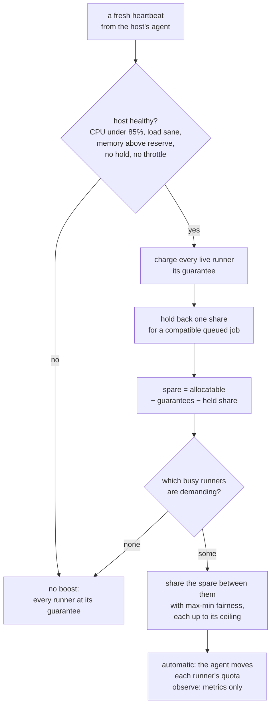

# Elastic CPU zoomies

A runner is given one slot's share of its host, as a real CPU quota, and most
of the time that is the right size. But a host with eight cores and two busy
runners is idling on more than half of itself, while each of those runners
compiles inside a quota of under two cores. **Elastic CPU zoomies** lends that
spare CPU to the runners that are actually using theirs, takes it back the
moment anything else needs it, and never touches memory. A job that would have
taken four minutes at its guarantee finishes in two, and the fleet's accounting
does not change by a single slot.

It is a pool setting, on by default in its measuring form for every new pool,
and the runner page and the Overview feed say when it is happening in the
product's own words: **Squirrel spotted — maximum zoomies**.

## What it promises

The design starts from what it must never do, because a scheduler that lends
CPU carelessly is a scheduler that starves a job it never noticed.

* **Every runner keeps its guarantee.** A runner's share of the host is what it
  was created with, and elasticity only ever adds to it. A quiet runner beside
  a busy one loses nothing: its guarantee is charged in full before a single
  hundredth of a core is lent to anyone.
* **The next job keeps its room.** When a job is queued that this host could
  run, one runner's worth of CPU is held back before any is lent, so a burst of
  fast jobs cannot crowd the next one off the machine.
* **The host's own reserve is untouched.** The agent, the container daemon and
  the operator's `reserve_cpus` come first, as they do for placement. Only what
  is left after all three — the guarantees, the imminent start and the reserve
  — is spare.
* **Host pressure always wins.** A host climbing the [throttle
  ladder](hosts-and-pools.md#current-usage-and-automatic-holds) is a host that
  has been overwhelmed, and a throttle reduces every limited runner on it
  whether or not its pool is elastic. A boost is never applied to a throttled
  host, and a throttle can take a runner below its guarantee. **Leash tightened
  — host under pressure** is the runner page's word for it.
* **Memory never moves while a job runs.** Lowering a live memory limit can
  kill the job it was meant to help, and raising one changes nothing the job
  can feel until it is too late. Elasticity is CPU only, by design.

## How a decision is made

Every heartbeat from an agent carries a fresh sample for each of its runners:
CPU used, and the cgroup's throttling counters, which count the periods in
which a runner wanted more CPU than its quota allowed. From one coherent
heartbeat the controller makes one host-wide plan.



A runner is **demanding** when its latest sample shows it using at least 80% of
its guarantee, or when its throttling counters rose since the last sample —
which is the cgroup saying, in its own terms, that the job wanted more than it
was allowed. Once a runner has been lent CPU and is using it, it keeps the
boost while it stays above 60% of its guarantee: separate thresholds for
entering and leaving stop a job that hovers around the line from having its
quota moved on every heartbeat.

The spare is shared by **max-min fairness**, filled like water rather than
divided once. Two demanding runners split it evenly; if one of them has a
ceiling it reaches first, what it cannot use goes to the other instead of being
stranded. Each target is floored to the hundredth of a core the daemon works in,
so rounding can never promise more than the machine has, however many runners
share it.

The plan is complete on every heartbeat — every runner is named with a target,
including the ones going back to their guarantee — so an agent that misses a
heartbeat restores everything it was lent, and a runner whose demand ended is
never left holding a boost.

### Worked example

An 8-CPU host at capacity 4 keeps half a core for its daemon and the agent,
which leaves 7.5 allocatable, and gives each runner a guarantee of 1.87 CPUs.

| Situation | Each busy runner is given | Factor | The runner page says |
| --- | --- | --- | --- |
| Two busy runners, nothing queued | 3.75 CPUs | 2.0× | Squirrel spotted — maximum zoomies |
| Two busy runners, one compatible job queued | 2.81 CPUs | 1.5× | Rabbit spotted — extra zoomies |
| Two busy runners, ceiling of 3 CPUs on the pool | 3 CPUs | 1.6× | Rabbit spotted — extra zoomies |
| Two busy and two idle runners, nothing queued | 1.87 CPUs | 1.0× | Steady paws — guaranteed pace |
| Host at 90% CPU | 1.87 CPUs | 1.0× | Steady paws — guaranteed pace |
| Host throttled one rung | 1.40 CPUs | 0.75× | Leash tightened — host under pressure |

The fourth row is the one that surprises people: the two idle runners are
charged their guarantees even though they are using nothing, because their
guarantee is a promise the fleet has already made. Elasticity lends only what
nobody has been promised. If that is the shape of your fleet — pools with
`min_runners` above zero holding warm capacity — the boost is smaller, and that
is the design working rather than failing.

## The three modes

| `cpu_burst.mode` | What it does | Who gets it |
| --- | --- | --- |
| `off` | Nothing. Runners stay at their creation quota, and the runner page shows CPU state only when the host is throttling. | Every pool that existed before elasticity did, so an upgrade changes no running quota. |
| `observe` | Makes every decision above and publishes it to Prometheus, but moves no quota. The runner page says **Nose to the wind — watching spare CPU**. | Every automatically-sized Docker or Podman pool created in the wizard, the CLI or the API without saying otherwise. The one the installer creates during setup starts `off`. |
| `automatic` | Applies the target: the agent moves the runner's CPU quota live, and the runner page and the feed say so. | A pool you have switched on, after watching `observe`. |

`observe` exists so that switching a fleet on is a decision made with evidence
rather than hope. Leave a new pool on it for a few days, then read the two
metrics it publishes:

| Metric | What to look for |
| --- | --- |
| `zoomies_elastic_cpu_decisions_total{pool, mode, outcome}` | How often the plan found room. `burst` against `base` says whether the host actually has spare CPU while jobs are demanding it; `unsupported_agent` says an agent needs upgrading before `automatic` will do anything on its host. |
| `zoomies_elastic_cpu_target_factor{pool, mode}` | A histogram of the target divided by the guarantee. A p50 around 1.0 means the host is usually full; a p50 at 2.0 means half of it is routinely idle while a job waits on its quota. |

A pool whose factor histogram never leaves 1.0 gains nothing from `automatic`
and loses nothing from staying on `observe`. A pool whose factor is often above
1.5 is the one to switch.

### The ceiling

`max_cpus` is the most one logical runner may be lent up to, in cores. Zero —
the default — is the host's allocatable CPU, which is the right answer for a
job that can use everything it is given. Set a ceiling for a pool whose jobs do
not scale — a test suite that runs single-threaded gains nothing past two
cores, and a ceiling leaves the rest for a runner that can use it — or when you
want the machine shared more evenly than fairness alone would.

A ceiling cannot take a runner below its guarantee. A pool edited to a ceiling
under a running runner's share keeps that runner at its guarantee, and the
runner page shows the guarantee as the ceiling rather than the smaller figure.

## Turning it on

=== "The pool wizard"

    Elasticity is on the **Size** step of the pool wizard, which the advanced
    path walks — every step of the simple path offers it, one click along —
    under **One share of each host**. It is a property of a pool sized by its
    host, and the fixed size radio hides it, because a fixed size *is* the
    guarantee and has no share to grow into.

    **Elastic CPU** offers the three modes: *Off*, *Observe only* and
    *Automatic boost*. **Boost ceiling** is `max_cpus`; leave it empty for the
    host ceiling. Choosing *Automatic boost* adds a line under the fields
    saying what you will see — busy runners sprint, quiet runners keep their
    guarantee, memory stays fixed — so the decision is made with its
    consequences in view.

    An existing pool is changed on its page: **Edit** opens the same wizard on
    the same step. The change is **live**: the controller reads the pool's
    policy on every heartbeat, so switching to *Automatic boost* can lend CPU
    to a job that is already running, lowering the ceiling can take a boost
    back, and switching to *Off* restores every runner of the pool to its
    guarantee at the next heartbeat. Nothing is ever taken below the
    guarantee, and memory is never touched, so a running job is slowed at
    most back to the quota it started with.

=== "The command line"

    `pools create` and `pools edit` take the policy as two flags:

    ```sh
    zoomies pools edit pool_k3f9qz2m --cpu-burst automatic
    zoomies pools edit pool_k3f9qz2m --cpu-burst-max 4
    zoomies pools create --name zoomies-linux-x64 --labels zoomies-linux-x64 \
      --installation ins_k3f9qz2m --cpu-burst observe --dry-run
    ```

    The two go to the API as one object, so an edit that types only the
    ceiling carries the mode forward from the pool as it stands rather than
    resetting it. `pools get` shows the policy beside the pool's sizing, and
    `--dry-run` on a create gives the wizard's own verdict — including the
    refusal below — without creating anything.

=== "The API"

    `cpu_burst` is a field of the pool object, on `POST /api/v1/pools` and
    `PATCH /api/v1/pools/{id}`:

    ```sh
    curl -X PATCH https://zoomies.example.com/api/v1/pools/pool_k3f9qz2m \
      -H "Authorization: Bearer $ZOOMIES_TOKEN" \
      -H "Content-Type: application/json" \
      -d '{"cpu_burst": {"mode": "automatic", "max_cpus": 0}}'
    ```

    The pool's `sizing` reads `elastic` when the policy is observing or
    enforcing, `automatic` when it is off and the host decides, and `fixed`
    when the pool typed a size. `GET /api/v1/runners/{id}` carries the live
    state as `cpu_resource`: `state`, a `label`, a `reason`, and the
    guaranteed, current and ceiling CPU. Clients branch on `state` — the label
    is for people.

Whichever way it is set, the server checks the same three things and refuses
the pool rather than accepting a policy that would bind nothing:

* **The pool must be sized by its host.** The host share is the guarantee,
  and a pool that typed a fixed `cpus` has no share to grow from. Clear the
  fixed size, or leave elasticity off.
* **The backend must be Docker or Podman.** Only they can measure a live cgroup
  and move its quota; the `process` backend applies no limit at all, so there
  is nothing to lend and nothing to protect.
* **A ceiling below a quarter of a core** cannot run the runner itself.

`automatic` also needs an agent that advertises live elastic CPU, which every
agent since the feature shipped does. An older agent is not refused: its
runners stay at their guarantee, the decision is still published, and the
`unsupported_agent` outcome in the metrics says which host to upgrade. Nothing
breaks on a mixed fleet; it just does not speed up until the agent does.

## What you see

**On the runner's page**, the CPU state sits beside the allocation: the
guaranteed, current and ceiling figures together, under one of five labels. The
labels are playful because the fleet is, but each is backed by a stable state
that the API carries and a client can branch on:

| Label | `state` | What is true |
| --- | --- | --- |
| Squirrel spotted — maximum zoomies | `maximum_zoomies` | Lent at least 1.75× its guarantee. |
| Rabbit spotted — extra zoomies | `zoomies` | Lent something, under 1.75×. |
| Steady paws — guaranteed pace | `guaranteed` | At its guarantee, in a pool that is observing or enforcing. |
| Nose to the wind — watching spare CPU | `observing` | An `observe` pool; the decision was made and no quota moved. |
| Leash tightened — host under pressure | `throttled` | The host's throttle has taken it below its guarantee. Shown for any limited runner, elastic pool or not. |

**On the Overview feed**, a runner lent spare CPU or slowed by its host is an
entry alongside the scheduler's decisions and the jobs that finished, under the
same label. The feed's switches on **Settings → Events** decide whether that
kind is shown.

**In Prometheus**, the two series above, labelled by pool and mode. There is no
per-runner label, on purpose: a fleet makes and destroys thousands of runners,
and a series per runner is a cardinality problem that outlives every runner in
it.

## Docker-in-Docker and the process backend

A `dind` pool's runner and its sidecar are **one logical runner** throughout.
The demand sample covers both, because the build's work happens in the daemon;
the ceiling covers both; and a quota change reaches both, so the daemon that is
doing the compiling is the one that gets the cores.

The `process` backend stays static. It starts a runner as a plain process with
no cgroup, which is why a pool on it cannot be elastic and why the wizard does
not offer it there.

## Where it sits among the other sizing rules

Elasticity is the last of four things that decide what CPU a runner has, and
the only one that moves while a job runs:

1. The **host's reserve** — the daemon's floor and the operator's `reserve_cpus`
   — is held back first. [What a runner
   reserves](hosts-and-pools.md#what-a-runner-reserves).
2. The **guarantee** is one slot's share of what is left, or the pool's fixed
   `cpus`. [Default allocations](hosts-and-pools.md#default-allocations).
3. The **throttle** reduces every limited runner when the host is overwhelmed,
   and outranks everything below it. [Current usage and automatic
   holds](hosts-and-pools.md#current-usage-and-automatic-holds).
4. **Elastic CPU** lends what is left after all three to the runners using
   theirs.

None of them changes how many runners a host holds. Capacity is a slot count
and elasticity spends CPU inside it, so a pool's `max_runners` and a host's
capacity mean exactly what they did before.
