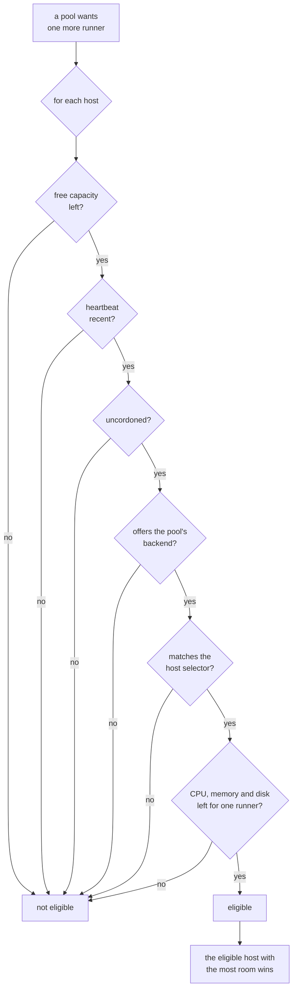

# Hosts and pools

**Adding a home-lab or private host?** Choose **Private connection · Tailcat**
in Add a host for built-in encrypted connectivity without public host IPs or
port forwarding. [Private host setup and how it works](private-hosts.md).

The [quick start](quickstart.md) leaves you with one host and one pool, which is
a whole working fleet. This page is the next step: a second machine, a second
pool, and the rules that decide which runner lands where.

Two things make up a fleet, and they are deliberately separate:

* A **host** is a machine an agent runs on. It contributes capacity, the
  backends it can actually service, and labels describing what it is.
* A **pool** is a named group of interchangeable runners: which labels a
  workflow must ask for, what image and backend to build them from, and how many
  may exist.

Neither owns the other. A pool can be placed on any host that suits it, and a
host can carry runners from every pool at once. That is what lets you add a
machine without touching a pool, and add a pool without touching a machine.

## Adding a host

{ .zoomies-shot }
{ .zoomies-shot }

**Hosts → Add a host** in the UI does the whole thing on one page: it mints a
join token and prints the command to paste on the new machine, already filled in
with the address your browser reached the controller on and the labels your
pools select hosts by. From a terminal, the same token comes from the CLI:

```sh
zoomies hosts join-token create --ttl 1h --capacity 8 --labels arch=arm64
```

It prints the command to run on the new host, the token, and when it expires.
The token is shown once — only its hash is stored — and it may be redeemed once.

On the new machine, either install and join in one line:

```sh
curl -fsSL https://zoomies.sh/install.sh | sh -s -- \
  --mode agent \
  --controller https://zoomies.example.com \
  --join-token zoojoin_...
```

or, if the binary is already there, join with the shorter form:

```sh
zoomies agent join https://zoomies.example.com --token zoojoin_... \
  --capacity 8 --labels gpu=true,zone=eu-west
```

`join` redeems the token, writes the credentials, and installs the service that
keeps the host enrolled; `--no-service` joins without one. A private controller
takes `--ca-file` — prefer it over `--insecure`, which trusts anything on the
path.

The agent connects outbound only, both to long-poll for tasks and to post
results back, so a host behind NAT or a strict firewall needs no inbound rule.
See [Architecture](architecture.md#why-the-agent-connects-outbound) for why the
connection runs that way round.

### An agent in a container

A host that would rather not have a binary installed on it can run
`ghcr.io/eyupio/zoomies-agent` instead. It is the same build as the controller
image, with the agent as its command rather than the controller, and it needs
the container runtime's socket bind-mounted so the runners it starts are
siblings on the host rather than containers inside it.

`zoomies init` does not set this up for you: a runner host it installs is a
native one, whatever `--deployment` says, because the join it performs writes
this host's credentials to the state directory and the binary reads them from
there at every start. A container joins itself instead, on its first start, so
the file is yours to write:

```yaml
services:
  zoomies-agent:
    image: ghcr.io/eyupio/zoomies-agent:v1.2.3
    restart: unless-stopped
    environment:
      ZOOMIES_CONTROLLER_URL: https://zoomies.example.com
      # Single-use, and spent on the first start: it is exchanged for a lasting
      # credential written into the volume below, which every later start reads
      # instead. Mint one under Hosts -> Add a host.
      ZOOMIES_JOIN_TOKEN: zoojoin_...
      # Say who this host is. The name is otherwise derived from the machine and
      # the container's hostname, and that hostname is identical on every
      # machine running this file -- so two hosts of the same shape would
      # compute one name, and the second one's join would be refused.
      ZOOMIES_AGENT_NAME: ollama1
      ZOOMIES_STATE_DIR: /var/lib/zoomies
      ZOOMIES_WORK_DIR: /var/lib/zoomies/work
      ZOOMIES_DOCKER_HOST: unix:///var/run/docker.sock
    # The image runs as an unprivileged account that is not on this host, so it
    # is given the group that owns the socket rather than joined to one. Use
    # your own: `stat -c %g /var/run/docker.sock`.
    group_add:
      - "998"
    volumes:
      - zoomies-agent-data:/var/lib/zoomies
      # Zoomies' own access to the runtime, which is what lets the runners it
      # starts be siblings of this container rather than containers inside it.
      # It is not handed to the jobs themselves.
      - /var/run/docker.sock:/var/run/docker.sock

volumes:
  zoomies-agent-data:
```

The volume is the part worth keeping. It holds the credential the join token was
exchanged for, and losing it means minting another token and joining again.

Give it the **same tag as the controller** where you can: a fleet on `v1.2.3`
wants `ghcr.io/eyupio/zoomies-agent:v1.2.3`, one tracking `main` wants `:dev` on
both. [Which image tag to run](upgrading.md#which-image-tag-to-run) has the full
table.

That is a preference rather than a requirement, and
[Version skew](upgrading.md#version-skew) is where the rules live: an agent may
lag its controller by releases while the protocol version matches, which is the
normal state during a rolling upgrade. The direction to avoid is a **newer agent
against an older controller** — upgrade the controller first.

What an older agent costs is description rather than placement. A host on a
build from before agents measured themselves reports no CPUs, memory or disk at
all, so a pool's resource limits have nothing to fit against and the Hosts page
shows it as a different build. Only a **protocol** mismatch stops work reaching
a host, and then it is excluded from placement exactly as a cordon excludes it
and says `incompatible` on its card.

### What a host brings with it

| What | Where it comes from | Why it matters |
| --- | --- | --- |
| Capacity | `agent.capacity`, `--capacity`, or half the CPU count | A hard ceiling the scheduler respects, per host — and, with default limits on, what one slot's share of the machine is divided by. |
| Backends | Probed by the agent at startup, and again as sockets appear | A pool is only placed on a host that offers its backend. |
| Labels | `agent.labels` or `--labels` | What a pool's `host_selector` matches against. |
| OS, arch, version | The agent | Shown in **Hosts**. A pool's `host_selector` can match `os` and `arch` directly, so keeping work on arm64 needs no labelling at all. |
| Health | A heartbeat every `agent.heartbeat_interval` | A host silent for 90 seconds — three times the default interval — is unhealthy, and takes no new runners until it checks in again. After five minutes of silence it is presumed gone: the runners still recorded on it are failed so the pool can replace them, and a job one of them was running is marked as lost by the fleet. |

A host that offers no backend is connected, healthy and useless: nothing will
ever be scheduled on it. `zoomies hosts list` says so rather than printing a
dash, and repeats the agent's own explanation for each backend it could not
use — usually a Docker socket that is not readable by the account the agent runs
as. [Configuration](configuration.md#agentdocker_host) covers that diagnosis.

The controller itself counts as a host. On a single-VM install the controller
runs an agent inside its own process, which is why the fleet works before you
have added anything.

## Living with more than one host

```sh
zoomies hosts list                  # health, free capacity, backends, platform
zoomies hosts cordon host_k3f9qz2m  # keep its runners, accept no new ones
zoomies hosts uncordon host_k3f9qz2m
zoomies hosts delete host_k3f9qz2m  # refused while runners are still on it
```

**Cordon before maintenance.** A cordoned host keeps everything it is already
running — no job is ever interrupted by a cordon — and accepts nothing new. Once
its runners have finished, reboot the machine, upgrade Docker, do whatever you
came to do, then uncordon it. The scheduler says `cordoned` in its reasons while
that is true, so the pause is visible rather than mysterious.

**Delete only a host that is gone for good.** `delete` is refused while live
runners remain; `--force` deletes anyway and leaves their GitHub registrations
orphaned, which is the right trade only when the machine itself has gone away.

Capacity and labels are edited in the UI under **Hosts**, or with a `PATCH` to
`/api/v1/hosts/{id}` — see [the API surface](api-surface.md#hosts-and-agents).
Relabelling a host changes which pools can select it on the very next scheduler
pass; the runners already on it stay where they are.

## Adding a pool

{ .zoomies-shot }
{ .zoomies-shot }

One pool is enough until the fleet has to answer two different questions. Add a
second when a job needs something the first cannot give it:

* **A different machine.** GPU boxes, arm64 builders, a host in another region.
  Architecture and operating system need nothing set up — `arch=arm64` or
  `os=linux` matches what the agent already reports. Anything else is a label
  on the hosts and the same key in the pool's `host_selector`.
* **A different runtime.** A pool whose jobs build images needs a
  `docker_mode`, which most pools should not have; asking for one switches the
  stock runner image to its Docker variant.
* **A different ceiling.** A noisy repository is easier to bound with its own
  pool and its own `max_runners` than with a shared one.
* **A different priority.** When the fleet is full, higher-priority pools
  receive create slots first.

### Two ways to make one

The wizard asks first how much of the pool you want to decide, because the two
answers lead to genuinely different amounts of work.

**Automatic** is the pool most fleets want. Name it, label it, say whether its
jobs build container images, and every other setting follows this fleet: each
runner is given one slot's share of whichever host it lands on, any host that
can run it may, the backend is Docker on the published image for the host's
platform, and every timing follows the fleet's own — and keeps following it when
you change one. Four questions, and nothing to revisit when the fleet grows.

The Docker question is there because it is the one thing a fleet cannot work out
for itself: nothing in a name, a label or a host says whether the jobs that will
land here run `docker build`. Answering yes sets `docker_mode: dind`, which
gives each runner a private daemon in a privileged container beside it — the
step says so — and the runner image follows automatically, so there is nothing
to pin. Answering no is the default and costs nothing. The host Docker socket,
which hands a job root on the host, stays on the advanced path where it is
confirmed deliberately.

**Advanced** is the same pool with the opinions put back: a fixed size on every
host, a host selector, a backend and platform chosen by hand, and the runner
timings this pool disagrees with the fleet about. Every step opens on the answer
the automatic path would have used, so you only change what you mean to.

Neither is a lesser pool, and the choice is not permanent — a pool can be edited
either way afterwards, and switching never loses what you have already typed.
Editing a pool that has anything the simple path cannot show opens on the
advanced one, so a tuned pool never hides the settings it was tuned with.

The CLI takes the same fields, and omitting them is how you ask for the
automatic answer:

```sh
zoomies pools create \
  --name zoomies-gpu \
  --labels zoomies-gpu \
  --installation ins_k3f9qz2m \
  --host-selector gpu=true \
  --max 4 \
  --dry-run
```

`--dry-run` validates exactly as the wizard's review step does — field errors and
the dangerous-setting warnings the pool would produce — without creating
anything. Drop the flag to create it for real. Every field is in
[Pool settings](configuration.md#pool-settings); the labels to choose are in
[The labels to give a pool](configuration.md#the-labels-to-give-a-pool).

A pool whose image is large is worth prewarming after you create it or point it
at a new image, so the first job of the day does not pay for the pull:

```sh
zoomies pools prewarm pool_k3f9qz2m
```

That pulls the pool's image on every host the pool could be placed on, and
reports what each one did.

**Disable rather than delete** a pool you may want back: a disabled pool drains
to zero and creates nothing, while its settings and history survive. Deleting
drains its runners first unless you pass `--force`.

### How big a runner is, and how many there are

A pool sizes its runners in one of two ways, and there is no third: **“no limit
at all” is not reachable**, because a runner with no cgroup limit takes every
core on the machine it lands on while the fleet charges it one slot's share —
the host reads as half committed, its daemon stops answering, and the creates
queued behind it time out on a machine every page calls busy.

**One share of each host** is what a pool with no `cpus` and no `memory_mb`
means, and it is what a new pool does. The scheduler charges each runner one
slot's share of the machine it is placed on — the machine less its reserve,
divided by the host's capacity — and gives it exactly that share as a real
cgroup limit. The books and the cgroups therefore say the same thing, and they
say it per host: the same pool is 3.8 cores on a 16-core box with four slots
and 7.6 on a 32-core one, so an unequal fleet is sized correctly everywhere
without anybody typing a number. Resize a host, or change its capacity, and the
share moves with it.

That share is handed out by `scheduler.default_runner_limits`, which is on by
default. With it off, a pool that names no size is charged the share and given
nothing, which is the one shape where “automatic” and “unlimited” are the same
thing — so the controller says so (`pool.size_unlimited`).

**A fixed size** is the two figures on the pool, applied on every host. It is
for a pool whose jobs need a particular amount of machine wherever they run,
and it is the right answer less often than it looks: a figure chosen for the
first host fits four runners on the 64-core one that joins later, and the
controller names that when it happens (`pool.size_strands_hosts`). The wizard's
sliders open on `runners.default_cpus` and `runners.default_memory_mb` — two
cores and four gigabytes out of the box — so a fleet of small boxes or of
compilers says so once rather than on every pool.

Disk and the process limit are independent of the choice. Neither has a share
to be given — free disk is a measurement rather than a budget — so a pool may
cap its cache's disk and still leave its size to the host.

On the advanced path the size is a step of its own, between the hosts and the
count, because that is the order the decision is made in: these are the
machines, this is what one runner costs on them, and therefore this is how many
there can be. Beneath the choice the controller counts what the hosts this pool
reaches can actually hold, host by host:

* A host that promises more slots than its machine can back at this size is
  named, and its capacity can be set to what fits in one click
  (`pool.host_overcommitted`). The slots above what fits are counted as free
  capacity everywhere they appear, and every create for one of them is refused
  for want of cores or memory.
* A maximum above what the fleet can place is named too
  (`pool.max_above_room`), with the room offered as the maximum. It is not
  wrong — the maximum is a backstop rather than a target — but the runners
  above the room are runners the scheduler will never create, and the jobs that
  ask for them wait with nothing else saying why.
* While a new pool's maximum has not been typed over, it follows that room, so
  choosing bigger runners or fewer hosts lowers the cap in front of you. The
  cap is still stored as a figure: one that silently grew with the fleet would
  be a cap nobody chose, and its whole job is to stop one misconfigured
  workflow filling every machine you have — and every machine the provider loop
  would rent behind them.

The cache size limit is a slider on the same step and is checked the same way,
against the free disk on the smallest host the pool reaches
(`pool.cache_above_disk`). The limit is kept by evicting whole entries between
one runner and the next, so a limit above the free space is not a limit at all:
the disk fills first, and a host at or below its disk reserve takes no runner
of any pool.

### Runner settings a pool can override

Every timing that shapes a runner's life is a fleet-wide setting, and a pool
follows the fleet on all of them until it says otherwise. A pool that overrides
one keeps following the fleet on the rest — and a setting left alone keeps
following it after you change the fleet's own figure, which a value copied onto
the pool at creation would not.

| Setting | Overrides | Zero means |
| --- | --- | --- |
| `provision_timeout` | `scheduler.provision_timeout` | Never give up on a runner that is still starting |
| `drain_timeout` | `scheduler.drain_timeout` | Leave a drain unbounded |
| `max_runner_lifetime` | `scheduler.max_runner_lifetime` | Let a runner live until something else removes it |
| `scale_up_delay` | `scheduler.scale_up_delay` | Scale the moment a job is queued |
| `docker_wait` | `runners.docker_wait` | Leave the runner image's own wait in place |

Zero is an answer in each of them rather than an absence, which is why the API
distinguishes an absent field from an explicit `null`: absent leaves what the
pool had, `null` hands the setting back to the fleet, and a duration sets it.

The pool that needs these is usually the one whose images are large. A pool
pulling twelve gigabytes of Windows and a pool booting Alpine do not agree about
how long registering should take, and a fleet that has to pick one picks the
slower — which leaves the fast pool holding a dead runner's slot for ten
minutes.

```sh
zoomies pools edit zoomies-windows --provision-timeout 45m --docker-wait 5m
```

Clearing an override is the empty string, which is how the CLI says `null`:

```sh
zoomies pools edit zoomies-windows --provision-timeout ''
```

`max_creates_per_tick` is deliberately not overridable. It is a fleet-wide
budget shared between pools, so a pool that could raise its own share of it
would be taking the protection from the others.

One relationship is worth knowing before you set a provision timeout. A runner's
start is bounded three times over, and the provision timeout is the only one
that gives up: the agent allows itself fifteen minutes for the create, and a
pool that provides Docker then waits for that daemon before it registers. A
provision timeout inside those two fails runners that are still coming up, and
the replacement pulls the same image over the link that was slow to begin with.
The fleet's own defaults are held in the right order by a test and by
[the validator](configuration.md); a pool that overrides either half is held by
`pool.provision_timeout_short`, which the wizard also says while the number is
being chosen.

### Sizing a machine from the other side

The same figures size a machine from the other side. The recommended capacity
on a host's **Adjust** dialog is the machine, less its reserve, divided by what
a runner in this fleet asks for — the largest ask across the enabled pools, or
the fleet's default where no pool has said — so the two screens describe one
fleet rather than two.

### A pool belongs to one installation

`--installation` is not bookkeeping. A pool's runners are registered into that
installation's GitHub target with that installation's credentials, so the
target decides which jobs can ever reach them — and Zoomies will not put a job
from one installation on a pool belonging to another, whatever the labels say.
Two installations whose pools advertise the same labels are two separate
fleets that happen to use the same words.

A job Zoomies cannot place for this reason says so rather than sitting there:
the Jobs page and the problems drawer name the pool whose labels matched and
the installation it belongs to, and a repository no installation here covers is
reported as that rather than as a labelling mistake. Neither has a fix in the
workflow file; both are fixed by installing the App on the right target or by
adding a pool there.

Within one organisation installation, that is as far as the boundary goes.
**GitHub decides which of its runners gets a queued job**, and it offers a job
to any runner in scope whose labels match — so a runner this fleet created for
one repository's job may be handed another repository's job from the same
organisation instead. Zoomies has no say in it. Where two repositories must not
share runners, give each one a repository-target installation, or separate them
by labels and accept that the separation is a convention kept in workflow files
rather than something the platform enforces. The same caveat governs a
repository-scoped cache: see
[Adding a pool](#adding-a-pool) and the pool's own warnings.

A **runner group** narrows this further, and only on an organisation. During a
successful organisation connection probe, Zoomies creates an organisation-wide
`zoomies` group, enables it for public repositories, and moves pools that still
use GitHub's implicit Default group into it. Idle runners registered in Default
are recycled so their replacements join the managed group; busy runners finish
first. New organisation pools use `zoomies` unless an operator explicitly
chooses another group or Default.

Explicit group choices remain administrator policy and Zoomies never rewrites
them. If an incompatible group named `zoomies` already exists, connection
verification stops with an actionable error instead of silently widening it.
If any explicitly selected group cannot be resolved, runners fall back to
Default and the pool carries a `pool.runner_group_unresolved` warning.
Repositories have no runner groups, so repository-target pools continue to use
their repository's Default scope.

## How a runner is placed

Every scheduler pass takes a snapshot — pools, runners, queued jobs, hosts — and
decides where new runners go. A host is eligible for a pool when all six of
these hold:



Among eligible hosts Zoomies prefers the most CPU and memory headroom after
placing the requested runner. It averages the remaining fractions, so a larger
machine can carry more work while a smaller, quiet machine can still beat a
busy one. Reservations made earlier in the same pass count immediately, across
every pool sharing the host. Equal scores prefer more free slots, then host ID,
so the same snapshot always produces the same plan.

### Current usage and automatic holds

Linux agents sample whole-host CPU occupancy, `MemAvailable` and the one-minute
load average on their normal heartbeats, including work outside Zoomies. CPU
uses counter differences, so the first sample reports memory and load only; I/O
wait counts as occupied. Available memory includes reclaimable cache. The load
average is there because CPU occupancy pins at 100% and then stops saying
anything: load keeps counting what is queued behind the cores, so it is what
says a host has been pushed *past* them rather than merely to them. Sampling
reads procfs and makes no extra Docker requests.

The Hosts page shows actual usage separately from **Committed** resources.
Committed CPU is a reservation, not a measurement of CPU saturation. A fresh
reading tightens memory admission and influences host ranking; it never raises
the configured capacity or overrides the pool's limits and host reserves.
Measured memory already contains running workloads, so their reservations are
not subtracted from that measurement again. Runners still provisioning or
registering, starts newer than the measurement, and all placements in the
current pass are charged before another placement is allowed. The independent
reservation budget remains enforced as well.

| Observation | New runner placement |
| --- | --- |
| CPU below 85% | Balance across eligible hosts using CPU and memory headroom. |
| CPU at least 85% | Start at most one runner at a time on that host. Other compatible hosts remain available. |
| CPU at least 95% for 30 seconds across fresh samples | Hold new starts until CPU falls below 85%. |
| Available memory at or below the host reserve | Hold new starts until memory becomes available. A pool whose next runner would not fit waits too. |
| Usage missing, older than 90 seconds, or inconsistent with the reported host size | Use configured capacity and reservations; show usage as unavailable. |
| **Overwhelmed** on a fresh sample: CPU at or above 95% for 30 seconds while a runner with no CPU limit is on the host, the one-minute load average at least twice the host's CPUs, or available memory at or below the reserve | **Throttle, step 1 of 3.** The host is stepped down to three quarters of its slots, and every runner on it that has a CPU limit is left 75% of it. The host card says so, `host.throttled` is raised, and the step is audited as `host.throttle`. |
| Still overwhelmed two minutes after the last step | **Step 2:** half the slots, and running jobs at half their CPU allocation. |
| Still overwhelmed two minutes after that | **Step 3:** a quarter of the slots. Running jobs stay at half — the top rung takes slots and nothing else. |
| **Calm** — CPU below 85%, load average under one per CPU, memory above the reserve — for five minutes without a break | **One step back down**, audited as `host.throttle_lift`. The streak starts again, and the throttle is gone once the last step is taken. |
| Neither — 90% CPU, say | The rung is kept and the calm streak is broken. Not overwhelmed, and not a host to give slots back to either. |
| Usage stale for ten minutes while throttled | The throttle is lifted anyway. A host nobody can measure is placed by its configured capacity, exactly as the holds fall back. |

The holds affect new runners only. Existing runners stay in place and running
jobs finish normally; an idle runner already registered with GitHub may still
receive a job. A host shared by several pools has one admission budget. An
operator's cordon and capacity remain authoritative during recovery.

The throttle is what outlasts a sample. A hold releases the moment a reading
says the pressure is gone, so a host that is overwhelmed on and off for an hour
spends that hour bouncing in and out of the holds, taking a fresh runner each
time it is let back in. The throttle is a ladder instead: each rung takes a
quarter of the host's slots, it climbs while the pressure keeps coming back,
and it comes down one rung at a time after a stretch of calm long enough to
mean something. The slots it takes come off the host's **effective capacity**
— the configured capacity stepped down by the rung — and that is the figure
`free` is measured against, on the Hosts page, in `zoomies hosts list` and in
the scheduler alike, while the throttle stands. The configured capacity is the
operator's, and the throttle never writes it.

It touches running jobs in exactly one way. On the next heartbeat the agent
lowers the CPU quota of every runner on the host that has one — the runner and,
for a `dind` pool, its sidecar — to the rung's share of what it was created
with, and **never below half**. Half speed doubles a job's time, which the
`timeout-minutes` most workflows set survives; a quarter turns "slow" into
"timed out", and a throttle that made jobs fail would be doing the thing it
exists to prevent. That is why the third rung takes slots and nothing else. A
runner with no CPU limit has nothing to lower and is left alone, and a memory
limit is never lowered on a live container, because that can kill it: memory
pressure is relieved by the smaller effective capacity only. The `throttle_reason`
on the host says all of this in one sentence — what was taken, which
measurement did it, what the running jobs are getting, and how it ends.

Not every host can be throttled, because not every host is measured.
Throttling needs a Linux agent on the machine it measures — the same hosts the
sampling above covers — so a remote Docker endpoint, which is never sampled, is
never throttled. Lowering a quota needs a Docker or Podman daemon beside that
agent: a host that offers only the `process` backend has no container to
update, so its throttle is slots only, and its reason says so.

**How a throttle ends.** Five minutes of calm — every fresh sample under 85%
CPU, under one runnable task per core and above the memory reserve — lifts one
rung, and the streak starts again for the next; a sample that is neither calm
nor overwhelmed breaks the streak without moving the rung. Recovery is longer
than a step up on purpose: a host that recovered in a minute and was pushed
straight back over would otherwise oscillate with the ladder rather than settle
on it. If the samples stop — an agent downgraded to a build that does not send
them, or a host that went away — the rung is kept for ten minutes and then
lifted, so a host that comes back is not still throttled for pressure nobody
can see. An operator can end one sooner, three ways: a `PATCH /hosts/{id}` that
changes the capacity or a reserve clears it, since it was decided against
figures that have just changed; a re-join clears it, since the row is made
afresh; and **Lift the throttle** on the host card
(`POST /api/v1/hosts/{id}/throttle/clear`, operator role, audited as
`host.throttle_clear`) clears it by hand once the cause is fixed. Nothing pins
one: a clear that was premature is answered by the next heartbeat putting the
host back on the first rung. A cordon keeps the throttle, and switching
`scheduler.host_throttling` off lifts every standing one.

At small capacities the ladder has less to take. The effective capacity never
falls below one — a host taken to nothing would look exactly like a cordon, and
an operator reading "0 slots" would go looking for who cordoned it — so a host
of capacity 4 steps through 3, 2 and 1; one of capacity 2 drops to 1 on the
first rung and stays there; and one of capacity 1 keeps its slot on every rung,
where the throttle is the CPU quota and nothing else.

Whole-host sampling currently covers local Linux hosts whose procfs CPU and
memory totals match the reported machine. Remote Docker endpoints, other
operating systems and differing cgroup views retain reservation-based
placement. Samples are best-effort observations, not predictions of a job's
peak memory demand. Continue setting appropriate pool limits and host reserves.
The [host usage metrics](metrics.md) expose fresh measurements and admission
holds for monitoring; diagnostic bundles include the same host view.

Two ceilings apply at once, and both are hard: a pool never exceeds its
`max_runners`, and a host never exceeds its capacity. A pool's `max_runners`
is therefore only as real as the capacity available on the hosts it can select;
setting it to 20 across two hosts of capacity 4 buys nothing.

### What a runner reserves

A slot is a count, and a count does not know that eight runners of a pool that
asks for 4 GB each do not fit on a 16 GB machine. So each runner is also
charged against what its host reported, and a host that cannot cover the charge
takes no more work however many slots it has left.

What one runner is charged is the pool's own `resources`. A field the pool
leaves unset is charged one slot's worth of the host instead — a host with
30 GB allocatable and a capacity of 6 charges 5 GB. That is not a fallback for
old rows: it is what [one share of each host](#how-big-a-runner-is-and-how-many-there-are)
means, it is the shape a new pool has, and the same share is handed to the
runner as a real cgroup limit, so the books and the cgroups agree.

A pool with `docker_mode: dind` runs two containers per runner, and what it is
charged follows what the two are given. A size **you typed** says what the job
may have, and the build runs in the daemon, so the daemon is given the same and
the host is charged twice: two of what the pool asked for. A size that came
from **the host's slot** is one slot, and the pair splits it between them — so
the host is charged one, and eight slots are eight runners whether or not their
jobs build images.

Both halves of that have to stay true together, and each has been wrong once.
Charging a defaulted pair one share while giving each container a whole one is
the arithmetic behind a host reading "CPU committed 50%" with every core on it
inside a runner's quota and `docker` refusing creates. Charging two while
giving the pair one is the mirror of it, and reads as a fleet that will not use
the machines it has: eight slots holding four runners, a page promising room
the scheduler refuses, and an overcommit warning whose fix — fewer slots — cost
room every time it was taken, down to one slot holding nothing at all.

A slot too small to give both halves what a runner needs is refused rather than
divided, and the host says so with its slot count and the figure it divides
into: dividing anyway would hand the daemon whatever was left over, and a
leftover of nothing is no limit at all. Stability over performance sets that
floor above the bare minimum a plain runner needs to avoid being killed: each
half of a defaulted pair has to clear a full core and 2 GB on its own, the same
figure a plain runner's slot is judged comfortable against, or the pool does
not run on that host at all. A host that used to squeeze several thin dind
pairs onto a small machine now runs fewer of them, each with room for its
daemon to answer a create — which is the trade this exists to make. The
reservation is worked out from the runner rows on every pass; nothing stores
it, so a restart recovers it and a runner that fails stops being charged for
as soon as its row says so.

Held back before any of that: `reserve_cpus`, `reserve_memory_mb` and
`reserve_disk_mb` on the host, which are the operator's the way capacity is —
an agent reports what it measured and never writes these. Set them with
`PATCH /hosts/{id}` or on the host's card; a reserve on a figure the host has
never reported, or one that would leave nothing to place on, is refused rather
than clamped, because an operator who typed megabytes for gigabytes should be
told and not quietly obeyed. All three have a floor, which is what holds when
the operator has set nothing or set less: **512 MB of memory, or a twentieth
of the machine on a large one, up to 8 GB**; **2 GB** of disk; and **half a
CPU, or a twentieth of the machine on a large one**. The first two exist
because a machine with nothing left over does not run jobs slowly, it has one
of them killed or fails a checkout before its first step. Memory scales with
the machine for the reason CPU does, and the cap is where holding more back
stops buying anything: a 64 GB host booked down to its last half gigabyte has
no page cache left, and the daemon minding its containers is the first thing
to suffer for it — while a twentieth of 256 GB is more than that daemon will
ever want.
The CPU floor is there for the daemon rather than for the jobs. A CPU quota is
a share of the one resource that is never exhausted, only contended, and a
contended machine does still finish the job — but the runners' quotas are not
the only thing on the machine. dockerd, containerd and the agent have to answer
in the gaps the quotas leave, and a host whose quotas add up to every core
leaves none: the daemon stops answering, creates time out, and the fleet reads
a busy host as a broken one. Half a core, or a twentieth of a sixty-four core
box with sixty-four containers to mind, is what those three need to keep
answering while every runner is flat out. An operator's own `reserve_cpus` is
whole cores and replaces the floor where it is larger.

The memory reserve is the one that is more than a charge: it is also the line
pressure is judged against. A host whose available memory falls **to its
reserve** takes no new runners and starts climbing the throttle ladder, and it
recovers only once memory is above the reserve again — so raising the reserve
raises the point at which the host counts as overwhelmed. Held at 8 GB of
32 GB, a host is under pressure from three quarters full. That is worth knowing
before raising one to protect a machine: the reserve is arithmetic rather than
a fence — the room is kept free by placing less there, and nothing stops a job
that runs away from taking it — so a large reserve buys an earlier throttle
rather than a guarantee. The host's Adjust dialog says what the figure set
there means for this machine.

#### Neither half is edited alone

A host's settings and a pool's requirements are two halves of one sentence,
written on two pages by people who cannot see the other half. Hold back most of
a machine's memory and the pool that used to run there fits nowhere; ask a pool
for two more cores than the fleet has and the same thing happens from the other
side. Neither shows up as a fault: the hosts stay healthy, the scheduler keeps
deciding correctly, and the only symptom is a job that queues for an hour.

So both edits are checked against the other half before they are saved. A
change that would leave a pool with **no host in the fleet that could ever run
it** is refused with a `409` naming the pool, the machine it no longer fits and
by how much — `PATCH /hosts/{id}` for the host's side, `PATCH /pools/{id}` for
the pool's, and the same sentence in the Adjust dialog and the pool wizard. The
check is deliberately narrow. It asks only whether a pool that has somewhere to
run would stop having one: a pool with another host to go to is not stranded, a
pool that already fitted nowhere is not made worse, and a disabled pool has
nothing waiting on it.

Shrinking a host before deleting the pool that used it, and sizing a pool for
machines that have not joined yet, are both real things to want, so the refusal
is a question rather than a wall — `?confirm=true`, or **Save anyway** in the
dialog, goes through. What it stops is the silent version, where the figure is
accepted and the consequence arrives an hour later as a job that never started.

A pool's `resources` are enforced as cgroup limits on the `docker` and `podman`
backends, including the docker-in-docker sidecar. The `process` backend applies
none of them, and a pool that sets limits on it raises
`pool.resources_unenforced`: the scheduler still holds the room, so the fleet
does not oversubscribe, but the room is bookkeeping and a job that runs away
takes the machine with it.

#### Default allocations

A charge is bookkeeping, and for a long time nothing turned the charge for an
unset field into a limit: the books balanced while eight runners of a pool with
no limits each took every core on the machine, which is how a host's Docker
daemon stops answering. With `scheduler.default_runner_limits` on — the default
— a runner whose pool leaves `cpus` or `memory_mb` unset is created with **one
slot's share of the host's allocatable** on that field as a real cgroup limit:
exactly what it was charged, and nothing the pool did not already pay for. The
share is the allocatable figure divided by the capacity. An 8-CPU, 16 GB host
with capacity 4 keeps half a core and 512 MB for itself and gives each runner
1.87 CPUs and 3968 MB; the CPU share is floored to the hundredth the pool form
takes limits in, rather than rounded, because three runners rounded up from
0.667 to 0.67 would together be promised a hundredth of a core the host does
not have, and the daemon refuses a quota above the machine. The memory default
is a hard limit, exactly like an explicit `memory_mb`. A pool's own limits win
on every field it set; the default fills only what it left empty, so a pool
that sets memory and leaves CPU alone has said something about memory and
nothing about CPU, and is treated that way.

#### Elastic CPU zoomies

The share is a guarantee, not a ceiling. An automatically-sized Docker or
Podman pool can let a busy runner be lent the CPU its host is not using —
after every live runner's guarantee and one queued start have been charged,
and never on a host under pressure — and give it back the moment the demand
ends. Memory never moves. New pools measure it by default and move no quota
until you say so; the runner page says **Squirrel spotted — maximum zoomies**
when it is happening. It has a page of its own: [Elastic CPU
zoomies](elastic-cpu.md).

A default is given only where it would bind. The host's own probe says what
its daemon can enforce — a CPU quota, a memory limit, both or neither, read
from the daemon's `/info` — and a field the daemon cannot apply gets no
default, because a daemon that cannot apply a CPU quota refuses the container
rather than ignoring the request, and a default sent there would fail every
create on the host. A probe from an agent too old to say is read as "nothing",
which is what every host did before; `host.limits_unverified` names such a host
and `host.limits_unenforceable` names one whose daemon has said it cannot. A
host that has not reported its size gets no default either, since a share of a
machine nobody has measured cannot be computed, and `host.resources_unknown`
becomes a warning while defaults are on. The `process` backend never gets one:
it applies no limit at all, and a defaulted figure on one of its runners would
be a number on the Runners page saying the opposite of the truth.

A `dind` pool's sidecar is given what the runner was, and what that is depends
on where it came from. A limit an operator typed is given to both containers
in full — the build runs in the daemon, so it needs the same figure the runner
was promised — and the charge covers both to match. A defaulted figure is one
slot's share, and the pair splits it between them rather than each keeping a
whole one, because a slot is one runner however many containers it takes to
run it; the charge is one share to match. A slot too small to give both halves
a full core and 2 GB each is refused rather than divided, because handing the
daemon whatever is left over is no limit at all, and a daemon on less than
that is the usual shape of a host that stops answering creates.

What a runner was given, and why, is on its page and in
`GET /api/v1/runners/{id}`: `allocated_cpus`, `allocated_memory_mb` and
`allocation_source`, which is `pool` when the pool set the limit and `host`
when the runner was given the host's default share. They are recorded at
create rather than recomputed, because the question they answer is historical:
a pool edited since, or a host whose capacity moved, would give a different
answer today. The container carries the same three as labels
(`io.zoomies.cpus`, `io.zoomies.memory-mb`, `io.zoomies.limits-from`), which
is how an agent that restarts knows what each workload it adopts was given.

The source is what an out-of-memory kill turns on. A runner killed for
exceeding a limit the pool set is told to raise the pool's `memory_mb`. One
killed on a host default is told the limit was the host's default share of its
memory, and offered the two ways out: set `memory_mb` on the pool, so its
runners carry a limit of their own, or lower the host's capacity, so each
runner's share is larger. A default share is the machine divided by its slots,
so a job that needs more than its share is either a pool that should say what
it needs or a host with too many slots — and `host.overprovisioned` warns about
the second before any job finds out: a measured host with more slots than it
has allocatable CPUs, or more than it has 2 GB of allocatable memory for, is
named with the share each runner is getting and the largest capacity that
fits.

`scheduler.default_runner_limits: false` restores unlimited containers for
pools that set no limits, and is warned about as
`scheduler.default_runner_limits_off` for as long as it stands.

Free disk is a gate rather than a budget. A host at or below its disk reserve
takes no new runner at all, whatever the pool asks for; nothing is evicted to
make room, because a runner's caches outlive it on purpose. Two things follow:
disk is the one shortage that no job finishing will clear, and a pool that sets
`resources.disk_gb` is charged it against what is free right now.

A host whose agent never reported its size is placed by slots alone, exactly as
before, which is what stops an upgrade emptying a fleet — and it is worth
knowing that this cuts both ways: an unmeasured host accepts a pool its
measured neighbour refuses, because a figure nobody reported constrains
nothing. Upgrade the agent and the machine starts answering for its own size.

The number to check a limit against is not the one on the pool. A runner is
charged what its pool asks for, a field left unset is charged one slot's worth
of the host instead, and a **docker-in-docker pool is charged twice over** —
whichever of those two the figure came from, so a slot on a host such a pool
uses is worth two — because the backend gives the build's sidecar the same
limits as the runner:
so a pool asking for 8 CPU needs a 16-CPU host, and a 12-CPU machine that
matches its selector in every other way will never take one. The pool wizard
says so as the limits are typed: it names each host its selector reaches that
could not run the pool, and what that host has against what a runner costs. Note also what a
reservation is not: it is a promise the fleet accounts for, and what actually
binds a runner is the cgroup limit the container backends apply from the same
`resources`, or from the host's [default share](#default-allocations) where
the pool set none. The `process` backend applies none, so on a `process` pool the
reservation is bookkeeping and nothing enforces it.

### When nothing can be placed

The scheduler says why, in one sentence, and the same reason appears in
**Scaling events**, the problems drawer and the CLI:

```text
no host can take a new docker runner (1 cordoned, 2 at capacity)
```

Read the counts, because they name the fix:

| What it says | What to do |
| --- | --- |
| `at capacity` | Nothing is wrong. Wait for a job to finish, raise a host's capacity, or add a host. |
| `cordoned` | Uncordon the host, if the maintenance is over. |
| `unhealthy` | The agent is not heartbeating. Check that it is running on that machine and can reach this controller. |
| `without the docker backend` | Fix the socket on that host, or point the pool at a backend your hosts already offer. When every other host is out for that reason, the sentence carries the agent's own words about the socket, and names the backends it could move to. |
| `not matching the pool's host selector` | Relax the selector, or label a host to match. |
| `too small for this pool's limits` | The machine could not hold one runner of this pool even when empty. Lower the pool's CPU or memory limits, or add a bigger host. Waiting will not help. |
| `short of memory`, `short of CPU` | The host is the right size and has already promised what it has to the runners on it. Wait, lower the pool's limits, or add a host. |
| `low on disk` | The work directory's filesystem is at or below the host's disk reserve. Free space on it, lower the pool's `disk_gb`, or add a host — no job finishing will return this, because a runner leaves its caches behind on purpose. |
| `throttled after sustained pressure` | The host is on a rung of the [throttle ladder](#current-usage-and-automatic-holds) and every slot the rung left it is in use. Wait for it to lift, lower the host's capacity or the pools' limits so its runners fit the machine, or add a host; running jobs continue. A host that keeps being throttled has too many slots for its machine, or pools whose limits let a job take more than a slot's worth of it. |

The distinction the reasons keep is between a fleet that is merely **full**,
which clears itself, and one that is **misconfigured**, which never will.
[Troubleshooting](troubleshooting.md#a-job-that-sits-in-the-queue)
walks the same tree from a queued job's point of view.

### When runners keep failing to start

A runner that dies before it ever registers -- the image will not pull, the
host cannot reach GitHub, the runner version does not exist -- is not replaced
in the same pass that notices. The pool waits ten seconds after the first such
failure, and doubles the wait with each one after it, up to five minutes:

```text
cannot scale linux-x64 0 -> 1: the last 3 runners failed to start, most recently
30s ago (No such image: sha256:9f2c…); trying again in 10s
```

Without the wait a pool with a bad image creates, fails and removes a runner
every second, and pays GitHub two API calls a time for the privilege. The
failed runners stay on the Runners page for ten minutes with their reasons,
which is where the sentence above points; the problems drawer lists the pool
under *runners are failing to start* for as long as it is waiting. Nothing
needs resetting once the cause is fixed: the next attempt succeeds, no new
failure lands on the page, and the wait runs out on its own.

A runner that ran jobs and then failed does not count. That says something
about the job, not about whether the next runner will start.

## Worked shapes

**A GPU box beside the general fleet.** Label the machine on the way in, then
require the label:

```sh
zoomies agent join https://zoomies.example.com --token zoojoin_... --labels gpu=true
zoomies pools create --name zoomies-gpu --labels zoomies-gpu \
  --installation ins_k3f9qz2m --host-selector gpu=true --max 2
```

Workflows reach it with `runs-on: zoomies-gpu`. Nothing else lands there,
because every other pool's selector is empty and matches any host — including
this one, which is usually not what you want, so give the general pools a
selector too (`class=general`) once a specialised host exists.

**An arm64 builder.** Same shape with `arch=arm64`, and a pool whose image is an
arm64 runner image — but no `--labels` on the agent this time, because the
architecture is something the agent already reports:

```sh
zoomies agent join https://zoomies.example.com --token zoojoin_...
zoomies pools create --name zoomies-arm --labels zoomies-arm \
  --installation ins_k3f9qz2m --host-selector arch=arm64 --max 4
```

`os` works the same way — `--host-selector os=linux` keeps a pool off the macOS
box somebody runs a controller on. Both are matched against what the agent
reports, and a label of the same name on a host still wins, which is the escape
hatch if you want a machine to answer for an architecture it does not have.

**A Windows host.** The agent runs on Windows with the `process` backend:
actions/runner's own `win-x64` build, started as a process on the machine, no
container. Download `zoomies_windows_amd64.exe` from the release, and from an
elevated PowerShell prompt:

```powershell
.\zoomies.exe agent join https://zoomies.example.com --token zoojoin_... --backend process
```

`join` writes its configuration and credentials under `%ProgramData%\zoomies`,
registers `zoomies-agent` with the service manager so the host comes back after
a reboot, and starts it; the service appends its log to
`%ProgramData%\zoomies\zoomies-agent.log`, since a service has no journal.
`sc.exe query zoomies-agent` is `systemctl status zoomies-agent`. The host
reports `os=windows`, so a pool selects it with `--host-selector os=windows`
and needs no image: there is no Windows runner image, and the pool's
`runner_version` picks the actions/runner release the agent downloads and
verifies.

What a Windows pool does not have is a container, and so it does not have the
ephemeral guarantee the rest of this page assumes: a job gets a fresh work
directory and a single-use registration on a machine whose state persists,
exactly what the `process` backend means on Linux, and
[security](security.md#agentbackend-process) says what that costs. Draining a
Windows runner is a kill rather than an interrupt, because a service has no
console to raise one on; the runner's registration is single-use either way.

This is new in 1.0 and
[not yet qualified](index.md#what-is-qualified): it is built and unit-tested,
and the first job that runs on a real Windows host is what moves the row.

**Separating a noisy repository.** Give it a pool with its own labels and its own
`max_runners`. Note the limit of `repository_scale_up_limit` on a shared pool: it
limits creation attributed to one repository, but GitHub may still hand a
queued job to any compatible idle runner. Strict isolation means a pool of its
own, with `runs-on` labels no other repository uses.

**Draining a machine for good.** Cordon it, wait for **Hosts** to show no
runners on it, then delete it and remove the agent's service. The controller
never dials an agent, so nothing has to be told to stop first.
