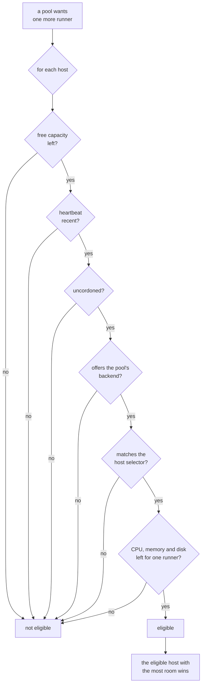

# Hosts and pools

The [quick start](quickstart.md) leaves you with one host and one pool, which is
a whole working fleet. This page is the next step: a second machine, a second
pool, and the rules that decide which runner lands where.

Two things make up a fleet, and they are deliberately separate:

* A **host** is a machine an agent runs on. It contributes capacity, the
  backends it can actually service, and labels describing what it is.
* A **pool** is a named group of interchangeable runners: which labels a
  workflow must ask for, what image and backend to build them from, and how many
  may exist.

Neither owns the other. A pool can be placed on any host that suits it, and a
host can carry runners from every pool at once. That is what lets you add a
machine without touching a pool, and add a pool without touching a machine.

## Adding a host

{ .zoomies-shot }
{ .zoomies-shot }

**Hosts → Add a host** in the UI does the whole thing on one page: it mints a
join token and prints the command to paste on the new machine, already filled in
with the address your browser reached the controller on and the labels your
pools select hosts by. From a terminal, the same token comes from the CLI:

```sh
zoomies hosts join-token create --ttl 1h --capacity 8 --labels arch=arm64
```

It prints the command to run on the new host, the token, and when it expires.
The token is shown once — only its hash is stored — and it may be redeemed once.

On the new machine, either install and join in one line:

```sh
curl -fsSL https://zoomies.sh/install.sh | sh -s -- \
  --mode agent \
  --controller https://zoomies.example.com \
  --join-token zoojoin_...
```

or, if the binary is already there, join with the shorter form:

```sh
zoomies agent join https://zoomies.example.com --token zoojoin_... \
  --capacity 8 --labels gpu=true,zone=eu-west
```

`join` redeems the token, writes the credentials, and installs the service that
keeps the host enrolled; `--no-service` joins without one. A private controller
takes `--ca-file` — prefer it over `--insecure`, which trusts anything on the
path.

The agent connects outbound only, both to long-poll for tasks and to post
results back, so a host behind NAT or a strict firewall needs no inbound rule.
See [Architecture](architecture.md#why-the-agent-connects-outbound) for why the
connection runs that way round.

### What a host brings with it

| What | Where it comes from | Why it matters |
| --- | --- | --- |
| Capacity | `agent.capacity`, `--capacity`, or half the CPU count | A hard ceiling the scheduler respects, per host. |
| Backends | Probed by the agent at startup, and again as sockets appear | A pool is only placed on a host that offers its backend. |
| Labels | `agent.labels` or `--labels` | What a pool's `host_selector` matches against. |
| OS, arch, version | The agent | Shown in **Hosts**. A pool's `host_selector` can match `os` and `arch` directly, so keeping work on arm64 needs no labelling at all. |
| Health | A heartbeat every `agent.heartbeat_interval` | A host silent for 90 seconds — three times the default interval — is unhealthy, and takes no new runners until it checks in again. After five minutes of silence it is presumed gone: the runners still recorded on it are failed so the pool can replace them, and a job one of them was running is marked as lost by the fleet. |

A host that offers no backend is connected, healthy and useless: nothing will
ever be scheduled on it. `zoomies hosts list` says so rather than printing a
dash, and repeats the agent's own explanation for each backend it could not
use — usually a Docker socket that is not readable by the account the agent runs
as. [Configuration](configuration.md#agentdocker_host) covers that diagnosis.

The controller itself counts as a host. On a single-VM install the controller
runs an agent inside its own process, which is why the fleet works before you
have added anything.

## Living with more than one host

```sh
zoomies hosts list                  # health, free capacity, backends, platform
zoomies hosts cordon host_k3f9qz2m  # keep its runners, accept no new ones
zoomies hosts uncordon host_k3f9qz2m
zoomies hosts delete host_k3f9qz2m  # refused while runners are still on it
```

**Cordon before maintenance.** A cordoned host keeps everything it is already
running — no job is ever interrupted by a cordon — and accepts nothing new. Once
its runners have finished, reboot the machine, upgrade Docker, do whatever you
came to do, then uncordon it. The scheduler says `cordoned` in its reasons while
that is true, so the pause is visible rather than mysterious.

**Delete only a host that is gone for good.** `delete` is refused while live
runners remain; `--force` deletes anyway and leaves their GitHub registrations
orphaned, which is the right trade only when the machine itself has gone away.

Capacity and labels are edited in the UI under **Hosts**, or with a `PATCH` to
`/api/v1/hosts/{id}` — see [the API surface](api-surface.md#hosts-and-agents).
Relabelling a host changes which pools can select it on the very next scheduler
pass; the runners already on it stay where they are.

## Adding a pool

{ .zoomies-shot }
{ .zoomies-shot }

One pool is enough until the fleet has to answer two different questions. Add a
second when a job needs something the first cannot give it:

* **A different machine.** GPU boxes, arm64 builders, a host in another region.
  Architecture and operating system need nothing set up — `arch=arm64` or
  `os=linux` matches what the agent already reports. Anything else is a label
  on the hosts and the same key in the pool's `host_selector`.
* **A different runtime.** A pool whose jobs build images needs a
  `docker_mode`, which most pools should not have; asking for one switches the
  stock runner image to its Docker variant.
* **A different ceiling.** A noisy repository is easier to bound with its own
  pool and its own `max_runners` than with a shared one.
* **A different priority.** When the fleet is full, higher-priority pools
  receive create slots first.

The UI's wizard is the easiest way in, and the CLI takes the same fields:

```sh
zoomies pools create \
  --name zoomies-gpu \
  --labels zoomies-gpu \
  --installation ins_k3f9qz2m \
  --host-selector gpu=true \
  --max 4 \
  --dry-run
```

`--dry-run` validates exactly as the wizard's review step does — field errors and
the dangerous-setting warnings the pool would produce — without creating
anything. Drop the flag to create it for real. Every field is in
[Pool settings](configuration.md#pool-settings); the labels to choose are in
[The labels to give a pool](configuration.md#the-labels-to-give-a-pool).

A pool whose image is large is worth prewarming after you create it or point it
at a new image, so the first job of the day does not pay for the pull:

```sh
zoomies pools prewarm pool_k3f9qz2m
```

That pulls the pool's image on every host the pool could be placed on, and
reports what each one did.

**Disable rather than delete** a pool you may want back: a disabled pool drains
to zero and creates nothing, while its settings and history survive. Deleting
drains its runners first unless you pass `--force`.

### A pool belongs to one installation

`--installation` is not bookkeeping. A pool's runners are registered into that
installation's GitHub target with that installation's credentials, so the
target decides which jobs can ever reach them — and Zoomies will not put a job
from one installation on a pool belonging to another, whatever the labels say.
Two installations whose pools advertise the same labels are two separate
fleets that happen to use the same words.

A job Zoomies cannot place for this reason says so rather than sitting there:
the Jobs page and the problems drawer name the pool whose labels matched and
the installation it belongs to, and a repository no installation here covers is
reported as that rather than as a labelling mistake. Neither has a fix in the
workflow file; both are fixed by installing the App on the right target or by
adding a pool there.

Within one organisation installation, that is as far as the boundary goes.
**GitHub decides which of its runners gets a queued job**, and it offers a job
to any runner in scope whose labels match — so a runner this fleet created for
one repository's job may be handed another repository's job from the same
organisation instead. Zoomies has no say in it. Where two repositories must not
share runners, give each one a repository-target installation, or separate them
by labels and accept that the separation is a convention kept in workflow files
rather than something the platform enforces. The same caveat governs a
repository-scoped cache: see
[Adding a pool](#adding-a-pool) and the pool's own warnings.

A **runner group** narrows this further, and only on an organisation. Naming
one puts the pool's runners in that group, so only repositories with access to
it can be offered their jobs. If the group cannot be resolved — it does not
exist on the target, or the App may not list groups — the runners register in
Default, which every repository the installation covers can reach; the pool
then carries a `pool.runner_group_unresolved` warning saying which happened,
because a pool that asked to be fenced off and quietly was not is worth
noticing. Repositories have no runner groups at all, so a repository-target
pool naming one is warned about the same way.

## How a runner is placed

Every scheduler pass takes a snapshot — pools, runners, queued jobs, hosts — and
decides where new runners go. A host is eligible for a pool when all six of
these hold:



Among eligible hosts the one with the most room left wins, so runners spread
across the fleet rather than piling onto whichever host answered first — one
busy machine should not become the fleet's single point of failure. Ties break
on host ID, so the same snapshot always produces the same plan.

Two ceilings apply at once, and both are hard: a pool never exceeds its
`max_runners`, and a host never exceeds its capacity. A pool's `max_runners`
is therefore only as real as the capacity available on the hosts it can select;
setting it to 20 across two hosts of capacity 4 buys nothing.

### What a runner reserves

A slot is a count, and a count does not know that eight runners of a pool that
asks for 4 GB each do not fit on a 16 GB machine. So each runner is also
charged against what its host reported, and a host that cannot cover the charge
takes no more work however many slots it has left.

What one runner is charged is the pool's own `resources`. A pool with
`docker_mode: dind` is charged twice: the build runs inside the sidecar, which
the backend gives the same limits, so the pool's footprint on the host really is
two of everything it asked for. A field the pool leaves unset is charged one
slot's worth of the host instead — a host with 30 GB allocatable and a capacity
of 6 charges 5 GB — which is what keeps a fleet of pools with no limits admitting
exactly what its slot counts admitted before. The reservation is worked out from
the runner rows on every pass; nothing stores it, so a restart recovers it and a
runner that fails stops being charged for as soon as its row says so.

Held back before any of that: `reserve_cpus`, `reserve_memory_mb` and
`reserve_disk_mb` on the host, which are the operator's the way capacity is —
an agent reports what it measured and never writes these. Set them with
`PATCH /hosts/{id}` or on the host's card; a reserve on a figure the host has
never reported, or one that would leave nothing to place on, is refused rather
than clamped, because an operator who typed megabytes for gigabytes should be
told and not quietly obeyed. Both memory and disk
have a floor, applied when the operator has set nothing: **512 MB** of memory
and **2 GB** of disk. Neither is generous, and both exist because a machine with
nothing left over does not run jobs slowly, it has one of them killed or fails a
checkout before its first step. CPU has no floor: a CPU reservation is a share
of the one resource that is never exhausted, only contended, and a contended
machine still finishes the job.

A pool's `resources` are enforced as cgroup limits on the `docker` and `podman`
backends, including the docker-in-docker sidecar. The `process` backend applies
none of them, and a pool that sets limits on it raises
`pool.resources_unenforced`: the scheduler still holds the room, so the fleet
does not oversubscribe, but the room is bookkeeping and a job that runs away
takes the machine with it.

Free disk is a gate rather than a budget. A host at or below its disk reserve
takes no new runner at all, whatever the pool asks for; nothing is evicted to
make room, because a runner's caches outlive it on purpose. Two things follow:
disk is the one shortage that no job finishing will clear, and a pool that sets
`resources.disk_gb` is charged it against what is free right now.

A host whose agent never reported its size is placed by slots alone, exactly as
before, which is what stops an upgrade emptying a fleet. Note also what a
reservation is not: it is a promise the fleet accounts for, and what actually
binds a runner is the cgroup limit the container backends apply from the same
`resources`. The `process` backend applies none, so on a `process` pool the
reservation is bookkeeping and nothing enforces it.

### When nothing can be placed

The scheduler says why, in one sentence, and the same reason appears in
**Scaling events**, the problems drawer and the CLI:

```text
no host can take a new docker runner (1 cordoned, 2 at capacity)
```

Read the counts, because they name the fix:

| What it says | What to do |
| --- | --- |
| `at capacity` | Nothing is wrong. Wait for a job to finish, raise a host's capacity, or add a host. |
| `cordoned` | Uncordon the host, if the maintenance is over. |
| `unhealthy` | The agent is not heartbeating. Check that it is running on that machine and can reach this controller. |
| `without the docker backend` | Fix the socket on that host, or point the pool at a backend your hosts already offer. When every other host is out for that reason, the sentence carries the agent's own words about the socket, and names the backends it could move to. |
| `not matching the pool's host selector` | Relax the selector, or label a host to match. |
| `too small for this pool's limits` | The machine could not hold one runner of this pool even when empty. Lower the pool's CPU or memory limits, or add a bigger host. Waiting will not help. |
| `short of memory`, `short of CPU` | The host is the right size and has already promised what it has to the runners on it. Wait, lower the pool's limits, or add a host. |
| `low on disk` | The work directory's filesystem is at or below the host's disk reserve. Free space on it, lower the pool's `disk_gb`, or add a host — no job finishing will return this, because a runner leaves its caches behind on purpose. |

The distinction the reasons keep is between a fleet that is merely **full**,
which clears itself, and one that is **misconfigured**, which never will.
[Troubleshooting](troubleshooting.md#a-job-that-sits-in-the-queue)
walks the same tree from a queued job's point of view.

### When runners keep failing to start

A runner that dies before it ever registers -- the image will not pull, the
host cannot reach GitHub, the runner version does not exist -- is not replaced
in the same pass that notices. The pool waits ten seconds after the first such
failure, and doubles the wait with each one after it, up to five minutes:

```text
cannot scale linux-x64 0 -> 1: the last 3 runners failed to start, most recently
30s ago (No such image: sha256:9f2c…); trying again in 10s
```

Without the wait a pool with a bad image creates, fails and removes a runner
every second, and pays GitHub two API calls a time for the privilege. The
failed runners stay on the Runners page for ten minutes with their reasons,
which is where the sentence above points; the problems drawer lists the pool
under *runners are failing to start* for as long as it is waiting. Nothing
needs resetting once the cause is fixed: the next attempt succeeds, no new
failure lands on the page, and the wait runs out on its own.

A runner that ran jobs and then failed does not count. That says something
about the job, not about whether the next runner will start.

## Worked shapes

**A GPU box beside the general fleet.** Label the machine on the way in, then
require the label:

```sh
zoomies agent join https://zoomies.example.com --token zoojoin_... --labels gpu=true
zoomies pools create --name zoomies-gpu --labels zoomies-gpu \
  --installation ins_k3f9qz2m --host-selector gpu=true --max 2
```

Workflows reach it with `runs-on: zoomies-gpu`. Nothing else lands there,
because every other pool's selector is empty and matches any host — including
this one, which is usually not what you want, so give the general pools a
selector too (`class=general`) once a specialised host exists.

**An arm64 builder.** Same shape with `arch=arm64`, and a pool whose image is an
arm64 runner image — but no `--labels` on the agent this time, because the
architecture is something the agent already reports:

```sh
zoomies agent join https://zoomies.example.com --token zoojoin_...
zoomies pools create --name zoomies-arm --labels zoomies-arm \
  --installation ins_k3f9qz2m --host-selector arch=arm64 --max 4
```

`os` works the same way — `--host-selector os=linux` keeps a pool off the macOS
box somebody runs a controller on. Both are matched against what the agent
reports, and a label of the same name on a host still wins, which is the escape
hatch if you want a machine to answer for an architecture it does not have.

`os=windows` is refused when you create the pool. There is no Windows agent to
join a host with, so such a pool would match nothing however many machines you
added, and a pool that matches nothing reports itself as a fleet short of
capacity rather than as a platform Zoomies has not got. Windows runners are
[not supported](faq.md#which-platforms-does-it-run-on).

**Separating a noisy repository.** Give it a pool with its own labels and its own
`max_runners`. Note the limit of `repository_scale_up_limit` on a shared pool: it
throttles creation attributed to one repository, but GitHub may still hand a
queued job to any compatible idle runner. Strict isolation means a pool of its
own, with `runs-on` labels no other repository uses.

**Draining a machine for good.** Cordon it, wait for **Hosts** to show no
runners on it, then delete it and remove the agent's service. The controller
never dials an agent, so nothing has to be told to stop first.
