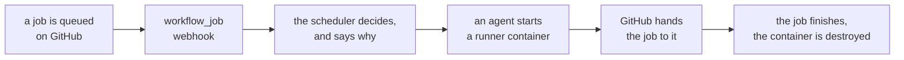

<div class="zoomies-hero" markdown>

{ .off-glb }

# Give your GitHub Actions runners the Zoomies.

<p class="lede">
<strong>Free and open source.</strong> Install in minutes, manage every runner
from a live web UI, and move off static runners without rebuilding your CI.
</p>

<div class="zoomies-install" markdown>

```sh
curl -fsSL https://zoomies.sh/install.sh | sh
```

</div>

<div class="actions" markdown>

[Install Zoomies :material-arrow-right:](quickstart.md){ .md-button .md-button--primary }
[See the web UI](ui.md){ .md-button }
[Migrate existing runners](migration.md){ .md-button }

</div>

<ul class="pills">
  <li>Free · AGPL-3.0</li>
  <li>Self-hosted</li>
  <li>Single Go binary</li>
  <li>No Kubernetes</li>
  <li>No database server</li>
  <li>Early beta</li>
</ul>

</div>

Zoomies gives each job a fresh runner, scales across the hosts and runner
operating systems you already use, and makes the fleet easy to see and operate —
without Kubernetes and without a database server.
{ .zoomies-proof }

{ .zoomies-shot }
{ .zoomies-shot }

The Overview, on a fleet part-way through a morning — every number live, and
nothing to press to keep it that way. [See all ten pages, in both
themes](ui.md).
{ .zoomies-shot-caption }

## Your home lab belongs in the pack.

**Turn your own private machines into GitHub Actions runner capacity.**
Built-in Tailcat connections bring your home lab and office hosts into the same
fleet as your cloud machines. No public host IP, router port forwarding,
Tailscale account or separate tunnel installation.

Choose **Private connection · Tailcat**, run one command, and watch the host
join the pack. Same web UI, same pools, same ephemeral runners. Your hardware,
your network, without a Zoomies per-minute platform fee.

[Connect your private hosts :material-arrow-right:](private-hosts.md){ .md-button .md-button--primary }

## How it works

Point Zoomies at a GitHub organisation, or at a repository on a personal
account. It watches for queued jobs, starts a fresh runner for each one, and
destroys the runner when the job finishes.



## What you get

<div class="zoomies-grid" markdown>

<div markdown>
:material-monitor-dashboard:{ .icon }

### A live web UI
Ten pages, one job each, and every one of them updates in place from the
controller's event stream — you never have to press refresh, though there is a
button where you want to be sure. Light and dark, a command palette, and a log
viewer built for a hundred thousand lines.
[See every page](ui.md).
</div>

<div markdown>
:material-recycle-variant:{ .icon }

### Ephemeral by default
One job per runner, then the container is gone. Nothing leaks from one workflow
run to the next — not a clone, not a cache, not a credential.
</div>

<div markdown>
:material-shield-key-outline:{ .icon }

### No pasted tokens
Zoomies authenticates as a GitHub App and mints single-use JIT registrations
itself. There is no long-lived token sitting in a dotfile beside a runner.
</div>

<div markdown>
:material-webhook:{ .icon }

### Event-driven
`workflow_job` webhooks, with polling only as a fallback — so a misconfigured
webhook slows your fleet down instead of silently stopping it.
</div>

<div markdown>
:material-server-network-outline:{ .icon }

### Multi-host, multi-OS
One controller, any number of agents, each connecting outbound only — a host
behind NAT needs no inbound firewall rule. Runner images for Ubuntu, Debian,
Fedora and Rocky Linux, and a pool names the machine it needs.
[Which images](naming.md#the-runner-image).
</div>

<div markdown>
:material-chart-timeline-variant:{ .icon }

### Actually observable
SQLite for state, Prometheus metrics, structured logs, live log streaming, job
history with queue waits, and an audit row for every mutating action.
</div>

<div markdown>
:material-shield-check-outline:{ .icon }

### Safe defaults
Loopback bind, authentication on, no Docker socket in your jobs, no root. Every
deviation is named at startup and in the UI's problems drawer. A self-hosted
runner still runs your repositories' code — [what this protects, and what it
does not](security.md).
</div>

<div class="wide" markdown>
:material-source-pull:{ .icon }

### One pull request per repository
The migration wizard rewrites `runs-on` across your repositories and opens a
pull request on each one — after showing you the exact diff, and only for the
jobs it is sure about. It never pushes to your default branch and never merges
anything. [How it works](migration.md).
</div>

</div>

## Five minutes to a running fleet

The installer detects your OS, architecture, container runtime and init system,
then walks you through the rest: service user, encryption key, backend, TLS, the
GitHub App — created for you through the manifest flow with exactly the
permissions Zoomies needs — and your first admin account.

```sh
curl -fsSL https://zoomies.sh/install.sh | sh
```

Piping a script into a shell deserves a second look, and this one is written to
survive one — [download it, read it, then run it](quickstart.md#1-install).

It can deploy three ways — the binary under systemd, a `docker compose` stack
with a fully populated `.env`, or a single container — and it will only offer
the ones your host can actually run. See the [quick start](quickstart.md).

## Moving what you have now

Two different journeys, and Zoomies answers them differently on purpose.

**Still on GitHub's runners, or renting somebody's?** The migration wizard reads
the workflows across the repositories your App can see, maps each hosted label
to one of your pools, and shows you the exact diff before it writes anything.
Approve it and you get one pull request per repository, each on its own branch.
It changes the `runs-on` lines and nothing else — comments, indentation,
quoting and line endings all survive byte for byte, because a pull request that
reformats the file hides the one line that actually changed. It never pushes to
your default branch, never merges, and never opens more than twenty-five at a
time.

**Already running your own static runners?** Then you do not need the wizard,
and it will deliberately leave those jobs alone — somebody already made that
decision and guessing at it would be rude. Give a Zoomies pool the label your
existing runners already advertise, and **not a line of any workflow changes**:
the same `runs-on` now reaches a fleet that gives every job a fresh runner.
Retire the old machines as the work moves across.

Either way, nothing is written until you have read it, and
`ZOOMIES_SEED_DEMO=true` gives you a whole fixture fleet to walk the wizard
through before you connect GitHub to anything.

[Migrate existing runners :material-arrow-right:](migration.md){ .md-button }

## What runs where

Three different questions, and conflating them is how a project ends up
promising a platform it has never run on.

| | Where it runs |
| --- | --- |
| **The controller and the agents** | Linux on x86-64 and arm64. macOS builds every release and is fine for running a controller while you develop against it. |
| **The runners** | Ubuntu 24.04, Ubuntu 22.04, Debian 12, Fedora 42 and Rocky Linux 9, from `ghcr.io/eyupio/zoomies-runner`. Every image is built for x86-64 and arm64 except Ubuntu 22.04, which is x86-64 only. [The catalogue](naming.md#the-runner-image) is generated from one table in the code, and a test holds this page to it, so neither can drift from what is published. |
| **The backends** | `docker` — the default — `podman`, including rootless, and `process`, which runs the runner straight on the host without a container. |

A pool names the machine its runners need, and the scheduler will not place it
anywhere else; when no host matches, the Overview says which machine to add.
Windows runners are not supported, and there is no macOS runner image.

## What is qualified

Zoomies is an early beta, and this project keeps a
[support matrix](https://github.com/eyupio/zoomies/blob/main/roadmap/support-and-measurement.md)
that separates what a test has actually run on from what merely builds. Read it
before you put anything precious on this. Today, in short: the controller, the
agents, a join, and a queued job becoming a real workload on a real machine are
exercised on every pull request, on the `process` backend against a fake GitHub;
the Docker backend is unit-tested against a fake Engine API and no test here has
yet started a real container; and no test runs on arm64.

That is not a reason to keep it off your own machines. It is the reason the
defaults are the careful ones, and the reason every claim on this page names
the thing that backs it.

## Why not something else

Zoomies is what you want when
[ARC](https://github.com/actions/actions-runner-controller) is too much
machinery — you have a VM or three, not a cluster — but a handful of
hand-registered long-lived runners is too little.

<div class="zoomies-compare" markdown>

| | ARC | A few static runners | Zoomies |
| --- | --- | --- | --- |
| Runs without Kubernetes | :material-close:{ .no } no | :material-check-bold:{ .yes } yes | :material-check-bold:{ .yes } yes |
| Ephemeral runners | :material-check-bold:{ .yes } yes | :material-minus:{ .partial } rarely | :material-check-bold:{ .yes } default |
| Autoscaling | :material-check-bold:{ .yes } yes | :material-close:{ .no } no | :material-check-bold:{ .yes } yes |
| Multi-host | :material-check-bold:{ .yes } yes | :material-close:{ .no } no | :material-check-bold:{ .yes } yes |
| Auth model | GitHub App | a PAT per runner | GitHub App |
| Web UI | :material-close:{ .no } no | :material-minus:{ .partial } sometimes | :material-check-bold:{ .yes } yes |
| Audit log | :material-close:{ .no } no | :material-close:{ .no } no | :material-check-bold:{ .yes } yes |
| To install | Helm, CRDs, a cluster | manual | one command |

</div>

## A word about self-hosted runners

A self-hosted runner executes code from your repositories, and on a public
repository that means anyone who can open a pull request. GitHub's own guidance
is blunt about this, and Zoomies does not change it. What it does is make the
blast radius of each execution as small as it reasonably can:

- one job per runner, then the container is destroyed;
- no reusable registration credential on the host;
- no Docker daemon reachable from the job unless you explicitly ask for one;
- a non-root user, dropped capabilities, `no-new-privileges`.

Every setting that trades any of that away is named at startup, listed in the
UI, and documented in [Security](security.md) with what it actually costs you.

Zoomies is an early beta, and the honest advice is to start it on workloads you
already trust. [What is qualified](#what-is-qualified) says which parts have
been run and which have only been built.

<div class="zoomies-cta" markdown>

<p class="title">Give your CI the Zoomies.</p>

<p class="lede">
One command installs it, and the quick start takes you from a fresh host to a
running job in about five minutes. It is free, it is yours, and you can read
every line of it. Still deciding? The FAQ answers what people ask before they
self-host runners — what it costs, what it needs, and what it will not protect
you from.
</p>

<p class="actions" markdown>
[Install Zoomies :material-arrow-right:](quickstart.md){ .md-button .md-button--primary }
[See the web UI](ui.md){ .md-button }
[Browse the FAQ](faq.md){ .md-button }
</p>

</div>
