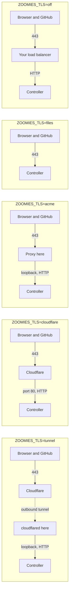

# One-click deployment

`deploy/marketplace/` in the repository is everything a VPS provider needs to
offer Zoomies as a one-click deployment, and everything an operator needs to
run the same thing by hand.

It deploys **a controller**. Zoomies is open source, self-hosted and
bring-your-own-infrastructure: the one-click install puts the always-on half on
one instance, and the runner capacity stays yours — this instance by default,
your own machines when you join them, a hypervisor when you configure a
provider. Nobody else runs your jobs and nobody else holds your GitHub App.

```sh
cp inputs.env.example inputs.env
$EDITOR inputs.env                    # at minimum, the hostname
./render.sh inputs.env > cloud-init.yaml
```

Boot an Ubuntu 24.04 LTS instance with that file as its user data.

## What the provider asks for

Six settings, of which one is required. They are the whole of what differs
between one customer's deployment and the next.

| Input | What it decides |
| --- | --- |
| `ZOOMIES_HOSTNAME` | **Required.** The DNS name that will point at this instance. Webhook deliveries, the session cookie's `Secure` flag and every link in the UI are built from it. |
| `ZOOMIES_EXTERNAL_URL` | The public address, when something in front publishes this instance under a different name. Derived from the hostname otherwise. |
| `ZOOMIES_DNS` | Whether that record already points here at boot, or is created afterwards — which is the usual order when the provider assigns the address at boot. It does not apply to a tunnel, where Cloudflare maps the hostname and this instance has no record of its own. |
| `ZOOMIES_TLS` | Who holds the certificate for the public name: `tunnel`, `cloudflare`, `acme`, `files` or `off`. See below. |
| `ZOOMIES_CONTROLLER_IMAGE` | The image to run. Defaults to the pinned, tested one in `release.env`. |
| `ZOOMIES_DATA_DIR` | Where the database, the encryption key and the runners' work area live — the directory to put on an attached volume, and the one a backup copies. |

There is deliberately no input for a GitHub App private key, a webhook secret,
an administrator password or a join token. Everything a provider's form
collects becomes instance metadata: readable by anything on the instance that
can reach the metadata service, kept in the provider's own database, and
printed in cloud-init's log. A credential that has been copied to all three
cannot be rotated out of them. `render.sh` refuses an inputs file that sets
one.

## Getting a certificate

Five arrangements, and the difference between them is only who holds the
certificate for the public name. Three of them leave the controller speaking
plain HTTP, which is correct rather than a compromise: the origin is not the
public endpoint, and something in front of it is.



**`tunnel` — a Cloudflare Tunnel, and no inbound rule at all.** A daemon on the
instance dials out to Cloudflare, Cloudflare serves HTTPS on the public name,
and the controller answers plain HTTP on loopback. Nothing is published, this
machine needs no DNS record of its own, and no certificate lives here. It is
the arrangement for a home network, a machine behind somebody else's firewall,
or a provider that charges for a static address.

The tunnel needs a token, and it is the one credential this package will carry.
Leave `ZOOMIES_TUNNEL_TOKEN` empty and the instance still boots ready for it:
the first-login notes name the file to paste it into and the single command
that starts the tunnel, so the token never passes through instance metadata,
the provider's database or cloud-init's log. Set it in the inputs only when a
form has to produce a working instance unattended, knowing where it ends up —
`render.sh` says so on the way past.

**`cloudflare` — Cloudflare in front of a published origin.** The classic
arrangement: this instance serves plain HTTP on port 80 and Cloudflare proxies
to it. **Firewall port 80 to Cloudflare's ranges.** Left open, the origin is
reachable directly and Cloudflare is merely in front of it rather than in the
way, so anyone who finds the address bypasses every rule set at the edge.

**`acme` — a certificate, automatically.** A small reverse proxy on the
instance asks Let's Encrypt for one and renews it. The controller stays on
loopback. This needs the DNS record to point at the instance and ports 80 and
443 reachable; until the record exists the proxy keeps trying, so an instance
booted before its DNS was ready becomes healthy on its own once it is. Set
`ZOOMIES_ACME_EMAIL` and Let's Encrypt will warn you before a renewal that
stopped working becomes an outage.

**`files` — a certificate you already have**, from the provider's own
certificate offering or anywhere else. Zoomies serves it itself, published on
443, and runs no proxy. Give it `ZOOMIES_TLS_CERT_FILE` and
`ZOOMIES_TLS_KEY_FILE`; the deployment mounts both into the container at the
paths you name. This is the only arrangement where the controller is the public
endpoint.

**`off` — something else in front already terminates TLS**: a load balancer of
the provider's, or a proxy you run.

### Which proxy is believed

This is the half that fails silently, so the arrangement sets it rather than
leaving it to be remembered. `X-Forwarded-For` is read only from a peer listed
in `trusted_proxies`, and `CF-Connecting-IP` — the one header a client cannot
forge — only from a peer that is Cloudflare's own edge.

| Arrangement | Trusted | Why |
| --- | --- | --- |
| `cloudflare` | the word `cloudflare` | The peer *is* Cloudflare's edge, so `CF-Connecting-IP` counts |
| `tunnel` | loopback | The peer is the tunnel daemon on this machine, not Cloudflare, so `CF-Connecting-IP` is deliberately not believed and `X-Forwarded-For` is what survives |
| `acme`, `files` | loopback | Whatever reaches the controller does so from this instance |
| `off` | **yours to set** | Only you know what fronts it |

Both Cloudflare arrangements are Cloudflare and they want opposite answers.
Trusting Cloudflare's ranges behind a tunnel would trust nothing that ever
connects; trusting loopback in front of a proxied origin would trust nothing
either. Get it wrong and every audit row records the proxy instead of the
person, and the login rate limiter throttles the whole internet as one caller —
with nothing anywhere reporting it. Setting `ZOOMIES_TRUSTED_PROXIES` yourself
overrides the arrangement's choice.

### What is not offered

A public endpoint that is plain HTTP. GitHub does not deliver webhooks to one,
the session cookie cannot be marked `Secure` without TLS, and an instance that
came up serving its public address in the clear is the failure this package is
most able to cause and least able to notice. An unrecognised `ZOOMIES_TLS` is
refused by name rather than defaulted.

## The first run

The instance comes up with a controller and no accounts. Finishing setup is
four steps, and none of them asks you to put a credential in a form.

**1. Read the setup token.** It is printed in the controller's log while no
account exists, and a restart mints a new one:

```sh
docker compose -f /etc/zoomies/docker-compose.yml logs zoomies | grep 'setup token'
```

`/etc/zoomies/first-login.txt` on the instance says the same thing, and so does
the message of the day.

This step is the gate on the next one, and it is not ceremony. The origin is
reachable the moment the container starts, and "no user exists yet" is a
condition an attacker can satisfy too — so an empty database is not proof of
ownership. Being able to read this instance's log is.

**2. Create the first administrator.** Open the external URL, paste the token,
choose a username and password. The token is checked against the running
process, so a wrong one is refused and a restart invalidates the one you were
holding.

**3. Connect GitHub.** From the UI, signed in, over the connection you have
already authenticated. Zoomies walks you through creating the App and takes the
private key and webhook secret directly, sealing both with the instance
encryption key. Nothing had to travel through the provider to get here.

**4. Make a pool.** Nothing runs until one exists. [Hosts and
pools](hosts-and-pools.md) explains what the settings mean, and the
[Quick start](quickstart.md) is the same walk with pictures.

If the deployment runs in `controller` mode, or you want capacity beyond this
instance, generate a join token under **Hosts → Add a host** and run the line it
gives you on a machine with Docker or Podman. Agents connect outbound only, so
that machine can sit behind NAT with no inbound rule.

## Your first workflow

From a booted instance to a green job, with the clock running. The slow parts
are GitHub's, not this instance's.

| | Step | About |
| --- | --- | --- |
| 1 | Point DNS at the instance, if it is not already | 1 min |
| 2 | Read the setup token and create the administrator | 1 min |
| 3 | Connect GitHub: create the App, install it on the organisation or repository | 4 min |
| 4 | Make a pool. On a `single` install the suggested one matches this machine, so accepting it is enough | 1 min |
| 5 | Point a workflow at it and push | 2 min |

Step 5 is one line in a workflow — the pool's name is what `runs-on` asks for:

```yaml
jobs:
  build:
    runs-on: zoomies-linux-x64
    steps:
      - uses: actions/checkout@v5
      - run: echo "this ran on my own hardware"
```

The job appears on the Jobs page as it queues, a runner is created for it, and
the container is destroyed when it finishes. If it stays queued, the Overview's
problems panel says which half is missing — no pool matches the labels, or no
host can run the pool — rather than leaving you to guess.
[Migrating repositories](migration.md) rewrites `runs-on` across a repository
when you are ready for more than one workflow.

## Sizing

The controller is a single Go binary with a SQLite file; it is not what needs
the room. On a `single` install, the runners are.

Each runner gets a share of what the host has left after its reserve — half a
CPU or a twentieth of the machine, whichever is larger, plus 512 MB — divided by
the host's capacity. That arithmetic gives these starting points:

| Instance | Capacity | Each runner gets | Suits |
| --- | --- | --- | --- |
| 2 vCPU, 4 GB | 2 | 0.75 CPU, 1792 MB | A few small repositories; linting and unit tests |
| 4 vCPU, 8 GB | 3 | 1.16 CPU, 2560 MB | A team's normal CI |
| 8 vCPU, 16 GB | 4 | 1.87 CPU, 3968 MB | Container builds, several repositories |
| 16 vCPU, 32 GB | 6 | 2.53 CPU, 5376 MB | Heavier matrices, or a controller busy enough to want headroom |

Give it **40 GB of disk or more**. Runner images are a few gigabytes each and a
build cache grows; the disk is what runs out first on a small instance.

A `controller` install needs far less — 2 vCPU and 2 GB is comfortable — because
the jobs are somewhere else. That is the shape to choose when the runners want
to be near your own network, or want machines bigger than this one.

These are starting points, not measurements. Reproducible timings on stated
hardware are their own piece of work and are not claimed here.

## The data, and getting it back

Everything that matters is in `ZOOMIES_DATA_DIR`: the SQLite database, the
runners' work area, and — unless you supplied one — the encryption key generated
on first start. Put that directory on the provider's attached volume when there
is one, which is the whole reason it is an input.

A backup is a copy of that directory, plus the encryption key if you keep it
elsewhere. Without the key, the stored GitHub App private key cannot be
decrypted, and the failure is silent until the next time Zoomies needs to
authenticate. [Backup and restore](backup-and-restore.md) is the procedure, and
it is the same one here.

## Upgrading

Change the release in `release.env`, re-run `make marketplace-lock`, and boot
new instances from the re-rendered artefact. An instance that is already running
upgrades in place:

```sh
zoomies upgrade
```

Controller and agents may drift, but not in every direction: a newer agent
against an older controller is unsupported, so upgrade the controller first.
[Upgrading](upgrading.md) has the version-skew rules and what happens to work in
flight.

## Removing it

```sh
zoomies uninstall --yes                # the service, the container, the config
zoomies uninstall --yes --volumes      # and the database with it
```

The second is irreversible and is asked about separately for that reason: the
volume *is* the database. The ACME proxy and the tunnel daemon are their own
compose projects, so whichever the deployment runs goes separately:

```sh
docker compose -f /etc/zoomies/proxy/docker-compose.yml down     # ZOOMIES_TLS=acme
docker compose -f /etc/zoomies/tunnel/docker-compose.yml down    # ZOOMIES_TLS=tunnel
```

Delete the tunnel in the Cloudflare dashboard as well, which is also how its
token is revoked.

Runners registered with GitHub are ephemeral and remove themselves, so nothing
is left behind on GitHub's side except the App, which you delete there.

## What is pinned, and why

`release.env` names one release and `images.lock` records the digest every tag
resolved to when that release was cut. The controller is pinned by tag *and*
digest, the installer is verified against a checksum before it is run, and the
join command a host is given names the same release as the controller — an
agent newer than its controller is unsupported, and copying a join line months
later is exactly how that happens by accident.

A marketplace artefact is deployed long after it is written, by somebody who is
not reading this repository. `latest` would hand them a build nobody tested
against this bootstrap.

## Getting help

[SUPPORT.md](https://github.com/eyupio/zoomies/blob/main/SUPPORT.md) says where
a question goes and what the boundary is: this is free, open-source software
with no support contract, and a provider offering it is supporting their
platform rather than this project. [Troubleshooting](troubleshooting.md) covers
what goes wrong most often, and the problems panel in the UI names the setting
to change rather than leaving you to search.

## What this has not been through yet

The implementation is complete and its rendering is covered by tests, which
check that the answer file a real boot writes is one setup accepts, that every
certificate arrangement produces a listener and a holder that agree, and that
the rendered cloud-config carries every file the instance will look for.

**No run on a pristine VPS has happened.** Neither has the first-workflow
journey above, end to end, on a provider's own image, nor a pilot review. Those
are the next piece of work and their evidence is recorded separately; until it
exists, this page describes a tested artefact and an untested deployment, and
the difference is the whole reason the sentence is here.

One friendly provider pilot follows that evidence. Until a pilot has produced a
supportable result, Zoomies is not submitted to an official marketplace, no
broad provider support is advertised, and no second provider is begun.
