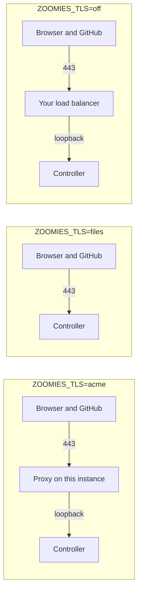

# One-click deployment

`deploy/marketplace/` in the repository is everything a VPS provider needs to
offer Zoomies as a one-click deployment, and everything an operator needs to
run the same thing by hand.

It deploys **a controller**. Zoomies is open source, self-hosted and
bring-your-own-infrastructure: the one-click install puts the always-on half on
one instance, and the runner capacity stays yours — this instance by default,
your own machines when you join them, a hypervisor when you configure a
provider. Nobody else runs your jobs and nobody else holds your GitHub App.

```sh
cp inputs.env.example inputs.env
$EDITOR inputs.env                    # at minimum, the hostname
./render.sh inputs.env > cloud-init.yaml
```

Boot an Ubuntu 24.04 LTS instance with that file as its user data.

## What the provider asks for

Six settings, of which one is required. They are the whole of what differs
between one customer's deployment and the next.

| Input | What it decides |
| --- | --- |
| `ZOOMIES_HOSTNAME` | **Required.** The DNS name that will point at this instance. Webhook deliveries, the session cookie's `Secure` flag and every link in the UI are built from it. |
| `ZOOMIES_EXTERNAL_URL` | The public address, when something in front publishes this instance under a different name. Derived from the hostname otherwise. |
| `ZOOMIES_DNS` | Whether that record already points here at boot, or is created afterwards — which is the usual order when the provider assigns the address at boot. |
| `ZOOMIES_TLS` | How this deployment gets its certificate. See below. |
| `ZOOMIES_CONTROLLER_IMAGE` | The image to run. Defaults to the pinned, tested one in `release.env`. |
| `ZOOMIES_DATA_DIR` | Where the database, the encryption key and the runners' work area live — the directory to put on an attached volume, and the one a backup copies. |

There is deliberately no input for a GitHub App private key, a webhook secret,
an administrator password or a join token. Everything a provider's form
collects becomes instance metadata: readable by anything on the instance that
can reach the metadata service, kept in the provider's own database, and
printed in cloud-init's log. A credential that has been copied to all three
cannot be rotated out of them. `render.sh` refuses an inputs file that sets
one.

## Getting a certificate

Three arrangements, none of which needs Cloudflare. The difference between them
is only who holds the certificate.



**`acme` — a certificate, automatically.** A small reverse proxy on the
instance asks Let's Encrypt for one and renews it. The controller stays on
loopback and is never published. This needs the DNS record to point at the
instance and ports 80 and 443 reachable; until the record exists the proxy
keeps trying, so an instance booted before its DNS was ready becomes healthy on
its own once it is. Set `ZOOMIES_ACME_EMAIL` and Let's Encrypt will warn you
before a renewal that stopped working becomes an outage.

**`files` — a certificate you already have**, from the provider's own
certificate offering or anywhere else. Zoomies serves it itself, published on
443, and runs no proxy at all. Give it `ZOOMIES_TLS_CERT_FILE` and
`ZOOMIES_TLS_KEY_FILE`; the deployment mounts both into the container at the
paths you name.

**`off` — something in front already terminates TLS**: a load balancer of the
provider's, or a proxy you run. The controller is published on loopback and
`ZOOMIES_TRUSTED_PROXIES` has to name what proxies to it, or every audit row
records the proxy instead of the person and the login rate limiter throttles
the whole internet as one caller.

There is no plain-HTTP option. GitHub does not deliver webhooks to one, the
session cookie cannot be marked `Secure` without TLS, and an instance that came
up serving an origin in the clear is the failure this package is most able to
cause and least able to notice. An unrecognised `ZOOMIES_TLS` is refused by
name rather than defaulted.

## The first run

The instance comes up with a controller and no accounts. Finishing setup is
four steps, and none of them asks you to put a credential in a form.

**1. Read the setup token.** It is printed in the controller's log while no
account exists, and a restart mints a new one:

```sh
docker compose -f /etc/zoomies/docker-compose.yml logs zoomies | grep 'setup token'
```

`/etc/zoomies/first-login.txt` on the instance says the same thing, and so does
the message of the day.

This step is the gate on the next one, and it is not ceremony. The origin is
reachable the moment the container starts, and "no user exists yet" is a
condition an attacker can satisfy too — so an empty database is not proof of
ownership. Being able to read this instance's log is.

**2. Create the first administrator.** Open the external URL, paste the token,
choose a username and password. The token is checked against the running
process, so a wrong one is refused and a restart invalidates the one you were
holding.

**3. Connect GitHub.** From the UI, signed in, over the connection you have
already authenticated. Zoomies walks you through creating the App and takes the
private key and webhook secret directly, sealing both with the instance
encryption key. Nothing had to travel through the provider to get here.

**4. Make a pool.** Nothing runs until one exists. [Hosts and
pools](hosts-and-pools.md) explains what the settings mean, and the
[Quick start](quickstart.md) is the same walk with pictures.

If the deployment runs in `controller` mode, or you want capacity beyond this
instance, generate a join token under **Hosts → Add a host** and run the line it
gives you on a machine with Docker or Podman. Agents connect outbound only, so
that machine can sit behind NAT with no inbound rule.

## What is pinned, and why

`release.env` names one release and `images.lock` records the digest every tag
resolved to when that release was cut. The controller is pinned by tag *and*
digest, the installer is verified against a checksum before it is run, and the
join command a host is given names the same release as the controller — an
agent newer than its controller is unsupported, and copying a join line months
later is exactly how that happens by accident.

A marketplace artefact is deployed long after it is written, by somebody who is
not reading this repository. `latest` would hand them a build nobody tested
against this bootstrap.

## What this has not been through yet

The implementation is complete and its rendering is covered by tests, which
check that the answer file a real boot writes is one setup accepts, that every
certificate arrangement produces a listener and a holder that agree, and that
the rendered cloud-config carries every file the instance will look for.

A run on a pristine VPS, the first-workflow journey and a provider pilot review
are separate work and are not claimed here. Until that evidence exists, this
page describes a tested artefact and an untested deployment.
