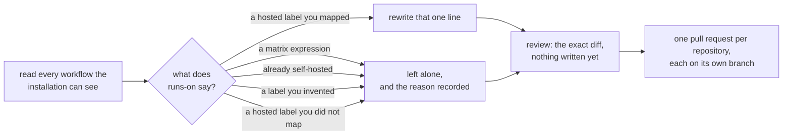

# Moving repositories onto your runners

You have a fleet. Your workflows still say `runs-on: ubuntu-latest`, in every
repository, in every job. The migration wizard changes those lines and opens a
pull request on each repository, and it shows you the exact diff before it opens
anything.

Open it at **Migrate** in the navigation, or `g` then `m`.

## What it does

{ .zoomies-shot }
{ .zoomies-shot }

1. **Reads.** It lists the repositories your GitHub App installation can see and
   reads the workflow files at the top of each one's `.github/workflows`. A large
   organisation is read a page at a time — **Read the next page** appends to the
   list rather than replacing it, so you end up looking at one list of everything
   you have looked at, with the choices you made on the way still ticked.
2. **Proposes.** For every rented-runner label it found — GitHub's own
   (`ubuntu-latest`, `ubuntu-24.04-arm`, `macos-14`) and the vendors that sit in
   front of Actions (`blacksmith-4vcpu-ubuntu-2404`, `buildjet-4vcpu-ubuntu-2204`,
   `warp-ubuntu-latest-x64-4x`, `nscloud-…`, `depot-…`, `ubicloud-…`) — it
   proposes the pool that promises the same operating system and architecture.
   A vendor's machines are the bill this fleet exists to replace, so its labels
   are as migratable as GitHub's.
3. **Lets you make exceptions.** One answer per label is the default and usually
   the whole answer. Where it is not, any single job can be pointed somewhere
   else — see [one job at a time](#one-job-at-a-time).
4. **Shows you.** A unified diff of every file it would change, and every job it
   would not, with the reason.
5. **Opens.** One pull request per repository, each on its own branch, changing
   only the `runs-on` lines you reviewed.

Nothing before step five writes anything.



## Choosing what moves

Two things are true of any organisation, and the repository step is shaped
around them.

Most repositories cannot move — the App cannot read them, they have no
workflows, or their jobs already point somewhere deliberate. Those are **hidden
by default**, with a count of how many, and the switch above the list shows them
again: "acme/docs has no workflows" is an answer worth being able to check, but
it is not what this step is for.

The ones that can move often have several workflow files, and a release or a
nightly is exactly the one to leave where it is. A repository with more than one
such file can be opened up and **picked through file by file**; the review step
then shows only the files you ticked, and the pull request touches only those.

## What it changes, and what it will not

It rewrites `runs-on` and nothing else. Comments, indentation, quoting, key
order, blank lines and line endings all survive byte for byte — it is a
line-level edit, not a YAML round trip, because a pull request that reformats
the whole file hides the one line that actually changed.

```diff
 jobs:
   build:
-    runs-on: ubuntu-latest      # the cheap one
+    runs-on: zoomies-linux-x64      # the cheap one
     steps:
       - uses: actions/checkout@v4
```

Four things it leaves alone, and says so:

| It sees | It does | Because |
| --- | --- | --- |
| `runs-on: ${{ matrix.os }}` | Skips it | What it resolves to is decided elsewhere in the file, or in a reusable workflow, or by a repository variable. |
| `runs-on: [self-hosted, linux]` | Skips it | Somebody already pointed this job somewhere deliberate. |
| `runs-on: acme-bigbox` | Skips it | Not a label any hosted-runner vendor publishes, so it is a runner group or a fleet of your own. |
| A rented label you did not map | Skips it | You chose to leave those jobs where they are. |

Each skip is listed in the review step and again in the pull request body, so
whoever reviews the change can see which jobs are still running on GitHub after
they merge it.

## Coming from your own static runners

The second row of that table is the interesting one. If your workflows already
say `runs-on: [self-hosted, linux, x64]`, or name a label your own machines
advertise, the wizard skips them on purpose — and you do not need it, because
there is a shorter route that changes no workflow at all.

Give a Zoomies pool the label your existing runners already advertise. Labels
every `actions/runner` binary carries anyway — `self-hosted`, `linux`,
`windows`, `macos`, `x64`, `arm64`, `arm` — never decide which pool a job goes
to, so a job asking only for those reaches any pool whose platform does not
contradict it. Anything else is matched exactly: a pool carrying `acme-bigbox`
is what `runs-on: acme-bigbox` finds.

So the move looks like this, and no pull request is involved:

1. Create a pool whose labels include the one your static runners advertise.
2. Watch a job land on it — the Jobs page names the pool that claimed each one.
3. Take the old runners offline as the work moves across. GitHub sends each job
   to whichever matching runner is idle, so the two can overlap for as long as
   you like.

The wizard is for the repositories still on GitHub's own runners, or renting
somebody else's. This is for the ones already on machines you own.

## The labels it writes

A pool's branded label, on its own:

```yaml
jobs:
  build:
    runs-on: zoomies-linux-x64
```

One label is enough to reach a pool, and it is what a workflow should write. The
older habit — `runs-on: [self-hosted, linux, x64]` — is longer, says nothing
about *which* fleet, and breaks as soon as two pools share an architecture.

Every pool also answers to `zoomies`, so `runs-on: zoomies` means "any runner
this fleet has". That is the line to write in a repository nobody has decided a
pool for yet.

## One job at a time

The **Labels** step answers "where does `ubuntu-latest` go" once, for every
repository at once. That is what a fleet nearly always wants, and it is the
default every job starts on.

"Nearly always" is not always. The **Exceptions** step lists every job in the
files you ticked, with the answer the label mapping already gave it, and changing
one changes only that job:

| You want | You do |
| --- | --- |
| The integration suite on the big host | Point `acme/widgets` → `ci.yml` → `integration` at that pool. |
| One job left where it is while everything else moves | Point it at **Leave this job where it is**. |
| A repository moved a job at a time | Leave the mapping empty and point the jobs you are ready for. |
| One Windows job moved, with no Windows pool proposed | Point it at the pool you know can take it. |

An exception names exactly one place — a job, in a workflow file, in a
repository. There are no patterns and no wildcards, because a pattern would
match jobs you did not read in the review step, and reading the exact change is
what this wizard is for. Two repositories with a job called `build` are two
jobs.

Doing nothing here is the normal outcome. Every row starts on **Use the label
mapping**, and the review step marks the ones that do not, so a diff that
disagrees with the mapping always says why.

The jobs in the table above are listed too, greyed, with the same reason: a
`runs-on: ${{ matrix.os }}` is not a decision an exception can make either, so it
is not offered as one. So is a `runs-on` the scan could not attribute to a job
name — there would be nothing stable to pin the exception to when the pull
request step re-reads the file.

## Permissions

This is the only thing in Zoomies that writes to a repository, and it needs
three App permissions the rest of Zoomies has no use for:

| Permission | Level | Why |
| --- | --- | --- |
| Contents | read and write | To create a branch and commit the file. |
| Pull requests | read and write | To open the pull request. |
| Workflows | write | GitHub requires it specifically to change files under `.github/workflows`. |

They are in the App manifest the installer builds, so an App created by Zoomies
already has them and there is nothing to do. Asking at creation is a deliberate
trade: an App that manages a fleet's runners is a high-value credential and most
fleets never migrate anything, but adding a permission to an App that already
exists is not a setting you can flip. GitHub holds the change until the
account's owner accepts it on the installation, and until they do the wizard
cannot even *read* a workflow — it reports every repository as unreadable, which
looks like a broken product rather than a missing permission. One consent
screen, at the point you are already reading one, is the honest version.

If your App predates this — or you removed them, which is a reasonable thing to
do in a fleet that will never migrate — add them once:

1. Open the App's settings — the review step links straight to the page.
2. **Permissions & events**, set the three above.
3. Accept the change on the installation. GitHub asks the account's owner.

The wizard checks before it tries. If they are missing it says so at the review
step, names each one the way GitHub's settings page names it, and refuses to go
further — rather than discovering it halfway through a batch with three of your
eight repositories done.

## What it will not do to you

* **It never force-pushes.** Each run commits to a branch carrying its own
  timestamp, so running the wizard twice opens a second pull request beside the
  first rather than rewriting one somebody is reviewing.
* **It never clobbers a concurrent push.** Every file is committed against the
  blob SHA it was read at. A push that lands while you are reviewing is a
  conflict, and that repository fails with a message rather than silently
  reverting somebody's change.
* **It never opens more than 25 pull requests in one call**, reads at most 50
  repositories per scan, and refuses an empty repository list rather than
  defaulting to everything the App can see. A mistake should be 25 pull requests
  to close, not an organisation-wide one.
* **It never merges anything.** The pull request is somebody's to review.
* **A failure is contained.** Each repository is its own branch and its own pull
  request, so one failing leaves it exactly as it was and the others alone.

## Doing it from the API

The wizard is two endpoints, and they are as usable from a script as from a
browser. See [the API surface](api-surface.md#migrations).

```sh
# What would change. Writes nothing.
curl -sS -X POST https://zoomies.example.com/api/v1/migrations/plan \
  -H "Authorization: Bearer $ZOOMIES_TOKEN" \
  -H 'Content-Type: application/json' \
  -d '{"installation_id": "ins_...", "repos": ["acme/widgets"]}'

# Open them.
curl -sS -X POST https://zoomies.example.com/api/v1/migrations/pull-requests \
  -H "Authorization: Bearer $ZOOMIES_TOKEN" \
  -H 'Content-Type: application/json' \
  -d '{
        "installation_id": "ins_...",
        "repos": ["acme/widgets"],
        "mapping": {"ubuntu-latest": "zoomies-linux-x64"},
        "overrides": [
          {"repo": "acme/widgets", "path": ".github/workflows/ci.yml",
           "job": "integration", "to": "zoomies-linux-arm64"},
          {"repo": "acme/widgets", "path": ".github/workflows/ci.yml",
           "job": "flaky", "to": ""}
        ]
      }'
```

`plan` answers with one page of repositories: send its `next_cursor` back as
`cursor` to read the one after it. `pull-requests` takes an optional `workflows`
object — `{"acme/widgets": [".github/workflows/ci.yml"]}` — to narrow a
repository to the files named for it; a repository left out of it gets every
file the mapping would change.

`overrides` is the Exceptions step, and it is optional on both endpoints. Each
entry needs `repo`, `path` and `job`; a `to` of `""` leaves that one job on the
runner it names today. A request that maps no label at all is accepted as long
as one override carries a `to` — pointing three jobs at a pool by name is a
migration too. An override that names a job the plan could not attribute, or a
path that is not a workflow GitHub runs, is refused rather than dropped.

Both need the operator role. `plan` costs a burst of the installation's GitHub
quota — the same quota the scheduler uses — which is why a viewer cannot spend
it.

The apply call re-reads and re-plans from each repository's current contents
rather than trusting a plan a client hands back. The workflows may have moved
since the review, and an endpoint that committed file contents supplied by its
caller would be a way to write arbitrary files into any repository the App can
reach.

## After it merges

Nothing else to do. The next `workflow_job` webhook for that repository arrives
with your pool's label on it, the scheduler matches it, and a runner starts. If
a job queues and nothing happens, the **Jobs** page has an "unmatched" filter
that finds *queued* jobs no pool claims and says why — usually a label typo, or a
pool that is disabled. A job that already ran is never listed there, however its
labels read: half-migrated repositories are the normal state of a migration, and
their jobs run on somebody else's machines rather than being stuck.
