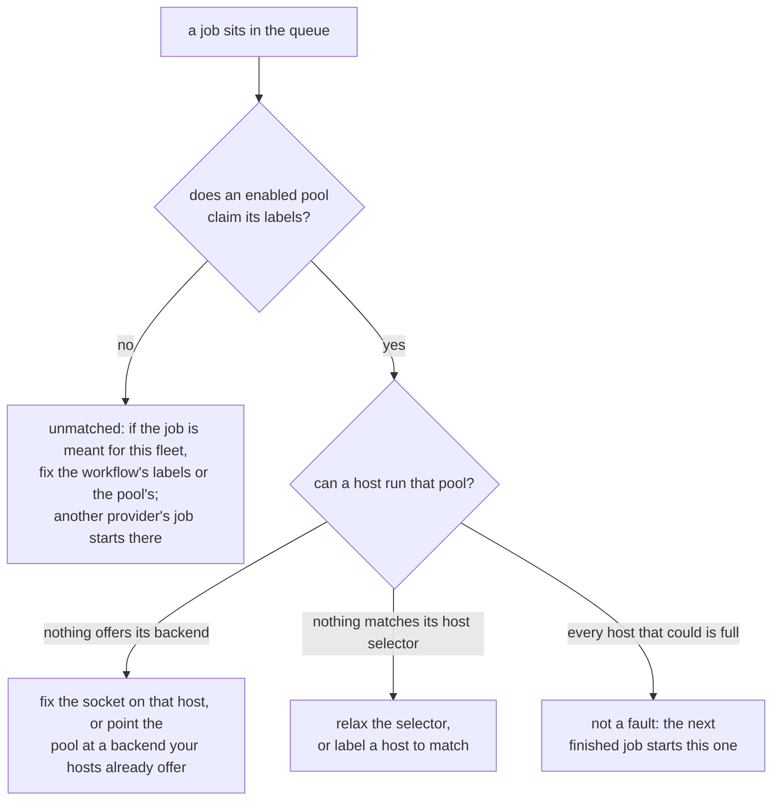

# Quick start

Five minutes, on a fresh Ubuntu, Debian, Fedora or Alpine host. macOS works too
for running a controller in development.

## 1. Install

```sh
curl -fsSL https://zoomies.sh/install.sh | sh
```

The script is POSIX `sh`, and it is written to be read before it is run — which
is the way we would rather you did it:

```sh
curl -fsSLO https://zoomies.sh/install.sh
less install.sh
sh install.sh
```

It works out your OS and architecture, your distribution and init system,
whether Docker or Podman is present and whether its socket is actually
reachable, whether that socket is rootless, which `compose` command you have,
whether ports 8080 and 443 are free — where `ss` or `netstat` exists to tell it,
and it says so when neither does — and whether Zoomies is already installed, in
which case it upgrades in place and says so.

The download must verify. It is checked against the release's `checksums.txt`,
and every way that can fail — a mismatch, no entry for this asset, no hashing
tool on the host, a checksums file that could not be fetched — refuses the
install rather than warning about it. A private mirror that publishes no
checksums is the one supported exception, with `--allow-unverified`.

Before it changes anything it prints what it is about to do — the version, where
the binary goes, whether it needs `sudo`, and what it leaves alone — and asks
once. `--yes` and `--non-interactive` skip the question.

Everything it discovered is handed to `zoomies init`, so the interactive setup
never asks a question the script already answered.

## 2. Choose how it runs

`zoomies init` offers only what your host can do:

=== "Native"

    The binary under systemd, with a hardened unit. Leanest, starts fastest,
    and needs no container runtime for the controller itself. **Setup finishes
    here**, including the GitHub App, your administrator and your first pool.

=== "Docker Compose"

    Writes a `docker-compose.yml` and a fully populated `.env`, then brings it
    up. Easiest to upgrade and to move to another host. It is the default
    whenever you have a `compose` command.

=== "Docker"

    A single container. Fewest files, but you manage the run command yourself.

!!! note "The containerised options move the last three steps to the browser"

    A container keeps its database in a volume the installer cannot open, so on
    the compose and docker paths the administrator, the GitHub App and the first
    pool are created in the browser afterwards rather than in the terminal. The
    closing summary prints all three with their exact addresses, and the
    Overview repeats them as a checklist that ticks itself off as you go.

Whichever you choose, the containerised deployments write a **fully populated
`.env`** -- no placeholders to go back and fill in. Every variable carries a
one-line comment saying what it is for, the file is `0600` because it holds your
encryption key, and it is written atomically so an interrupted install never
leaves a half-written file that compose would then read.

Re-running the installer over an existing deployment is an upgrade, not a
reinstall: it **keeps the existing encryption key** (minting a new one would
make every stored secret undecryptable) and backs the old file up beside it.

Then it walks the rest: a dedicated service user and directories, an encryption
key (which it will tell you to back up, and say exactly what is lost without),
the runner backend — preferring a rootless Docker or Podman socket, and
spelling out the consequence of each alternative — the bind address and TLS, and
your first administrator account.

Setup does not assume the service account can reach the container socket, it
checks. The account's access is worked out from the socket's own owner and mode
rather than from a group called `docker`, which is the wrong group on a Podman
socket or a distribution that names it something else; the account is added to
whichever group that is; and the check runs **again** afterwards, so an install
only reports success it has verified. Where joining a group cannot help — a
socket with no group permissions at all — it says so and names the two ways out,
instead of leaving you with a fleet that comes up unable to run anything.

## 3. Connect GitHub

Zoomies creates the GitHub App for you through the manifest flow. It opens your
browser at a pre-filled form — and always prints the URL as well, so a headless
host still works — with exactly the permissions it needs and no more:

| Permission | Why |
| --- | --- |
| `organization_self_hosted_runners: write` | register and remove runners (org targets) |
| `administration: write` | the same, for a repository target (a single repository, which is also how a personal account is used) |
| `actions: read` | read workflow runs and jobs for the fallback poller |
| `metadata: read` | required by GitHub for any App |
| `contents: write` | read and rewrite workflow files for the [migration wizard](migration.md) |
| `pull_requests: write` | open the migration wizard's pull request |
| `workflows: write` | GitHub requires it specifically to change files under `.github/workflows` |
| `workflow_job` event | the webhook that makes scaling instant |

The last three are the migration wizard's, and they are asked for now rather
than later because later is expensive: adding a permission to an App that
already exists is held by GitHub until the account's owner accepts it on the
installation, and until they do the wizard cannot read a workflow at all. If you
never migrate anything, remove them on the App's **Permissions & events** page —
nothing else in Zoomies writes to a repository.

Create the App, install it on your organisation -- or, for a repository target,
on your own account scoped to that repository, which is how a personal account
is used -- and the credentials come back to the installer automatically. The
private key is sealed with your instance encryption key before it touches the
database, and is never returned by the API.

## 4. Your first pool

A pool says what labels your runners answer to and how many may exist.
On a single-host install made by `zoomies init`, setup creates this one for you
once GitHub is connected -- it is derived from what the host actually is, so the
numbers below are what you get on a 4-CPU Linux box with Docker. The
repository's `docker-compose.yml` has no installer, so on that path you create
it yourself on the **Pools** page:

| | |
| --- | --- |
| **Name** | `zoomies-linux-x64` |
| **Labels** | `zoomies-linux-x64` — what your workflows put in `runs-on` — and `zoomies`, which every pool answers to |
| **Backend** | Docker (rootless if available) |
| **Min / max** | `0` / `4` — nothing idle when nothing is queued; the max is the host's capacity |
| **Idle timeout** | `5m` |
| **Ephemeral** | yes |
| **Docker in jobs** | none |

The wizard does not make you invent the first two rows. It opens with a name
already in the field -- the brand, a name from the kennel and the
infrastructure the runners will land on, so `zoomies-biscuit-docker-linux` --
and a label derived from that name, so the pool is reachable by a workflow
before you have typed anything. The dice beside the field roll another name;
type over it and the wizard leaves the name and the label alone from then on.
Every name it offers starts with `zoomies-`, which is what tells you a runner
in GitHub's own settings is one of yours.

Decline it, or set `pool.skip` in an answer file, and the Pools page starts
empty; nothing runs until a pool exists. Either way, always set a maximum. It
is your only backstop against a runaway workflow.

## 5. Run something

```yaml
jobs:
  build:
    runs-on: zoomies-linux-x64
    steps:
      - uses: actions/checkout@v4
      - run: make test
```

One label is enough, and it is branded on purpose: a reviewer of the pull request
that introduces it can tell at a glance that the job has left GitHub's runners.
`runs-on: zoomies` works too, and means "anywhere in this fleet".

Push it. Zoomies sees the `workflow_job` webhook, starts a runner, and you watch
the whole thing happen on the Overview page without refreshing — including the
scheduler's reasoning, in its own words:

```
scaled zoomies-linux-x64 0 -> 1: 1 job queued > 30s
```

The Jobs page keeps the record: how long each job waited, how long it ran,
which runner took it, and — for anything that failed — the step it failed at.

{ .zoomies-shot }
{ .zoomies-shot }

## Moving the rest of your repositories

Editing every workflow by hand is the part nobody does. **Migrate** in the
navigation reads the workflows in the repositories your App can see, rewrites
their `runs-on` lines, shows you the exact diff, and opens one pull request per
repository. See [Migrating repositories](migration.md).

## Adding another host

**Hosts → Add a host** does the whole thing on one page. It comes filled in --
the address your browser reached the controller on, the labels your pools
already select hosts by, capacity left for the agent to decide -- and hands you
one line to paste into a shell on the new machine:

```sh
curl -fsSL https://zoomies.sh/install.sh | sh -s -- \
  --mode agent \
  --controller https://zoomies.example.com \
  --join-token zoojoin_...
```

Leave the page open. It watches for the host and says the moment it has
joined: what the machine is, which backends it offers, and which pools can
place runners on it. If the binary is already on that machine, the same page
offers the shorter `zoomies agent join` form, and the CLI can mint a token too
with `zoomies hosts join-token create`.

Join tokens are single-use and short-lived. The agent connects outbound only, so
the new host needs no inbound firewall rule.

[Hosts and pools](hosts-and-pools.md) takes it from here: what a host brings with
it, cordoning one for maintenance, when a second pool is worth having, and the
rules that decide which host a runner lands on.

## Unattended installs

Every prompt has a flag, and there is an answer file for the rest:

```sh
sh install.sh --non-interactive --answers zoomies-answers.yaml
```

`zoomies init --print-answers` writes a commented template. In non-interactive
mode a missing required answer is an error naming the key and what it is for,
never a silent default.

## If something is wrong

```sh
zoomies status          # the Overview, in a terminal
zoomies config check    # validate the config without starting anything
journalctl -u zoomies -n 50
```

The problems drawer -- the count in the UI's top bar opens it --
`GET /api/v1/problems` and `zoomies status` all render the same list, each entry with what is true, why it matters and what to
change. When there is nothing wrong it is one quiet line.

### When setup goes wrong

Five things go wrong on a first run more often than anything else, and each has
a way back.

**Locked out of your own controller.** There is no password reset over the
network, deliberately. On the host: stop the service, put
`security: {disable_auth: true}` in `zoomies.yaml` *while the listener is still
on loopback*, start it, create a replacement administrator under
Settings → Users, take the setting out again, and restart. Anyone who can reach
the listener while that is set is an administrator, which is why the loopback
bind is not optional here.

**The encryption key is gone.** Pools, runners, jobs and the audit log are not
encrypted, so the fleet's state survives — but the GitHub App's private key and
every webhook secret were sealed with that key and cannot be recovered. Generate
a new private key on the App's settings page on GitHub, then
Installations → Connect GitHub → **Use an App you already have**, and paste the
new PEM and a fresh webhook secret. A new key is written on the next start; back
that one up.

**The App handshake did not come back.** The App and its private key are
recorded the moment GitHub hands them over, before you are asked to install it —
so a browser that wandered off has cost you nothing. Open
Installations → Connect GitHub again: the flow resumes where it stopped and asks
only for the installation ID, and it takes the whole URL GitHub left you on if
that is what you have to hand.

**A half-finished install.** Running `zoomies init` again is safe: it notices
that setup did not finish and carries on from where it stopped, keeping your
encryption key and database. To start over instead, `zoomies uninstall` (or
`sh install.sh --uninstall`) stops the service, removes the unit, the service
account and the data directory, and offers to deregister your runners from
GitHub first.

**No Docker or Podman on the host.** The native install works regardless — only
the compose and docker *deployments* need a runtime. For running jobs, the
process backend executes workflow steps directly on the host as the agent's
user, with no container isolation and nothing cleaned up between jobs beyond the
work directory. It is a reasonable choice for a machine that runs your own
trusted workflows and a bad one for anything else; see
[Security](security.md#agentbackend-process).

### A job that sits in the queue

Two different faults look the same from GitHub, and the problems drawer tells
them apart:



* **No pool claims the job.** Its `runs-on` labels match no enabled pool. Change
  the workflow's labels, or the pool's.
* **No host can run the pool.** A pool is claiming the job and nothing in the
  fleet offers its backend, matches its host selector, or has room left. The
  panel names which, and repeats what the host's own agent said -- an
  unreadable `docker.sock` is the usual answer, and it is fixed on the host
  rather than in the pool.

  A pool blocked on its backend has two ways out, and both are named where the
  problem is. On the host, the agent's sentence about a socket it cannot open
  identifies **its own account**, not `$USER`: an agent installed as a service
  runs as `zoomies`, so a `usermod` copied from a shell adds the wrong user and
  changes nothing. When that account is already in the group, the agent says so
  and asks to be restarted instead, because a running process cannot gain a
  group it did not start with. When the agent is itself a container -- the
  compose and `docker run` deployments -- it says so and gives the container's
  fix instead, because its account exists only inside the image and a `usermod`
  on the host answers `user 'nonroot' does not exist`. A container is given
  its groups when it is created, so the sentence names the group the
  container actually holds against the one that owns the socket -- "holds
  999, socket is 987" -- and gives the two steps: with compose, change
  `DOCKER_GID` in `.env` and run `docker compose up -d`, which recreates the
  container (no `down` first, and never `down -v`, which deletes the volume
  with the database in it); with `docker run`, recreate it with
  `--group-add <gid>`. Setup checks the same thing before it starts one, and
  the repository's compose file refuses to start without a `DOCKER_GID` at
  all. In the controller, if your hosts offer a backend
  this pool is not using, the problem names it and the pool's own page offers
  the change as a button -- the runners it already has finish their jobs first.
  Wherever one of these sentences carries a command, the UI shows it as a
  command with a copy button rather than as prose to retype.

  The wizard will not make this pool in the first place: choosing a backend no
  connected host offers stops it, says which backends they do offer and how many
  hosts each, and switches the pool to one of them in a click. It gives way only
  when there is nothing better to insist on -- no hosts yet, or no host offering
  anything -- which is how the first pool gets created before the first agent
  joins.

A host whose Docker daemon was not up when the agent started re-probes as it
runs, so it starts taking work within a heartbeat of the daemon appearing. What
each host can currently run, and why it cannot run the rest, is on the Hosts
page.

## Next

- [Hosts and pools](hosts-and-pools.md) — a second machine, a second pool, and how placement is decided
- [Configuration](configuration.md) — every setting, including running behind Cloudflare
- [Security](security.md) — the threat model, and what each dangerous toggle costs
- [Architecture](architecture.md) — how the pieces fit
- [API](api-surface.md) — the REST surface the UI and CLI both use
