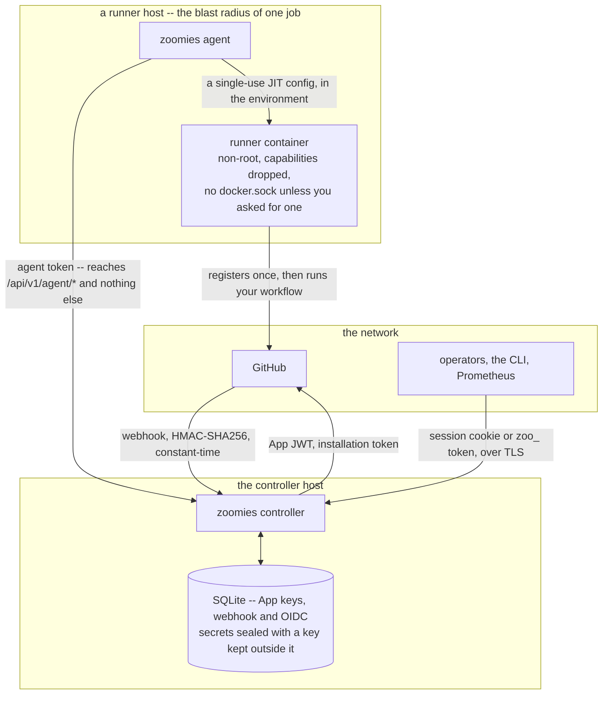
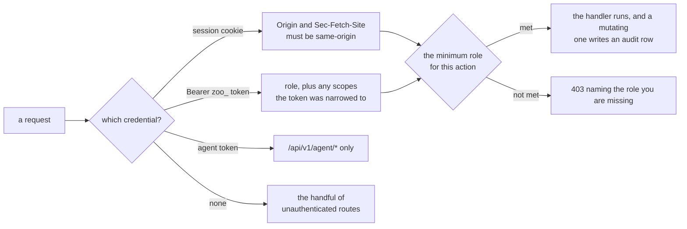

# Zoomies security

This document says what Zoomies protects, what it does not, and what every
dangerous setting actually costs you. Nothing here is hypothetical — each toggle
below is a real setting, and each one produces a named warning at startup and in
the UI's problems drawer when it is on.

---

## 1. The fundamental problem

**A self-hosted runner executes code from your repositories.** Anyone who can
cause a workflow to run — which, on a public repository, is anyone who can open
a pull request — can execute arbitrary code inside your runner.

GitHub's own guidance is blunt about this: do not use self-hosted runners with
public repositories. Zoomies does not change that. What it does is make the
blast radius of each execution as small as it can reasonably be:

* one job per runner, then the container is destroyed (ephemeral by default);
* no long-lived credential on the runner — a JIT registration is single-use;
* no Docker daemon reachable from the job unless you explicitly ask for one;
* a non-root user inside the container;
* capabilities dropped to a build-shaped minimum, `no-new-privileges` set.

## 2. Threat model

Three places, and every credential that crosses between them:

The runner container is the only place untrusted code runs, and the credential
it is given registers one runner and then expires. The host's own credential
reaches `/api/v1/agent/*` and nothing else: an agent can claim tasks and report
on its own runners, and cannot read pools, jobs, users or the audit log.

### In scope

| Threat | Mitigation |
| --- | --- |
| A malicious job tries to read another job's secrets or source | Ephemeral runners: the container that ran the previous job no longer exists |
| A malicious job tries to reach the host | Container isolation, non-root user, dropped capabilities, no `docker.sock` by default |
| A malicious job steals the runner registration credential and registers its own runner | JIT configurations are single-use and expire; there is no reusable PAT on the host. The entrypoint also unsets both the JIT configuration and the registration token before it starts `run.sh`, so neither is in the environment a workflow step inherits — which matters most on a pool with `ephemeral: false`, where the credential is an organisation-scoped registration token good for an hour rather than a single-use one |
| Someone forges a webhook to make Zoomies create runners | HMAC-SHA256 signature verification on every delivery, constant-time comparison |
| Someone reaches the controller's API | Authentication required by default; the listener binds to loopback unless told otherwise |
| Someone reaches a freshly deployed controller before its owner does | The first-run endpoint needs the setup token printed in the controller's log, not merely an empty database |
| A host enrolled with a join token tries to become a different host, or to advertise labels that win it another pool's work | Taking over an existing host by name needs that host's own agent token; join-token labels win over the agent's |
| A stolen browser session | Sessions are hashed at rest, `HttpOnly` + `SameSite=Lax` + `Secure` (when the external URL is https), and expire |
| A stolen API token | Tokens are stored as SHA-256 hashes, scoped by role, optionally expiring, individually revocable |
| Someone reads the database file or a backup | GitHub App private keys, webhook secrets and OIDC client secrets are AES-256-GCM sealed with a key held outside the database |
| An operator does something destructive | Every mutating action writes an audit row with actor, target, and a before/after diff with secrets redacted |
| A compromised agent | Agents can only claim tasks and report on their own runners; they cannot read pools, jobs, users or the audit log |

### Out of scope

* **A malicious job escaping the container.** Container isolation is the boundary.
  If you need a stronger one, run one agent per trust domain on separate hosts,
  or use the `process` backend inside a VM you are willing to lose.
* **Multi-tenancy between untrusted organisations.** One Zoomies instance is one
  team's fleet. Pools are not a security boundary between tenants.
* **Compromise of the GitHub App itself.** If the App's private key leaks, the
  attacker can register runners against your org, and — because the App is
  created with the [migration wizard's](migration.md) permissions — commit to a
  branch and open a pull request on the repositories it is installed on. It
  cannot merge one. Rotate the key in GitHub and re-enter it in Zoomies; a fleet
  that will never migrate anything can drop those three permissions on the App's
  **Permissions & events** page.
* **Denial of service.** `repository_scale_up_limit` can best-effort throttle
  new runner creation attributed to one repository, but it is not a security
  boundary or strict concurrency quota: GitHub can assign that repository's
  jobs to compatible idle runners. Use `max_runners` as the pool-wide backstop;
  strict separation requires repository-specific pools and workflow labels.

---

## 3. Credentials and how they are stored

| Credential | Where it lives | Protection |
| --- | --- | --- |
| GitHub App private key (PEM) | `installations.private_key_enc` | AES-256-GCM, key from env or key file |
| Webhook HMAC secret | `installations.webhook_secret_enc` | Same |
| OIDC client secret | config / `settings` | Sealed when stored in the database |
| User passwords | `users.password_hash` | argon2id, 64 MiB × 2 passes × 4 lanes, 16-byte salt |
| Session cookies | `sessions.token_hash` | SHA-256 of a 32-byte random token |
| API tokens | `api_tokens.token_hash` | SHA-256; the plaintext is shown exactly once. Revoked with the account they belong to: disabling or deleting a user revokes their tokens, and one whose owner is disabled or gone is refused even if it was not |
| Agent tokens | `hosts.token_hash` | SHA-256; issued once at join |
| Join tokens | `join_tokens.token_hash` | SHA-256, single-use, short TTL |
| JIT runner configs | Never stored | Passed to the agent in a task and to the container in its environment |

### The instance encryption key

32 bytes, base64 or hex, supplied by one of:

1. `ZOOMIES_ENCRYPTION_KEY` (preferred for containers)
2. `security.encryption_key_file` — a `0600` file; Zoomies refuses to read a key
   file that is group- or world-readable
3. `security.encryption_key` in `zoomies.yaml` — **warned about**, because
   anything that can read your config (backups, configuration management, a
   support bundle) can then decrypt every stored secret

**Back this key up.** Losing it means re-entering the GitHub App private key and
webhook secret. It does not mean losing the fleet's state — pools, runners, jobs
and the audit log are not encrypted.

Rotation: change the key and restart; Zoomies will fail to decrypt the existing
installation rows and tell you which ones to re-enter. There is no automatic
re-encryption in v1.

---

## 4. Authentication and authorisation

### Identities

* **Local users** — argon2id passwords. The first admin is created by
  `zoomies init` on the console, or by the one-time bootstrap endpoint, which
  refuses to run once any user exists **and** requires the setup token the
  controller prints in its log while the instance is empty. "No account exists
  yet" is a condition a stranger can satisfy too, so on its own it would hand a
  freshly deployed controller to whoever loaded the page first; the token is
  proof that the caller can read the controller's log. It is minted per process,
  so a restart prints a new one, and the line stops appearing once an account
  exists.
* **OIDC users** — optional. Linked by `sub`, and by username only for an
  account that has no local password: adopting one that does would let whoever
  holds that username at the identity provider take over the local account, so
  it takes `oidc.link_by_username`. An `email` claim is used as a username only
  when the provider says `email_verified`.
* **API tokens** — `zoo_<prefix>_<secret>`, sent as `Authorization: Bearer`.
  Carry a role and optionally a narrower scope list.
* **Agents** — a separate credential class that can only reach `/api/v1/agent/*`,
  and only for their own host: an agent may report on its own runners and write
  into its own log relay, and gets the same "no such stream" answer for anybody
  else's. A join token enrols a machine; it does not let that machine take over
  an existing host by claiming its name, which needs the agent token the
  previous registration was issued. Labels pinned by the join token win over
  labels the agent declares for itself, because host labels are what decide
  which pools' work — and which pools' runner registrations — a host is offered.

### Roles

| Role | May |
| --- | --- |
| **viewer** | Read pools, runners, jobs, hosts, the audit log and metrics. Never sees a secret value — including a pool's `env`, where a registry or proxy credential ends up: a viewer is sent the variable names with empty values, on the API and on the event stream alike. |
| **operator** | Everything a viewer may, plus act on the fleet: create and edit pools, drain/delete/restart runners, cordon hosts. |
| **admin** | Everything an operator may, plus manage users, API tokens, installations, join tokens and settings, and take a support bundle. |

The mapping from every individual API action to its minimum role is a table in
`internal/auth/rbac.go`, and a test walks the full action list — so a new
endpoint cannot be added without deciding who may call it.

The API refuses to remove or demote the last enabled admin.

### How one request is authorised

The action-to-role table is `internal/auth/rbac.go`. A mutating handler that
succeeds writes an audit row naming the actor, the target and a redacted
before/after; a refused login writes one too, because a burst of those is
something you want to see.

### Sessions

`HttpOnly`, `SameSite=Lax`, `Secure` when the external URL is https or TLS is
terminated by Zoomies. Default lifetime seven days. Changing a password
invalidates every other session for that user.

Login is rate limited per source address (default 10/minute) and, more loosely,
per account, so a pool of addresses does not buy an unbounded budget against one
person. An unknown username runs the argon2 KDF anyway, so response timing does
not enumerate accounts either. Nor does the answer: "this account is disabled"
is only said to somebody who has already given the right password, and an
SSO-only account — which has no password to prove anything with — is refused
exactly as an unknown username is. The reason is in the log and the audit trail
for whoever is diagnosing it.

A failed sign-in records the submitted username only when it names an account
that exists. An unrecognised one is stored as a short fingerprint instead: a
password typed into the username field is a common slip, and the audit log is
readable by every viewer on the instance.

Single sign-on binds its `state` to the browser that started the handshake with
a short-lived cookie, so a callback obtained by an attacker signing in as
themselves cannot be replayed into somebody else's browser.

---

## 5. Webhooks

Every delivery is verified with HMAC-SHA256 against the installation's secret,
compared in constant time. A delivery with a bad signature is recorded as
`rejected` and shows up on the Installations page — a burst of them means
somebody is probing you, and you should be able to see that.

The webhook endpoint is the one unauthenticated route that mutates state. It:

* accepts only `POST` with a body under 5 MiB;
* only acts on `workflow_job` and `ping`;
* records every delivery, accepted or not;
* never trusts a repository or label value beyond matching it against pools you
  configured.

If your controller is not reachable from GitHub, turn on `github.poll_fallback`
(it is on by default). Polling is slower but it is not less safe.

---

## 6. The dangerous toggles

Each of these is off by default and is named when it is on, and each is listed
here with what it actually costs. The instance-wide settings are warned about at
startup and shown in the UI's problems drawer -- except `server.bind` without
TLS, which is printed at startup and by `zoomies config check` but kept off the
drawer, because it is true of every fleet behind a TLS-terminating proxy and a
count that is always amber is a count nobody reads. The per-pool settings are
not startup matters at all: they are shown on the pool's own page and in the
drawer for as long as the pool has them.

This section is about what each dangerous setting *costs*.
[Problem codes](problem-codes.md) is the other half: every code Zoomies can
raise, dangerous or not, with its severity and what to do about it.

### `pool.docker_mode: host-socket`

Bind-mounts the host's `docker.sock` into every runner in the pool.

**Any job on this pool can start a privileged container, mount the host's root
filesystem, and become root on the host.** It also sees, and can stop, every
other container on the host — including other runners and Zoomies itself.

Use it only when every repository that can reach this pool is as trusted as the
host. Prefer `dind`.

The runner is not root in its container, so Zoomies also adds the group that
owns the socket to it. That is what makes the mount usable, and it is worth
knowing that it is the whole of the access control here: nothing else stands
between a job and that daemon.

### `pool.docker_mode: dind`

Runs a privileged `docker:dind` sidecar per runner, sharing a network namespace.

The job gets a real Docker daemon it can build with, and it cannot see the
host's containers. But the sidecar itself is `--privileged`, so a container
escape *from the sidecar* reaches the host. This is a real improvement on
`host-socket` and still not a security boundary you should bet a production
host on.

Either mode gives the job a daemon; the client comes from the image, and a pool
on the stock runner image is switched to its Docker variant as it asks for one.
An image of your own has to carry the client itself. See [Jobs that build
container images](configuration.md#jobs-that-build-container-images).

### `pool.ephemeral: false`

Runners persist across jobs.

Job N+1 inherits everything job N left behind: cloned source, build caches,
environment variables, credentials written to disk, background processes. This
is the single largest isolation regression available in the product. It exists
because some workloads genuinely need a warm cache.

### `pool.cache.scope: repository` under an organisation installation

The pool names the repository its cache is for, but its runners register to
the organisation, and GitHub gives a runner any queued job whose `runs-on`
matches its labels. A job from another repository that asks for this pool's
labels lands on one of its runners and reads and writes the cache — the
sharing the scope exists to prevent, held off only by a discipline kept in
other people's workflow files.

Give such a pool a branded label that only that repository's workflows use.
Zoomies warns about the combination on the pool's page and in the problems
panel, because the cache's privacy depends on something it cannot see. A
repository-targeted installation registers runners that only that
repository's jobs can reach, so there the cache is as private as it looks.

### `pool.run_as_root: true`

The job runs as UID 0 inside the container. Combined with any Docker mode, or
with a container escape, this is materially worse than the default.

### `agent.backend: process`

No container at all. Workflow steps run directly on the host as the agent's
user, sharing its filesystem, package manager, network and SSH agent.

If the agent runs as root, every workflow step from every matched repository
runs as root on that host. Zoomies warns about this combination specifically.

### `server.bind: 0.0.0.0` with `server.tls.mode: off`

Session cookies, API tokens and the GitHub App private key you paste during
setup all cross the network in cleartext.

This is legitimate *behind a TLS-terminating reverse proxy* — which is why it is
a warning rather than an error. If that is your setup, also set
`server.trusted_proxies` so audit entries record the real client address rather
than your proxy's. The word `cloudflare` stands for Cloudflare's published
ranges when Cloudflare is the proxy.

### `server.allowed_origins: ["*"]`

Switches the origin check off. Browser requests that change state are normally
accepted only from this controller's own origin (or an origin listed here), so
that a page on some other site an operator happens to visit cannot use their
session cookie to create pools, drain runners or mint tokens. `"*"` accepts any
origin, which is exactly that cross-site request forgery. List the origins that
actually host the UI instead. An `http://` origin on an `https://` controller
is warned about for a related reason: a plaintext page can be rewritten in
transit, and whatever rewrites it inherits the permission the entry grants.

### `server.trusted_proxies: [0.0.0.0/0]`

Believes `X-Forwarded-For` from every address. It is what makes a header-based
setup "just work", and what it costs is that any client can choose the address
the audit log records for it and defeat login rate limiting by rotating the one
it claims. List your proxy's own range, or the word `cloudflare`.

### `security.rate_limit_logins: 0`

Turns the sign-in rate limit off, so a password can be guessed from one address
as fast as the controller answers. The default of ten attempts per address per
minute is generous for a person and hopeless for a dictionary.

### `oidc.link_by_username: true`

Lets the first single sign-on login by a username take over an existing local
account of that name, password and role included. Off, a username alone links
only to an account created for SSO — one with no password — so an identity
provider whose users can influence their own username claim cannot hand someone
the local `admin` account. Turn it on for the migration from local passwords to
SSO, when every account is known and the provider is trusted to spell names
correctly, and turn it off again afterwards; or link the accounts by hand and
leave it off.

### `oidc.issuer: http://…`

Discovery, the token exchange and the client secret all travel to the identity
provider over plaintext HTTP, where anything on the path can read or replace
them and sign in as anyone. Use the issuer's `https://` address; a loopback
issuer for local development is not warned about.

### `security.disable_auth: true`

Every request is treated as an administrator.

Zoomies **refuses to start** with this set unless the controller looks
unreachable from anywhere but this machine — which means a loopback bind *and*
no `server.external_url` *and* no `server.trusted_proxies`. A loopback bind on
its own is not enough: loopback behind a reverse proxy is the deployment this
documentation recommends, and it is reachable by the whole internet. With
nothing in front of it, this is a warning, because it is genuinely useful for
local development.

### `server.allowed_origins: "*"`

The cross-origin check is off. Any site a signed-in operator visits can make
state-changing calls to this controller with their session; the `SameSite=Lax`
cookie still refuses most of them, but it becomes the only thing left. List the
origins you actually serve the UI from instead.

### `agent.allow_insecure_http: true`

The agent talks to a remote controller over plain HTTP. Its token and the JIT
runner configuration in every create task — a live registration credential for
your runner group — cross the network in the clear. Without this, a plaintext
controller URL that is not on loopback is refused outright.

### `oidc.link_by_username: true`

A successful SSO login adopts an existing account that still has a local
password. Whoever controls a username at your identity provider then controls
the local account of the same name, `admin` included. Turn it on for the one
migration where that is what you mean, then turn it off again.

### `metrics.public: true`

`/metrics` served without authentication. No repository or workflow name is a
label — the code stopped putting them there — but pool names, backend kinds,
runner and host states, the id of each GitHub App installation a call was made
for, and the build's version and commit are, and together they tell a stranger
what you run and how busy it is. Prefer giving Prometheus a viewer API token.

### `server.allow_indexing: true`

`robots.txt` invites search engines into the interface, advertises
`/sitemap.xml`, and the page's own directive changes from `noindex, nofollow` to
`index, follow`.

Nothing behind authentication becomes readable — the API still refuses a request
without a session — but the sign-in page, this controller's address and the fact
that it is a Zoomies fleet all become public knowledge, findable by anyone
searching for exactly that. Leave it off unless the instance is deliberately
public.

### `agent.allow_unverified_runner_download: true`

**What it does.** Lets the process backend install an `actions/runner` archive
whose SHA-256 Zoomies does not know.

**What it costs.** The runner is downloaded and then executed on the host as the
agent's user. Without a digest to check, anything between the host and the
download source -- a mirror, a proxy, a compromised network -- can substitute its
own archive, and the agent will run it. Zoomies ships the digests for the
release it pins, so the setting is only ever needed for a release it does not
know about.

**Do this instead.** Pin the release with `github.runner_version` and put its
digest, from the actions/runner release notes, in `agent.runner_sha256`.

### `agent.insecure_skip_verify: true`

The agent does not verify the controller's TLS certificate. Anything on the
network path can impersonate the controller and hand the agent arbitrary
containers to run. Pin the CA with `agent.ca_file` instead.

---

## 7. What is tested

The claims above are not assertions of intent. Each of these is a test that was
run against the code with its rule removed and confirmed to fail before it was
kept; a rule that could not be made to fail did not ship.

| Claim | Where |
| --- | --- |
| Every route refuses the roles below it, and every scoped token refuses the routes outside its resource | `TestRouteAuthorisation`, `TestScopedTokenRouteAuthorisation` (`internal/api`) |
| A scope narrows a role and never widens it | `TestScopesAreNarrowerThanRoles` (`internal/api`) |
| All five agent routes refuse a user credential, an anonymous caller and a revoked host | `TestAgentRoutesRefuseAUserCredential`, `TestADeletedHostsAgentTokenIsRefused` (`internal/api`) |
| A host cannot report a runner, a task result or a log chunk that is not its own | `TestAHostCannotReportOnAnotherHostsRunner`, `TestAHostCannotReportATaskResultForAnotherHostsRunner`, `TestLogRelayRefusesAnotherHostsStream` (`internal/controller`) |
| Secrets are absent from responses, error bodies, audit rows, event frames, metrics and the controller's log | `TestSecretsAreNeverInAResponse`, `TestSecretsAreNeverInAFailure` (`internal/api`) |
| A task carries the runner's registration credential and no controller secret | `TestACreateTaskCarriesNoControllerSecret` (`internal/controller`) |
| A `process` runner's environment is built, not inherited | `TestProcessChildEnvironmentIsBuiltNotInherited` (`internal/backend`) |
| Disabling an account ends its sessions, not merely its access | `TestDisablingAUserEndsItsSessionsAtTheAPI` (`internal/api`) |
| A cross-origin sign-in is refused, and a non-browser client is not | `TestCSRFRefusesACrossOriginLogin` (`internal/api`) |
| `X-Forwarded-Proto` is believed only from a trusted proxy | `TestForwardedProtoIsBelievedOnlyFromATrustedProxy` (`internal/api`) |
| Enrolment is rate limited, on a counter of its own | `TestAgentJoinIsRateLimited` (`internal/api`) |
| A live stream ends within one heartbeat of its credential being revoked, and keeps running while it stands | `TestAStreamEndsWhenItsCredentialIsRevoked`, `TestALogStreamEndsWhenItsCredentialIsRevoked`, `TestALiveStreamSurvivesItsOwnHeartbeat` (`internal/api`) |
| A name carrying markup is rendered as text, and a runner's output cannot retitle the page, clear it or open a dialog | `web/tests/hostile-input.spec.ts` |
| A link a runner printed is followed only when it is http or https, and then with `noopener` | `followableLink` in `web/src/lib/logs/LogViewer.svelte` (see the note in ZF-104's fourth pull request) |
| A body over the limit is refused, and the log relay is exempt | `TestOversizeRequestBodyIsRefused`, `TestARunnerThatPrintsMoreThanTheBodyLimitIsNotCutOff` (`internal/api`) |

### The supply chain

The [OpenSSF Scorecard](https://scorecard.dev/viewer/?uri=github.com/eyupio/zoomies)
on the README is the outside view of the same discipline, re-run weekly by
`.github/workflows/scorecard.yml`. Most of what it measures is in this
repository and checked by it: every action pinned to a commit, workflow tokens
that grant nothing at the top, Dependabot on all three ecosystems, CodeQL on
every pull request, `govulncheck` on every change, a fuzz workflow, and a
release that ships its build provenance twice — a Sigstore bundle for
`gh attestation verify` and the same statement as `.intoto.jsonl` for SLSA
tooling. `osv-scanner.toml` at the root is the one place an advisory is
ignored, and only when `govulncheck` has already shown the package is not in
the import graph and no version fixes it; an entry there names why.

Three of its checks are repository settings rather than files, so no pull
request can change them. They are recorded here so the next person to read the
score knows what it is measuring:

* **Branch-Protection** wants `main` to refuse a direct push and a force push,
  and to require the CI status checks before a merge.
* **Code-Review** counts merged pull requests approved by someone other than
  their author. A project with one maintainer scores zero here until it has
  two, and the score is honest about that.
* **CII-Best-Practices** looks for a badge earned at
  [bestpractices.dev](https://www.bestpractices.dev/projects/14604), a
  questionnaire a maintainer fills in about the practices this document
  describes. The project holds the passing badge; Scorecard picks it up on
  its next weekly run.

---

## 8. Hardening a production install

1. Create the first administrator before anyone else can. If you deployed with
   the compose file rather than the installer, the controller is listening the
   moment it starts: read the setup token out of its log
   (`docker compose logs zoomies`) and finish the first-run page. Keep the
   origin firewalled to your proxy as well, as the compose file's comments say.
1. Run the controller as a dedicated unprivileged user
   (`zoomies init` creates one).
2. Use a **rootless** Docker or Podman socket. The installer detects and prefers
   one.
3. Terminate TLS with a certificate GitHub trusts — either in Zoomies
   (`tls.mode: files`) or in a reverse proxy, and then set `trusted_proxies`.
4. Keep `ephemeral: true` and `docker_mode: none` on every pool you can.
5. Set `max_runners` on every pool. It is your only backstop against a runaway
   workflow.
6. Give automation scoped API tokens with expiry, not admin tokens.
7. Put the encryption key in `ZOOMIES_ENCRYPTION_KEY` or a `0600` file, and back
   it up somewhere that is not the same backup as the database.
8. Watch the audit log. `zoomies audit tail` and the Audit page both work.
9. Keep the runner image current — it carries the `actions/runner` release and
   its .NET dependency, and GitHub deprecates old runner versions.

## 9. Reporting a vulnerability

Open a [private security advisory][advisory] on the repository rather than a
public issue. Please include the version (`zoomies version`), the configuration
with secrets removed — `zoomies config print` produces it already blanked — and
what an attacker gains.

`SECURITY.md` in the repository root says the same thing, and is what GitHub
reads to offer "Report a vulnerability" on the repository's own security tab.
It also draws the line this document is the long form of: a dangerous setting
behaving dangerously is not a vulnerability, and a way to reach one without
setting it is.

[advisory]: https://github.com/eyupio/zoomies/security/advisories/new

## Tailcat private connections

Private tunnels expose only the agent API and retain Zoomies join-token and
agent-token authentication. No administrator route, SSH service, arbitrary
port forwarding or subnet routing is enabled. Tunnel identities are encrypted
in SQLite; agent capability addresses live in mode-0600 agent credentials.
Enrolment commands contain secrets and must not be published. Disabling
`server.tailcat_enabled` and restarting closes private connectivity; it does
not rotate the saved identity. See [private host credential handling and relay
limitations](private-hosts.md#restarts-and-credential-protection).
