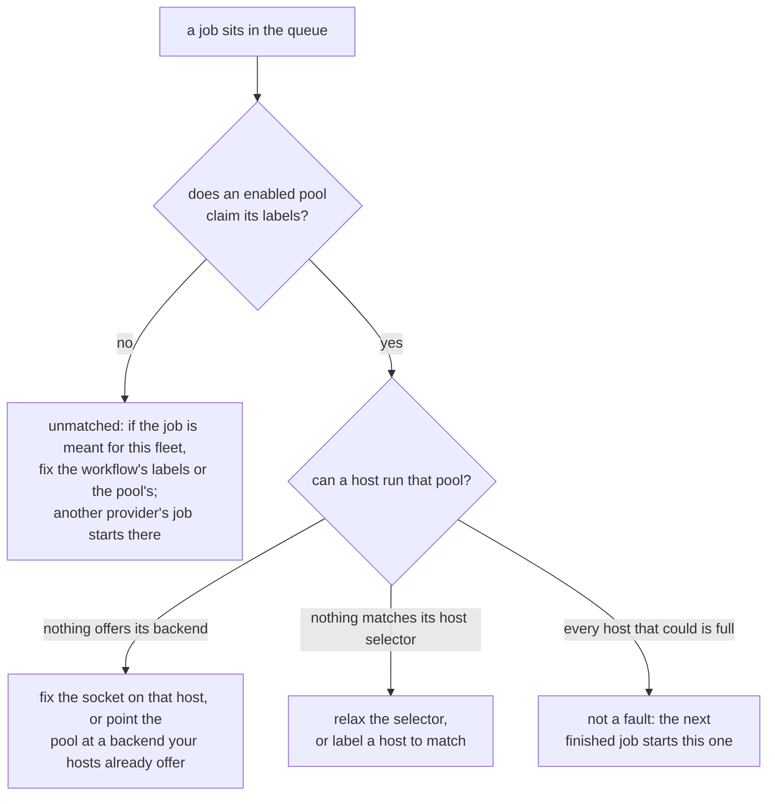

# Troubleshooting

Zoomies is built so that most of what goes wrong says so itself. The problems
drawer — the count in the UI's top bar opens it — `GET /api/v1/problems` and
`zoomies status` all render the same list, each entry with what is true, why it
matters and what to change. Every one carries a code, and
[Problem codes](problem-codes.md) is the full list.

Start here:

```sh
zoomies status          # the Overview, in a terminal
zoomies config check    # validate the config without starting anything
journalctl -u zoomies -n 50
```

This page is the rest: the things that go wrong before there is anything to
look at, and the one symptom that has more causes than any other.

## When setup goes wrong

Five things go wrong on a first run more often than anything else, and each has
a way back.

**Locked out of your own controller.** There is no password reset over the
network, deliberately. On the host: stop the service, put
`security: {disable_auth: true}` in `zoomies.yaml` *while the listener is still
on loopback*, start it, create a replacement administrator under
Settings → Users, take the setting out again, and restart. Anyone who can reach
the listener while that is set is an administrator, which is why the loopback
bind is not optional here.

**The encryption key is gone.** Pools, runners, jobs and the audit log are not
encrypted, so the fleet's state survives — but the GitHub App's private key and
every webhook secret were sealed with that key and cannot be recovered. Generate
a new private key on the App's settings page on GitHub, then
Installations → Connect GitHub → **Use an App you already have**, and paste the
new PEM and a fresh webhook secret. A new key is written on the next start; back
that one up.

**The App handshake did not come back.** The App and its private key are
recorded the moment GitHub hands them over, before you are asked to install it —
so a browser that wandered off has cost you nothing. Open
Installations → Connect GitHub again: the flow resumes where it stopped and asks
only for the installation ID, and it takes the whole URL GitHub left you on if
that is what you have to hand.

**A half-finished install.** Running `zoomies init` again is safe: it notices
that setup did not finish and carries on from where it stopped, keeping your
encryption key and database. To start over instead, `zoomies uninstall` (or
`sh install.sh --uninstall`) stops the service, removes the unit, the service
account and the data directory, and offers to deregister your runners from
GitHub first.

**No Docker or Podman on the host.** The native install works regardless — only
the compose and docker *deployments* need a runtime. For running jobs, the
process backend executes workflow steps directly on the host as the agent's
user, with no container isolation and nothing cleaned up between jobs beyond the
work directory. It is a reasonable choice for a machine that runs your own
trusted workflows and a bad one for anything else; see
[Security](security.md#agentbackend-process).

## A job that sits in the queue

Two different faults look the same from GitHub, and the problems drawer tells
them apart:



* **No pool claims the job.** Its `runs-on` labels match no enabled pool. Change
  the workflow's labels, or the pool's.
* **No host can run the pool.** A pool is claiming the job and nothing in the
  fleet offers its backend, matches its host selector, or has room left. The
  panel names which, and repeats what the host's own agent said -- an
  unreadable `docker.sock` is the usual answer, and it is fixed on the host
  rather than in the pool.

  A pool blocked on its backend has two ways out, and both are named where the
  problem is. On the host, the agent's sentence about a socket it cannot open
  identifies **its own account**, not `$USER`: an agent installed as a service
  runs as `zoomies`, so a `usermod` copied from a shell adds the wrong user and
  changes nothing. When that account is already in the group, the agent says so
  and asks to be restarted instead, because a running process cannot gain a
  group it did not start with. When the agent is itself a container -- the
  compose and `docker run` deployments -- it says so and gives the container's
  fix instead, because its account exists only inside the image and a `usermod`
  on the host answers `user 'nonroot' does not exist`. A container is given
  its groups when it is created, so the sentence names the group the
  container actually holds against the one that owns the socket -- "holds
  999, socket is 987" -- and gives the two steps: with compose, change
  `DOCKER_GID` in `.env` and run `docker compose up -d`, which recreates the
  container (no `down` first, and never `down -v`, which deletes the volume
  with the database in it); with `docker run`, recreate it with
  `--group-add <gid>`. Setup checks the same thing before it starts one, and
  the repository's compose file refuses to start without a `DOCKER_GID` at
  all. In the controller, if your hosts offer a backend
  this pool is not using, the problem names it and the pool's own page offers
  the change as a button -- the runners it already has finish their jobs first.
  Wherever one of these sentences carries a command, the UI shows it as a
  command with a copy button rather than as prose to retype.

  The wizard will not make this pool in the first place: choosing a backend no
  connected host offers stops it, says which backends they do offer and how many
  hosts each, and switches the pool to one of them in a click. It gives way only
  when there is nothing better to insist on -- no hosts yet, or no host offering
  anything -- which is how the first pool gets created before the first agent
  joins.

A host whose Docker daemon was not up when the agent started re-probes as it
runs, so it starts taking work within a heartbeat of the daemon appearing. What
each host can currently run, and why it cannot run the rest, is on the Hosts
page.
