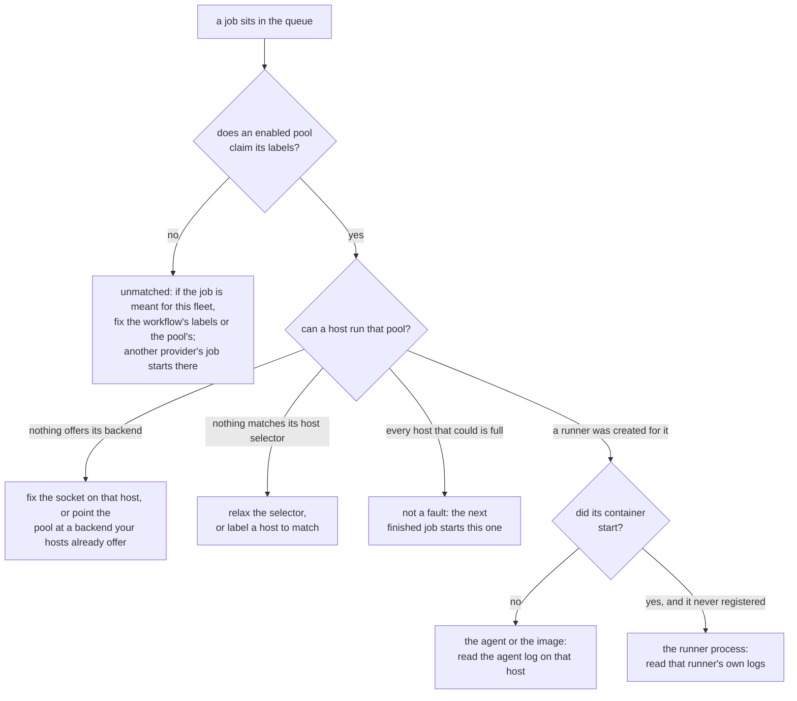

# Troubleshooting

Zoomies is built so that most of what goes wrong says so itself. The problems
drawer — the count in the UI's top bar opens it — `GET /api/v1/problems` and
`zoomies status` all render the same list, each entry with what is true, why it
matters and what to change. Every one carries a code, and
[Problem codes](problem-codes.md) is the full list.

Start here:

```sh
zoomies status          # the Overview, in a terminal
zoomies config check    # validate the config without starting anything
journalctl -u zoomies -n 50
```

This page is the rest: the things that go wrong before there is anything to
look at, and the one symptom that has more causes than any other.

## When setup goes wrong

Five things go wrong on a first run more often than anything else, and each has
a way back.

**Locked out of your own controller.** There is no password reset over the
network, deliberately. On the host: stop the service, put
`security: {disable_auth: true}` in `zoomies.yaml` *while the listener is still
on loopback*, start it, create a replacement administrator under
Settings → Users, take the setting out again, and restart. Anyone who can reach
the listener while that is set is an administrator, which is why the loopback
bind is not optional here.

**The encryption key is gone.** Pools, runners, jobs and the audit log are not
encrypted, so the fleet's state survives — but the GitHub App's private key and
every webhook secret were sealed with that key and cannot be recovered. Generate
a new private key on the App's settings page on GitHub, then
Installations → Connect GitHub → **Use an App you already have**, and paste the
new PEM and a fresh webhook secret. A new key is written on the next start; back
that one up.

**The App handshake did not come back.** The App and its private key are
recorded the moment GitHub hands them over, before you are asked to install it —
so a browser that wandered off has cost you nothing. Open
Installations → Connect GitHub again: the flow resumes where it stopped and asks
only for the installation ID, and it takes the whole URL GitHub left you on if
that is what you have to hand.

**A half-finished install.** Running `zoomies init` again is safe: it notices
that setup did not finish and carries on from where it stopped, keeping your
encryption key and database. To start over instead, `zoomies uninstall` (or
`sh install.sh --uninstall`) stops the service, removes the unit, the service
account and the data directory, and offers to deregister your runners from
GitHub first.

**No Docker or Podman on the host.** The native install works regardless — only
the compose and docker *deployments* need a runtime. For running jobs, the
process backend executes workflow steps directly on the host as the agent's
user, with no container isolation and nothing cleaned up between jobs beyond the
work directory. It is a reasonable choice for a machine that runs your own
trusted workflows and a bad one for anything else; see
[Security](security.md#agentbackend-process).

## A job that sits in the queue

Three different faults look the same from GitHub, and the problems drawer tells
them apart:



* **No pool claims the job.** Its `runs-on` labels match no enabled pool. Change
  the workflow's labels, or the pool's.
* **No host can run the pool.** A pool is claiming the job and nothing in the
  fleet offers its backend, matches its host selector, or has room left. The
  panel names which, and repeats what the host's own agent said -- an
  unreadable `docker.sock` is the usual answer, and it is fixed on the host
  rather than in the pool.

  A pool blocked on its backend has two ways out, and both are named where the
  problem is. On the host, the agent's sentence about a socket it cannot open
  identifies **its own account**, not `$USER`: an agent installed as a service
  runs as `zoomies`, so a `usermod` copied from a shell adds the wrong user and
  changes nothing. When that account is already in the group, the agent says so
  and asks to be restarted instead, because a running process cannot gain a
  group it did not start with. When the agent is itself a container -- the
  compose and `docker run` deployments -- it says so and gives the container's
  fix instead, because its account exists only inside the image and a `usermod`
  on the host answers `user 'nonroot' does not exist`. A container is given
  its groups when it is created, so the sentence names the group the
  container actually holds against the one that owns the socket -- "holds
  999, socket is 987" -- and gives the two steps: with compose, change
  `DOCKER_GID` in `.env` and run `docker compose up -d`, which recreates the
  container (no `down` first, and never `down -v`, which deletes the volume
  with the database in it); with `docker run`, recreate it with
  `--group-add <gid>`. Setup checks the same thing before it starts one, and
  the repository's compose file refuses to start without a `DOCKER_GID` at
  all. In the controller, if your hosts offer a backend
  this pool is not using, the problem names it and the pool's own page offers
  the change as a button -- the runners it already has finish their jobs first.
  Wherever one of these sentences carries a command, the UI shows it as a
  command with a copy button rather than as prose to retype.

  The wizard will not make this pool in the first place: choosing a backend no
  connected host offers stops it, says which backends they do offer and how many
  hosts each, and switches the pool to one of them in a click. It gives way only
  when there is nothing better to insist on -- no hosts yet, or no host offering
  anything -- which is how the first pool gets created before the first agent
  joins.

* **A runner was created and never arrived.** The pool claimed the job, a host
  took it, and the runner has been starting up ever since. `runners.not_progressing`
  is raised once that has gone on for half the provision timeout -- while there
  is still time to look, rather than only when the fleet gives up and fails
  them -- and it splits the two shapes, because they are not fixed in the same
  place:

    * **No container has started.** Nothing has reported the workload running,
      so the fault is between the agent and the backend: read the agent log on
      that host, and check the pool's image exists and can be pulled. A first
      pull of a large image can legitimately take minutes, which is why the
      threshold follows `provision_timeout` -- raise that and this waits longer
      too.
    * **The container started and the runner never registered.** The workload
      is up on the host and the runner process inside it has not reached
      GitHub. Read that runner's own logs, from its page. The usual causes are
      a host that cannot reach `github.com` and a JIT configuration GitHub has
      already consumed.

    Zoomies moves a runner out of `registering` on one signal: the agent
    observing its workload running. So a runner that stays there is one whose
    workload the agent is not seeing -- which is what the two branches above
    are asking about.

    **The runner's own page answers which branch it is**, without going
    anywhere else. Its facts panel carries **Container started** and
    **Registered with GitHub** separately: the first present and the second
    missing is the second branch, and neither present is the first. Beside them
    is **Host last seen**, because a runner that is not progressing is often a
    host whose agent has gone quiet, and that is the cheapest thing to rule out
    first. The timeline names the same stages in order rather than showing two
    rows that both say "Registering".

A host whose Docker daemon was not up when the agent started re-probes as it
runs, so it starts taking work within a heartbeat of the daemon appearing. What
each host can currently run, and why it cannot run the rest, is on the Hosts
page.

## What Zoomies cleans up, and what it leaves

Most of the time cleanup is invisible, which is the point. What follows is what
it actually does, so that the one time something is left behind you know
whether it is yours to deal with.

**What Zoomies removes by itself:**

* **The runner's workload.** The agent deletes a finished runner's container
  once the controller has heard how it ended and the window an operator gets to
  read its output — `agent.finished_retention` — has passed. A
  docker-in-docker sidecar goes with it.
* **Untracked workloads on a host.** Anything carrying Zoomies' own labels that
  no runner claims is removed, but only after a successful poll and a
  two-minute grace, and only when the controller has said it does not know it.
  The agent never decides on its own that something is litter.
* **GitHub runner registrations.** Removing a runner deletes its registration.
  A deletion that fails is retried by a sweep every ten minutes, which also
  clears registrations for runners this fleet has finished with.
* **History.** Jobs, deliveries, audit rows and samples are pruned on their own
  retention settings.

**What it never removes:**

* **Container images.** Zoomies pulls images and never deletes one. A host that
  has run several pools accumulates them, and `docker image prune` is the
  answer; nothing here will do it behind your back.
* **A job that is running.** No maximum job duration exists by design — a
  workflow's own `timeout-minutes` is the right place for that, and it is the
  one GitHub reports honestly.

**When cleanup fails**, the runner's row says so rather than only the log. The
Runners page and the runner's own page show what went wrong, how many times it
has been tried, and the `runners.cleanup_failed` problem names it in the
problems panel. Two shapes:

* **A container Zoomies could not remove.** It is still on its host, holding
  its writable layer. Zoomies keeps retrying; if it does not clear, remove it
  on the host with `docker rm -f`, and look at why the daemon refused.
* **A registration GitHub would not delete.** It is still on the organisation's
  runner list, offline and doing nothing, and this is usually a permission the
  App has lost. Check the App's installation, or delete the entry on the
  target's runner settings page.

Both clear themselves when a retry succeeds. The attempt count is kept
afterwards, because how many tries it took is the difference between a blip and
a host worth looking at.

A runner's **Cleaned up** time is when nothing of it was left, on the host or
on GitHub. A finished runner without one still has something outstanding.
