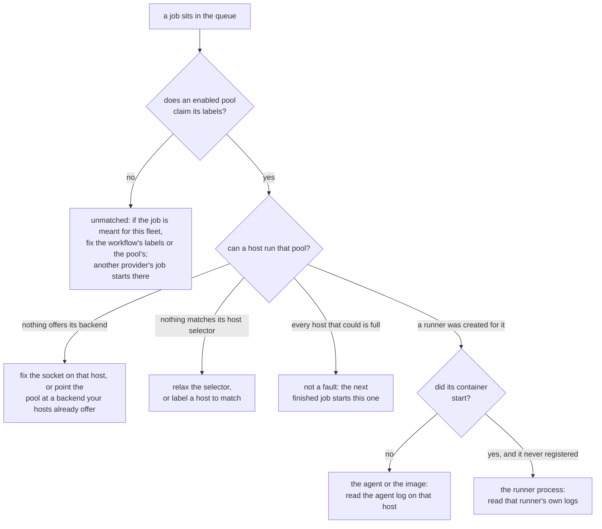

# Troubleshooting

Zoomies is built so that most of what goes wrong says so itself. The problems
drawer — the count in the UI's top bar opens it — `GET /api/v1/problems` and
`zoomies status` all render the same list, each entry with what is true, why it
matters and what to change. Every one carries a code, and
[Problem codes](problem-codes.md) is the full list.

Start here:

```sh
zoomies status          # the Overview, in a terminal
zoomies config check    # validate the config without starting anything
journalctl -u zoomies -n 50
```

This page is the rest: the things that go wrong before there is anything to
look at, and the one symptom that has more causes than any other.

## When setup goes wrong

Five things go wrong on a first run more often than anything else, and each has
a way back.

**Locked out of your own controller.** There is no password reset over the
network, deliberately. On the host: stop the service, put
`security: {disable_auth: true}` in `zoomies.yaml` *while the listener is still
on loopback*, start it, create a replacement administrator under
Settings → Users, take the setting out again, and restart. Anyone who can reach
the listener while that is set is an administrator, which is why the loopback
bind is not optional here.

**The encryption key is gone.** Pools, runners, jobs and the audit log are not
encrypted, so the fleet's state survives — but the GitHub App's private key and
every webhook secret were sealed with that key and cannot be recovered. Generate
a new private key on the App's settings page on GitHub, then
Installations → Connect GitHub → **Use an App you already have**, and paste the
new PEM and a fresh webhook secret. A new key is written on the next start; back
that one up.

**The App handshake did not come back.** The App and its private key are
recorded the moment GitHub hands them over, before you are asked to install it —
so a browser that wandered off has cost you nothing. Open
Installations → Connect GitHub again: the flow resumes where it stopped and asks
only for the installation ID, and it takes the whole URL GitHub left you on if
that is what you have to hand.

**A half-finished install.** Running `zoomies init` again is safe: it notices
that setup did not finish and carries on from where it stopped, keeping your
encryption key and database. To start over instead, `zoomies uninstall` (or
`sh install.sh --uninstall`) stops the service, removes the unit, the service
account and the data directory, and offers to deregister your runners from
GitHub first.

**No Docker or Podman on the host.** The native install works regardless — only
the compose and docker *deployments* need a runtime. For running jobs, the
process backend executes workflow steps directly on the host as the agent's
user, with no container isolation and nothing cleaned up between jobs beyond the
work directory. It is a reasonable choice for a machine that runs your own
trusted workflows and a bad one for anything else; see
[Security](security.md#agentbackend-process).

## A job that sits in the queue

Three different faults look the same from GitHub, and the problems drawer tells
them apart:



* **No pool claims the job.** Its `runs-on` labels match no enabled pool. Change
  the workflow's labels, or the pool's.
* **No host can run the pool.** A pool is claiming the job and nothing in the
  fleet offers its backend, matches its host selector, or has room left. The
  panel names which, and repeats what the host's own agent said -- an
  unreadable `docker.sock` is the usual answer, and it is fixed on the host
  rather than in the pool.

  A pool blocked on its backend has two ways out, and both are named where the
  problem is. On the host, the agent's sentence about a socket it cannot open
  identifies **its own account**, not `$USER`: an agent installed as a service
  runs as `zoomies`, so a `usermod` copied from a shell adds the wrong user and
  changes nothing. When that account is already in the group, the agent says so
  and asks to be restarted instead, because a running process cannot gain a
  group it did not start with. When the agent is itself a container -- the
  compose and `docker run` deployments -- it says so and gives the container's
  fix instead, because its account exists only inside the image and a `usermod`
  on the host answers `user 'nonroot' does not exist`. A container is given
  its groups when it is created, so the sentence names the group the
  container actually holds against the one that owns the socket -- "holds
  999, socket is 987" -- and gives the two steps: with compose, change
  `DOCKER_GID` in `.env` and run `docker compose up -d`, which recreates the
  container (no `down` first, and never `down -v`, which deletes the volume
  with the database in it); with `docker run`, recreate it with
  `--group-add <gid>`. Setup checks the same thing before it starts one, and
  the repository's compose file refuses to start without a `DOCKER_GID` at
  all. In the controller, if your hosts offer a backend
  this pool is not using, the problem names it and the pool's own page offers
  the change as a button -- the runners it already has finish their jobs first.
  Wherever one of these sentences carries a command, the UI shows it as a
  command with a copy button rather than as prose to retype.

  The wizard will not make this pool in the first place: choosing a backend no
  connected host offers stops it, says which backends they do offer and how many
  hosts each, and switches the pool to one of them in a click. It gives way only
  when there is nothing better to insist on -- no hosts yet, or no host offering
  anything -- which is how the first pool gets created before the first agent
  joins.

* **A runner was created and never arrived.** The pool claimed the job, a host
  took it, and the runner has been starting up ever since. `runners.not_progressing`
  is raised once that has gone on for half the provision timeout -- while there
  is still time to look, rather than only when the fleet gives up and fails
  them -- and it splits the two shapes, because they are not fixed in the same
  place:

    * **No container has started.** Nothing has reported the workload running,
      so the fault is between the agent and the backend: read the agent log on
      that host, and check the pool's image exists and can be pulled. A first
      pull of a large image can legitimately take minutes, which is why the
      threshold follows `provision_timeout` -- raise that and this waits longer
      too.
    * **The container started and the runner never registered.** The workload
      is up on the host and the runner process inside it has not reached
      GitHub. Read that runner's own logs, from its page. The usual causes are
      a host that cannot reach `github.com` and a JIT configuration GitHub has
      already consumed.

    Zoomies moves a runner out of `registering` on one signal: the agent
    observing its workload running. So a runner that stays there is one whose
    workload the agent is not seeing -- which is what the two branches above
    are asking about.

    **The runner's own page answers which branch it is**, without going
    anywhere else. Its facts panel carries **Container started** and
    **Registered with GitHub** separately: the first present and the second
    missing is the second branch, and neither present is the first. Beside them
    is **Host last seen**, because a runner that is not progressing is often a
    host whose agent has gone quiet, and that is the cheapest thing to rule out
    first. The timeline names the same stages in order rather than showing two
    rows that both say "Registering".

A host whose Docker daemon was not up when the agent started re-probes as it
runs, so it starts taking work within a heartbeat of the daemon appearing. What
each host can currently run, and why it cannot run the rest, is on the Hosts
page.

## The agent is connected but new runners are held

Read the host card's reason before changing a pool. **Committed** CPU and
memory are reservations; **CPU usage** and **memory available** are recent
measurements of the whole host, including work outside Zoomies.

A host can be under pressure while the room **held back for the machine** looks
generous, and the two do not contradict each other. The reserve is what the
scheduler will not promise away rather than a fence around the machine — the
room is kept free by placing less there, and nothing stops a job that runs away
from taking it — and the memory reserve is itself the line pressure is judged
against: a host counts as overwhelmed when available memory falls *to* it, so
holding more back means being throttled sooner rather than later. When the
reason names the **load average** instead, look for work no quota binds: the
kernel counts a task waiting on disk towards the load average while it keeps a
container that has spent its CPU quota off the run queue, so a host can sit at
40% CPU with a load past twice its cores and a daemon too busy to answer a
`create`. `docker_mode: dind` is the usual multiplier, since each of its slots
is two containers — a typed pool gives both the same limits, and a pool sized
by its host still splits one slot between them. Either way a slot too thin to
give both a comfortable share is refused the host outright, before it can
produce this symptom at all; [`host.overprovisioned`](problem-codes.md) is the
warning for a host that is still too finely sliced even where it is not.

At 85% CPU usage, Zoomies starts one runner at a time. Sustained usage of at
least 95% holds new starts until it falls below 85%. A host at its memory
reserve holds starts too, and a pool waits when its next runner would not fit.
Reduce competing work or add a compatible host; the next fresh measurements
allow placement to recover. A manual cordon remains in place. The full
[pressure rules](hosts-and-pools.md#current-usage-and-automatic-holds) explain
sample freshness and the fallback when usage cannot be measured.

A host card that says **Throttled** is a different thing from a hold, and
waiting is only half the answer. A hold is one bad sample and releases on the
next good one; a throttle means the host has been overwhelmed for long enough
that the controller has stepped it down a rung — to three quarters, half or a
quarter of its slots — and lowered the CPU quota of every runner on it that has
one, never below half. The card's sentence, and `zoomies hosts list`, say which
measurement did it: CPU pinned at 95% with a runner no limit binds, a load
average past twice the host's CPUs, or memory at the reserve. Running jobs
continue, slower; nothing is failed. It lifts itself one rung after five
minutes of calm, and a host that keeps climbing back up has too many slots
for its machine or pools whose limits let a job take more than a slot's worth
of it — `host.overprovisioned` says which, and the fix is the host's capacity
or the pool's `cpus` and `memory_mb`, not the throttle. Once the cause is
fixed, **Lift the throttle** on the card, or
`POST /api/v1/hosts/{id}/throttle/clear`, gives the slots back without waiting
out the recovery; a clear that was premature is put back on the first rung by
the next heartbeat. A `PATCH` that changes the capacity or a reserve clears it
too. If the jobs on a throttled host are not slowing down, check the agent's
log: `throttling N runners to P% of their CPU allocation` is the quota being
lowered; `the controller throttled this host, but no runner here has a CPU
limit to reduce; running jobs continue at full speed, and only the host's
smaller effective capacity applies` means no runner there carries a recorded
allocation — the pool set no limits and defaults are off or unsupported on
that host, the runners were created before allocations were recorded and are
replaced by their pool's next ones, or the pool runs on the `process` backend,
which has no container to hold a quota; and `could not change a runner's CPU
quota` is the daemon refusing the update, retried on the next heartbeat. The
[ladder](hosts-and-pools.md#current-usage-and-automatic-holds) has the
thresholds and what ends a throttle.

If Docker is timing out while the agent still heartbeats, the heartbeat only
proves the agent can reach the controller. Widespread health-check exec and
container-operation timeouts warrant checking Docker, containerd and host
resource pressure. They do not establish an out-of-memory or disk fault by
themselves. Pressure admission can reduce overload, but does not detect every
runtime stall or restart the daemon.

Use **Cordon** on the host card, or `zoomies hosts cordon <host-id>`, to stop
new placement while investigating. Existing runners remain registered and may
still receive work from GitHub. Save `zoomies diagnostics` and the Docker,
containerd and kernel logs for the same time window before a restart or
cleanup removes evidence. The
[host metrics](metrics.md) report measurement freshness and admission holds;
an unavailable reading is not evidence that the host is idle.

## "CI is flaky" — is it, or is it us?

GitHub records a job whose runner died exactly as it records a job whose tests
failed: `failure`. From GitHub's side the two are indistinguishable, which is
how a fleet that is quietly killing jobs gets blamed on the workflows, or the
other way round — and the two need completely different people.

Zoomies knows which it was, and says so in three places.

**On the Jobs page**, the **Our failures** view is the half this deployment
caused: a runner that stopped under a job, or one that never started for it.
Everything left in **Failed** is the workflows' own. The "Failed at" column
carries the category rather than a repeated "Runner lost", so a column read
downwards says what is actually happening — six rows of `Out of memory` is a
memory limit to raise.

**On a job**, the outcome panel leads with the category, carries the runner's
own last words, and names the fix. Where the failure was the fleet's, it also
offers **Run it again**: nothing about the workflow has changed, so re-running
is the ordinary remedy. GitHub has no job-level re-run, so that re-runs every
failed job in the run, and the panel says so before you press it.

**On the Overview**, the failure badge reads "11 failed, 9 ours" rather than
"11 failed", and links straight to whichever half is worth opening.

The categories, and what each one means you should change:

| Category | What happened | What to do |
| --- | --- | --- |
| `out_of_memory` | The runner was killed for exceeding its memory limit. | Raise the pool's memory limit, or move the pool to a host with more memory. The runner's page names the limit it was given. |
| `out_of_disk` | The host ran out of room. | Free space or give the host a larger disk. Runner images and workflow caches are the usual weight. |
| `host_lost` | The host stopped answering while the job ran; the runner went with the machine. | Check the host is up and its agent can still reach the controller. |
| `removed` | Somebody removed the runner with force while it was working. | Nothing, unless that was a mistake. |
| `image` | The runner image could not be pulled or would not start. | Check the pool's image tag, and that the host can reach the registry. |
| `registration` | GitHub would not register the runner, so it had nothing to attach to. | Check the App is still installed on the repository and still holds its runner permissions. |
| `backend` | The container backend refused the work or did not answer. This is "cannot start the runner container". | Check the daemon on the host, and the socket the agent names on the host's page. |
| `container_conflict` | A container name remains occupied after bounded recovery or ownership could not be verified. | Check its managed, runner, pool and role labels, its parent workload and duplicate agents sharing the daemon. Active or unrelated containers are retained; do not remove them blindly. |
| `backend_busy` | The daemon is there and did not answer in time — the host is carrying more work than it can keep up with, not a backend that is broken. | Lower the host's capacity or the pool's maximum runners, or give the pool CPU and memory limits so the daemon keeps a share of the machine. The host's throttle steps it down on its own while the pressure lasts. |
| `config` | The runner refused a setting it was given. | Read the runner's log for the setting it named. Every runner in that pool will do the same until it is changed. |
| `runner_exited` | The runner stopped and nothing could narrow it further. | Read the runner's last output on its page. |

A `backend_busy` create is not failed on the first timeout. The agent gives
the daemon a few more tries first, waiting longer between each — stability
over performance for the one fault a retry can actually fix, because the
daemon is there and only momentarily busier than it can answer, not down or
refusing the work. If every try is still busy, the runner fails as before,
and the pool's next create for the job steers away from that host toward
any other eligible one, rather than sending every retry back to the same
daemon; it uses that host again only when the fleet has nowhere else to
place it. Every other category fails on the first attempt, because nothing
about trying again or trying elsewhere would change the answer.

### The failure with no failed job behind it

A runner that dies before it registers never reaches a job at all. The job
stays queued, waits for the next runner, and waits again — so nothing is marked
failed, every count reads as a fleet that is merely busy, and a queue that has
not moved in an hour looks exactly like a queue that is keeping up.

That is why a queued job's own page says when its pool keeps failing to start
runners, the problems drawer raises `pool.runners_failing` with the category's
remedy rather than a list of possibilities, and
`zoomies_runner_start_failures_total` is a metric of its own. Alert on it
separately from the job-failure rate: it is the only signal a fleet in this
state produces.

## Reporting a bug

`zoomies diagnostics` writes a support bundle: this instance's build and
process, its effective configuration and the validator's findings, everything
currently wrong, the fleet's installations, pools, hosts and runners, the work
in flight with the controller's own explanation for each of it, and the recent
scheduler decisions — one JSON file to attach to an issue.

Two things about it are worth knowing before you attach one.

It carries no secret. Every section is a rendering the API already serves, and
the configuration in it is the same key-by-key rendering the settings page
uses, where a secret is absent rather than blanked.

It carries no workflow log. There is no redaction pass for log bodies and there
cannot be a reliable one, because a log holds whatever a workflow printed — so
the bundle names the runners whose logs are likely to matter and the route that
fetches each one, and you attach the ones you have read.

A section the controller could not gather lands in the document's `errors`
array rather than taking the whole document with it, and the terminal summary
says which. That is deliberate: the moment a bundle is worth taking is the
moment a query is most likely to fail, and a bundle short one section is worth
more than no bundle at all.

## What Zoomies cleans up, and what it leaves

Most of the time cleanup is invisible, which is the point. What follows is what
it actually does, so that the one time something is left behind you know
whether it is yours to deal with.

**What Zoomies removes by itself:**

* **The runner's workload.** The agent deletes a finished runner's container
  once the controller has heard how it ended and the window an operator gets to
  read its output — `agent.finished_retention`, default `0s` — has passed. A
  docker-in-docker sidecar and its anonymous volumes go with it. GitHub job
  completion, including cancellation and failure, also triggers ephemeral
  runner removal. The controller recovers pending removals after a restart
  and retries them until the host confirms success.
* **Unused Docker builder cache.** Every five minutes the agent asks the host
  Docker daemon to reduce unused cache toward `agent.docker_build_cache_mb`
  (default 5 GiB). Active cache is protected; this is a target, not a quota.
  Set `0` to disable it. Separate Buildx container builders are not covered.
* **Container logs.** New Docker runner and sidecar containers rotate their
  logs at 10 MiB with three files retained.
* **Untracked workloads on a host.** Anything carrying Zoomies' own labels that
  no runner claims is removed, but only after a successful poll and a
  two-minute grace, and only when the controller has said it does not know it.
  The agent never decides on its own that something is litter.
* **GitHub runner registrations.** Removing a runner deletes its registration.
  A deletion that fails is retried by a sweep every ten minutes, which also
  clears registrations for runners this fleet has finished with.
* **History.** Jobs, deliveries, audit rows and samples are pruned on their own
  retention settings.

**What it never removes:**

* **Container images.** Zoomies pulls images and never deletes one. A host that
  has run several pools accumulates them, and `docker image prune` is the
  answer; nothing here will do it behind your back.
* **A job that is running.** No maximum job duration exists by design — a
  workflow's own `timeout-minutes` is the right place for that, and it is the
  one GitHub reports honestly.

**When cleanup fails**, the runner's row says so rather than only the log. The
Runners page and the runner's own page show what went wrong, how many times it
has been tried, and the `runners.cleanup_failed` problem names it in the
problems panel. Three shapes:

* **A container Zoomies could not remove.** It is still on its host, holding
  its writable layer. Zoomies keeps retrying; if it does not clear, remove it
  on the host with `docker rm -f`, and look at why the daemon refused.
* **A registration GitHub still calls busy.** GitHub's own bookkeeping can lag
  a few seconds behind the `workflow_job` webhook that told Zoomies the job
  was done, and the first delete attempt loses that race. This is not a
  permission problem and needs nothing done about it: Zoomies rechecks every
  ten minutes and the row clears itself as soon as GitHub agrees the runner is
  idle. GitHub refuses to delete a runner it believes is running a job with no
  override, so if it stays this way well past a few rechecks, waiting will not
  fix it: cancel the workflow run on GitHub, or remove the runner on the
  target's runner settings page.
* **A registration GitHub would not delete for another reason.** It is still on
  the organisation's runner list, offline and doing nothing, and this is
  usually a permission the App has lost. Check the App's installation, or
  delete the entry on the target's runner settings page.

All three clear themselves when a retry succeeds. The attempt count is kept
afterwards, because how many tries it took is the difference between a blip and
a host worth looking at.

A runner's **Cleaned up** time is when nothing of it was left, on the host or
on GitHub. A finished runner without one still has something outstanding.

### Container names already in use

Docker can finish a create after the agent has timed out. A later attempt may
therefore see HTTP 409 even if its initial cleanup found nothing. Zoomies inspects
the conflicting container and retries creation up to twice. It removes only a
container whose managed, runner, pool, role and name labels match the request.
A runner must be inactive; a DinD sidecar must have no parent runner. Removal uses
the inspected container ID, never a name that another container could acquire.

Unknown ownership, an active parent, or repeated conflicts stop recovery with a
**Container name conflict** finding. The daemon has answered: socket repair is
not the appropriate advice. Check for duplicate agents connected to the same
runtime. Recovery never reruns registration inside an existing runner container.

### GitHub says a runner is still running a job during cleanup

A busy registration is a deferred cleanup, not evidence that the GitHub App has
lost permission. Zoomies leaves busy registrations alone and rechecks them every
ten minutes. When an idle listing races with a newly busy response to deletion,
cleanup is deferred in the same way. Waiting observations do not increment the
failed-delete count or reset the age of an existing warning.

Housekeeping also compares terminal rows with the complete, successful GitHub
listing. If GitHub has already removed a registration, Zoomies clears that side
of the cleanup record, including warnings left by earlier releases. A failed or
incomplete listing cannot prove absence. GitHub confirmation never clears a
separate host/container cleanup failure.

If GitHub still reports a runner busy after hours, inspect the workflow run's
actual status. Allow real work to finish; Zoomies does not cancel workflows or
force-delete busy registrations to clear a warning. A persistently stale GitHub
busy flag needs investigation on GitHub. Existing warnings containing the older
“currently running a job” message now get this advice too.
